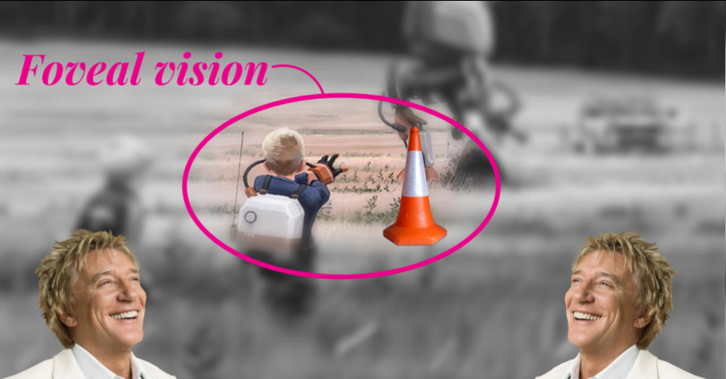
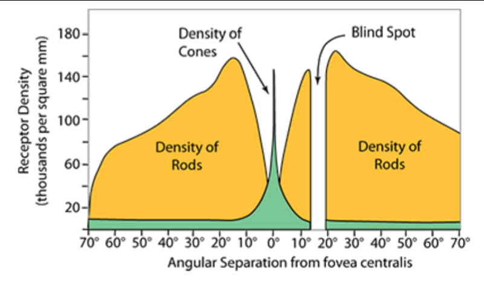

Graphics and Computation COMP30019 Lecture 16
=============================================

# Building Gaze Aware Systems (Building Gaze-Aware Systems (Dr. Eduardo Velloso)

## Eye tracking
- Changed through the years
- Used to be medieval shit
- Now it's a few hundred bucks to do cool stuff
	- Come in all shapes and sizes

### Designing for Eyes
- The gaze is very different from using hands to input
- Fastest action your body can make and it precedes all physical action
- Play a social role
- Always there
- Indicates attention

#### Challenges of Gaze Interaction
- Inaccuracies
- Calibration
- Multiple Roles

##### Inaccuracies
- You can get perfect-pixel accuracy with your hands
- Eyes only select a *region* of the screen
	- Result of algorithm/inaccuracies
	- This is also how our vision works
		- Foveal Vision is our region of focus
			- Contains *cones*
		- Perhipheral vision is black and white and sensitive to movement
			- Contains *rods*
		- At a certain degree of our vision, we have a blind spot at about 20 degrees

###### Saccades
- When we look around, we move our eyes in small movements
- During these movements we are blind
- We actually spend 3-5h a week completely blind when our eyes are open

###### Solution
- Gaze-Touch
	- Gaze for pointer, touch to click
	- We can now tell if a gaze point matches a region on the screen
	- Powerful ability for creative design
		- Always focused on screen

##### Calibration
- Need to calibrate a system before we can accurately track our eyes
- It's difficult to calibrate for a non-static screen
	- e.g. smartwatches
- It's a lot easier to calibrate when objects on screen are moving
	- You can design UI with moving elements
	- Targets can be very small and precise
	- Orbits

###### Public Application
- You can be sure the user is not "faking" input incorrectly
- Gaze action is hard to fake
- You can calibrate with other discrete UI elements
	- e.g. museum start thing

##### Midas-Touch Problem
- Can't define difference between 'activating' UI elements and just actually looking at things
- End up touching everything and activating it

#### Visual Attention
- We have attention drawn by all different movements
- This results in a conflict in different movements:
	- Task-driven eye movements
	- Stimulus-driven eye movements
- Samsung galaxy s4 eye-gaze ad.

#### Eyeplay
- [Games have been the main driver for eye tracking](tobiigaming.com/games)
- Took us forever to get here
- Attempt to make games feel fun with eye-tracking
- It's possible to make a game unnatural and fun - they're separate from each other and thus eye-tracking doesn't add difficulties but rather adds more avenues of input
	- Mapping controls unnaturally can be part of the challenge
	- Eye trackers can completely break games
		- The ball/paddle game
			- Just staring at the ball allows the paddle to always be under the ball

##### Social Signals
- Eyes can convey a lot about a user's thoughts
- Gaze Awareness for AI
	- NPCs that get mad when you don't look at them.
- Display the user's gaze for showing intentions in psychological games
	- Opens up a whole new level of play where user's gazes can change the game

#### Multiple Applications
- Interactive books
	- Images that change based on what you're reading
	- Smart text
- Games

### Summary
- Designing for gaze requires new ways of thinking about input
- Use gaze in a supporting role
- Use movement to avoid calibration
- Embrace the nature of visual attention

Do masters of human-computer interaction?