Graphics and Interaction COMP30019 Lecture 2
=============================================

### Announcements:
- New Student Reps:
- Daniel Sunderland

### The Problem with Graphics
- **How are three-dimensional objects projected onto two-dimensional images?**
- Mapping from *3d space to 2d image surface*
- Start with **X, Y, Z** in a 3d world (called a *voxel*) transform into **X, Y** *pixels*
- More specifically a mapping from 3d directions, *rays of light, to/from the observer*
	- *It's like we're simulating a camera in 3D graphics*

### Simulating a camera 
- Simulating a camera can be *challenging and costly* in computer graphics
- Enter a simple camera concept: The **Pinhole Camera**
	- Box with a small hole on one side and film on the other side
	- 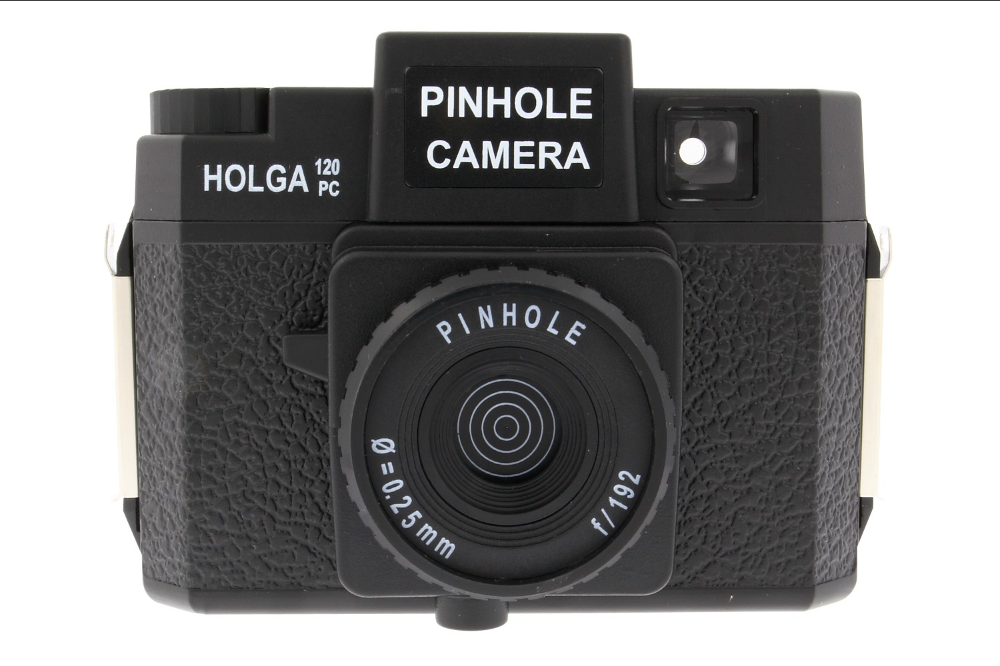
- [*Camera Obscura*](https://www.youtube.com/watch?v=gvzpu0Q9RTU)
	- This is how *all cameras work*

### Perspective Geometry
- How can we take what we just saw from the pinhole model and put it in an equation/diagram
	- This is what it looks like
	- Cameras work this way, where f is the distance to the sensor and O is the 'lens' or 'origin point', and z is the distance to the object
	- 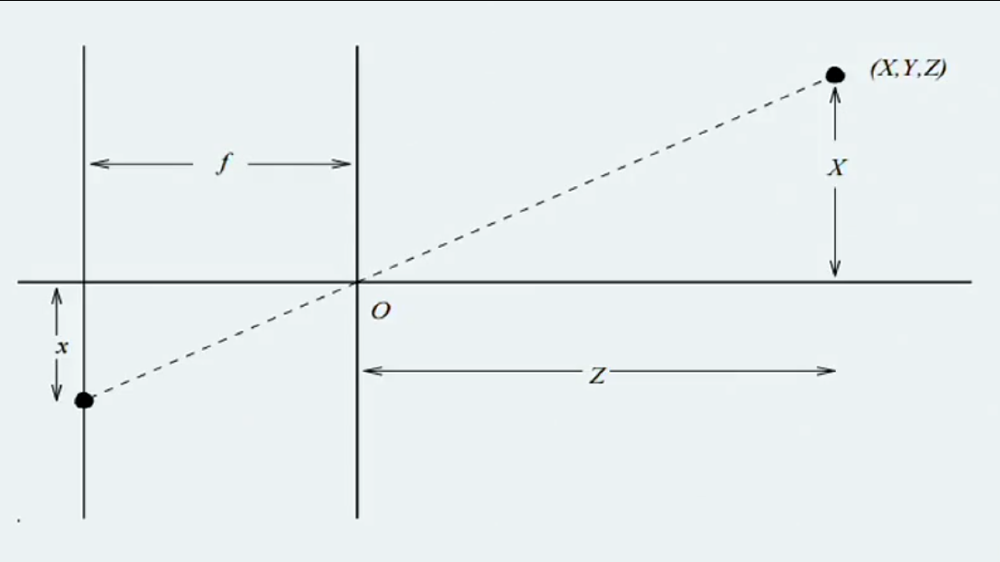
	- 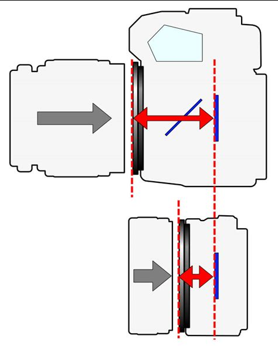
- Human eyes work like this too
	- Brain flips the image
- We can emulate this flip by positioning the x *before the origin point*
	- Now things will be in the correct orientation
	- 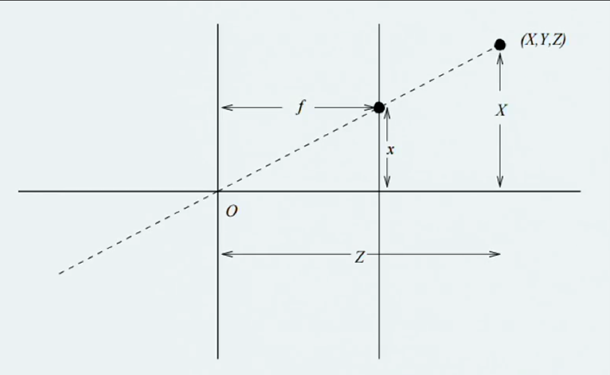
	- Problem is this will still *always be smaller*

### Virtual Camera
- Simply simulate a pinhole camera
- Image projection will use perspective geometry like above
- Can calculate the actual size

### Perspective Formulas
- Point `P = (X, Y, Z)` in 3D space has projection `(x, y)` in the image where
	- `x/f = X/Z`
	- `y/f = Y/Z`
- Keep the ratio of the points the same
- Notice how the triangles `xOf` and `XOZ` have the *same proportions*
	- Means we can *scale things to make them the correct size*

### Perspective Projection
- In order to draw a 3D image, you will need width, length, height
- You will need to *convey depth* in *one-point perspective*, *two point perspective* and *three point perspective*
- Common concept in graphic art
- There are *three key components* when perspective drawing or modelling
	- Horizon Line (Eye Level)
	- Vanishing Points
	- Vanishing Lines
	- 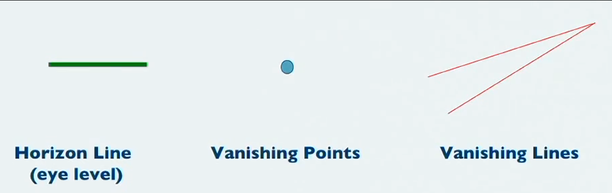
- **One Point Perspective**
	- Put one vanishing point on the horizon to test
	- 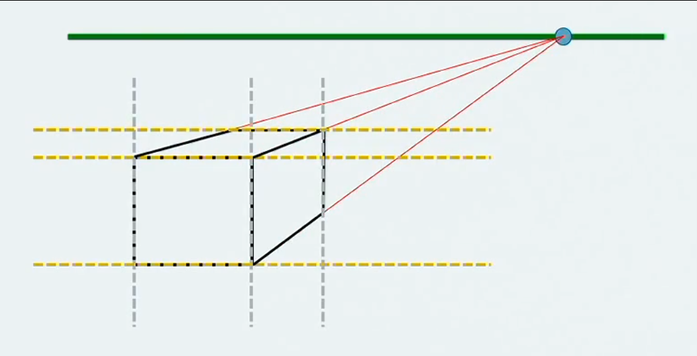
	- Lines of cube remain parallel while other lines converge
	- 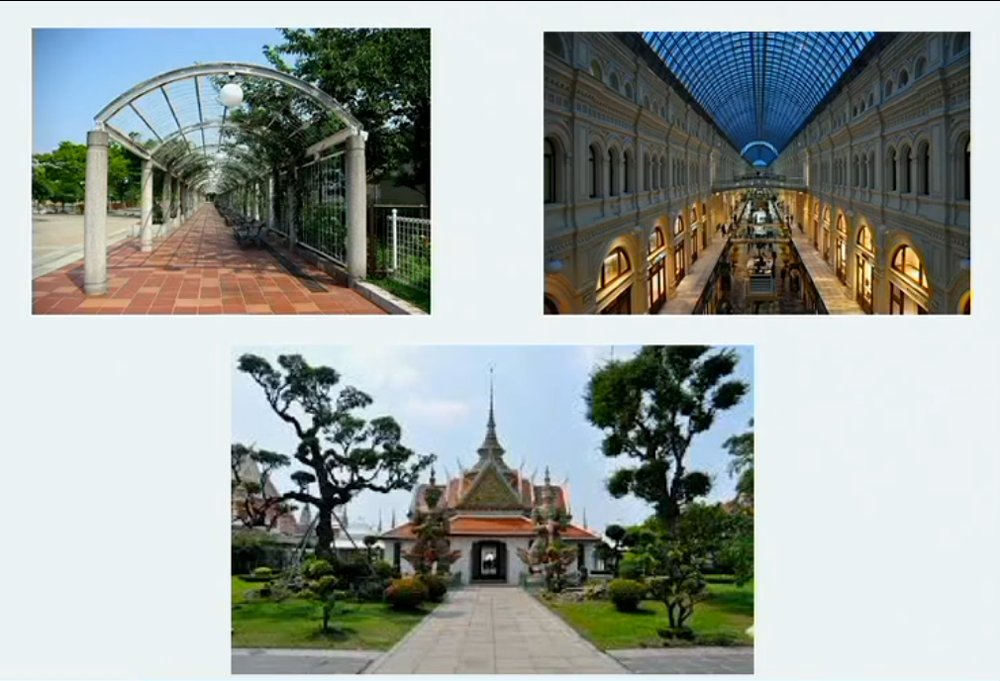
	- Everything converges at one point
- **Two Point Perspective**
	- Put *two* vanishing points on the horizon
	- 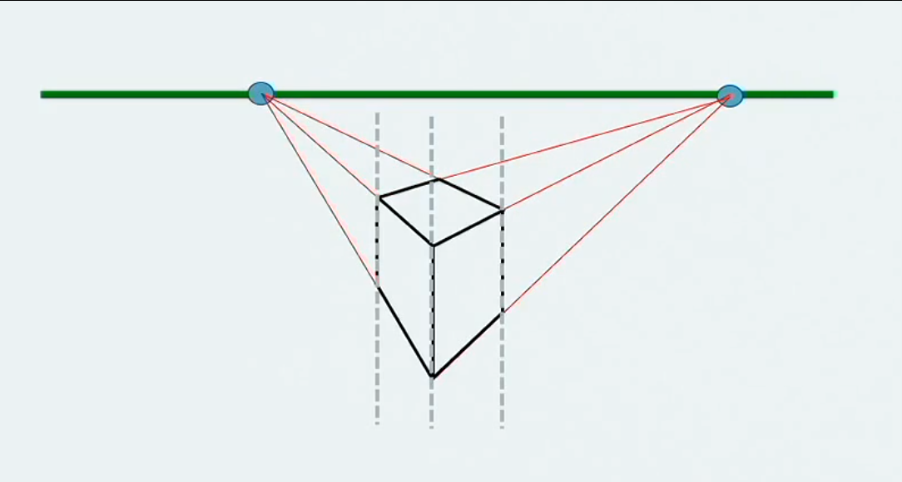
	- Only one set of parallel lines now
	- 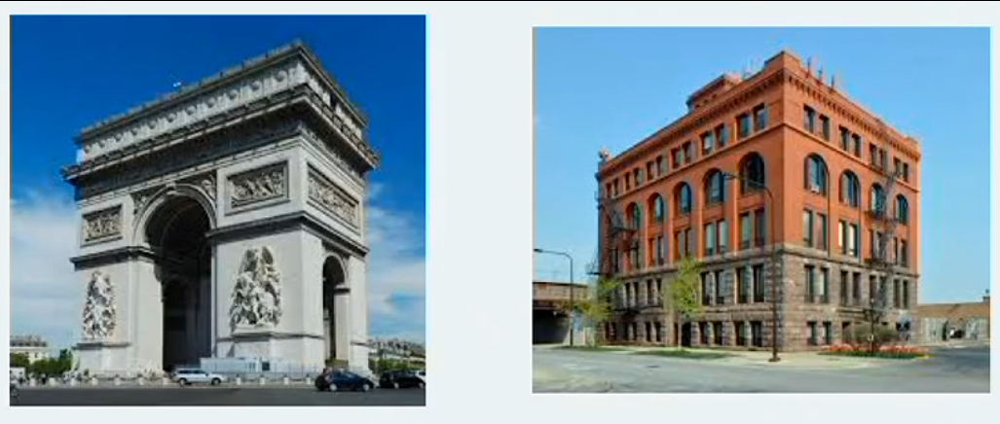
- **Three Point Perspective**
	- *Two* vanishing points on the horizon *and one in front of the object*
	- No parallel lines at all
	- 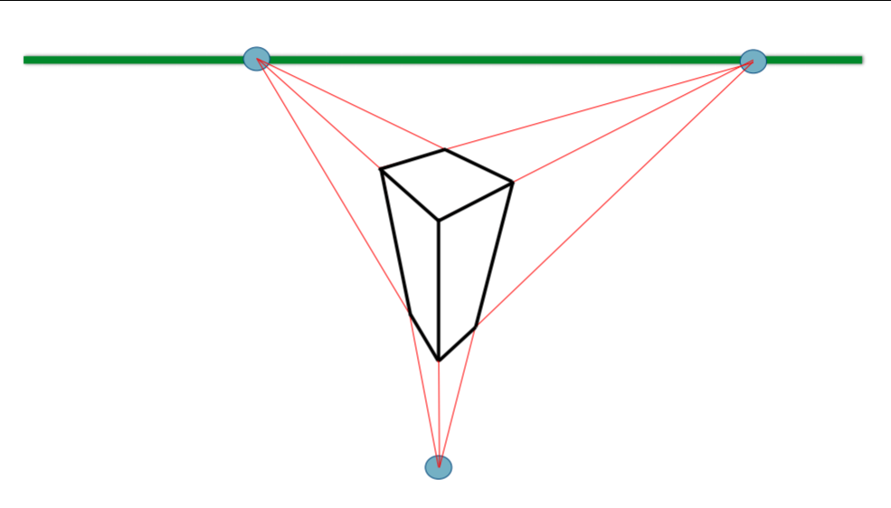
	- 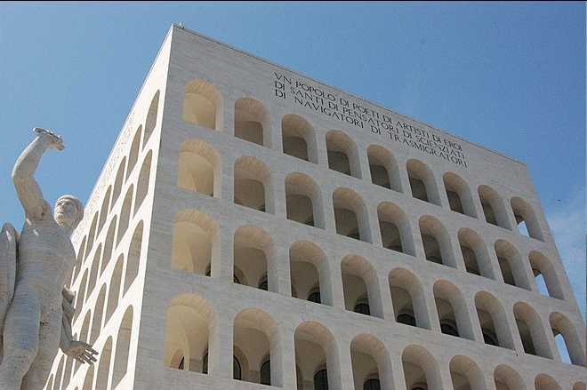
	- 
- *[Unity Roll a Ball Tutorial](https://unity3d.com/learn/tutorials/projects/roll-ball-tutorial)*

### Polygonal Geometry
- Polygon is any plane figure bounded by straight-line segments
- Three types of polygonal geometry:
	- **Polygonal Arc** (lines)
	- **Polygonal Boundaries** (closed shape)
	- **Filled Polygons** (filled in closed shape)
- Represented as *a set of lines* or *a **ordered sequence of vertices using coordinates***
	- **The order of this is very important**
	- To do with *culling* (render a polygon based on whether you're facing the *front* or the *back*)
		- i.e. We don't need to render the back of an object since we can't see it so we can skip these polygons to save resources
- There are *many types of Polygons*:
	- 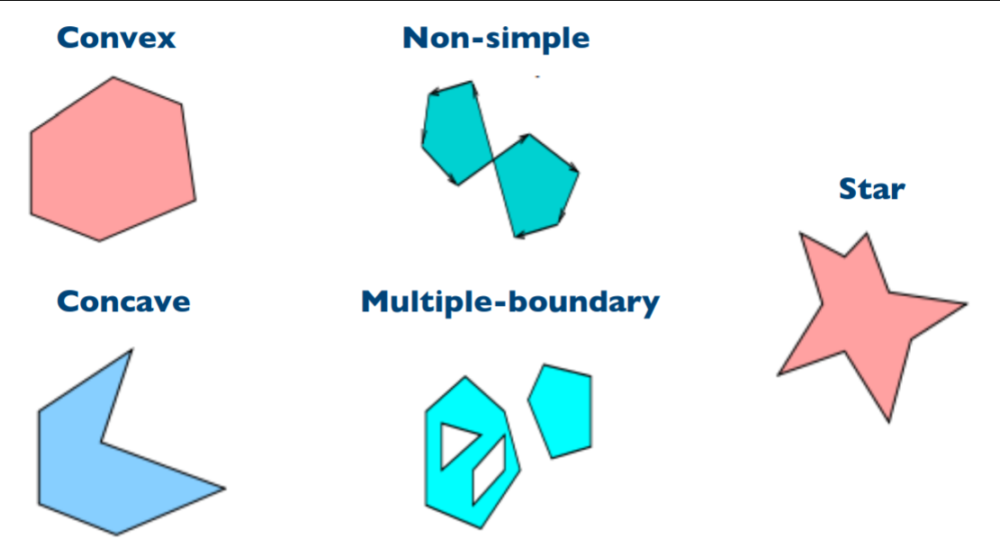
	- Convex polygon has *no internal angle greater than 180 degrees*
	- Concave polygon there *are internal angles greater than 180 degrees*
	- Usually use triangles to create objects since *trigonometry*

### Level of Detail
- Create several different versions of an object for viewing at different distances
- This is the "LoD" setting in video games
	- Why sometimes a character looks like a potato until you get close to them
- Use a *lower res* model when the object is far away - no reason to make things far away high res
- 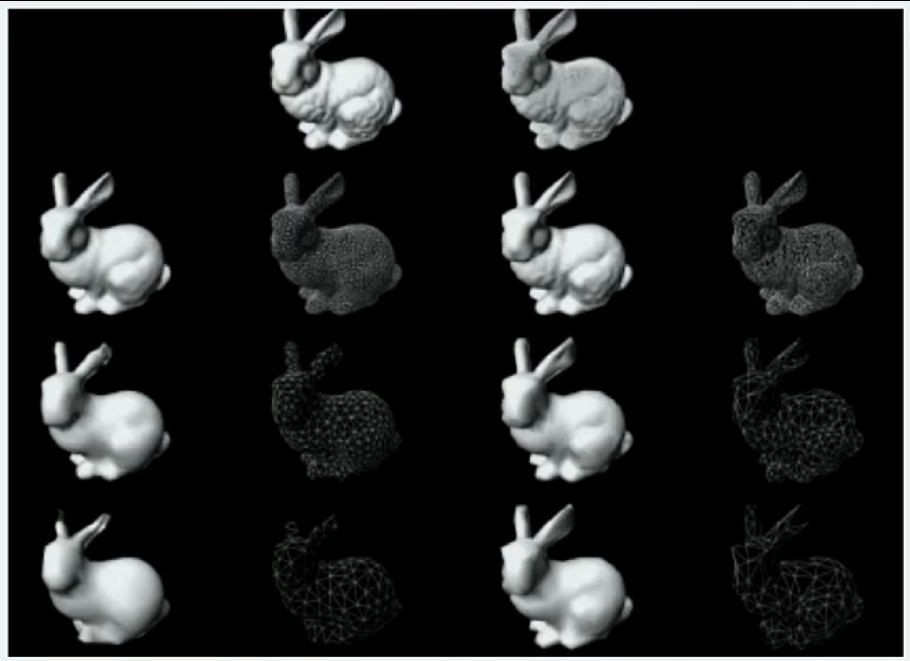

