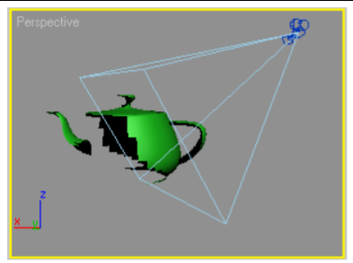
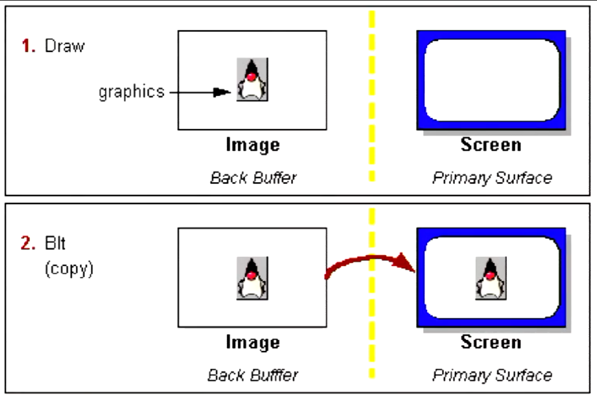

Graphics and Interaction COMP30019 Lecture 3
============================================

### Graphics Programming
- Game engines generally use **Direct3D** (windows) or **OpenGL**
- This subject focuses on **Direct 3D**
- Most graphics cards support both APIs
- Game engines build upon these APIs to make development easier

### Representing Objects
- For efficiency, the graphics card will render objects *as triangles*
- *Any polyhedron* can be represented by triangles
	- Literally everything
- The process of breaking a model into triangles is called *tesselation*
- More detailed objects means more triangles

### Pipelining
- Both OpenGL and Direct3D operate a pipeline, consisting of several different stages
- Allows the programmer to perform a number of different operations on the input data, and provides greater efficiency
- Differences between different pipelines

#### Direct3D 11 Pipeline

##### Input Assembler
- Building block stage
- Reads data from buffers into primitive format that can be used by other stages of the pipeline
- We mainly use "*Triangle Lists*"

##### Vertex Shader
- Performs operations on *individual verticies* we got from the previous stage
- Typically includes transformations
- Used to have to define matrix coodinates for the vertex shader
- 

##### Tesselation Stages
- Optional stages, added with Direct3D 11
- Allows you to generate *additional vertices if required*
- Automatically generate Level of Detail differences
	- Soft Shadows
	- Smooth Objects
- This is somewhat equivalent to adding more triangles in the input assembler
	- If you do it at the start, you need to "go back all the time"
	- Tesselation can be done *dynamically* and allows you to *scale level of detail as you approach an object*

##### Geomtetry Shader
- Optional Shader, added with Direct3D 10
- Does operations on the actual shader
- Operates on an entire triangle
- Can do a number of algorithms
	e.g. dynamically calculating normals, particle systems, shadow volume generation
- Colour, Lighting is all done in the shader

##### Stream Output Stage
- Allows us to receive data and then feed it *back into the pipeline* for processing by another set of shaders
- This allows the GPU to do more processing
- If we want to *go back to the Input Assembler, then we have to use more CPU resouruces*
- Useful for particle systems update (waves, ripples)

##### Rasterizer Stage
- Convert vector information into a raster image for the purpose of displaying real-time graphics
- Change the image from maths to pixels
- Performs *culling* - don't render things you don't see
	- Triangles facing away from the camera will be culled and not rendered

###### Culling
- DirectX performs 'counter clockwise culling'
- Triangles with certices in a counterclockwise order are not rendered
- The order of vertices is therefore important
- 

##### Pixel Shader Stage
- Produce colour values for each interpolated pixel fragment
- Per-pixel lighting can be performed
- Produce depth values for depth buffering
	- When two pixels are in the same projection position - you render the one with the less depth (i.e. the closer one)
- Instagram filters come in here

##### Output Merger Stage
- Combines pixel shader output values to produce final image
- May also perform depth buffering

- All of this is done 60 times a second (hopefully)

#### Double Buffering
- Don't want to draw objects directly to the screen
	- Wait until image is fully drawn before showing the next
- This is because some images may render before others
- Stops screen tear
- Instead draw next frame to a buffer and swap buffers when complete
- 
- VSync is similar to this, but this happens *all the time*

#### Framerate
- Data sent through the pipeline X amount of times per second
- If X is 30, then the framerate is 30 fps
- Input lag can be a result of low framerate
	- Command you did takes a while to manifest in the game
- [See examples here](http://www.30vs60fps.com)

#### HLSL Shaders
- Shaders are written in a language called `HLSL`
- Main challenge of this subject
- `Shaders` have properties to define lighting things
- `Subshaders` are defined for *different hardware*
- `Pass`: a subshader can be split into multiple passes, rendering geometry more than once
- `CGPROGRAM`: The meat of the shader - specify code to act at different levels of the pipeline
- `#pragma target 2.0`: Specifies the hardware required for the shader to run. 2.0 is the minimal setting (DX9)
- `#pragma fragment fragmentShader`: This specifies the name of
the function that will be used as the fragment shader.
- Syntax similar to C
- [Functions in CG/HLSL](https://msdn.microsoft.com/enus/library/ff471376.aspx)
- [Data Types in CG/HLSL](https://msdn.microsoft.com/enus/library/bb509587(v=vs.85).aspx)

