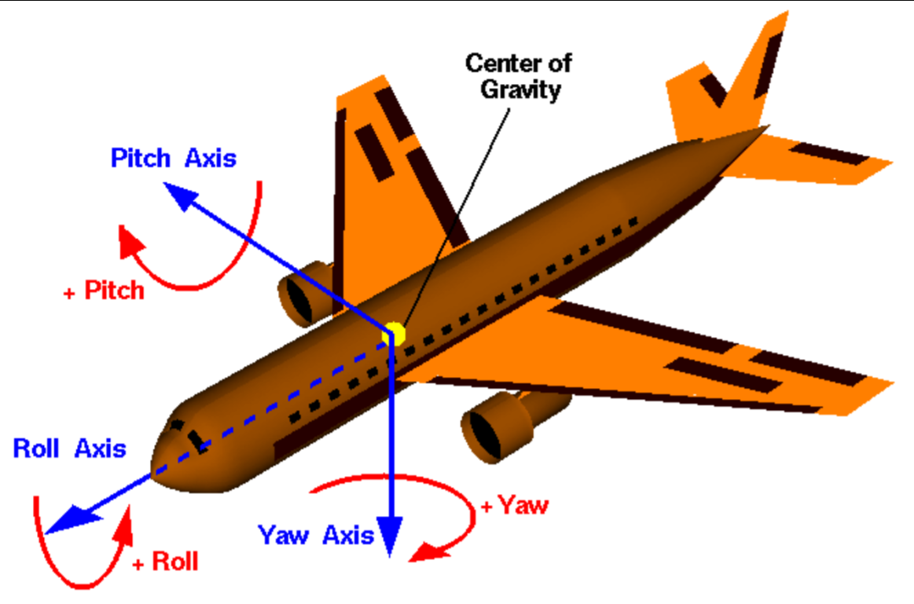
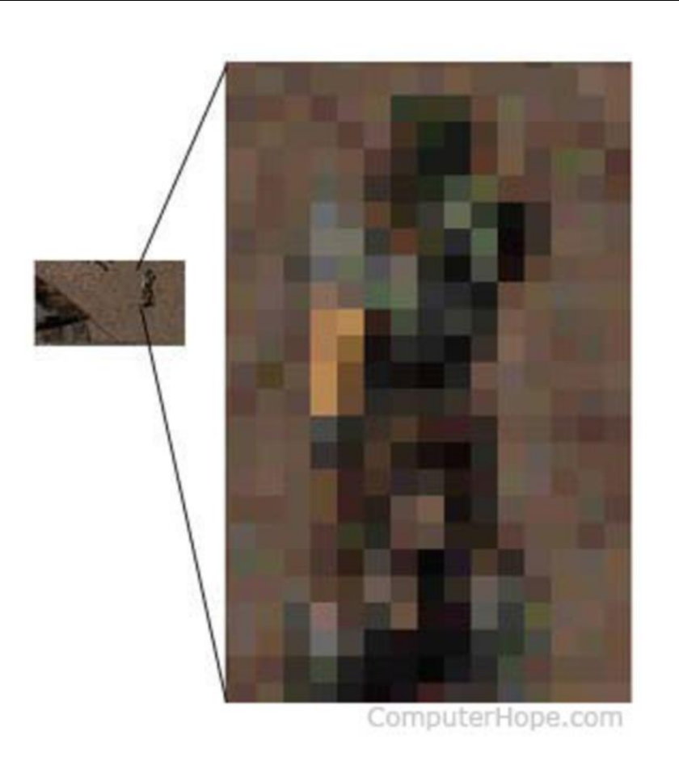

Graphics and Interaction COMP30019 Lecture 4
============================================

### Camera Control
- Requirement in nearly all 3d ineractive applications
- Including visualisations, games, visual analytics, cinematography
- Crucial to have effective camera control/positioning/movement

### Camera Parameters

- **Roll** (rotation around the front/back axis)
- **Pitch** (rotation around the side-to-side axis)
- **Yaw** (rotation around the vertical axis)
- **Focal Length** You know this already - field of view
	- Approximates behaviour of real camera lens
	- Objects at distance of focal length are in focus, other objects get blurred
	- Also affects field of view
	- Depth of field is a thing??
- [**Zoooooom**]( https://www.youtube.com/watch?v=LhF_56SxrGk) 
	- Referring to increasing the overall size of a graphic to manipulate or view in greater detail
	- Upscaling LoD
	- Doesn't work like IRL, you can *actually render things at a higher LoD* unlike real cameras
	- As you zoom into an image, each of the pixels that make up the image grow and make the image appear pixelated or jaggy
	- 

#### Camera Control Dependency
- Camera control is dependent on:
	- Balance of camera control approaches
	- Application domain
	- Nature of the user (goals, expertise, etc.)
- **3 Different ways of control**:
	- The user exercises interactive control
		- e.g. The Sims
	- The user exercises some degree of interactive control
	- The application itself decides full control
		- e.g. Rocket League (Ball Cam)

#### Application Domain
- Camera control will depend on the application domain
	- 3d Modellers
	- Visualisation
	- Games
	- Multimodal systems

#### Visualisation
- An application for which the user requires interactive control to explore and pursue hypothese concerning the data
- Automatic / Assisted camera control both used to help

### Games
- "The camera is the window through which the player interacts with the simulated world"
- Interactive computer games impose the necessity for real-time camera control
	- Need smooth changes in camera location/orientation
- This is important to stop disorienting players 
- Games are inherently different from film in that the camera is either directly or indirectly controlled by the player
- Narrative aspects of real-time games can by supported by the appropriate choice of shot edits during and between periods of actual game play
- Potentially can cause occlusions
	- Make sure scene doesn't block camera

#### Types of Viewpoints
- **First Person**
	- Users control the camera as if the camera is their face
	- Very unproblematic
	- Many FPS games are like this
	- e.g. [Overwatch](https://www.youtube.com/watch?v=uHEqOpuzzB8)
	- Precise games
- **Third Person**
	- Camera tracks characters from a distance (usually over the shoulder/above)
	- Responds to both local elements of environment and character's interactions
	- Can give unfair advantage (e.g. [PlayerUnknown's Battlegrounds](https://www.youtube.com/watch?v=U33CEWuUo_4))
	- e.g. [Monster Hunter World]()
- **Action Replay**
	- Cinematic view of what's happening
	- Replays used in modern racing/multi character games
	- Replays must be meaningful
	- Can be used as interactive storytelling
	- Max Payne?

#### Navigation Metaphors
- **Eyeball in Hand**
	- Manipulate the viewpoint as if it was held in his/her hand
	- User imagines moving him/herself around the object
- **World in Hand**
	- User's navigation directly to the object or environment to be moved
	- User imagines that the object is in his/her hand as the mouse is moved
	- Useful in a single object case but not good at navigating
	- Looking at a specific item in Skyrim
- **Flying Vehicle**
	- Kinda like NoClip in many FPS games
	- Flying around in 3d space
- **Walking**
	- Give the user the sense they're in the virtual environment
	- Move in the environment while maintaining a *constant distance from a ground plane*

### Combining Navigational Metaphors
- The optimal navigation method will depend on the exact nature of the task
- Applications tend to use multiple metaphors in sequence:
	- Flying Vehicle for navigation of a large landscape
	- World in hand for proximal inspection
	- Walking to give the user the sense of presense
	- Literally Google Earth
