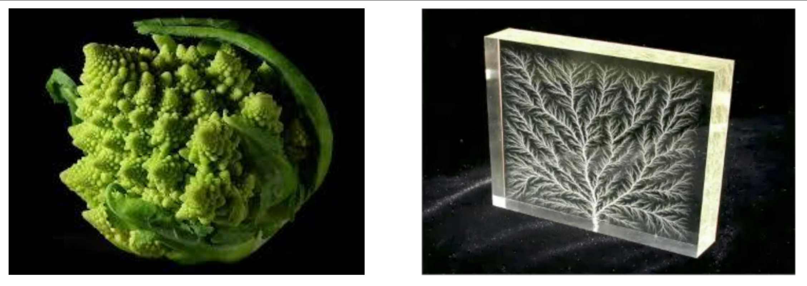
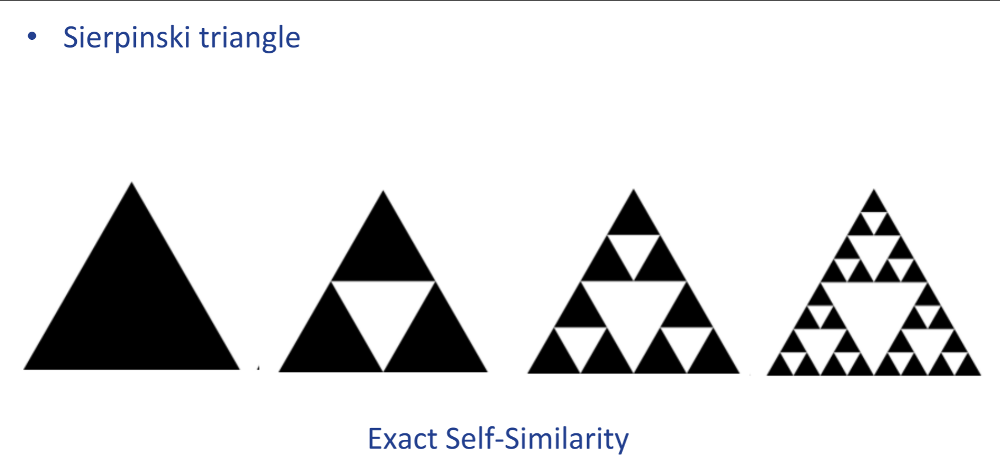
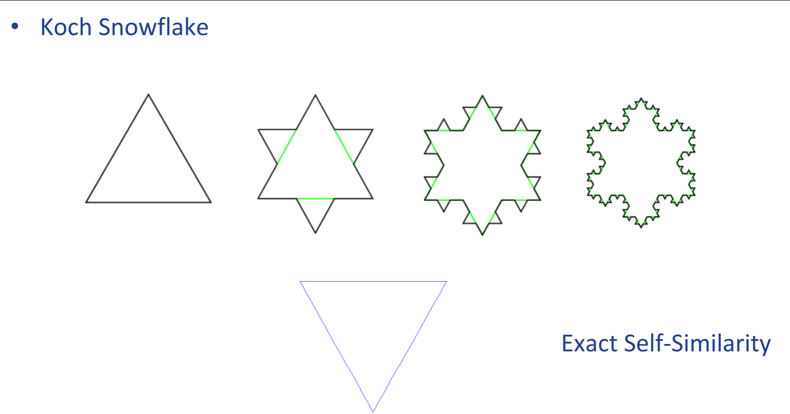
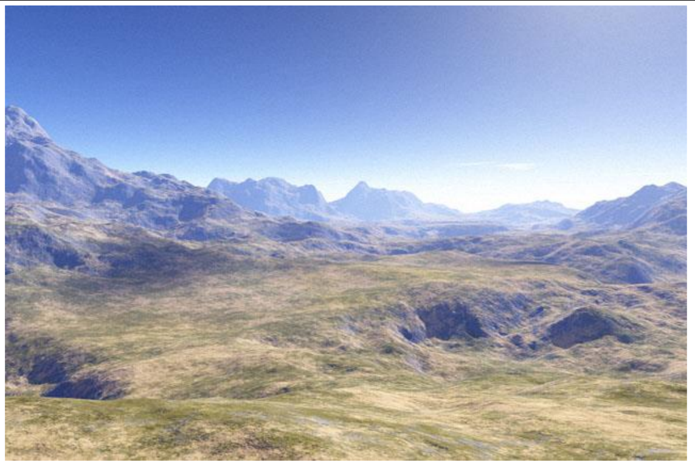
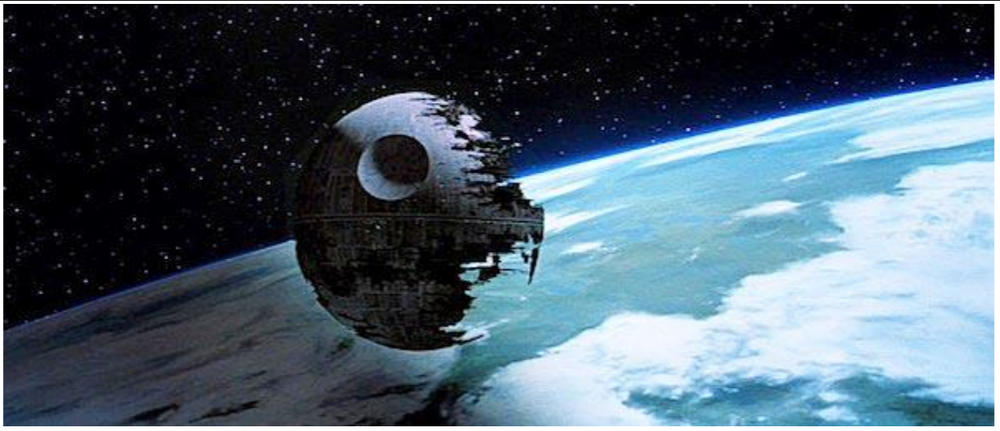
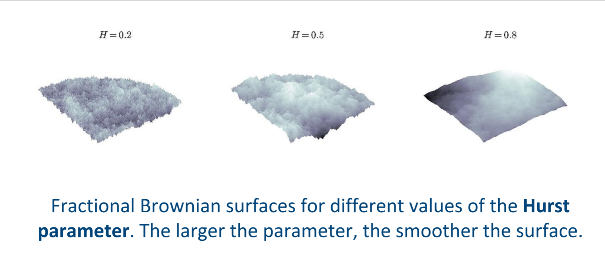
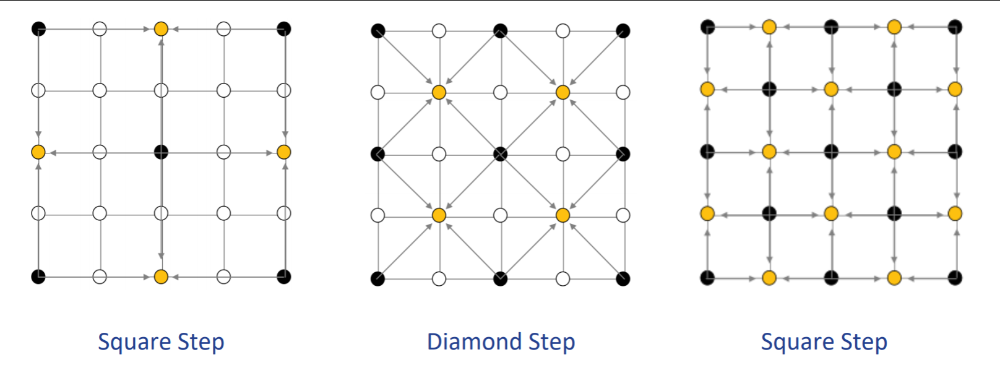

Graphics and Interaction COMP30019 Lecture 5
============================================

# Fractal Geometry and Landscapes
### Fractal
- Derived from the latin word `fractus` (broken)
- A fractal is a geometric shape is generated using a series of recursive rules
- Has a pattern that repeats at different levels, also called *self-similarity*

#### Self-Similarity
- Three types
- **Exact self-similarity (strongest)**: 
	- The fratals are identical at different scales
- **Quasi-self-similarity**: 
	- Fractal appears approximately identical at different stales. These fractals contain small copies of the entire fractal in *distorted* forms
- **Statistical self-similarity (weakast)**:
	- The fractal has *numerical or statistical measures* which are preserved across scales.
	- Random fractals are examples of fractals which are statistically self-similar, but neither exactly nor quasi self similar

#### Geometry
- Sierpinski triangle
- 
- Koch Snowflake
- 
- You can generate complex pictures by formula and using several iterations with different values
	- Used to generate realistic textured landscapes
	- e.g. 
	- e.g. 
- Typical basic primitives of ocmputer graphics are not suitable for fractals
	- Would need *millions of lines, cicles and polygons* for a good resolution
	- Special algorithms required

### [Brownian Motion](https://www.youtube.com/watch?v=5JuEomRki_M)
- Describes the stochastic movement of small particles of matter in a fluid
- Mathematical examination by Einstein and Wiener
	- Dynamics of molecular collisions
-  
- Fractional brownian surfaces of the *Hurst Parameter*

### Diamond Square Algorithm
- Generate heightmaps from a 2d grid
- Create a grid and set initial values for corners of grid
- Perform a diamond step and a square step alternately until completetion
	- **Diamond Step**
		- For each square in the array, set the midpoint of that square to be the average of the intersecting points plus a random value
	- **Square Step**
		- Do the same thing but with the corners of the square
- If you don't add a random value it looks too perfect
- 
- 