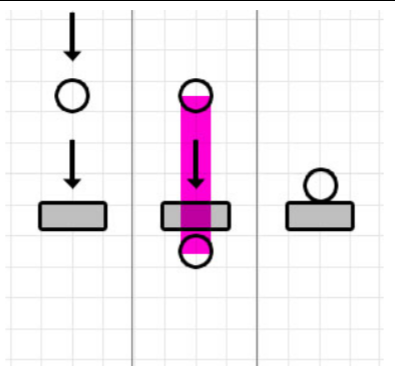
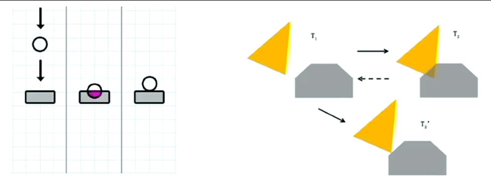
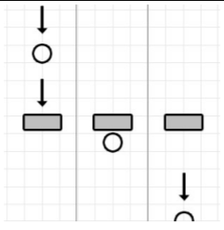
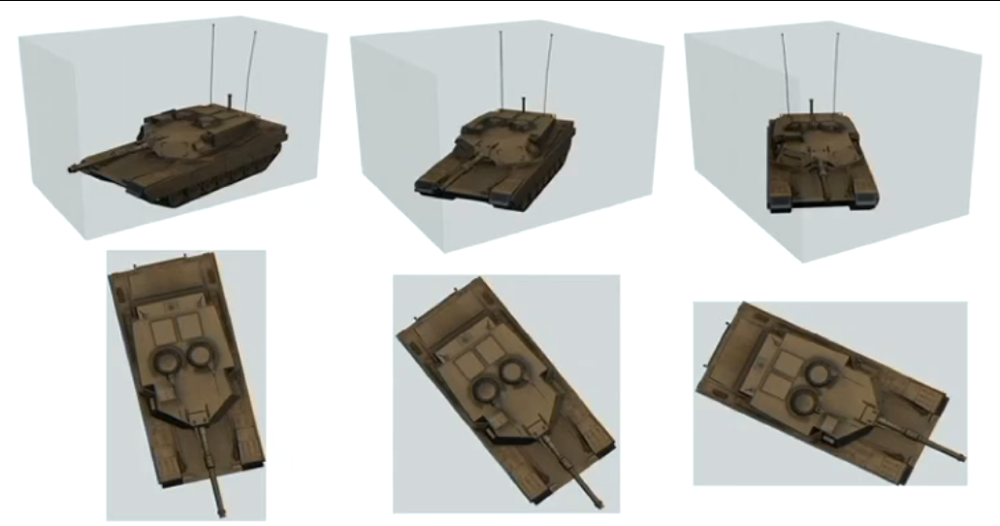
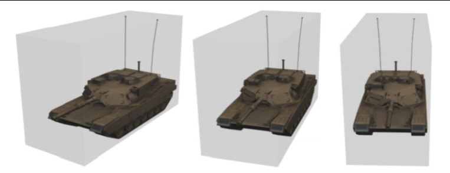
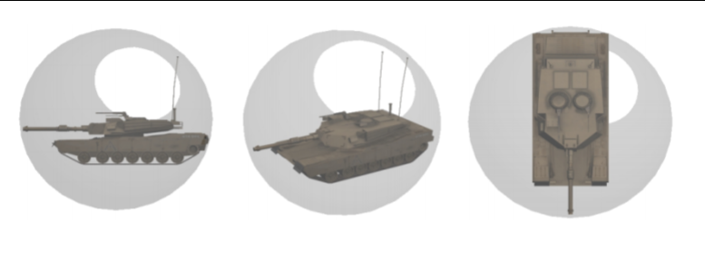
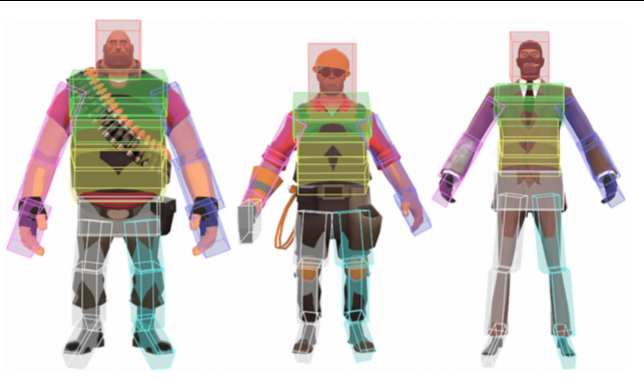
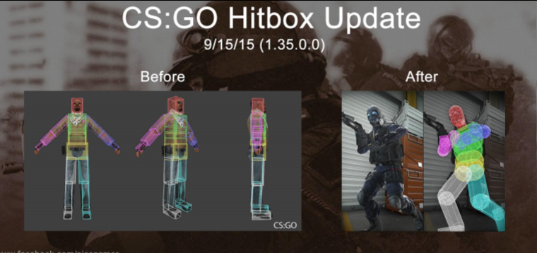
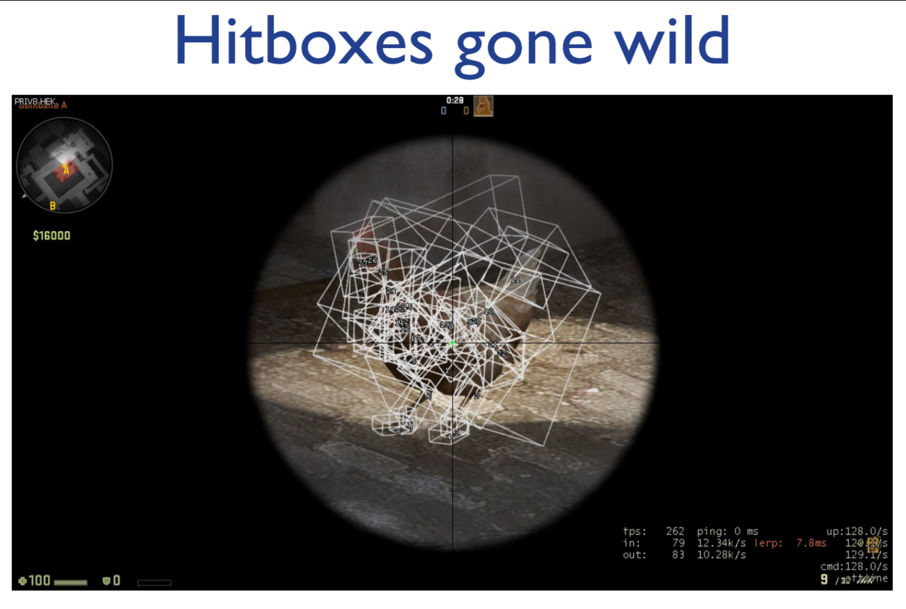

Graphics and Computation COMP30019 Lecture 6
============================================

#### Physics
- They don't exist in an virtual environment by default
- We have to implement these ourselves
- Newton's Laws of Motion

# Collision Detection
- As the name implies, collision detection is all about the detection of an intersection between different objects in a virtual environment
> **Why is this important?**
- Prevent objects from *clipping through each other*
- Produce *realistic environments* by having objects *react accordingly*
- Bad collision results in things like [this](https://www.youtube.com/watch?v=nuxmgZL1Y0s) (warning, loud!)
- Two *different approaches* to *collision detection*

### Continuous (a priori)
- We predict if a collision is going to occur based on the trajectories of the objects
- 
- This *works pretty well* but is also *really expensive* since you need to be checking *every vertex* for a collision
	- If you have thousands of collisions you're gonna have a bad time
	- If you have 1 object with 100 triangles, and another with 200, then there are 20000 different potential intersections to calculate
- Very computationally complex

### Discrete (a posteriori)
- Allows objects to actually penetrate each other
- The physics engine pushes it back to where the collision happened initially
- You do not see the penetration (i.e. middle of the diagram)
- 
- This works okay but *there's a chance that it'll suffer from **tunnelling***
	- If your object is travelling *really fast* then it might go through objects
	- 

### Bounding Volumes
- Used to simplify collision detection
- Volumes enclose the whole object, and should be as small as possible
- Simpler calculations
- But you may end up with that grenade issue as shown earlier

### Types of Bounding Boxes

#### Axis Aligned Bounding Box (AABB)
- Bounding box remains oriented with respect to the main axes
- 
- **Pros**:
	- *Translation invariant*
	- Does not change if you move every point of the object by the same amount in a given direction
	- Simple to compute
- **Cons**:
	- *Needs to be recomputed every frame*
	- *Changing volume*, so in some cases it might hit depending on how the tank is oriented

#### Oriented Bounding Box (OBB)
- Box is oriented with respect to the tank
- 
- **Pros**:
	- *Translation invariant*
	- Volume is *more compact than AABB*, so *less empty space*
- **Cons**:
	- Computation of intersections is complex as *box orientation/rotation is dynamic*

#### Bounding Spheres
- Sphere around the object
- 
- **Pros**:
	- *Transformation invariant*
	- Simple collision detection
- **Cons**:
	- More empty space in the bounding volume

## Hierarchical Bounding Volumes
- We can split a model into smaller bounding volumes to improve efficiency
- **Broad phase (simple, low cost)**
	- Used as a first pass to identify potential collisions
- **Narrow phase (complex, high cost)**
	- Once we find a potential collision, we do *more complex collision tests*
- Once you have a collision you can do a lot of things after that collision with more complex series

### Hitboxes
- Collision detection but *in one way*
- Don't need to figure out if a person hits a bullet - only the other way around
- 
- Here hierarchical bounding volumes are used to calculate damage based on where the character is hit
- 
- Larger hitboxes results in stuff like [Hanzo in Overwatch](https://www.youtube.com/watch?v=rQ-sip4-CFw)
	- Apparently Gorge is *not a Hanzo main*
	- "This character is hard to play"
- 
> "Ethical developers - make sure you kill your chicken properly."
