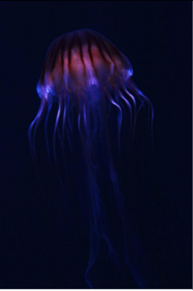
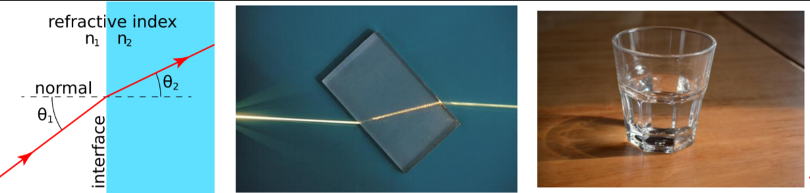
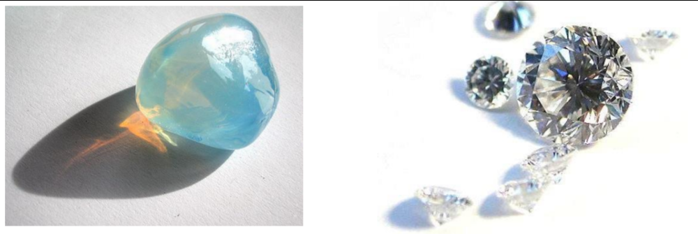
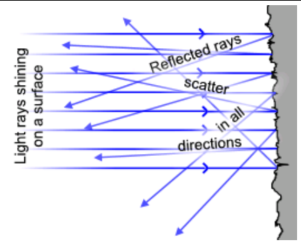
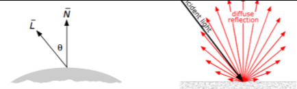
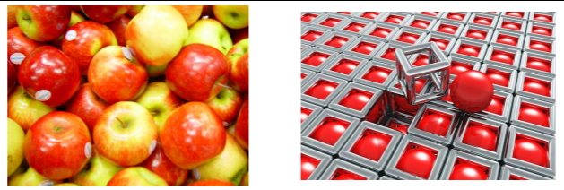
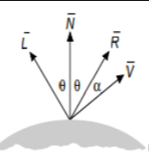
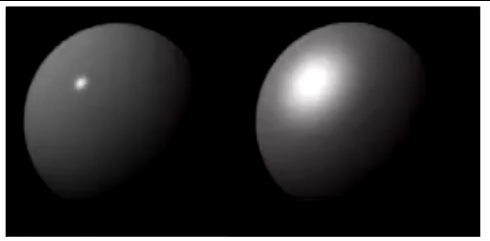
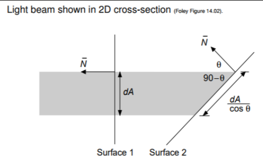

Graphics and Computation COMP30019 Lecture 7
============================================

# Illumination Models

## Physics
- IRL, physics precisely defines measurable phenomena in the universe
- Specifically
	- Nature of Light and it's interaction with materials
	- Newton's laws of motion
	- Gravity

## Shading and Illumination
- Surface material properties
- Orientation of surfaces
- Nature and direction of light sources
- View direction
- Shadows

## Surface Types
- Self-luminous
- Refractive
- Translucent
- Reflective
	- Diffuse
	- Specular

### Self Luminous
- The object itself eminates light
- A lightbulb
- Radioactive isotopes
- Those weird mushroom things in Blackreach in Skyrim
- 

### Refractive
- Change in transmission medium
- Water
- Glass
- 

### Transclucent
- Light interacts in a more complex way, e.g. scatters
- Curtains
- 

### Reflective (Diffuse)
- Light is reflected from a surface in many different angles
- Carpet, rugged surfaces
- 

### Reflective (Specular)
- Light is reflected from a surface in the same angle
- Polished steel
- Glossy surfaces

## Isotripoc Surfaces
- Where the *relationship* between the *incoming* and *outgoing* direction of light is the same over the whole surface
- Illumination models generally most often consider isotropic surfaces only, however
- Certain kinds of material and certain rock or stone faces have asymmetric illumination models so they're hard to make

## Which Illumination Model to use?
- Balance between modelling the physics fully and computational cost
- **Simple Illumination Models** do not consider shadows
	- Doesn't have radiosity
	- Doesn't have reflections
- **Full Ray Tracing**
	- Takes a ray of light and just keeps bounding it till it diminishes
	- Really expensive
	- nVidia RTX 2080 anyone?
 
## Components of Light
- **Ambient component**
	- Uniform light from all directions
	- Won't care about shadows/reflections
	- Can be calculated by:
		- `I = Iaka`
		- `Ia = intensity of the ambient light`
		- `Ka = percentage of the light reflected by the object (or albedo)`
- **Lambertian component**
	- The brightness depends only on the angle θ between the firection (L) to the light source and the surface normal (N)
	- A.k.a. Matte or diffuse lighting
	- Reradiated light is reflected *uniformly in all directions*
	- 
	- Calculated by:
		- `I = Ipkdcosθ`
		- `Ip = intensity of light`
		- `kd = coefficient of diffuse reflection (reflectivity)`
	- Cosine expressed as a scalar product
		- `I = Ipkd(N . L)`
		-  N and L are unit vectors in the directions, respectively, of the surface normal and of the light source.
- **Specular component**
	- This is the "shine" when you point a light at metal
	- All these things will influence the specular component
	- Highlights
	- 
	- If it's a mirror, it follows the law of perfect reflection (incident angle same as original)
	- Glossy surfaces spread out to a greater/lesser degree, from the direction of perfect reflection
		- Caused by *microscopic unevenness of the surface*
	- Modelled by  looking at the angle α between the direction of *perfect reflection* and the viewer direction - modify the reflected intensity by the factor `(cos α)^𝑛`
	- 
	- The exponent n is the specular reflection exponent and controls the degree of spread
		- High values of n lead to sharp highlights, more mirror-like
		- Low values of n lead to slow fall off and spread out, diffuse highlights
		- 

### Surface Orientation
- 
- Both of these surfaces actually appear the same
- The area on surface 2 is bigger, but the intensity of surface 1 is larger
- These two effects *exactly compensate*
- So looking at a lambertain light looks the same at all angles

## Distance of Viewer from surface
- Likewise, as the surface moves futher away from the viewe, the received light intensity falls off as an inverse-square law in distance
- However, for a *given angle subtended* at the viewer, the amount of surface included *grows in proportion to the square of the distance*
- These two compensate, so the intensity of Lambertian reflection is *independent of the distance of the surface from the viewer*

## Combined Lighting Models
- The combination of ambient, lambertian and specular is *adequate for realistic renderings*
- Can assume isotropic surfaces
- This lighting model is called **The Phong Reflection Model**
	- 