Graphics and Computation COMP30019 Lecture 8
============================================

# Surface Rendering and Shading

## Shading vs Illumination Model
- There's a difference between the *shading* model and the *illumination* model
- **Illumination Model**
	- Determining *how light sources* interacts with object surfaces
- **Shading Model**
	- How to *render the faces of polygons* in the scene, given the illumination

## Light Source Models
- **Point Source**
	- All light rays *originate at one point* and *radially diverge*
- **Parallel Source**
	- Light rays are *all parallel*
	- Can be modelled as a *point source at infinite distance* (e.g. the sun)
- **Distributed Source**
	- All light rays *originate at a finite area* in space
	- Models a *nearby source*, such as fluorescent light

## Shading Techniques
- **Flat Shading**
	- No interpolation
	- Straight one colour, then another
- **Smooth Shading**
	- Linear interpolation
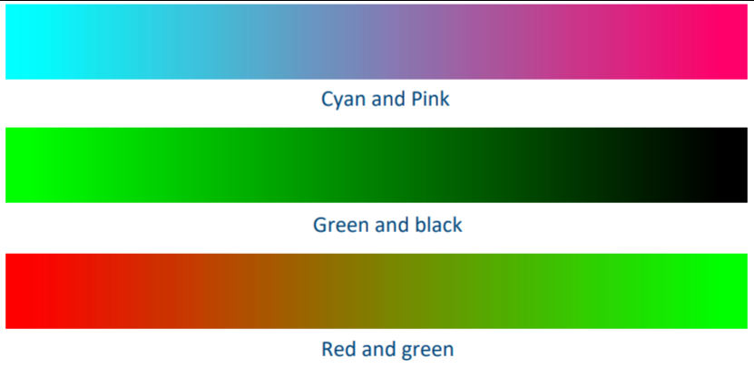

## Flat Shading
- Same values are used to render the entire polygon
- Misses out on shading variations
- Really *fast and simple to compute* compared to smooth shading
- Realistic in certain cases
	- Polygon is small enough
	- Eye is very far away
- Each vertex is clearly shaded one colour
	- Results in the *Mach Band Effect*
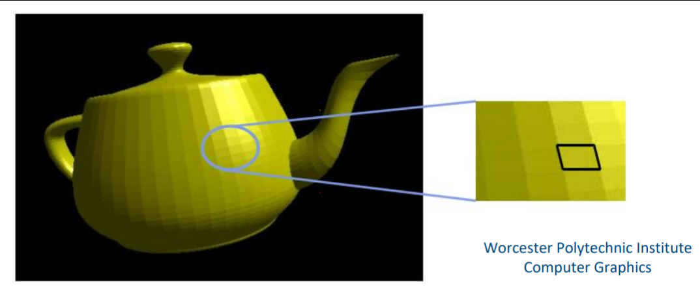

## Smooth Shading
- This is an improvement on the above
- In smooth shading the lighting is computing at *multiple points* on each polygon
- No Mach Band Effect
- Two popular methods of implementing smooth shading:
	- **Gouraud Shading**
	- **Phong Shading**

### Gouraud Shading
- Lighting calculated for *each polygon vertex*
- Colours interpolated for pixels on the other side of the vertex
- Linear change from one vertex to another
- **Cons:**
	- If a polygon surface has high curvature then the shading can freak out since it tries to change linearly in a very short space
	- Assumes linear change across polygon (if it's bumpy it won't work so well)
	- Change in vertex angles isn't handled very well

#### Gouraud Shading Algorithm
1. Determine a normal at each polygon vertex
2. Apply illumination model at each vertex to calculate the vertex intensity
3. Linearly interpolate the vertex intensities over the surface polygon
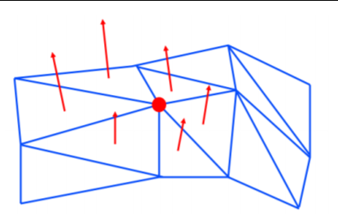

### Phong Shading
- Phong shading is *similar to Gouraud*, except instead of interpolating at vertex normals, it *does it at every pixel* using the normals.
- Slower but handles highlights a lot better than Gouraud shading
- Emulates a similar look to as if you had many many more polygons
- Should look nicer than Gouraud but more expensive
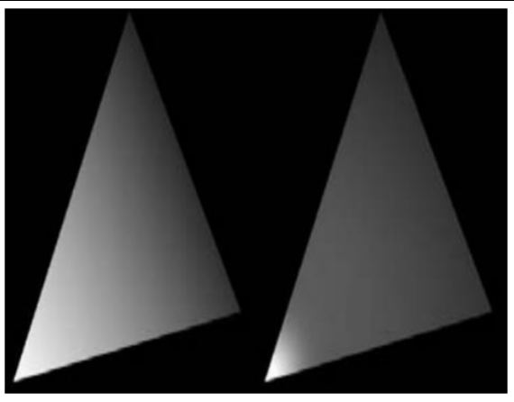
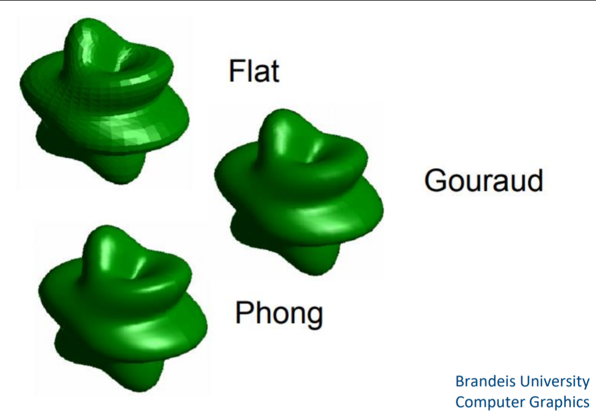

#### Phong Shading Algorithm
1. Determine a normal at each polygon vertex
2. Linearly interpolate the vertex normals over the surface polygon
3. Apply the illumination model along each *scan line* to calculate the *intensity of each surface point*
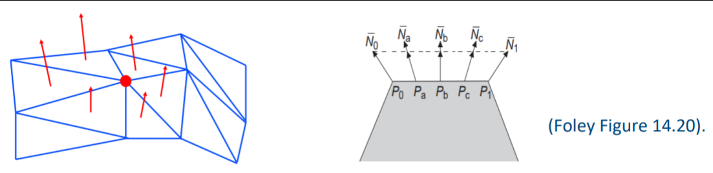

## Cel Shading
- Non-realistic shading technique aimed at making objects look like comic books
- [*Borderlands*](https://www.youtube.com/watch?v=gXl9mqlRqKY) has this iconic look
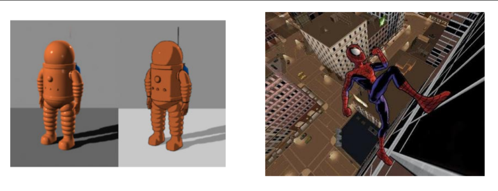

## Textures
- After creating an object, you can apply a *texture* onto it
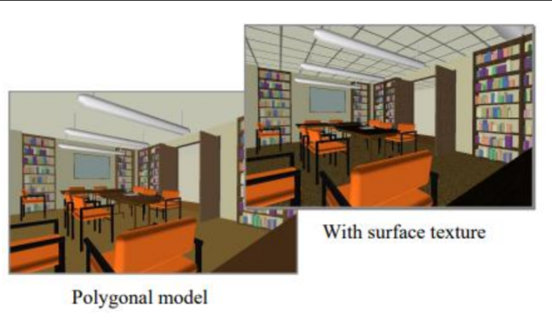

### Texture Mapping
- Texture mapping maps a planar image onto a 3-dimensional object
- **Issues with Texture Mapping**:
	- *Texture Maps smaller than the surface*
		- If you replicate the texture, the image may not look natural
		- If you don't then the texture may not cover the whole surface
		- You have to align the texture correctly
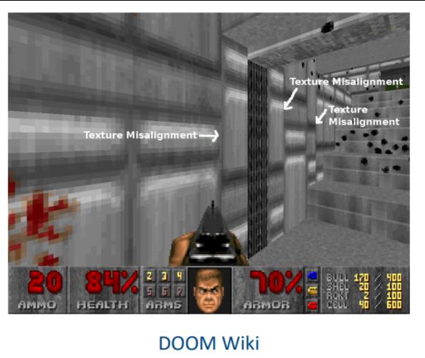
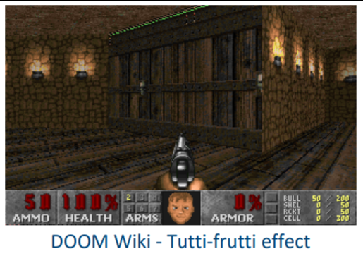
- In the above image, you can see a green line at the top where the texture was not large enough and the renderer doesn't know what to output

### Texture Synthesis
- Texture Synthesis can fix this but only works with *random looking textures*
- 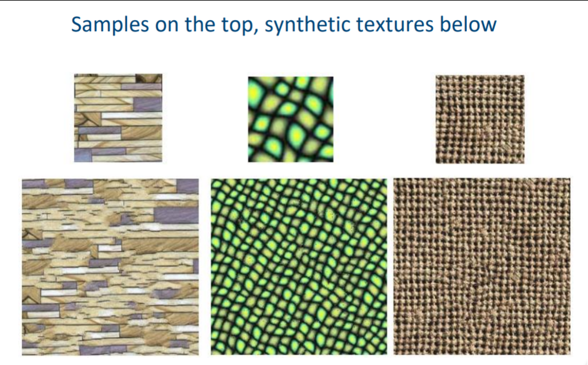

## Displacement Mapping
- Actually [*changes the shape of the surface*](https://www.youtube.com/watch?v=FWwUp7Oz1Lw) according to applied texture values
- Increases number of polygons
- This results in far more realistic looking 'textures' but is more expensive

## Bump Mapping
- Used to *generate rough surfaces* without increasing the number of polygons
- The surface does not change, but shading makes it look like it did
- Can be used to add realism to textures
- Notice in the 2nd image, the geometry of the ball on the right has *actually changed* as the shadow reflects this
- In the first ball, only the shading has changed, but the actual geometry hasn't changed (i.e. physics would be the same as a normal ball0)
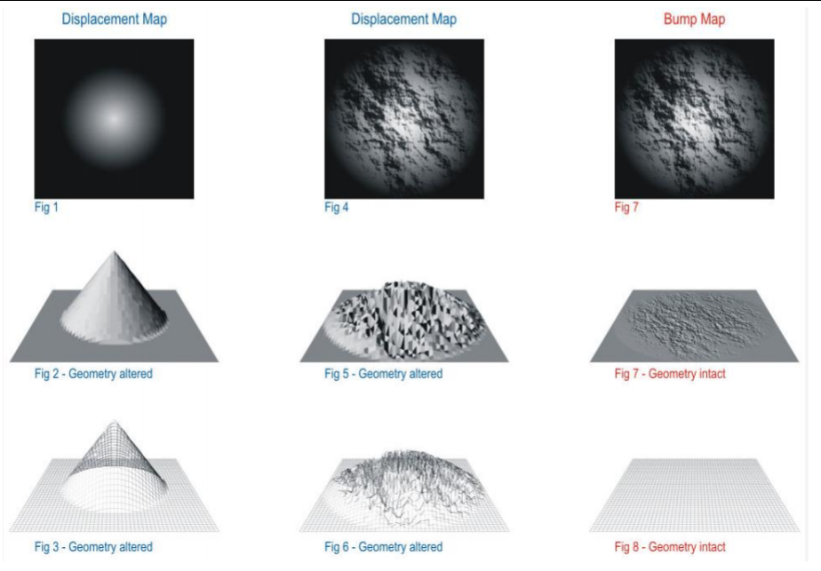
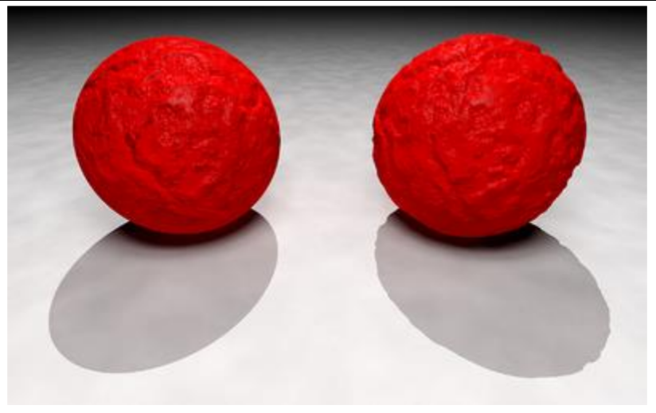