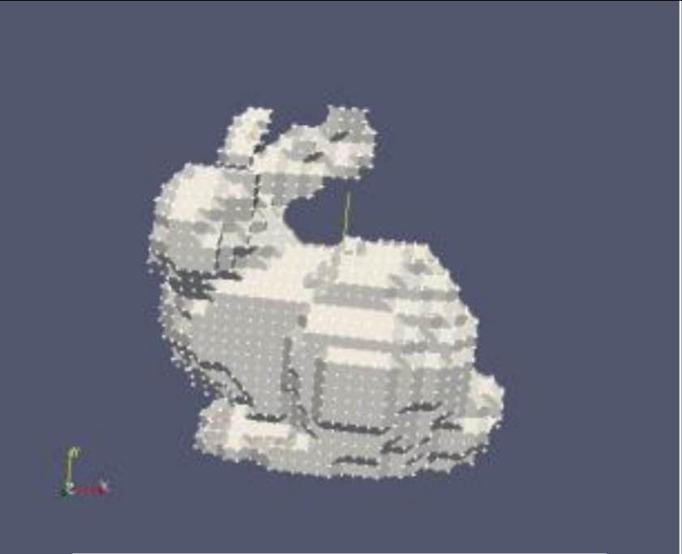

Graphics and Computation COMP30019 Lecture 9
============================================

# Particle Systems

> "A particle system is a collection of many small particles that together represent a fuzzy object.
> Over a period of time, particles are generated into a system, move and change from within the system, and die from the system."

## Geometry Shaders
- We want to create particles in the GPU not the CPU
- Create new primitives from existing ones
- Useful in creating *particle systems*
- This is done in the *geometry shader* section of the DX11 pipeline

## Uses of Particle Systems
- Used to model irregular types of natural phenomena
- e.g.
	- [Fire](https://www.youtube.com/watch?v=mMHcnyZMp-c&ab_channel=Koldora)
	- Water
	- Smoke

## Particle System Criteria
- All particle systems follow *two main criteria*:
- **Collection of Particles**:
	- A particle system is composed of *one or more individual particles*
	- Each particle has *attributes* that *effect the behaviour of the particle* (how/where it's *rendered*)
- **Stochastically Defined Attributes**:
	- Has a random element with stochastic limits (bounds, variance, distribution).
	- This random element is used to control the particles

### Attributes of a Particle System
- Particles can have a [number of different attributes](https://www.youtube.com/watch?v=heW3vn1hP2E&ab_channel=Koldora):
	- Emission (speed, spread, rate)
	- Age (time that particle has been alive)		
	- Lifespan (infinite, constant, variable)
	- Opacity (static, dynamic)
	- Colour (static, dynamic)
	- Size
	- Shape

## Life Cycle of a Particle

### Generation
- Particles are *randomly generated* within a *predetermined location*
- This location can change over time
- Particles are *given initial values*
	- These values can be fixed or *determined by a random/stochastic process*

### Dynamics
- Attributes of each of the particles may vary over time
- Example:
	- The colour of a particle in an explosion may get darker as it gets further from the center from the explosion
- Each of the particle attributes *can be specified by an equation of time*
- Particle attributes can be functions of both time and other particle attributes

### Extinction
- When the particle age matches it's lifetime, it is *destroyed*
- In addition there may be other criteria for terminating a particle prematurely
- e.g.
	- **Running out of bounds**
		- If a particle moves out of the viewing area and will not re-enter it
	- **Hitting the ground**
		- It can be assumed that particles that run into the ground burn out
	- **Some Attribute Reaches a Threshold**
		- If a particle colour turns transparent then it will not contribute anything to the image

## Rendering
> What if you render the entire life cycle of each particle *simultaneously*?
- You can use this technique to render **static particles**
	- This is useful in creating certain effects like
		- Hair
		- Fur
		- Grass
	- 
- Particle simulations are achieved via
	- **Sprites (2D)**
	- **Voxels (3D)**

### Sprites
- A sprite is a textured quad
- Usually controlled by 2 sets of values
	- Anchor point
	- Sprite dimensions
- [You can still use it in a 3D context](https://www.youtube.com/watch?v=EKQKUVrIbkA)

### Voxels
- Essentially 3D pixels
- Used quite commonly in cinema since performance is less of an issue
- Quite [computationally complex](https://www.youtube.com/watch?v=miWXtX46QAY)
- 
