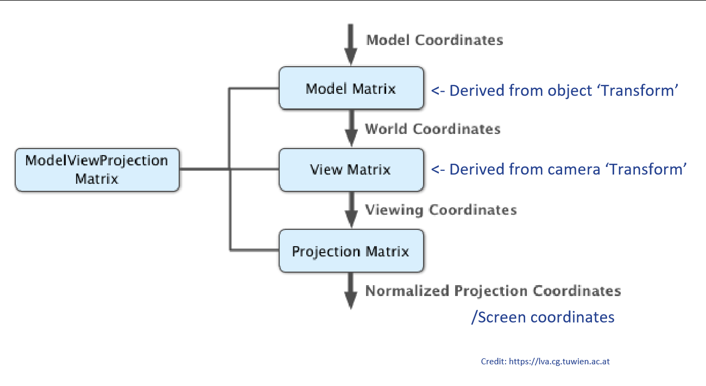
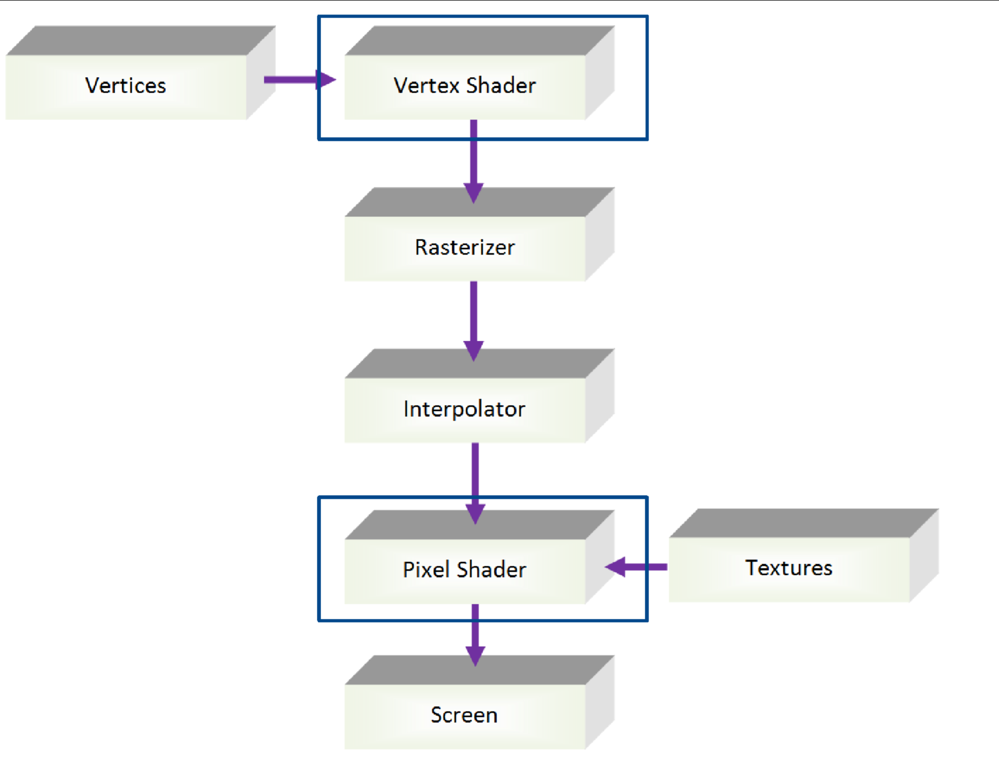
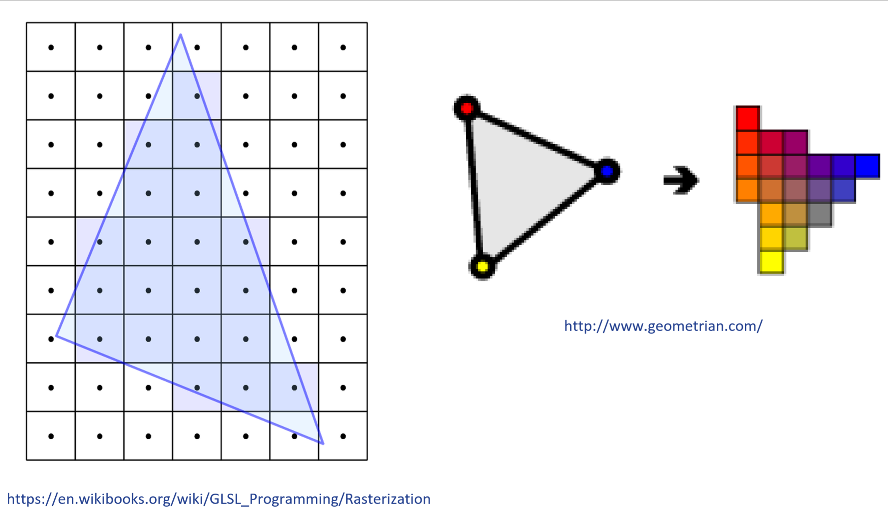
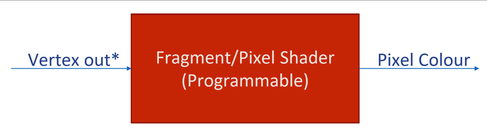
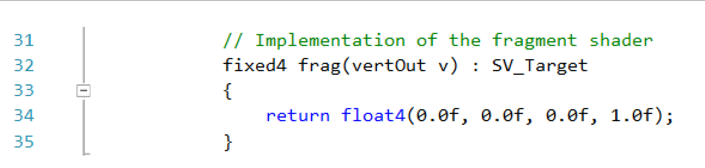

Graphics and Interaction COMP30019 Tutorial 3
=============================================

# Assignment Stuff
- Surface Properties
	- Set vertex colour based on height
	- Vertex shader
	- Lighting models
	- Create water waves using a vertex shader
- Try and complete the first two sections (landscape and camera motion) before continuing

# The GPU
- Located on a graphics ard
- Specialised processor for graphics processing
- Strong emphasis on *parallel computing*
	- Unlike CPU which does 1 operation at a time, GPU does multiple
- A very specialised processor that's good at linear algebra
	- Multiplication of matrices is a big thing for GPUs
- Many cores

# The GPU/CPU split
- Main memory works with CPU
	- i.e. C#
- Sends a mesh via PCI bus to GPU
	- GPU stuff is stored in graphics memory
	- Cg/HLSL

# Transformations
- If we only upload the vertices to the GPU once, then how do we *rotate, scale* and *translate* the object in *the game world* in real time?
	- Use **transformation matrices**

# The Model Matrix
- Upload the vertices once, then upload a transformation continually
	- Let the GPU do the heavy lifting via shaders
- Unity automatically calculates this matrix based on the transform component of the object and uploads it every frame

# Model -> View -> Projection (MVP)
- Derive model matrix from transform
	- Appl yworld coordinates to this
- Derive view matrix from model matrix
	- Camera can be placed arbritrarily
	- Everything transform around the camera
	- Apply viewing coordinates
- Derive projection matrix
	- Render on 2d surface
- 
- You can multiply all 3 models to get one MVP
- Orthographical projection
	- Throw away Z

# Programmability of the GPU
- GPU used to be a specialised thing that did one thing
	- Render specific 3d graphics in a certain way
	- Now we have shaders which can execute on the GPU
	- Programmability is ever increasing

# Rendering Pipeline
- 
- Vertices -> Vertex Shader
- **Vertex Shader** does transformations
- **Rasterizer** translates it into *pixels*
	- Scanline algorithm
	- Figures out whether this pixel is a part of the triangle
- **Interpolator**
	- Look at vertices
	- Interpolation
		- We want to select a value between two values
		- Smoothing technique
	- Converting projections into an image
- **Pixel Shader**
	- Defines colours for pixels
- It looks like Vertex Shader feeds directly into Pixel Shader
- Each step in the pipeline must be completed before rendering the next

# Vertex Shader
- `Vertex in -> Shader -> Vertex out`
- Can take things like colours, values etc. that represent a single point
- HLSL
	- "High Level Shader Language"
		- Even though it's quite low level
		- Similar to C but made for linalg
	- You can only interact with one vertex at a time
	- Limitation because of the great efficiency you get
- Output goes into `Rasterizer`
- `Vertex out -> Rasterizer/Interpolator -> Vertex out*`
	- Vertex out* is in terms of pixels
	- Same structure but represents a pixel

# Rasterization and Interpolation
- 
- You can interpolate any values, not just colours

# Fragment/Pixel Shader
- 
- Also done in parallel
- Lighting models go her
- 

# Textures
- Vertex colours are limiting
- A texture is an image that is wrapped onto the surface of a mesh
- Associate a UV coordinate with each vertex (like vertex colours)
- Stretching an image
- Textures are implemented in shaders by means of a *texture sampler*
- The interface to a texture sampler in HLSL is a **function**
	- Inputs: **Texture** and a **UV coordinate**
	- Output: A **colour**


# HLSL
```HLSL
//UNITY_SHADER_NO_UPGRADE

Shader "Unlit/CubeShader"
{
	SubShader
	{
		Pass
		{
			CGPROGRAM
			#pragma vertex vert
			#pragma fragment frag

			#include "UnityCG.cginc"

			struct vertIn
			{
				float4 vertex : POSITION; // represents a single instance of a vector in cubescript -> this is a SEMANTIC
				float4 color : COLOR;
			};

			struct vertOut
			{
				float4 vertex : SV_POSITION;
				float4 color : COLOR;
			};

			// Implementation of the vertex shader
			vertOut vert(vertIn v)
			{
				vertOut o;
				o.vertex = mul(UNITY_MATRIX_MVP, v.vertex);
				o.color = v.color; 		// simply assign color to that vertex
				return o;
			}
			
			// Implementation of the fragment shader
			fixed4 frag(vertOut v) : SV_Target
			{
				return v.color;			// return our color when rendering
				// return float4(0.0f, 0.0f, 0.0f, 1.0f);
			}
			ENDCG
		}
	}
}

```

Note for assignment:
- Try not to use recursion/DFS for diamond-square