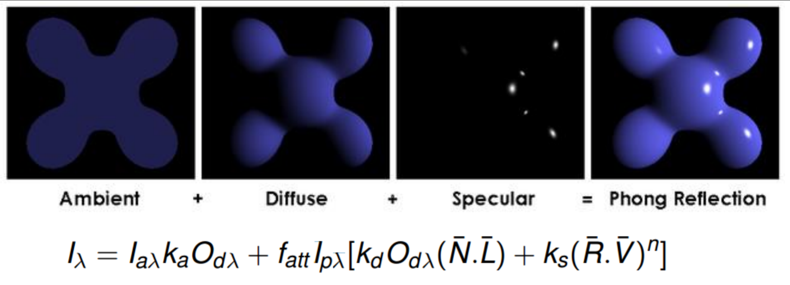

Graphics and Interaction COMP30019 Tutorial 4
=============================================

# Shading

# Phong Illumination Model
- Ambient
- Diffuse
- Specular
- Phong
- Too expensive to simular light irl (raytracing)
- We can use the Phong Illumination model to *simulate raytracing*

- Where Iλ is a vector for each *RGBA*

## Ambient
- Comes from all directions
- Uniformly bouncing light
- Baseline level of light

## Diffuse
- Scattered light in all directions
- Represented by kdOdλ(N.L)

### Normal
- A vector perpendicular to the surface
- 90 degrees
- Normals have to be defined when you're doing lighting calculations

## Specular
- Light is reflected off of the surface
- Reflects in the same direction as it came
- Represented by kₛ(R.V)ⁿ
- n represents the "sharpness" of the highlights
- A mirror is a extreme specular surface

## Shading Models
- Given an illumination model - where on the object should it be applied?
- Flat
	- Per triangle
- Gouraud
	- Per vertex
	- Pixel shader
- Phong
	- Per pixel
	- Fragment shader