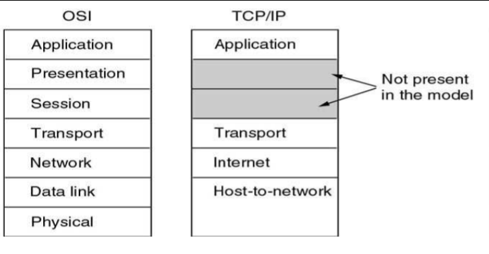
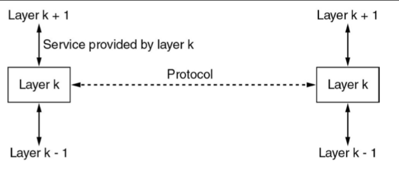
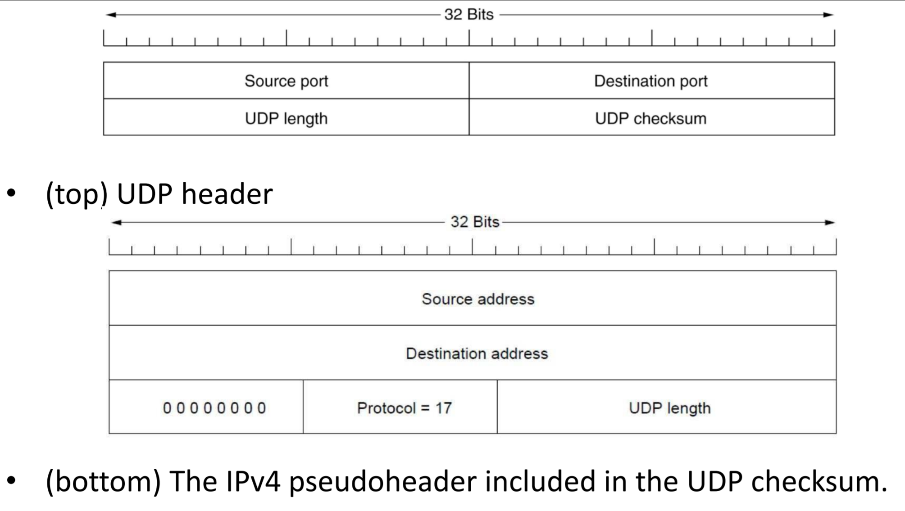
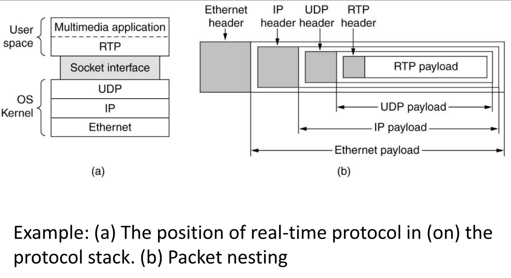
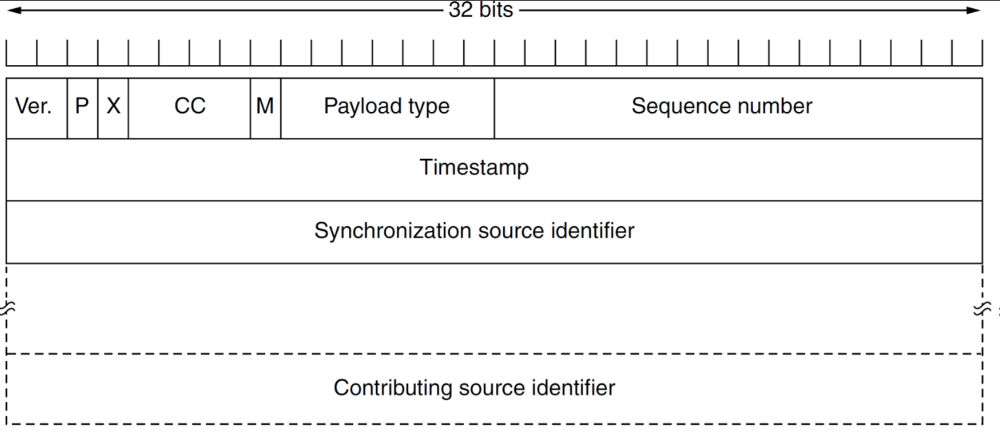
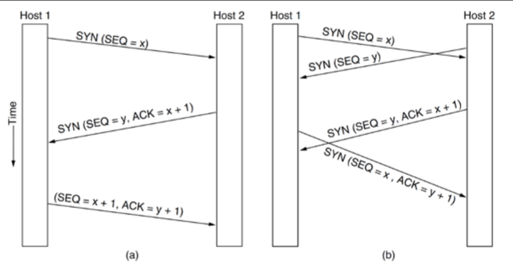
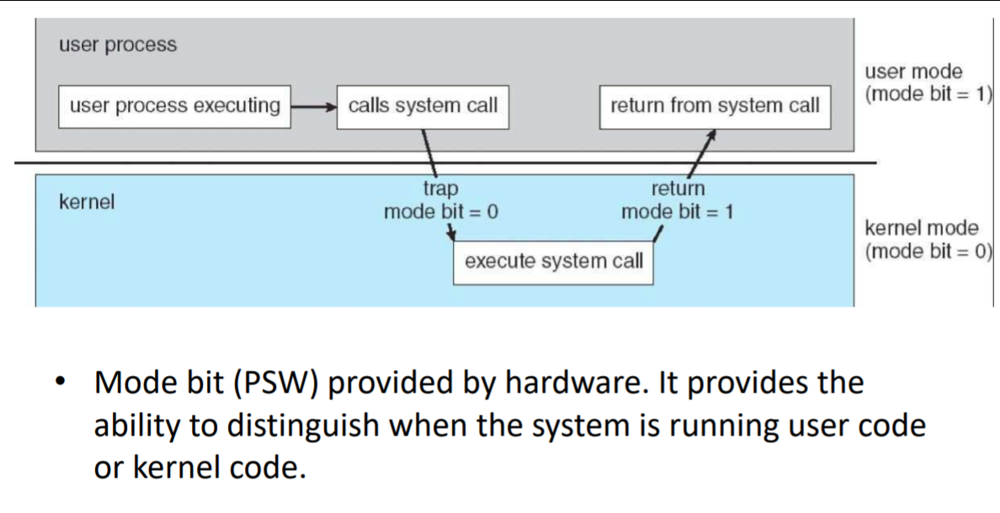
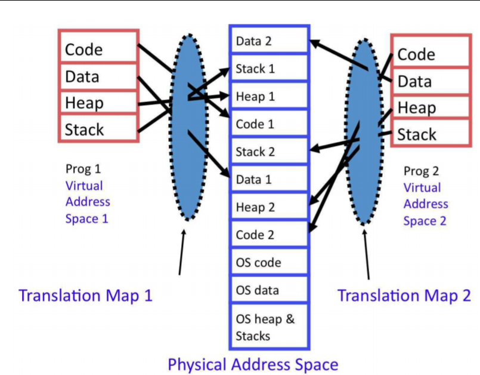
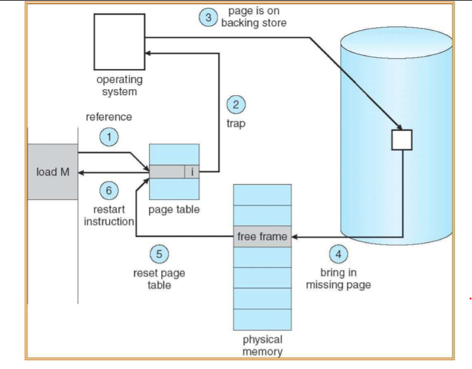

COMP30023 Computer Systems Semester 1 2018
==========================================

Exam Revision Notes
===================

### Table of Contents
-   [Network Models](#network-models)
    -   [OSI vs TCP/IP](#osi-vs-tcpip)
        -   [Differences, Advantages,
            Disadvantages](#differences-advantages-disadvantages)
        -   [Why do we need them?](#why-do-we-need-them)
        -   [Services vs Protocols](#services-vs-protocols)
        -   [Connection Oriented vs.
            Connectionless](#connection-oriented-vs.-connectionless)
-   [Application Layer](#application-layer)
    -   [HTTP](#http)
        -   [Differences Between
            Versions](#differences-between-versions)
        -   [HTTP Request Methods](#http-request-methods)
        -   [Response Codes](#response-codes)
        -   [Cookies](#cookies)
    -   [DNS](#dns)
        -   [Domain Names:](#domain-names)
        -   [Resolution](#resolution)
        -   [Resource Records](#resource-records)
    -   [Streaming](#streaming)
        -   [TCP vs UDP](#tcp-vs-udp)
        -   [Protocols](#protocols)
    -   [Transport Layer](#transport-layer)
        -   [Encapsulation](#encapsulation)
        -   [Reliable vs Unreliable](#reliable-vs-unreliable)
        -   [Addressing (Port Numbers)](#addressing-port-numbers)
        -   [Multiplexing/Demultiplexing](#multiplexingdemultiplexing)
        -   [UDP - User Datagram
            Protocol](#udp---user-datagram-protocol)
    -   [Transport Layer UDP](#transport-layer-udp)
        -   [Remote Procedure Calls](#remote-procedure-calls)
        -   [Idempotent Requests](#idempotent-requests)
        -   [Real-Time Transport
            Protocol](#real-time-transport-protocol)
    -   [Transport Layer TCP](#transport-layer-tcp)
        -   [Primitive Functions](#primitive-functions)
        -   [Segments](#segments)
        -   [3 way Handshake](#way-handshake)
        -   [Transport Layer Sliding
            Window](#transport-layer-sliding-window)
        -   [Sockets](#sockets)
-   [Processes and Threads](#processes-and-threads)
    -   [Program vs Process vs
        Threads](#program-vs-process-vs-threads)
    -   [User vs Kernel Threads](#user-vs-kernel-threads)
    -   [Program Status Word](#program-status-word)
    -   [Interrupts](#interrupts)
-   [Memory Management](#memory-management)
    -   [Swapping](#swapping)
    -   [Virtual Memory](#virtual-memory)
    -   [Paging](#paging)
    -   [Memory Management Unit (MMU)](#memory-management-unit-mmu)
    -   [Page Fault Handling](#page-fault-handling)
    -   [Translation Lookaside
        Buffer](#translation-lookaside-buffer)
    -   [Address Spaces](#address-spaces)
-   [Internet Layer](#internet-layer)
    -   [Quality of Service](#quality-of-service)
        -   [Why is QoS important?](#why-is-qos-important)
        -   [QoS vs Net Neutrality](#qos-vs-net-neutrality)
    -   [IP Version 4 Protocol (IPv4)](#ip-version-4-protocol-ipv4)
        -   [IP Addresses - CIDR (What we
            use nowadays)](#ip-addresses---cidr-what-we-use-nowadays)
        -   [Subnets](#subnets)
        -   [Subnet Masks](#subnet-masks)
        -   [Network Address
            Translation (NAT)](#network-address-translation-nat)
        -   [Fragmentation](#fragmentation)
        -   [Routing Overview](#routing-overview)
        -   [Routing Algorithms](#routing-algorithms)
        -   [Border Gateway
            Protocol (BGP)](#border-gateway-protocol-bgp)
        -   [Address Resolution Protocol](#address-resolution-protocol)
-   [Link Layer](#link-layer)
    -   [Ethernet](#ethernet)
    -   [Link Layer Purpose](#link-layer-purpose)
    -   [Medium Access Control
        Sublayer](#medium-access-control-sublayer)
    -   [Broadcast Channels Collisions](#broadcast-channels-collisions)
    -   [Ethernet](#ethernet-1)
    -   [Classic Ethernet](#classic-ethernet-1)
        -   [Classic Ethernet - Bus Model](#classic-ethernet---bus-model)
        -   [Classic Ethernet - Hub Model](#classic-ethernet---hub-model)
    -   [Switched Ethernet](#switched-ethernet)
    -   [Hubs vs Switches](#hubs-vs-switches)
    -   [Fast Ethernet](#fast-ethernet)
    -   [10 Gigabit Ethernet](#gigabit-ethernet)
    -   [Link Layer - Wireless LANs](#link-layer---wireless-lans)
        -   [Collision Management](#collision-management)
        -   [802.11 Frame](#frame)
        -   [802.11 Security](#security)
    -   [Network Discovery and Power
        Usage](#network-discovery-and-power-usage)
    -   [Network Discovery Security](#network-discovery-security)
    -   [Evil Portal](#evil-portal)
-   [Cryptography](#cryptography)
    -   [Encryption](#encryption)
    -   [Decryption](#decryption)
    -   [Types of Cryptography](#types-of-cryptography)
    -   [Key Sizes](#key-sizes)
-   [Certificates](#certificates)
    -   [What's the purpose of a
        certificate?](#whats-the-purpose-of-a-certificate)
    -   [Certificate Hierarchies](#certificate-hierarchies)
    -   [Trust anchors and certificate
        authorities](#trust-anchors-and-certificate-authorities)
    -   [Trusting root certificates](#trusting-root-certificates)
    -   [Certificate Issuance](#certificate-issuance)
    -   [Issues with Certificate
        Issuance](#issues-with-certificate-issuance)
    -   [Certificate Revocation](#certificate-revocation)
    -   [Certificate Transparency](#certificate-transparency)
    -   [Certificate Validation](#certificate-validation)
-   [TLS](#tls)
    -   [Secure Communication](#secure-communication)
    -   [TLS Handshake](#tls-handshake)
    -   [Diffie-Hellman Key Exchange](#diffie-hellman-key-exchange)
    -   [Diffie-Hellman Key Exchange
        Calculation](#diffie-hellman-key-exchange-calculation)
    -   [TLS in use](#tls-in-use)
    -   [Local TLS Interception](#local-tls-interception)
    -   [Network Level TLS
        Interception](#network-level-tls-interception)
    -   [Server-side problems](#server-side-problems)
-   [System Security](#system-security)
    -   [System Security Threats](#system-security-threats)
    -   [Full Disk Encryption (FDE)](#full-disk-encryption-fde)
    -   [Cold boot attack](#cold-boot-attack)
    -   [File System Encryption](#file-system-encryption)
    -   [Runtime Attacks](#runtime-attacks)
        -   [WannaCry attack](#wannacry-attack)
    -   [Viruses/Worms/Trojan Horses](#viruseswormstrojan-horses)
        -   [Malware](#malware)
        -   [Malware - Critical
            Infrastructure](#malware---critical-infrastructure)
        -   [Not just a network problem](#not-just-a-network-problem)
        -   [Social Engineering](#social-engineering)
        -   [USB Drop Attack](#usb-drop-attack)
        -   [Protection](#protection)
        -   [Software as a Service](#software-as-a-service)
        -   [Infrastructure as a Service](#infrastructure-as-a-service)
        -   [Some idiots getting their data
            breach'd](#some-idiots-getting-their-data-breachd)
        -   [AWS EC2](#aws-ec2)
        -   [AWS Credentials](#aws-credentials)
-   [Future of Computing](#future-of-computing)
    -   [Platform as a Service](#platform-as-a-service)
    -   [IaaS vs PaaS vs SaaS](#iaas-vs-paas-vs-saas)
    -   [Severless - Function as a
        Service](#severless---function-as-a-service)

Good luck everyone! :muscle:

Network Models
==============

OSI vs TCP/IP
-------------

### Differences, Advantages, Disadvantages

-   OSI is a 7 layer *conceptual* model that was never properly put into
    place
    -   Layers are Application, *Presentation, Session,* Transport,
        Network, Data Link and Physical
    -   **Advantages**:
        -   More well defined layers, allowing for better defined
            services
        -   Everything isn't shoved into the application layer
    -   **Disadvantages**:
        -   Not widely implemented
        -   May be too complex for basic configurations
-   TCP/IP is a 5 layer network - what we use today
    -   Presentation and Session are not present
    -   Named as TCP is used in Transport Layer and IP in Internet Layer
    -   **Advantages**:
        -   Implemented everywhere
        -   Simpler
    -   **Disadvantages**:
        -   Application layer not well defined 

### Why do we need them?

-   *Protocols* are required so we can all communicate in the same way
    -   Everyone just has to *implement one thing instead of everyone
        having different communication protocols*
-   Services can be provided to other layers of the same depth through
    these protocols

### Services vs Protocols

-   A *service* is a operation that can be performed by a layer k, for
    example presenting text on a webpage
    -   Think *vertically*
-   A *protocol* is a method of transfering data or performing
    operations from one layer to another of the same depth
    -   Think *horizontally*
-   

### Connection Oriented vs. Connectionless

-   **Connection Oriented**
    -   Two hosts *establish a connection* before transferring data
    -   Done in **TCP**
    -   If connection is broken, we have to re-establish the connection
-   **Connectionless**
    -   Connection is *not established*
    -   One host just starts sending information
    -   Done in **UDP**
    -   If the connection is broken, then we do nothing but just resend
        later

Application Layer
=================

HTTP
----

### Differences Between Versions

-   **HTTP 1.0**:
    -   Simple but inefficient
    -   Single use connections
    -   Use TCP to send request/response
    -   Have to *send a request/response for every element on a webpage*
        -   If a page has 10 images it'll send 10 requests
        -   **Non Persistent HTTP Overview**
            1.  HTTP Client initiates TCP connection to HTTP server on
                port 80
            2.  HTTP server waiting for TCP connection accepts
                connection on port 80, notifies Client
            3.  Client HTTP request message into TCP connection socket.
                Client indicates it wants object
            4.  Server recieves request message - responds and sends
                object message into socket
            5.  HTTP server closes connection
            6.  Client recieves response message with HTML file,
                displays this. Parses file, finds jpeg objects
            7.  Steps 1-5 repeated for every jpeg object
-   **HTTP 1.1**:
    -   Persistent connections
-   **HTTP 2.0**
    -   More speed improvements
    -   Improved caching, pipelining

### HTTP Request Methods

  Method   |Safe  |Idempotent  |Cacheable
  ---------|------|------------|-----------
  GET      |Y     |Y           |Y
  HEAD     |Y     |Y           |Y
  POST     |N     |N           |Y/N
  PUT      |N     |Y           |N
  DELETE   |N     |Y           |N
  CONNECT  |N     |N           |N
  OPTIONS  |Y     |Y           |N
  TRACE    |Y     |Y           |N
  PATCH    |N     |N           |N

##### ***Idempotent***:

-   multiple identical requests have same effect

##### ***Safe***:

-   only for information retrieval
-   shouldn't change state

Note: According to the Revision Lecture slides, we're doing GET, POST
and PUT

##### GET

Simply "gets" data. Should only retrieve data.

##### HEAD

Get a response identical to GET, but without the response body (so just
the header of the response itself).

##### POST

Requests that the server accept whatever is being sent as a new child of
the web resource as identified by its URI (e.g. a message on a messaging
app).

##### PUT

Requests that the server accept whatever is being sent to be stored
under the supplied URI. Also makes a new resource if the URI points
doesn't point to an existing resource.

##### DELETE

Deletes the specified resource.

##### TRACE

Echoes the recieved request so the client can see what's changed by any
intermediate servers.

##### OPTIONS

Returns the HTTP methods that the server supports for the URL.

##### CONNECT

Converts the request to a TCP/IP tunnel (usually to facilitate HTTPS
through an unencrypted HTTP proxy).

##### PACH

Applies partial modifications to a resource.

***Only GET and HEAD is generally required by a HTTP server, everything
else is optional.***

### Response Codes

  Code  |Type          |Example
  ------|--------------|--------------------------------------------
  1xx   |Information   |100 - Agrees to handle client's request
  2xx   |Success       |200 = request succeeeded; 204 = no content
  3xx   |Redirection   |301 = Page moved
  4xx   |Client Error  |404 not found
  5xx   |Server Error  |

#### HTTP Response Example:

``` {.http}
HTTP/1.1 200 OK             // Status line
Connection close            // Header Lines
Date: Thu, 06 Aug 2009 12:00:15 GMT 
Server: Apache/2.2.11 (Unix)    // generally change this to hide vulnerabilities
Last-modified: Mon, 22 Jun 2009 
Content-Length: 6821 
Content-Type: text/html

<html>...               // Data
```

### Cookies

-   Small amount of information placed on the user's computer and reused
    deterministically
-   Cookies of 5 fields: `domain`, `path`, `content`, `expiry`,
    `security`
-   Questionable mechanism for tracking users
    -   Since cookies appear everywhere you can figure out where
        someone's been
-   Used for session/login data etc.
    ```
    HTTP  Name           Value               Domain              Expires         HTTPOnly    Secure Session-id      356-7555.....       .amazon.com.au      2036-01-01.     -           
    ```

DNS
---

-   Used by a *resolver* to *resolve URLs* to an *absolute location*
    -   e.g. `google.com` vs `216.58.200.110`
-   Maps a `host.domain.com` to an **IP Address**
-   UDP based protocol
    -   Not secure
    -   Open to vulnerabilities
        -   DNS Spoofing
            -   Pretending you're a site with a slightly different name
        -   DNS Flooding
            -   Just DDoSing a domain

### Domain Names:

-   Case sensitive
-   Up to 63 characters per constituent
-   Can have up to 255 chars per path
-   Can be internationalised
    -   Non latin characters allowed
    -   Huge security problem
        -   URL Phishing -&gt; Using characters that look really similar
            but aren't
            -   Most browsers usually stop this

### Resolution

-   Done in "right to left" order: `com->domain->host`
-   Start at **top level domain** at **root server**
    1.  Check your cache/local DNS, if it's not there, then go to the
        root DNS server
    2.  Query for that part of domain
    3.  Continue down to next name server zone
    4.  Recursively do this until you reach the end

    -   
-   **3 Types of Name Servers**
    -   **Top level Domain DNS servers:**
        -   Responsible for com, org, net, edu
        -   *All top level country domains*
    -   **Authoritative DNS servers:**
        -   *Organisations'* DNS servers
        -   Authoritative hostname to IP mappings for organisations
            servers
        -   Maintained by organisation or servers provider
        -   Contains full resource records
    -   **Local DNS server:**
        -   *Not strictly part of this hierarchy*
        -   If you are running a DNS server in your machine, if it is
            not an authority for a host, then it isn't part of the
            hierarchy
        -   It's just caching and forwarding queries - a proxy

### Resource Records

-   These are described in a *zone file* of a DNS that basically gives
    information of the zone

  Type   |Meaning                  |Value
  -------|-------------------------|------------------------------------------
  SOA    |Start of Authority       |Parameters for this zone
  A      |IPv4 Address of a Host   |32-Bit integer
  AAAA   |IPv6 Address of a Host   |128-Bit integer
  MX     |Mail Exchange            |Priority, domain willing to accept email
  NS     |Name Server              |Name of a server for this domain
  CNAME  |Canonical name           |Domain Name
  PTR    |Pointer                  |Alias for an IP address
  SPF    |Sender policy framework  |Text encoding of mail sending policy
  SRV    |Service                  |Host that provides it
  TXT    |Text                     |Descriptive ASCII text

-   Usually you'll have separate servers for MX and stuff, otherwise
    you'll get weird problems.
-   SPF is nowadays used for authentication
-   Focus on remembering **SOA**, **A**, **MX**, **NS** and **CNAME**

Streaming
---------

### TCP vs UDP

-   UDP - Good for live video streams
    -   Packet loss is acceptable in return for immediate delivery of
        content
    -   Supports IP Multicast (one source -&gt; many destinations)
    -   Less resource intense on the server
        -   Smaller buffer (don't need to know whether packages were
            successfully sent)
-   TCP - Good for stored video
    -   Quality of service is provided, i.e. packet resending
    -   Individuals streams
    -   Compatible with Content Delivery Networks
    -   Can create *jitter/buffering* problems
    -   High workload on the server

### Protocols

##### RTMP

-   Real Time Media Protocol
    -   Flash Based
    -   Deprecated

Transport Layer
---------------

-   Layer responsible for preparing cost effective data transport
-   Provides a local communication between application processes running
    on different hosts
-   Interface between the application layer and the network/internet
    layer
-   Service provided to the application layer

### Encapsulation

-   As you send a message "down one layer" it is wrapped or encapsulated
    into the next unit header
    -   When it arrives at the other host, it will peel each layer off
-   Encapsulation is done in *frames*

### Reliable vs Unreliable

-   **Reliable Medium**:
    -   A *reliable medium* will *retransmit lost packets*
    -   Provides a notational perfect connection between two nodes
    -   Makes sure that data is *accurate*
-   **Unreliable Medium**:
    -   Makes no attempt to check for accuracy or whether the packets
        have been received
    -   Hides acknowledgements, congestion control, lost packets

### Addressing (Port Numbers)

-   When you receive data you have no idea what process requires this
    data
-   This is where port numbers are used
    -   If *IP addresses are like Street Addresses*, then *Port Numbers
        are like apartment numbers*
-   Port Numbers point to a process on the host

### Multiplexing/Demultiplexing

-   *Different streams from different ports* are **multiplexed** into
    *one data stream*
-   *Once the data arrives at the recipient*, it is **demultiplexed**
    into *multiple streams to be sent to their respective ports*
-   This is the process used in the Transport Layer to send data from
    different ports in one connection
-   Shortened to **MUXING/DEMUXING**

### UDP - User Datagram Protocol

-   Simple protocol for putting data into the Link protocol
-   Straight from source to destination with a particular port number
-   UDP headers contain *source and destination ports*, *payload is
    handed to the process* which is handed to the particular port at the
    destination
-   Simple and efficient
-   Suitable for some client-server settings
    -   *Short request and short response*
    -   If that does not occur, client timeouts and resents
    -   Simple to code, fewer messages, one in each dir
    -   DNS is a good example



Transport Layer UDP
-------------------

### Remote Procedure Calls

-   Basically having a different host and calling functions from them as
    if they are local
-   Hides networking from programmer
-   Makes distributed programming easier
    -   Hard to pass pointers since different addresses
    -   Unable to deduce parameter types
-   UDP can be a good choice for RPC
    -   Idempotent since everything is only sent once

### Idempotent Requests

-   This implies that the request multiple requests don't change
    anything and return the same thing every time
    -   An example would be looking up someone's name/address

### Real-Time Transport Protocol

-   Real Time Streaming Protocol/Real Time Transport Protocol
-   Runs in the middle of Transport Layer and Application Layer
    -   Provides services to applications but also prepares things to be
        sent in the Transport Layer
-   *Multiplexes several streams* into a *single stream of UDP segments*
-   Doesn't really matter which layer you pick in the Exams
-   Uses a **sequence number** in the RTP header - allows reciever to
    know if it's lost a packet
-   **Timestamp** - you can figure out how far from the first packet you
    need to play this one
-   Controlled by Real-time Transport Control Protocol RTCP

**UDP Example Use with RTP** 

**RTP Packet** 

**HLS/MPEG-DASH** - Web-based browser viewing - I guess this is like
YouTube/Generic video host sites

Transport Layer TCP
-------------------

-   TCP is a point to point connection
-   Reliable
-   Buffer Capable

### Primitive Functions

  Primitive   |Packet Sent        |Meaning
  ------------|-------------------|-----------------------------------------------------------
  LISTEN      |(none)             |Block until something tries to connect (can timeout this)
  CONNECT     |CONNECTION REQ     |Actively attempt to connect
  SEND        |DATA               |Send information
  RECEIVE     |(none)             |Block until DATA packet arrives
  DISCONNECT  |DISCONNECTION REQ  |This side wants to release connection

### Segments

-   TCP splits things into *segments* for transfer via a data stream
-   Receiver reconstructs the original byte stream with TCP
-   Each segment has a header of 20-60 bytes + zero or more data bytes
-   Header contains a bunch of different flags which can be used to
    signify different things
    -   Some examples of flags:
        -   SYN
            -   Request to synchronise, sent when initiating connection
        -   ACK
            -   Acknowledgement, sent to client upon connection
        -   FIN
            -   Finish transmission, close connection
        -   RST
            -   Reset
        -   PSH
            -   Don't buffer this segment and just send it

### 3 way Handshake

-   Client initiates by sending a SYN flag to the Server with a Sequence
    Number X
-   Server responds with SYN and ACK
    -   Sequence Number Y
    -   ACK number X + 1 (or some hash)
-   Client responds with SYN and ACK
    -   Sequence Number X + 1 (or some hash)
    -   ACK number Y + 1 (or some hash)
-   Connection established! 
-   Can DDoS a simple server by just flooding it with SYN requests and
    never sending the ACK

### Transport Layer Sliding Window

-   Works by limiting the number of segments the receiver can be sent at
    any given moment

##### At the Start :smile:

-   Both windows initialised
-   3-way handshake already done
-   Synchronized af boi

##### Sending stuff :speech\_balloon:

-   Bytes are loaded into the send window 'buffer' and these are called
    *in flight*
-   Send an ACK for a segment and the window size to the receiver
-   These bytes will be read by application
-   An ACK is sent back to sender *(may be out of order)*


##### Moving to the next segment :muscle:

-   Remove the first socket
-   Slide along the receiver window
-   Next byte received - same ACK process done again
-   Sender *still has less bytes for window size*
    -   This *variable window size* allows for a different number of
        bytes to be read for each segment
-   The sender *may send a window size update*
-   The sender window **must always be in sync with the receiver** and
    *the same size* or *slightly smaller*


##### Oh no! We lost a segment! :scream:

-   Keep sending the later segments cause we don't notice
    
-   Eventually receiver window *keeps sending an ACK for the previous
    segment* so the sender window stops and does a *fast retransmit*
    -   This previous ACK is called a *DupACK
        (Duplicate Acknowledgement)*
    -   *3 DupACKS = fast retransmit*
    -   If there's still other segments in the network we let them turn
        up before our resend 
-   Fast retransmit is just resending some shit
-   The latest ACK will have the newest byte value so we can go back up
    to where we were (sender window size should be 0 so again *don't
    send anything*)


-   Shitty thing is you can't predict when the receiver window will move
    on, just hope the data is read at some point
    -   The process is initiated when a window update is sent back and
        we'll start sending things again 

##### Persist Timer

-   The sender will just wait when it receives a 0 size window until the
    timer is up
-   After the timer is up it'll send a probe "pls notice me senpai" to
    the receiver window
    -   This should nudge the receiver window with a *ZeroWindowProbe*
        and the receiver should reply with a windowUpdate and a
        *ZeroWindowProbeACK*

### Sockets

-   In a UNIX system everything is like a file that can be written to
-   Sockets are a way to "write to" each other over network
-   Create sockets on both sender and receiver consisting of the IP
    address of the host and a port number
    -   A connection *must be established between a sending host socket
        and a receiving host socket*
    -   
-   Steps for creating a socket are the following:
    1.  Create a socket
    2.  Bind and listen to the socket for incoming connections
    3.  Accept the connection
    4.  Send data
    5.  Close the socket
-   Client just has to *connect* and *receive*
-   Use MultiThreading to allow concurrent connections

Processes and Threads
---------------------

[This is a pretty good
summary](http://www.8bitavenue.com/2015/07/difference-between-user-level-threads-and-kernel-level-threads/)

### Program vs Process vs Threads

-   **Program**:
    -   A blueprint or code/set of instructions from which a *process
        can be made*
    -   This is *static*
    -   Program is like the recipe
-   **Process**:
    -   A program in *execution* (i.e. an *instance of a program*)
    -   Several processes may be part of the same program
    -   Process is *dynamic*
    -   Process is like the dish
    -   Has at least one thread
-   **Thread**:
    -   A thread runs under a process and also does sequential
        operations
    -   However it *runs in a **shared memory space***
        -   Same address space/file descriptors/stack

### User vs Kernel Threads

-   **User Thread**:
    -   A thread created by the user via a threading library running in
        *user mode*
    -   **Advantages**:
        -   *Simple and fast to create/manage* and *doesn't require much
            resources*
        -   Efficient communication
        -   *Doesn't require Kernel Mode privileges*
    -   **Disadvantages**:
        -   Require a *kernel system call* to do privileged operations
            like read(), write()
        -   These system calls are *blocking* meaning *all threads in
            the same process have to wait until they're done*
        -   Subject to security restrictions\
        -   *Cannot* directly take advantage of *multiprocessing (using
            multiple cores)*
-   **Kernel Thread**:
    -   Kernel threads are supported directly by the operating system
        and run in *kernel mode*
    -   Part of the operating system
    -   Provides these services to user threads
    -   Protects against unauthorized memory access
    -   **Advantages**:
        -   Can do as many system calls as it wants
        -   If there's a blocked thread, it can simply schedule another
            thread from the same process
        -   Kernel routines can be multithreaded themselves
    -   **Disadvantages**:
        -   Expensive to create and switch
        -   Transfer of control from one thread to another within the
            same process requires a mode switch to the kernel mode

### Program Status Word

-   This is how the *operating system* determines *whether the kernel or
    the user is currently in control*
-   Most CPUs will have *two modes:* **User and Kernel Mode**
-   **User Mode vs Kernel Mode**:
    -   User mode can only do actions determined by the kernel
    -   Kernel mode can issue *all instructions and access all memory*
-   *Secure way of managing processes*

##### System Calls

-   User programs will use *system calls* to do privileged actions
    (executing privileged instructions on their behalf)
    -   System will typically do several privileged things in carrying
        out one logical operation
    -   The OS checks requests before executing them
    -   `e.g. open, read, write, close, fork, exec, exit, wait`

##### Mode Switching

-   This is done with a *mode bit* provided by the hardware
    -   Provides the ability to distinguish when the system is running
        user code or kernel code 

### Interrupts

-   This is what happens when a *hardware device needs attention from
    the CPU*, it'll generate an ***interrupt***
-   The *CPU* takes the current state of all the *program counters* and
    *program stats words* then *saves them in privileged memory
    locations*
-   *PSW* will be switched to **kernel mode** and *fix the interrupt*
-   After, it'll return from the interrupt by restoring everything
-   *Technically a blue screen is an interrupt*
-   *Traditionally only caused by hardware*
-   You can have a **pseudo interrupt**:
    -   Software calls
    -   Divisions by zeros/exceptions/weird behaviour

Memory Management
-----------------

### Swapping

-   This was historically main method of memory management 60s-90s
-   Basically *when the total size of processes exceed the size of main
    memory*, we **swap it onto the disk** called *swap space*
-   This was *performed by the kernel*
-   Causes *external fragmentation*
    -   Need to defrag

### Virtual Memory

-   Used nowadays everywhere
-   Runs off two assumptions:
    -   All the code/data of a program *has to be in main memory* when
        the program is running
    -   This code and data has to be stored in *contiguous locations*
-   So *in virtual memory* we just *load parts of the program we
    require*
-   Different parts of physical memory can be mapped to contiguous
    virtual memory
-   Allows *programs larger than the amount of available RAM to be run*
-   Very important in the 60s/70s when RAM was smol

### Paging

-   A paged system allocates a set number of pages for our system.
-   Addresses generated by programs are virtual addresses
-   Memory is kept in *physical pages* which are *mapped to virtual
    pages* in memory
-   Pages are swapped out/mapped depending on whether they are
    used/required
-   These addresses are *mapped to physical addresses* by a **Memory
    Management Unit (MMU)** 

### Memory Management Unit (MMU)

-   Responsible for mapping virtual pages to physical pages.
-   Whenever the CPU accesses memory, the MMU will transform the
    addresses according to the mapping
-   The *mapping* is *kept inside a **page table***.\
-   A **Page Table Contains the Following**:
    -   Physical Page Number
    -   Valid Bit
        -   The MMU will *check this is set to TRUE* before permitting
            memory access
    -   Referenced Bit
    -   Modified Bit
    -   Read/Write/Execute Permission Bits
        -   The MMU will check *it has permission before continuing*
-   If it is able to be accessed by the MMU it *will construct a
    physical address using the physical page number field of the PTE*
    -   It will then set the *referenced bit* and if modified, the
        *modified bit*
-   If **any conditions are not met it will return a Page Fault
    Exception!**

### Page Fault Handling

-   If the permissions are violated, the page fault handler will usually
    terminate the process
-   Otherwise it will:
    1.  Suspend the process
    2.  Free up a page frame
    3.  Load the required virtual age from swap space into a free page
        frame
    4.  Cause the MMU map the virtual page onto the physical page
    5.  Restart the process at the same instruction
-   

### Translation Lookaside Buffer

-   Basically a *cache* of previously used *PTEs*
-   Allows you to get quick responses
-   **Must be cleared when switching processes** or it will leak
    information
-   Kind of like how DNS resolvers look at local first before querying
    further

### Address Spaces

-   In *paging* we make addresses based on *page numbers* and *offsets*
-   *Page Number* is the *virtual page number*
-   *Offset* is the *address' position from the first address within the
    page*

Internet Layer
--------------

-   Connectionless
    -   Most of the internet is connectionless (IP)
    -   **Packet Switching**
        1.  Transmit to nearest router
        2.  Packet stored on router until it fully arrives
        3.  Send to the next router
        4.  Repeat until you get there
    -   *Dynamically constructed routes*
-   Connection-oriented
    -   Restricted connection
    -   Know more about the network/bandwidth of the path
    -   Less congestion/QoS since you can restrict path

Issue|Datagram Network|Virtual Circuit
---|---|---
Type|Connectionless|Connection-oriented
Addressing|Each packet has full source and destination|Each packet contains a short VC number|
State|Routers do not hold state information about connections|Each VC requires router table space per connection
Routing|Each packet independently|Defined at set-up
**Quality of Service**|**Difficult**|**Easy if enough resources**
**Congestion control**|**Difficult**|**Easy if enough resources**

Won't have to remember all of this


Quality of Service
------------------

### Why is QoS important?

-   Not all services are *equally important or robust* to network delay
    -   VoIP vs File downloads
    -   VPN connections vs web browsing
-   You can prioritize services in your own network
    -   Now imagine that on an ISP scale
    -   e.g. Bittorent slowing down

### QoS vs Net Neutrality

-   QoS and Net Neutrality are opposing forces
-   Net Neutrality advocates that *all traffic on the internet should be
    treated equally*, irrespective of source, destination, application,
    type, or user (*don't prioritize anything, it's all the same*)
-   *Without Net Neutrality*, ISPs can
    -   Block or delay certain traffic
    -   Block access to services unless additional fees paid (google dlc
        for 15.99\$)
    -   Degrade performance of services (e.g. YouTube Netflix)

IP Version 4 Protocol (IPv4)
----------------------------

 - Hierarchical - Composed of a **Network** and
**Host** section - Expressed in *decimal notation*, each byte is a
number - Assigned to networks in blocks - The network part is the same
for all hosts in that network - Written as the *lowest IP address
followed by a slash and the size of the network portion* -
`192.0.2.0/24`

#### IP Addresses - CIDR (What we use nowadays)

-   **Classless InterDomain Routing**
-   Prefix IP structure
-   Still the problem of routing table expansion
    -   Size of routing tables way too big
-   Particular *problem for routers at the center of the internet, have
    to maintain routes everywhere*
-   Solution is route aggregation
    -   Combines multiple prefixes into a larger prefix
-   Aggregation is performed *automatically*
-   Roughly *halves the size of the routing table*
-   Prefix one above - don't know the rest of where it's going, just
    send it
    -   Kinda like if you're sending something to London, 13 X Street
    -   You just send it to London and they figure it out
-   Prefixes *can overlap* in which case the longest matching prefix is
    selected

### Subnets

-   Internet is made up of networks
-   We've run out of IP addresses since forever SO:
    -   For every IP address we can host a few subnets or smaller
        networks with a *subnet mask*
    -   This allows us to have a network within a network
        -   i.e. a *subnet*

### Subnet Masks

-   Written like this: `255.255.255.128        // dot notation` or
    `192.238.120.32/25      // slash notation`
-   Specifies subnet mask prefix
    -   Dot notation can be converted to binary to figure out the mask
    -   Slash notation is simply the number of bits that make up the
        mask
-   If you use a `binary-AND` operation on the original IP + subnet mask
    we get our internal network address

A mask works like this:
```
    Computer Science/17
    Electrical Engineering/18
    Arts/19
```
### Network Address Translation (NAT)

-   We've run out of IP addresses
-   Apparently this is a not very good solution but it works
-   Using subnet masks, if we give an ISP a /16 allocation that's still
    only 65534 hosts
    -   We can try dynamic allocation (allocating IP addresses
        whilst connected)
        -   Still limited to 65534 concurrent connections
        -   ADSL requires always on connections
-   Now all internal IP addresses are *private* and are used to
    communicate within the LAN
    -   Router **NAT translates the private IP address to a external one
        with a translation table**
    -   Also *changes the port*
        -   Now we have issues with communicating on ports
        -   Fixed with *port forwarding* (set the outward port the same
            as the internal one)


#### Criticisms of NAT

-   Violates IP architectural model (every interface on the network no
    longer is unique)
-   Breaks end-to-end connectivity
-   Changes internet from *connectionless to pseudo-connection-oriented*
    -   NAT maintains connection state
    -   If it crashes everything screws up
-   Violates layer model by *assuming nature of payload contents*
    -   Causes problems with FTP and other protocols
-   Limits number of outgoing connection

### Fragmentation

-   Process of breaking up larger packets into smaller packets
-   IP packets have a maximum size of 65535 determined by the total
    length header field
-   Most links can't handle this size
    -   Due to OS
    -   Hardware
    -   Weird protocols
    -   Reducing transmissions due to errors
-   Means lower layers should be able to fragment larger packets
-   Defined by a *MTU - Maximum Transmission Unit*
    -   Path MTU - Maximum size for path through network
        -   Reason why this is dynamic is cause the path can change
            after it's been sent

#### Non Transparent Fragmentation vs Transparent Fragmentation

-   Have to reassemble our fragmentated packets, we can do it two ways:
-   **Non Transparent Fragmentation (Used by IP)**
    -   Reassembly happens at the destination host
-   **Transparent Fragmentation**
    -   Reassembly is performed at the next router

#### Fragmentation and IP headers

-   IP headers have the following:
    -   Identification
        -   Indentifies a packet in some fragments
    -   Flags
        -   Don't Fragment or More Fragments (on the way)
    -   Fragment Offset
        -   Offset in 8-byte blocks
-   Use these to store info of fragmentation
-   Allows receiving host to reconstruct at buffer

##### Path MTU discovery

-   Basically send smaller and smaller packets until you can get to the
    host in one go
    -   No fragmentation is required
        -   Not guarenteed

### Routing Overview

-   Each router has a forwarding table
    -   Maps destination addresses to outgoing interfaces
    -   When a packet is received it inspects the address, indexes it in
        into the table and sends it to the interface it's supposed to go
-   Then the next router in the path repeats the process
-   Routing in the internet is done differently in different networks
-   Usually based around a triple
    -   IP Address
    -   Subnet Mask
    -   Outgoing Line
    -   e.g. `203.32.8.0 255.255.255.0 Eth 0`
-   Longest mask used when choosing a route

### Routing Algorithms

-   **Non-adaptive (static routing)**
    -   Doesn't adapt to the network
    -   Calculated "offline" and uploaded at boot
    -   Can't respond to failure :sad:
    -   Reasonable where there is a clear/implicit choice
        -   e.g. home router, if router goes down we don't have a
            connection anyway
-   **Adaptive**
    -   Dynamic routing, adapts to changes in topology/congestion
    -   Optimise some property (distance, hops, transit time etc.)
    -   May get information from adjacent routers/all routers in the
        network

##### Optimality Principle

-   If router *j* is on the *optimal path from router i to k* then the
    optimal path from *j* to *k* also falls along the same route

```
        i -------------> j --------------> k
```

##### Sink Tree

-   We can construct a tree of optimal routes from the above principle
-   Directed graph of shortest paths from a root
    -   All long paths stripped

#### Shortest Path Algorithm

-   Once we have a sink graph, we can use the *shortest path algorithm*
-   Most famous is [**djikstra's
    algorithm**](https://brilliant.org/wiki/dijkstras-short-path-finder/)
-   Simply label all paths as distance infinity
    -   Go through and label the shortest path for each node
        -   Basically for each node:
            -   From the node we came from, figure out how much the path
                costs
            -   Pass this onto the nodes around us
            -   Only accept the paths which are the shortest
-   Now we can get the shortest path
-   If we don't know the cost between nodes, simply use the bandwidth
    provided


#### Link State Routing

-   Relatively simple, 5 step process
    1.  Discover it's neighbours and learn their network address
    2.  Set the distance or cost to each of it's neighbours
    3.  Construct a packet containing all it has just learned
    4.  Send the packet to, and receive packets from, all other routers
    5.  Compute the shortest path to every other router
-   Still used today
-   *Basically Dijkstra's but constantly happening in the background*
-   To discover neighbours it *just sends a HELLO packet on each
    interface*
-   Cost can be set automatically or manually
    -   Usually via bandwidth or delay
-   Consists of ID, sequence number, age and a list of neighbours and
    their respective costs

### Border Gateway Protocol (BGP)

-   Just like the TV series lol
-   Internet is a bunch of independently administered networks
    -   No automatic routing so we use BGP
    -   At borders of networks where they're owned by different entities
        they'll have BGP
-   Different networks will have different protocols for
    internal/external routing
-   BGP also has *politics* as well
    -   Companies not willing to have their network used for transit
    -   ISPs not wanting other ISPs traffic
    -   Not carrying commercial traffic on academic networks
    -   Use one provider over another because they are cheaper
    -   Don't send through certain countries
-   Typically based on peering agreements
    -   one ISP buying transit service from another
-   Super complex
-   Like the glue that holds the internet together

### Address Resolution Protocol

-   MAC addresses assigned when manufactured
    -   Can be changed now
-   Link between internet layer and physical layer
-   Allows you to translate an IP address into a MAC address
-   Broadcasts ethernet packet asking who owns the target IP address
-   Owner of IP address responds with it's MAC address
-   Low level sending done via MAC addresses

Link Layer
==========

##### Ethernet

###### Two flavours:

-   Classic
-   Switched

Ethernet is old af and not made with a lot of modern features in mind.

##### Link Layer Purpose

-   Provides algorithms for *communicating between two adjacent
    machines*
    -   Adjacent means two machines connected by a wire or something
        equivalent
-   Focus on Local Area Networks (LAN)
-   Link layer Abstractly Provides:
    -   Interface for the network layer
    -   Error detection/correction
    -   Flow control
-   Protocol data unit is a *frame*
-   3 possible services
    -   Unacknowledged connectionless service
        -   Ethernet - low error rate
    -   Acknowledged connectionless service
        -   802.11 wifi - unreliable channel
    -   Achnowledged connection-oriented services
        -   Asychronised Transfer Mode
        -   This is dying out

#### Medium Access Control Sublayer

-   Sublayer below the link layer
-   Sublayer allows you to abstract different methods of transfer
-   Network links categorised as:
    -   point to point
    -   Broadcast channels
-   In broadcast channels we need some way or determining why can use
    the channel when there is conpetition for it
    -   Who gets to send their shit first??

##### Duplex connections

-   Duplex connections are point-to-point connections between two
    parties
-   **Full Duplex**: You can communicate *simultaneously* like on a
    telephone
-   **Half Duplex**: one at a time e.g. walkie-talkie radios
-   Half duplex lets you have a longer cable
-   Originally had a huge effect on the length of the cable we could use

### Broadcast Channels Collisions

-   We need to avoid collisions where two people broadcast shit at the
    same time
-   **CSMA/CD** - Carrier sense multiple access with collision detection
    1.  Station that wants to send listens to channel
    2.  If the channel is idle it sends its data
    3.  Otherwise waits for channel to become idle
    4.  If a collision occurs, wait a random amount of time and start
        all over again
        -   Stops 'deadlocks' where we keep colliding and waiting
-   Ethernet started as broadcast but now it's point-to-point
    -   Bus -&gt; hubs -&gt; switches
-   Collisions checked by monitoring and checking if the *same signal
    that was transmitted is received*, if not, indicates a collision has
    occured
-   Time taken to determine whether a collision has occured is based on
    the time for data to propagate between the two furthest stations
-   The time taken to detect collisions puts a limit on cable length and
    send speed.
    -   If the cable is too long and you send data too fast and collide
        before you can detect it then you have no way of avoiding
        collisions and everything's shit

### Ethernet

-   Most ubiquitous kind of network in the world
-   Classic ethernet - broadcast - no longer used
-   Switched ethernet - point-to-point - used today
-   Defined mostly in IEEE 802.3

#### Classic Ethernet

-   Standardised in 1978 by Xerox
-   Became 802.3
-   Ether/Bus - all people tap into this really long cable together
    -   Send something along the line, if it's for you take it otherwise
        pass it along
    -   Terminate at ends of line

##### Ethernet Frames
```
        [8][6][6][2][0-1500][0-46][4]

        Ethernet (DIX)
        [Preamble][Destination Address][Source Address][Type][Data][Pad][Check-sum]

        Ethernet IEEE802.3
        [Preamble][SOF][Destination Address][Source Address][Length][Data][Pad][Check-sum]
```
-   Link layer kinda breaks layer structure
-   People don't like type vs length
    -   Breaks layers
    -   Ambiguity since everything under size 1500 is length, otherwise
        it's type
-   Preamble contains 8 bytes
-   Destination and source address - 6 bytes each
    -   If destination begins with 0 it's an ordinary address
    -   Otherwise it's multicast
    -   If all bits are 1 it's broadcast
-   Have to pad it if it's under a certain length

### Classic Ethernet

-   **t h i c c** ethernet (10BASE5)
    -   thick coaxial cable
    -   maximum length of 500m per segment
    -   maximum of 100 machines per segment
    -   vampires
        -   Drill holes into network cable to insert connection
-   Thin ethernet (10BASE2)
    -   Coaxial cable like your TV cable
    -   Maximum length of 185m per segment
    -   Max of 30 machines

### Classic Ethernet - Bus Model

-   Repeaters
    -   Device that receives, amplifies and retransmits signals to allow
        two segments to be joined
-   Simple to setup and operatoe
-   No need for additional networking hardware beyond the cable
-   Easy to add additional station
-   Susceptible to problems with bad connections
-   Tripping over a cable = bring down the entire network

### Classic Ethernet - Hub Model

-   Everything would run to the hub
-   Hub acts like all cables are connected together
-   Increased cabling complexity
-   Literally cost more with more cables to do the same thing as the bus
    model
-   Fixed capacity
-   Have to share power between number of hosts

### Switched Ethernet

-   Switches are devices which send data to specific destinations
    instead of flooding the entire network
-   Determined by monitoring incoming packets with their machine's MAC
    addresses
    -   Learnt MAC addresses by flooding all ports to test (i.e.
        like ARP)
-   Needs a intense backplane to handle all the different data going
    into different places
-   Why people spend millions on switches - no saturation
-   Every port also needs a buffer since two people may communicate with
    something on the same port

### Hubs vs Switches

-   Hubs have to handle collisions since everything is broadcast and run
    on the same line
-   Switches are point-to-point so we don't need to account for
    collisions and they're *so much faster*
    -   Switches also improve performance
    -   Security benefits since everyone only receives data directed for
        them

### Fast Ethernet

-   Eventually everyone had a mix of bus, hub and switched ethernet
-   Still not fast enough
-   Cables everywhere and now everything is on fire
-   I want to die
-   We need to *i m p r o v e* this
-   `we have the technology`
-   They just made the cable faster lol
    -   This is the cat5 cable we now all know
    -   They're hard to wire up
    -   Backwards compatible
    -   For some reason the spec says they should be yellow
    -   Some of them have fibre optics and those are real fast and long
        cause you can send more

### 10 Gigabit Ethernet

-   1000x faster than original Ethernet
    -   Also 420x cooler and healthier
-   Primarily used in data centers and exchanged
    -   Requires high end routers/interfaces
-   Full duplex point to point
-   No collision detection CSMA/CD so it's fast af

### Link Layer - Wireless LANs

-   Increasingly popular
-   Doesn't cost anything to connect things
-   Main standard is `802.11 (a, g, n)`
-   2 modes
    -   Infrastructure mode (access points)
    -   Ad-hoc mode (direct between computers - `PSP ANYONE?????`)
        -   Not well supported
-   Has a Medium Access Control sublayer like ethernet
    -   Determines how to interact with the channel - who can transmit
        next
-   802.11 has varied over time

#### Wireless Communication

-   Wireless uses radio waves to communicate
    -   Operate at a specific frequency
    -   Different frequencies are reserved for different purposes - some
        are open and some are restricted
    -   Within a frequency band there could be a number of channels
        operating
    -   Adjacent channels and frequencies tend to interfere with each
        other, careful channel and frequency selection is necessary
-   3 usable channels on a router - otherwise you'll be screwing with
    everyone else around you lol
-   Different countries allocate different bands to different things

### Collision Management

-   Want to save energy since sending WiFi takes up power
    -   Instead of constantly sending things, idle until it's free
-   Use CSMA/CA as opposed to CSMA/CD
-   Detection vs avoidance
-   Instead of waiting to collide we check if anyone else is sending
    something
-   If there is, we wait and have this "backoff" period which stops
    collisions between sends (like at traffic lights when
    everything's red)
-   If we somehow get an error, resend after a while
-   In wireless it's really hard to detect collisions
    -   Hidden terminal problem - can't hear all devices at the same
        time and thus can't account for all collisions
        

### 802.11 Frame

-   Not going to go through in detail
-   Has 3 address fields
    -   Your 2nd address may be the router's address
    -   Saying how it's gonna get there
    -   Start, router and end point instead of just start/end point
-   Duration
    -   How long the frame is likely to occupy channel - go to sleep
        after this so we don't use up power 

### 802.11 Security

-   Authentication and security tied together
-   Open - no authentication or encryption
    -   All traffic *is visible*
    -   All of your DNS queries which are not secured
-   WEP - wired equivalent Privacy
    -   Key is 40-100 bits - RC4 encryption
    -   Easy to crack by capturing packets
        -   40,000 packets -&gt; 3 minutes to capture -&gt; 3 seconds to
            crack key
-   WPA - WiFi Protected Access
    -   Temporal key integrity protocol - each packet has a unique key
    -   Attacks focus on recovery of small amounts of data - not access
    -   Best access attacks are *directed brute force passwords*
        -   People still make shitty passwords lol
-   WPA2 - Updated WPA
    -   Use AES to counter the weakness in WPA1
    -   Was secure until the KRACK attack in 2017
    -   Key reinstallation attack - jeys should only be used once
        otherwise they are susceptible to attack
    -   Attack was against the 4-way handshake used in WPA2 to negotiate
        a key - the third message may be resent in case of loss - each
        time the client received message 3 it would reinstall the key
    -   Devastating to android phones
        -   Android would just install random keys
-   Could only fix this vulnerable by patching everything
-   Many devices are not supported anymore and are still vulnerable to
    KRACK
-   You can only switch wifi off

### Network Discovery and Power Usage

-   Many devices using WiFi are power constrained
    -   Activating WiFi radio it costs power
-   Access Points send out beacon frames announcing they're available
    -   By default sent every 100 TU (Time Unit) which is equivalent to
        102.4 ms
    -   Contains
        -   SSID (network name)
        -   BSSID: MAC address of the access point
        -   Security settings (Open, WPA, WPA2)
        -   Channel
        -   Beacon interval
        -   Traffic indication map and delivery traffic indication map:
            technique for improved power management on devices - tells
            you if there's data waiting for you at the AP when you wake
            up
    -   This is sent off everywhere like crazy
    -   Zero security to hide it
-   Devices continue to listen to beacon frames *even when connected*
    -   Allows moving to a different access point if the signal strength
        is better
    -   Generally won't switch between SSID
-   Network discovery is either Passive or Active
    -   **Passive**: listen to beacon frames - significant power drain -
        full scan takes several seconds and is done every minute
    -   **Active**: Used a lot today and just sends out a *probe
        request*
        -   Probe consists of
            -   BSSID: Broadcast MAC address
            -   SSID: Zero length of a SSID the device has *previously
                connected to*
            -   MAC: The device MAC address
            -   Additional fields similar to the information in
                beacon (security/channel)
            -   If an AP sees a general probe request (or one
                for itself) *it will respond with a probe response*
                which is similar to beacon frame

### Network Discovery Security

-   Huge problem
-   You're literally leaking information when you walk around with your
    WiFi on
-   Tracking, Privacy and Security (Evil portal)
-   MAC address is unique
-   If you control many APs across an area you can track people's
    movement
-   Attempts at MAC address randomisation have either not been
    implemented (Android) or failed (iPhone)
-   Not only revealing your MAC ddress
-   Also sends SSIDs which means you can figure out where people were at
-   You can now get a GPS reading from an SSID name
-   Chances are is your home wifi access name is listed on your device
    which means it's trivially easy to figure out where you live
    whenever you're walking around with wifi on
-   `this is scary`

### Evil Portal

-   You can construct an *Evil Portal*
-   Basically by monitoring a Open wifi place, you can pretend you're a
    place you're not by making a spoofed SSID
    -   e.g. "hey its me ur starbucks wifi"
    -   Phone auto connects to this
    -   **Make sure you don't save open SSIDs!**
-   You can literally buy WiFi pinapples - automatic tools for
    performing this attack
-   wtf

Cryptography
============

#### Encryption

-   Hiding data from everyone except those holding the decryption key
-   Output is a cipher text

#### Decryption

-   Recovering the original text using a key

##### Modern Cryptography

-   Modern cryptography is based on mathematics
    -   Problems that are considered to be hard or are well studied
        -   Factoring the product of 2 large primes (RSA)
        -   Solving discrete logs (ElGamal)
        -   AES - substitution - permutation network
-   *There is not perfect security*
    -   Ultimately there is a key and we can bruteforce the fuck out of
        it
    -   Challenge is to make bruteforce as long as possible or
        infeasible within the useful timeline of the data
-   Increasing the bit length of the keys is only a temporary measure
    -   Years ago we used half of what we use today and now it's
        insecure
-   Quantumn computing could fuck everything up

### Types of Cryptography

#### Symmetric Cryptography

-   *Same key* is used for encryption and decryption
    -   Not really that safe
    -   Need to give the key to the other person in a secure way
    -   Once the key is figured out found everyone's screwed
-   Modern example is *AES* (Advanced Encryption Standard)
    -   Encrypt(SecretKey, Message) -&gt; Cipher Text
    -   Decrypt(SecretKey, Cipher Text) -&gt; Message
    -   Useful for keeping your own data secure

##### AES Encryption

-   AES breaks data into blocks and encrypts each block
-   AES has different modes of operation
    -   ECB - *Electronic Codebook* (really insecure)
        -   Every block is encrypted the same way
            -   Really fast since it's parallelizable
        -   Doesn't have any randomness (this is called *diffusion*)
        -   If you encrypt the same key with the same data it'll have
            the same output
            -   The *pattern* of the data will be the same thing
        -   *lol adobe did this and they leaked 153 million passwords
            and password hints*
            -   If you figured out one password with the same pattern
                then you figured out *literally all the passwords with
                the same pattern since they're the same*
        -   [Relevant XKCD](https://www.xkcd.com/1286/)
    -   CBC - Cipher Block Chaining
        -   XOR every block with the next block and key
        -   Encryption must be done sequentially
        -   Decryption can be done in parallel
        -   Losing a block means you *lose the entire file*
    -   Describes how each block is linked
    -   Try it yourself!
        -   `openssl enc -aes-256-cbc -in msg.txt -out ciphertext.enc -pass pass:"COMP30023"`
        -   Encrypts with AES
        -   Random salt stored in ciphertext.enc file
        -   `openssl enc -aes-256-cbc -in ciphertext.enc -out plaintext.txt -pass pass:"COMP30023" -d`
    -   **Salt vs Pepper**
        -   Both are random values added to the encryption/hash
        -   Salt is public
        -   Pepper is secret
        -   Why isn't it the other way round the alliteration potential
            is huge :sad:

#### Asymmetric Cryptography (Public Key Crypto):

-   Two keys, encrypt with one, decrypt with the other
-   One of the most important developments in modern computer science
-   Called public key cryptography
-   Heart of modern security
    -   Digital signatures
    -   TLS (Transport Layer Security)
    -   PGP (Pretty Good Privacy)
    -   Secure Messaging
    -   End-to-End Encryption
-   Consits of two related keys
    -   Public key - as per the name, can be made public
    -   Private key - must be kept secret by the owner/user
-   Slower than symmetric
-   *Not suitable for* encrypting *large amounts of data* or *even
    multiple blocks*
    -   Usually the encrypted data can only be the size of the key
-   Often used *together with Symmetric Cryptography* as a way of
    *exchanging a joint secret key like AES*
    -   *This is sort of how TLS (HTTPS) works*
-   Have to balance key size with encrypted data

#### Asymmetric Cryptography in Action

-   Example:
    -   Alice generates her key pair (PublicKey, PrivateKey)
    -   She posts her PublicKey online
    -   Bob wants to send Alice a secrete message
    -   Bob runs Encrypt(PublicKey, message) -&gt; Cipher Text
        -   Using Alice's PublicKey
    -   Bob sends the Cipher Text over to Alice over the internet
    -   Alice runs Decrypt(PrivateKey, Cipher Text) -&gt; Plaintext
        -   Alice recovers the secret message
    -   *No need to meet or securely exchange any keys! We can all be
        introverts now!*
    -   Can also send *secret keys for symmetrical cryptography*

#### Sending something with Asymmetric Cryptography

-   RSA is probably the most well known Public Key Cryptography System
-   `openssl genpkey -algorithm RSA -out PrivateKey.pem -pkeyopt rsa_keygen_bits:2048`
    -   Make a 2048bit key pair
-   `openssl rsa -pubout -in PrivateKey.pem -out PublicKey.pem`
    -   Extract PublicKey from key pair file
-   Now for Encrypting the message:
    -   Encrypt msg.txt with PublicKey.pub
    -   `openssl rsautl -in msg.txt -out ciphertext.enc -pubin -inkey PublicKey.pub -encrypt`
    -   Decrypt with private key
    -   `openssl rsautl -in ciphertext.enc -out plaintext.txt -inkey PrivateKey.pem -dencrypt`
    -   This is literally what we did to access our `nectar instance`

#### Public Key Signatures

-   A bit like the inverse of encryption and decryption
-   Provides link between key holder and message/document/file
-   These are actually legally binding today
-   Instead of encrypting with public key, encrypt with *the private
    key*
-   Everyone can *decrypt and check that you made it with the public
    key*, but can't change it without the private key
-   Can add timestamps
-   I think this is what signing commits are like with Git
-   What happens with large documents?
    -   Use a **Cryptographic Hash Function**
    -   *Takes a near arbitrary length input* and outputs a *fixed
        length version*
    -   SHA256, SHA512, (MD5, SHA1 - now insecure/deprecated)
    -   Sign the hash digest which can be recalculated by the verifier

#### Cryptographic Hashing

-   Mistakenly called a one-way function
    -   Only one-way under certain circumstances - large input set that
        is sampled at random
-   Have been misused to protect confidentiality (hide unique
    identifiers in datasets, hash passwords, etc.)
    -   ***this is a bad idea!***
    -   Hashes can be bruteforced - try every possible input and see
        which one produces a match
        -   Average machine will produce 500k hashes per sec
        -   GPU Blockchain miner would be billions per sec
    -   If you have 26 million possible identifiers it would take &lt;1
        min to try them all
    -   Do not hide things with hashes, it's not a good idea
-   Hash Properties:
    -   Easy and fast to calculate
    -   Infeasible to reverse
    -   Extremely unlikely two slightly different documents produce the
        same hash
        -   e.g. changing one bit in the document will completely change
            the hash result

#### Public Key Signature Example

-   Alice signs a document
    -   Sign(PrivateKey, Hash(document)) -&gt; Digital Signature
-   `openssl dgst -sha256 -sign PrivateKey.pem -out signature.txt plaintext.txt`
-   Bob wants to verify Alice signed the document
    -   Verify(PublicKey, Hash(document)) -&gt; True or False
-   `openssl dgst -sha256 -verify PublicKey.pem -signature signature.txt modified.txt`

#### Certificates (The vague version)

-   Digitally signed documents that provide proof of identity or
    ownership
    -   i.e. This Public belongs to Alice - signed by some Authority
    -   The Authority should be someone you know or trust
-   In reality the signer is a Certificate Authority (CA) pre-trusted by
    your browser/OS
    -   Can create chains of certificates, so you only need to trust a
        few root certificates to trust a whole web of certificates

### Key Sizes

-   Security is based on a computentially hard problem
-   As such out security parameter is *dependent on the key size*
    -   Normally expressed in bits
-   Different key sizes are required for symmetric and asymmetric
    -   Asymmetric is generally *longer than symmetric*, current
        minimums:
        -   RSA - 2048 bits, AES - 128 bits
        -   Previously much shorter - 512 bits for RSA in the '90s, 56
            for DES

#### Randomness

-   Cryptography is *dependent on good randomness*
    -   Key generation
    -   IV generation for ciphers
    -   Padding
-   Randomness must *never be reused or discoverable*
    -   KRACK attack
    -   Wholesale PrivateKey recovery can take place is randomness is
        reused in DSA
-   Generating good randomness is hard
    -   Must be unpredictable
    -   Dependent on *good OS implementations*
    -   Someone removed a line in Debian and randomness was shit and
        no-one noticed for a long time
-   Don't do this:

    ``` {.c}
    int getRandomNumber()
    {
    return 4; // chosen by dice roll, guarenteed to be random lol https://www.xkcd.com/221/
    }
    ```

Certificates
============

### What's the purpose of a certificate?

-   Establish the identity associated with a public key
    -   Name, domain, organisation, etc.
-   X.509(v3) is the most common standard
    -   Has a bunch of stuff:
        -   Version Number
        -   Serial Number
        -   Signature Algorithm ID
        -   Issuer Name
        -   Validity Period
        -   Subject Name
        -   Subject Public Key Info
        -   Issuer Unique Identifier
        -   Subject Unique Identifier
        -   Extension
        -   Certificate Signing Algorithm
        -   Certificate Signature
-   The *certificate itself is signed* often by a third party

### Certificate Hierarchies

-   The signer *vouches for the identitiy behind the public/private key
    pair*
-   Certificates can be chained: A signs B's certificate, B signs C's
    certificate and C runs a website or issues digital signatures
-   Trust *flows down the hierarchy*, if you trust A, then you trust all
    certificates A signs and in turn all certificates signed with
    certificates signed by A (*trusting A means trusting C as well*)
-   Limiting purpose is critical (BasicConstraints - id-ce 19)
    -   Stops further chains from happening

### Trust anchors and certificate authorities

-   Trust anchors are entities that are *explicitly trusted*
    -   Most commonly found as *root certificates*
    -   Implicitly trusting all the root certificates in your OS
-   They are points from which *all other trust is derived*
-   **Certificate Authorities (CA)** are the most common trust anchors
    -   Sign certificates for others
    -   Root certificates are shipped, pre-loaded with your operating
        system/browser
        -   Root certificates are usually not directly used to sign
            something
        -   If one of them gets compromised then we fucked with the
            internet
        -   Certificate Authorities can get their reputation destroyed
            if a root certificate gets compromised
    -   Root certificate is self-signed
    -   Sub-CA - intermediate CA that is not a root, but has been signed
        by a root
    -   Cross-signing - sub-CA signed by multiple root CAs
        -   Greater compatability across different OS/browser since
            you're signed by multiple CAs
-   Trust anchors can also be *explicit/hardcoded*
    -   VPN connections, SSH, Application specific connections
    -   No one else connect pls
-   PGP Web of Trust
    -   Checking if both of you trust another 3rd party which helps with
        verification - no CAs
    -   Nowadays not really used cause it didn't scale well

### Trusting root certificates

-   Machine will contain *50+ root certificates*
-   Mozilla includes *173 root certificates*
    -   Largely geopolitical
    -   Government of The Netherlands
    -   Government of Turkey
    -   China Internet Network Information Center
    -   Large issue
        -   Do we trust these governments?
        -   A lot of the 173 root certificates are kinda shady
        -   they can decide to issue a Facebook verification certificate
            and shit will happen
-   Some certificates are only partially trusted
    -   *Should we really trust all those organisations?*

### Certificate Issuance

-   **Domain Validation (DV)**
    -   Most common
    -   Ties a certificate to a domain and checks the requester has some
        control over the Domain
        -   Show you can change something on the website
    -   Validation via email/DNS/URL - possible weakness
    -   Has gone wrong before
        -   Where 'admin' email was used to receive emails, make sure
            users can't register this admin account and receive
            certificates for the domain
            -   This happened with github
        -   Consequence of getting this wrong can be severe
-   **Organisation Validation (OV)**
    -   Ties a certificate to a domain and a legal entity
-   **Extended Validation (EV)**
    -   Establishes legal entity, jurisdiction, and presence of
        authorised officer
    -   Offline process + expensive
    -   This shows the name of the entity too

### Issues with Certificate Issuance

-   DV certificates *do not establish* a link between the domain and a
    real world entity
    -   LetsEncrypt has issued *14000 certificates* containing the word
        "paypal"
        -   Not their job to check whether they are actually the
            organisation they say they are
    -   WoSign incorrectly issued certificates for github
    -   CNNIC issued an uncontrolled Sub-CA certificate
        -   No basic constraints
        -   People could just issue certificates for anything with this
        -   Sometimes a result of internal testing being leaked
-   Even **EV certificates are not immune**
    -   Symmantec issued an EV certificate for Google.com
        -   Was pretty bad cause why would Google.com have an external
            certificate issuance
        -   Symmantec actually got rekt out of the CA business because
            of this

### Certificate Revocation

-   Recovation occurs when a certificate is:
    -   Mistakenly issued
    -   Private key is compromised
    -   You're responsible if you don't revoke the certificate
-   Performed via *Certificate Revocation Lists and OCSP*
    -   When you check a certificate check that it's not in this list
    -   or with OCSP you request to check if a certificate is verified
        or not
-   When *root certificates are revoked, all certificates below that
    become untrsted*
    -   Hence cross-signing root certificates
        -   Maybe you got issued a certificate from a CA with a root
            certificate that got revoked and now *everything you signed
            is now revoked even though you didn't do anything wrong*
        -   If you have cross-signing this doesn't happen
-   Only useful if aware of incorrectly issued certificate
    -   TrustWave issued a Sub-CA certificate for use on a private
        network to intercept traffic
        -   Man-in-the-Middle attack - taking your certificate,
            duplicating it and using their own allowing to see traffic
-   No way of figuring out if things are correctly issued

### Certificate Transparency

-   Something that's trying to be implemented now
-   Intended to provide a way or monitoring certificates that have been
    issued
-   Uses a *cryptographic append-only log to record the issuance of
    certificates*
    -   Merkle trees
    -   Sort of like blockchain
    -   Can't skip entries, have to read it
-   Monitors check for rogue certificates
-   Public auditing of Certificate Authorities
-   EV: Server should send signed certificate timestamp with TLS
-   Useful for protecting *public internet*
-   Some weird cases sometimes where laptops are shipped with
    compromised root certificates
    -   Literally anyone can fuck with that laptop

### Certificate Validation

-   Trust is *only as good as the certificate validation*
-   Not a simple task
    -   Involves checking CRL/OCSP, start/end dates, each certificate in
        the hierarchy until trusted certificate is found, extensions of
        certificates, purpose of certificate
    -   Certificates are typically ASN.1 encoded - difficult to parse
        correctly
    -   Common for developers to just say everything's trusted and
        accept it all - too easy for app devs to skip
        validation/partially verify - 1 line of parsing Null vs a bunch
        of classes for checking certificates - Who would win?: A Hundred
        well written classes to check certificates or one nully boi
-   Improved significantly recently, but problems still occur
    -   Apple Code Injection Bug
        -   Due to incorrect parsing of certificate you could inject
            code
    -   Avast Rendering Certificate Common Name
        -   You could put malicious html using the avast tool since it'd
            view pages as trusted
-   Our focus is on *TLS certificates*
-   Common Name should contain the DNS URL
    -   Can be a wildcard - *.google.com*
    -   Can only contain 1 URL
        -   This created problems - each IP address should only return 1
            certificate
        -   Solution was Subject Alternative Name extension
-   Subject Alternative Name extensions allows *multiple URLs* to be
    covered by a single certificate
    -   Can contain wildcards but *not all CA's will issue such
        certificates*
        -   You can now kinda see all the unrelated websites that use
            this same certificate
        -   Helped spread TLS certificates but hurt the end-to-end
            nature of Certificates
    -   4096kb limit on size
-   Has a few attributes:
    -   Valid From
    -   Valid To
    -   Public Key - including algorithm and key length
    -   Basic Constraints
        -   Can be used as a CA certificate or is it an end entity
    -   Enhanced Key Usage
        -   Server Authentication, Client Authentiction, Code
            Signing, etc.
        -   Shouldn't accept certificates that are used for something it
            states it shouldn't be used for

TLS
===

### Secure Communication

-   Standards get outdated *really fast*
-   Initial attempt was Secure Network Programming (SNP)
    -   Basically like an API for sockets to retrofit security
-   SSL (Secure Socket Layer)
    -   Developed by netscape
    -   1.0 was never released because of security flaws
    -   2.0 was first to be made public
    -   3.0 complete redesign, basis on which TLS was designed

### TLS Handshake

1.  TCP connection is established
2.  Client sends `ClientHello` to server asking for secure connection,
    listing its support cipher suites
    -   RSA, Elliptic curve etc.

3.  Server responds with `ClientHello` and the cipher suite it supports
    -   This also includes the *certificate* and can *request the client
        send its certificate* - used in VPNs and organisational networks
    -   Vulnerability to downgrade hack where *you decide the cipher
        suite*

4.  Client confirms validity of certificate
5.  Client generates session key
    -   Either by picking a random key and encrypting it with the public
        key of the server or
    -   Running the Diffie-Hellman Key Exchange protocol that provides
        better security

6.  Handshake *concludes* and *both parties share a key* that is then
    used for *encrypting/decrypting messages*

-   More modern systems will use the Diffie-Hellman key exchange method
    because of *forward secrecy*

### Diffie-Hellman Key Exchange

-   Provides **forward secrecy**
    -   Means that if the *long term key (private key)* was compromised,
        and an attacker had recorded all traffic they would *still not
        be able* to decrypt the messages
    -   Its protection is *still limited to conventional compromises*
        (won't protect against a quantumn computer)
    -   In essense the Diffie-Hellman Key exchange works by *sending
        information* in a way that both parties can calculate a shared
        key *without ever excplicitly communicating the key*
-   Look at [Tutorial 11](tut11.md) for more information


### Diffie-Hellman Key Exchange Calculation

-   Uses similar techniques to *Discrete Log Cryptography* Elgamal
-   **How it works:**
    -   Generate some *public information like with public keys*
    -   Large prime number *p*
    -   A generator *g*
    -   Alice will pick a secret value *a*
        -   Computes `A = g^a mod p`
        -   Sends *A* to Bob
    -   Bob will pick a secret value *b*
        -   Computes `B = g^b mod p`
        -   Sends *B* to Alice
    -   Alice calculates the secret s by:
        -   `s = B^a mod p = g^ba mod p`
    -   Bob calculates the secret s by:
        -   `s = A^b mod p = g^ab mod p`
    -   And it works because they equal each other:
        -   `g^ba mod p = g^ab mod p`

### TLS in use

-   Should *always be between the exact process and the exact server*
-   It seems to be good
    -   It's on the basis that the public are *told to check for the
        padlock to know their communication is secure and protected
        between their web browser and the server, and is with the
        genuine server*
-   Is our confidence misplaced?
    -   Do you *trust TLS?*

### Local TLS Interception

-   Create *own local CA and install certificate into root stores*
-   Local proxy can *intercept TLS connections*
    -   Acts as a man in the middle
    -   Dynamically *issues fake certificates* using the local CA
    -   *Virtually invisible to the user*
-   Common practice for Anti Virus/Web Protection software
    -   Avast, Paspersky, ESET
    -   Necessary to *monitor and analyse TLS traffic*
    -   Most attack traffic goes over TLS cause they want to make it
        harder to detect
-   Not only *trusting tools for privacy, also security*
-   When acting as Man In The Middle, the local proxy is performing the
    certificate validation, *not the browser*
-   Too often this has shown to be flawed:
    -   Susceptibility to FREAK
    -   Not supporting modern features (OCSP stapling)
    -   Downgrade attacks
-   Worst case was *superfish/eDellRoot*
    -   Same root certificate *installed on all machines* - same private
        key that was locally stored
    -   Once compromised anyone could *impersonate websites/code
        signing*
    -   Superfish also had faulty certificate checking
    -   Proxy was Komodia
        -   People don't give a crud about proxy
    -   Dad nearly had this

### Network Level TLS Interception

-   Many companies intercept TLS connections using the same approach
-   Private network proxy acts as a Man In the Middle and generates
    *fake certificates*
-   Domain controllers install root certificate on machine
-   If you *don't control the machine, you don't control the trust*
    -   If you had a machine outside of your control then you can
        believe that someone has intercepted all of your shit
-   Same problems with poor validation and old cipher suites
    -   Hardware routers hardly ever get updated
    -   Browsers update like every day for security
    -   Routers never really get updated

### Server-side problems

-   Often we're not *actually connecting directly to the server*
-   Web servers increasingly using *TLS proxies or Load Balancers*
    -   Protects against *hacking and DDoS*
    -   Prevalent on cloud services
-   Problem is you *don't know what's beyond the TLS proxy*
    -   Could be shit
-   Proxy has certificates for *many different sites*
-   Backhaul may not be over a secure connection
-   Must trust proxy for privacy
-   Cannot determine routing of traffic
    -   Everything from proxy beyond is *hidden*
-   **Fundamentally breaks concept of end-to-end encryption**
-   Proxies analyse and inject content into pages

System Security
===============

-   Protecting computer systems from theft and damage to their
    hardware/software and data
-   More recently called *cyber security*
-   Important to recognise *it is not just netowrk based threats, some
    of the most effective attacks are offline*

### System Security Threats

-   Physical loss or theft - hardware or data devices
    -   Hardware can be replaced, *the biggest concern is data*
-   If the attacker gains physical access it is *generally considered
    they can do anything*
    -   Two risks
        -   Compromise - device is altered/infected for an ongoing
            attack
        -   Removal - device is taken/lost, data may be extracted
-   Physical access security
    -   Multi-layered - building -&gt; floor -&gt; room -&gt; cabinet
    -   Easier the equipment is to access the more vulnerable it is
        -   *Desktops* in particular reception desk
        -   *Laptops/Mobile Phones* - Physical protection almost
            impossible
        -   *Printers* - almost always in communal areas - not well
            protected
            -   No-one updates this
            -   Sees a bunch of sensitive information (since it
                prints it)
        -   Dropping USB sticks everywhere
        -   *takes 30 seconds to compromise something*
-   Further mitigating strategies
    -   Full disk encryption
    -   Multi-factor authentication - biometrics
        -   Don't rely on passwords

### Full Disk Encryption (FDE)

-   Encrypts *every bit on the disk* with the exception of a small
    portion for the Master Boot Record
-   Transparent - disk appears as normal, but everything is
    encrypted/decrypted transparently to the user
-   Can be combined with a *Trusted Platform Module to allow decryption
    only on the machine the disk is in*
-   Typically same key is used for entire volume which has to be held in
    memory - leading to a possible weakness
-   Weakness of FBE is that the same key is used for everything

### Cold boot attack

-   Relies on data remanence of DRAM/SRAM - data is still readable for a
    short period after power down
    -   Attack relies on physical access
    -   Attacker cold reboots machine with custom lightweight OS on
        removable disk
    -   Take a copy of everything that was in memory when machine was
        last running - including encryption/decryption keys
    -   There are even automated tools for finding the keys
-   Mitigating techniques include *encrypting RAM* and memory scrambling
    -   Xbox did this to stop piracy
    -   Apple also does this to stop piracy

### File System Encryption

-   File System Encryption is per file or folder
    -   Different keys for more sensitive material
    -   External keys - smartcards - *secure tokens for highly sensitive
        material*
    -   Controlled access to secure tokens can provide location based
        security -i.e. access to data in the office but not outside

### Runtime Attacks

-   File and disk encryption are *not effective against runtime attacks*
    -   If the user can access or view the data, then so could an
        attacker
-   In person runtime attacks are almost impossible to stop if *remote
    devices/access are allowed*
    -   Recall the weakest link is the person
    -   However such attacks are rare and high risk for the attacker
-   Most common attack is a remote attack to *give pseudo-real-time
    access*
    -   Provide a backdoor, screengrab or keylog your machine
-   Malware
    -   Keyloggers
        -   Record all keystrokes and leaks them to attacker
        -   Allows *recovery of username, passwords, clipboard contents
            and resource locations*
        -   Example; Olympus Vision Keylogger
            -   Business Email Compromise (BEC)
            -   Detected in companies across 18 countries
            -   Targets email accounts of senior finance staff to trick
                suppliers/customers to send payments to fraudulent bank
                accounts
            -   Type of attack is becoming common, can be costly
                -   A Belgium lost 10m euros and an Austrian parts
                    manufacturer lost 70m euros
    -   Ransomware
        -   Recent form attack
        -   Form of extortion
            -   Dependent on bad backup practises that prevent easy
                recovery
        -   Often combined with other attacs
        -   Can be catastrophic to business/function operation
            -   WannaCry/WannaCrypt - hit the UK national health service
                hard
                -   Victorian traffic cameras
            -   NotPetya - targeted attack on Ukraine - spread more
                widely
            -   Cryptolocker - widespread attack
    -   Viruses
    -   Trojan horses
    -   Worms
-   Social Engineering

### WannaCry attack

-   Based on EternalBlue exploints developed by the NSA
    -   Stolen by ShadowBrokers and attempted to be sold on the black
        market - ultimately leaked
-   Attack affected more than 200000 computers in 150 countries
-   Would have been considerably worse if a kill switch had not been
    discovered (the malware checked if a URL resolved and if it did
    stopped spreading)
    -   MalwareTech - discoverd the URL and registered the domain
-   The US, UK and Australia formally asserted that North Korea was
    behind the attack
-   Up to 70000 in the NHS may have been infected
-   Non-critical emergencies were turned away in some instances
-   Nissan car plant in the UK halted due to infection
-   Renault car plants in France halted
-   Deutsche Bahn - train information screens
-   The list of companies and organisations is long

Viruses/Worms/Trojan Horses
---------------------------

-   Trojan Horses
    -   Software that misleads the user as to its true intent
    -   More commonly seen as spyware today
    -   Often included in pirated software or content
-   Viruses
    -   Infected documents, websites, downloads
    -   Could be performing any number of malicious attacks from
        backdoors, installing Trojan horses, or keyloggers, or creating
        botnets of compromised machines
-   Worms
    -   Malicious software that replicates itself and spreads through a
        network or removeable device

### Malware

-   Initially attacks were untargeted and more of a nuisance than a
    threat
    -   Most problems were caused by badle written malware
-   More recently malware has become *weaponised*
    -   Targeted at countries or specific entities
    -   EternalBlue is evidence of the *scale of nation state
        development of malware*
    -   The problem is that even though the attacks start off targeted,
        once in the wild they get repurposed
-   A lot of the damage we see today is *collateral damage caused by
    targeted attacks*
    -   Likely to see more of that

### Malware - Critical Infrastructure

-   Critical infrastructure is *particularly vulnerable*, especially
    industrial control
    -   Equipment and systems *never intended to be put online have been
        put online to deliver efficiency*
    -   Even when not directly online they have been successfully
        targeted
-   Stuxnet - discovered in 2010, believed to be developed in 2005
    -   Targeted SCADA (supervisory control and data acquisition) -
        industrial control systems. In particular centrifuges in the
        Iranian nuclear program
        -   Destroyed all of the centrifuges
        -   Spread by offline usbs
    -   Spread widely but was inert unless it found *Siemens Step7
        software*
    -   Similar vulnerabilities to the Equation Group (NSA operation
        that developed EternalBlue)
-   2018 could be the year we see/hear of more critical infrastructure
    attacks
-   Not new, but up until now attacks have been limited or exploratory

### Not just a network problem

-   We view malware as coming from networks/internet but targeted
    attacks are *likely going to come from physical threats*
-   Physical infection of devices that are accessible, printers,
    machines on the front desk, display screens
-   Attacking remote hardware that will subsequently be taken into and
    connected to a secure network (BYOD)

### Social Engineering

-   Spear Phishing - sending emails from a known entity to induce the
    target to open a file or click a link
    -   Targeted against particular individuals or organisations
    -   Often use background intelligence to improve likelihood of
        success
    -   Good example is HBGary attack in 2011

### USB Drop Attack

-   Create branded USB sticks
-   Add compromised material/stick
    -   Zero day exploit
    -   HID spoofing to inject keystrokes
    -   Malware infected file on the USB stick
-   Drop the sticksa round the carpark and wait for a good samaritan in
    the company to pick one up and plug it into their machine
-   How to make sure they will open the file?
-   What filename always works?
    -   redundancies2018.txt
        -   Want to see if you're getting laid off lol

### Protection

-   *Air-gapped networks*
    -   One network for external access, one for internal
    -   Essential there is no connectivity between - i.e. no CD/DVD,
        USB, Network
    -   Significant impact on efficiency and productivity
-   *Principle of Least Privilege* - only have the rights that are
    necessary to complete the task
    -   User accounts with highly restricted access, only able to see
        the files they absolutely need
    -   Segregated networks with minimal/controlled bridging
    -   Running processes and services in *dedicated accounts*, *not as
        root*
-   **Cyber security training**
    -   Depends on the weakest link in the business
    -   Senior execs are stupid and are always targeted
-   *Sandboxing*
    -   Create a new instance for every application - malware cannot
        expand out of this
-   Assume there is an attack even if there is no evidence of one, by
    the time you realise one is around it is too late
-   **Multi-layered security is vital**
    -   Physical, software, network, social, process
-   *Defence in depth*
    -   *Don't want security to be like an egg* - hard outer shell, but
        once inside there is no security
    -   Ideally we want many interwoven layers making it dificult to
        move through, even if each layer is not that strong
-   Not necessarily about stopping the attacker outright, it's about
    getting enough time to take evasive action
    -   Going offline, shutting down services, changing passwords

### Software as a Service

-   Where *cloud services began*
-   Enterprise applications *delivered through the browser*
-   Streamlines enterprise IT management
    -   Vendor does all of the maintenence shit
-   Google Apps, Office 365, GitHub, GitLab
-   *Entirely dependent on the vendor not being bad*
-   *Depends on internet connectivity*
    -   No internet = no job
-   *Trust in a single provider*
    -   Failure means you lost all your shit
        -   Also means provider may not be trustworthy
-   *Privacy and Security Challenges*
    -   Where is data stored?
    -   What protections does it have?

### Infrastructure as a Service

-   Usually virtualised access to hardware instances
-   AWS EC2 is one of the biggest examples
    -   Various hardware specifications available
    -   Both shared and dedicated instances
        -   Dedicated instances provide a greater degree of security and
            predictability of performance
-   Able to reduce hardware purchase and support costs
    -   Allows rapid rescaling of resources - able to handle peak demand
        more efficiently and at a lower cost cause you can just turn
        on/off things instead of having to set up your own machines that
        just idle there when it's not peak hours
-   Software is still the *responsibility of the enterprise*
    -   Amazon will not touch your software
    -   Have to install patches, keep OS to date, manage
        software/applications
-   NeCTAR provides Infrastructure as a Service
-   *Requires skilled System Administrators to manage IaaS*
-   Can be expensive
    -   *Forgot to shut down things during prototyping = still paying
        for idle things*
    -   AWS has no billing warnings, just spends till you run out of
        money so be careful
-   Replication makes scaling easy but can also lead to *replication of
    vulnerabilities*
    -   Old images not being updated
    -   Poorly configured server instance replicated 100's of times
    -   Incorrect security settings lead to massive data lost
-   Amazon Simple Cloud Storage Service (S3)
    -   Really easy to use and get terabytes of data
    -   Nothing inherently insecure about it, just really easy to setup
        incorrectly
-   In 2013 Rapid7 survey 12000 s3 buckets and found that 1 in 6 were
    left open to the public
    -   `Accessible via a guessable URL: s3.amazonaws.com/[bucket_name]/`
    -   This is getting worse lol

### Some idiots getting their data breach'd

-   WWE - 3+ million member details
-   Verizon - 14 million records of subsciber calls, including name and
    account PIN
-   Republican National Committee - 198 million voter details (*o shit
    that's like everyone in the US*)
    -   Had modelled religion/ethnicity lol
-   Dow Jones & Company - 2.2+ million customer records
-   Election Systems & Software - 1.8 million voter records
-   Power Quality Engineering (PQE) - lost sensitive electrical
    infrastructure data
    -   Found top secret government shit
-   [Here's some more](https://www.upguard.com/breaches/data-leak-pqe)
-   Holy shit guys *actually stop please*

### AWS EC2

-   By default AWS instances will have some degree of insecurity
    -   Gobally accessible
    -   Password based access (as in your AWS account not the
        actual instance)
        -   Holy shit your credit card stuff
    -   Publicly accessible metadata available at /latest/meta-data/
-   Threat stack analysed their own customers and found *73%* of
    companies had critical AWS misconfigurations
    -   This is *really hard to fix* since most people offshored all
        their sys admins and they have 100s of instances

### AWS Credentials

-   AWS credential compromise is a growing problem
-   *Never hardcode your AWS credentials or store them in a git
    repository*
-   DXC lost their credentials via a developer publishing them to a
    public repo by mistake
    -   Started 244 AWS instances and had a 64k USD
-   Uber had a private repo compromised that contained AWS credentials
    giving the attackers access to customer data held in AWS (50m
    customers and 7m drivers)
    -   Uber *secretly paid 100k usd to the attackers to delete the
        data*

Future of Computing
===================

Platform as a Service
---------------------

-   People thought this would be better since it's not as low level
-   Provides a framework for rapid development/deployment of
    applications
    -   Potentially across multiple platforms
-   Select frameworks to add to application, then develop the
    application
    -   No managing the installation or updating or the frameworks
    -   Often uses Git to deploy applications
    -   Generally provides *auto-scaling*
-   Salesforce Heroku, AWS Elastic Beanstalk, Microsoft Azure, RedHat
    OpenShift, Google App Engine
-   Not grown as quickly as expected
-   In many ways provided a *middle ground between IaaS and SaaS but
    somewhat blighted by history*
    -   *Vendor tie-in*
        -   Moving between different Platforms can be difficult and
            expensive (like Google App Engine requiring certain things)
    -   *Scaling costs grow rapidly*
        -   Good for proof of concept but wouldn't want to run a large
            business on PaaS
        -   Infrastructure cost is like the half
    -   *Runtime limitations* - limited support and often restricted
        features
    -   *Service providers have shutdown*, abandoned platforms, forcing
        customers to migrate/update their applications using a different
        infrastructure

#### IaaS vs PaaS vs SaaS

 - Probably still need on-premises for
academic/really high powered shit

### Severless - Function as a Service

-   Next step from PaaS - developer takes no interest in infrastructure
    or software stack, *just the functionality of the application*
    -   It isn't actually serverless - there are still servers, it is
        just they are invisible to the developer
    -   The scaling works really well
    -   Costs are tiny
-   Hook.io and AWS Lambda introduced in 2014
    -   Google Cloud Function (Firebase as well), Azure Functions
    -   Aligns with microservice development technique
        -   *Build services to do tiny things*
        -   *Call these services for your app*
        -   Some people don't like this cause it splits stuff up
-   *Development is simplified, no low level handling of requests,
    functions are small pieces of code expected to run in milliseconds*
-   Static content served via a CDN (Content Delivery Network)
    -   CDN is good at delivering static stuff
    -   Moves all your dynamic stuff to the cloud network

```
    good luck i hope u do well c:
```