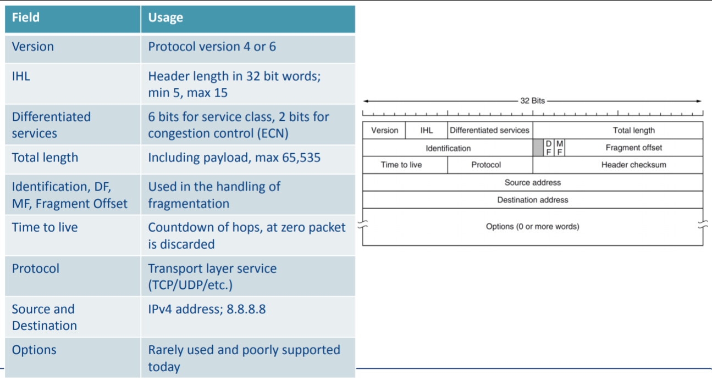
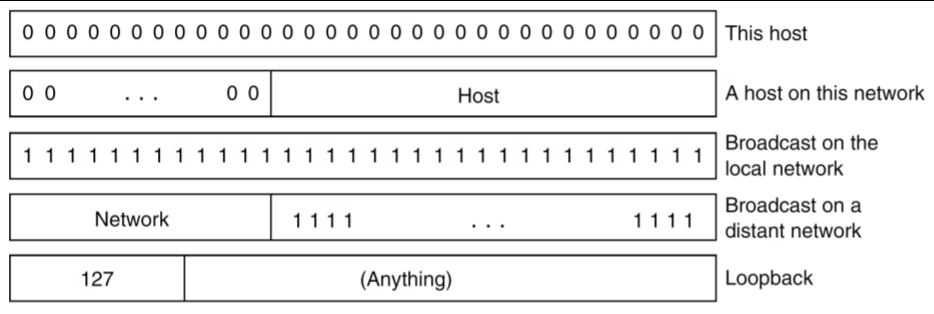
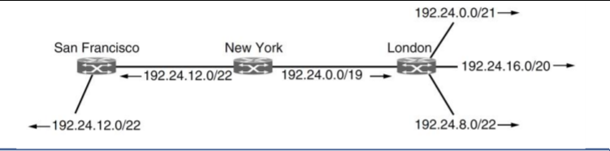
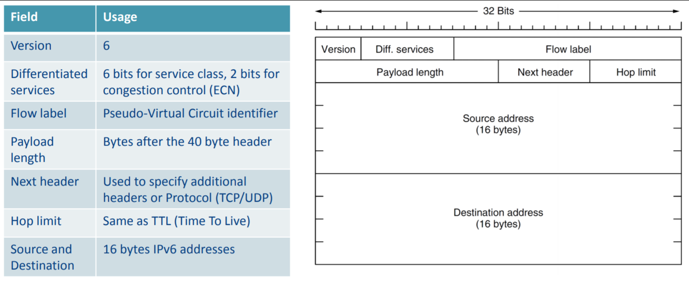

# Computer Systems - Lecuture 10 (Week 6) - Internet (Network) Layer – IP Addresses and Packet Switching

### The Internet (Network) Layer
- Network Layer doesn't exist in TCP/IP but it does in OSI
- Internet layer is *tasked with getting data from source to destination*
- Traffic must be routed efficiently.
- Source/destination may not be on the same network.
- All about connecting multiple networks.
	- You can add/remove networks and the Internet Layer will handle that

### Internet Layer
- Most internet layer code runs on routers
- Refer to data units as packets (not segments/datagrams)
- What services does this layer provide?
	- Connectionless
		- Packet Switching (Internet Protocol - IP)
	- Connection-oriented
		- Circuit Switching
			- Rather than deciding every next hop decide the route from the beginning

- The Internet is a *packet switched network*.
- Host H1 wants to send a packet to H2
	1. Transmit to nearest router
	2. Packet is stored on the router until it has arrived
	3. Forward the packet
	4. Repeat 2-3 Until you get there
- These routes are *dynamically constructed*
	- Only needs to know what host the packet is going to

##### Connection-Oriented vs Connectionless Internet Layer
Issue|Datagram Network|Virtual Circuit
---|---|---
Type|Connectionless|Connection-oriented
Addressing|Each packet has full source and destination|Each packet contains a short VC number|
State|Routers do not hold state information about connections|Each VC requires router table space per connection
Routing|Each packet independently|Defined at set-up
Quality of Service|Difficult|Easy if enough resources
Congestion control|Difficult|Easy if enough resources

##### Multiprotocol Label Switching
- Widely deployed Virtual Circuit (connection-oriented) Internet Layer Protocol
	- Virtual Circuit is super expensive compared to normal internet circuit
	- More resources required -> only high-end risk-averse companies use this
- Primary purpose is *Quality of Service*
	- Prioritising traffic
	- Allocating everything ahead of time

###### Quality of Service
- What is quality of service?
	- *Not all services are equally important* or robust to network delay
		- VoIP vs file downloads
		- VPN connection vs web browsing
- Within your own network you can prioritise services
	- Happens in an ISP (traffic shaping)
		- ISPs slowing down bittorrent things

###### Net Neutrality
- QoS and Net Neutrality can be opposing forces
- Net Neutrality advocates that *all traffic on the internet should be treated equally*, irrespective of source, destination, application, type or user (i.e. don't prioritize anything)
- Without Net Neautrality, ISPs can
	- Block or delay certain traffic
	- Block access to services unless additional fees paid (e.g. blocking Facetime unless you block stuff)
	- Degrade performance of services (e.g. Youtube, Netflix)
- *Happens in Australia as well*
	- Zero-rating traffic (no bandwidth charge for)
		- Optus: Netflex and Spotify streaming
		- Telstra: Apple
	- Looks like you're getting something for free
		- *Uneven competition*
		- New ISPs will find it hard to startup
		- Network providers can *lock customers into favoured services*
		- Charged extra to access popular services
		- Goes against the *principle of an open internet*

###### Internet Protocol Design
- Was designed with a few principles in mind:
- Make sure it works
	- Prototype it
- Keep it simple
	- Occam's razor (fewest assumptions possible)
- Make clear choices
	- Don't have different approaches in a standard
- Avoid static options and parameters
	- Negotiate them at runtime
- Be strict when sending and tolerant when receiving
- Think about scalibility

#### IP Version 4 Protocol (IPv4)
- Much like at the transport layer, we have a header/payload
	- Payload is *TCP segment/UDP datagram*
	- IPv4 header is *20 bytes*

- No one cares about Options anymore lol

#### IP Addresses
- Hierarchical
	- Composed of a **Network** and **Host** section
- Expressed in *decimal notation*, each byte is a number
- Assigned to networks in blocks
	- The network part is the same for all hosts in that network
	- Written as the *lowest IP address followed by a slash and the size of the network portion*
	- `192.0.2.0/24`

##### Example:
`192.0.2.0/24`
- 24 bits are for the network:
`192.0.2|.0`
- Leaves 8 bits for hosts - up to 256 addresses

`10.0.0.0/8`
- 8 bits for the network
`10|.0.0.0`
- Leaves 24 bits for hosts - up to 16777216 addresses

Can also be written as a subnet mask, a binary mask of 1's
- In the case of /24 - `255.255.255.0`

#### Special Addresses
- Reserved IP addresses for private networks
- Most houses use 192.168.0.0-192.168.255.255 since we don't need to have more than 65,536 addresses
	- Unless you're some kinda IP hoarder

Address Range|Prefix & Mask|Available Addresses
-|-|-
10.0.0.0 – 10.255.255.255|10.0.0.0/8 (255.0.0.0)|16,777,216
172.16.0.0 – 172.31.255.255|172.16.0.0/12 (255.240.0.0)|1,048,576
192.168.0.0 – 192.168.255.255|192.168.0.0/16 (255.255.0.0)|65,536

- You can broadcast to another network but there's not much point
	- Source of a huge amount of security issues if they accept it
- Loopback
	- You actually can use the entire 127..... prefix

##### IP Addresses - Prefixing
- Used with a binary AND operation to extract the network portion of an IP address
- Crucial for efficient rounting on the internet
	- Since networks are *assigned in blocks*, intermediary routers need only maintain routes for prefixes, not every individual host

###### IP Classes - No longer used
- Originally IP addresses were allocated based on class
- Routing was performed based on class which could be derived from the first part of the address
	- You *could literally own 240.0.0.0 to 255.255.255.255*
- *incredibly wasteful*

#### IP Addresses - CIDR (What we use nowadays)
- **Classless InterDomain Routing**
- Prefix IP structure
- Still the problem of routing table expansion
	- Size of routing tables way too big
- Particular *problem for routers at the center of the internet, have to maintain routes everywhere*
- Solution is route aggregation
	- Combines multiple prefixes into a larger prefix
- Aggregation is performed *automatically*
- Roughly *halves the size of the routing table*
- Prefix one above - don't know the rest of where it's going, just send it
	- Kinda like if you're sending something to London, 13 X Street
	- You just send it to London and they figure it out
- Prefixes *can overlap* in which case the longest matching prefix is selected

#### IPv6
- *Simpler header*
- *Improved security*
- *Better Quality of Service support*
- 128 bits
	- **Really freakin huge space**
	- You could assign *1 million addresses every picosecond for millions of years and not run out of space*

- Written as 8 groups of 4 hex digits
	- e.g. 8000:0000:0000:0000:0123:4567:89AB:CDEF
- Can be optimized by stripping leading 0's
	- e.g. 8000::123:4567:89AB:CDEF
- Backwards compatibility with IPv4 is achieved with
	- ::192.31.20.46
- Still not widely deployed
	- Google measures IPv8 requests
	- Still less than 25% globally
- Fairly widely supported, likely to see a sudden growth over the next few years.