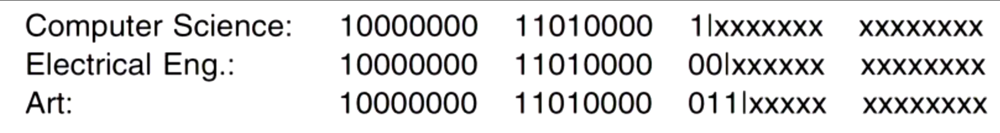
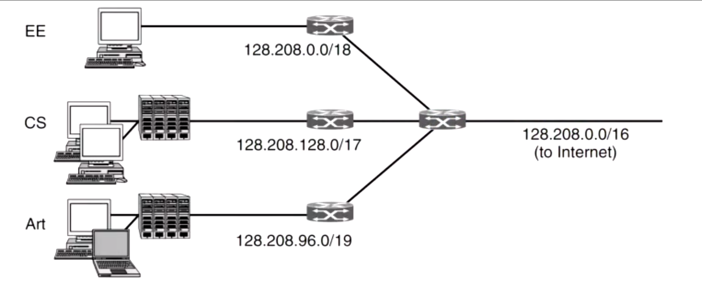
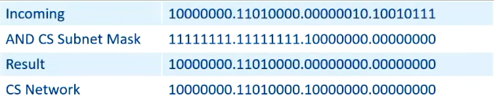
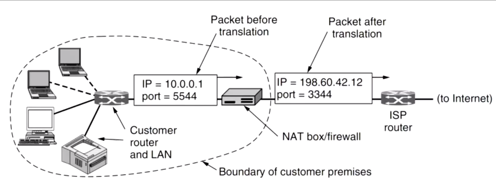

# Computer Systems - Lecuture 11 - Subnets, NAT, Fragmentation

### Subnets
- Internet is made up of networks
- We've run out of IP addresses since forever SO:
	- For every IP address we can host a few subnets or smaller networks with a *subnet mask*
	- This allows us to have a network within a network
		- i.e. a *subnet*

### Subnet Masks
- Written like this:
	`255.255.255.128 		// dot notation`
	or
	`192.238.120.32/25		// slash notation`
- Specifies subnet mask prefix
	- Dot notation can be converted to binary to figure out the mask
	- Slash notation is simply the number of bits that make up the mask
- If you use a `binary-AND` operation on the original IP + subnet mask we get our internal network address

A mask works like this:

```
Computer Science/17
Electrical Engineering/18
Arts/19
```





Our first router (the one everything forks to) will be responsible for handling all external data.



- Future changes can be made without any external impact
- No need to request more external IP addresses
- Routing on the internet does not change

### Network Address Translation (NAT)
- We've run out of IP addresses
- Apparently this is a not very good solution but it works
- Using subnet masks, if we give an ISP a /16 allocation that's still only 65534 hosts
	- We can try dynamic allocation (allocating IP addresses whilst connected)
		- Still limited to 65534 concurrent connections
		- ADSL requires always on connections
- Now all internal IP addresses are *private* and are used to communicate within the LAN
	- Router **NAT translates the private IP address to a external one with a translation table**
	- Also *changes the port*
		- Now we have issues with communicating on ports
		- Fixed with *port forwarding* (set the outward port the same as the internal one)



#### Criticisms of NAT
- Violates IP architectural model (every interface on the network no longer is unique)
- Breaks end-to-end connectivity
- Changes internet from *connectionless to pseudo-connection-oriented*
	- NAT maintains connection state
	- If it crashes everything screws up
- Violates layer model by *assuming nature of payload contents*
	- Causes problems with FTP and other protocols
- Limits number of outgoing connections

#### Why it works
- Significant security advantage
	- Internal network is shielded from attacks from incoming unsolicited packets
- Likely to remain after IPv6 is normal

### Fragmentation
- Process of breaking up larger packets into smaller packets
- IP packets have a maximum size of 65535 determined by the total length header field
- Most links can't handle this size
	- Due to OS
	- Hardware
	- Weird protocols
	- Reducing transmissions due to errors
- Means lower layers should be able to fragment larger packets 
- Defined by a *MTU - Maximum Transmission Unit*
	- Path MTU - Maximum size for path through network
		- Reason why this is dynamic is cause the path can change after it's been sent

#### Non Transparent Fragmentation vs Transparent Fragmentation
- Have to reassemble our fragmentated packets, we can do it two ways:
- **Non Transparent Fragmentation (Used by IP)**
	- Reassembly happens at the destination host
- **Transparent Fragmentation**
	- Reassembly is performed at the next router

#### Fragmentation and IP headers
- IP headers have the following:
	- Identification
		- Indentifies a packet in some fragments
	- Flags
		- Don't Fragment or More Fragments (on the way)
	- Fragment Offset
		- Offset in 8-byte blocks
- Use these to store info of fragmentation
- Allows receiving host to reconstruct at buffer

#### Downsides
- Overhead from fragmentation is incurred all the way to the host
- If a single fragment is lost the entire packet has to be resent
- Overhead on host is more than expected

##### Path MTU discovery
- Basically send smaller and smaller packets until you can get to the host in one go
	- No fragmentation is required
		- Not guarenteed

##### IPv4 vs IPv6 Fragmentation
- IPv4 allows for either nontransparent fragmentation or path MTU discovery
	- Min accept size 576 bytes
- IPv6 expects hosts to discover the optimal path MTU, routers will not perform fragmentation in IPv6
	- IPv6 minimum accept size 1280 bytes

