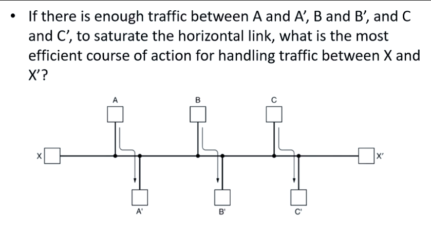
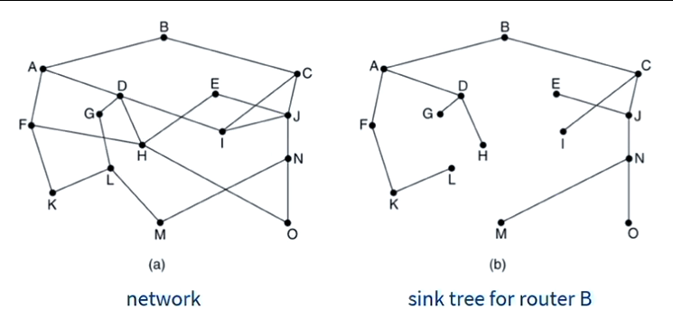
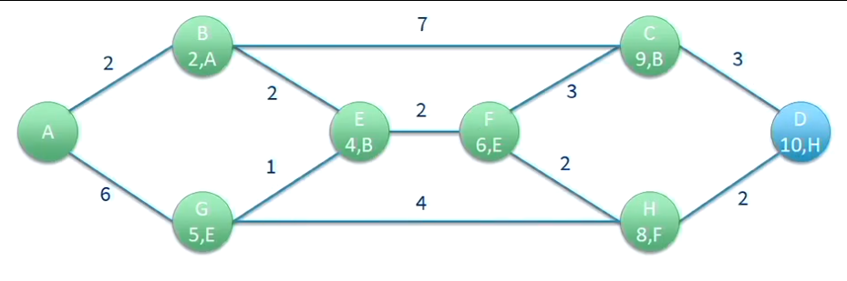
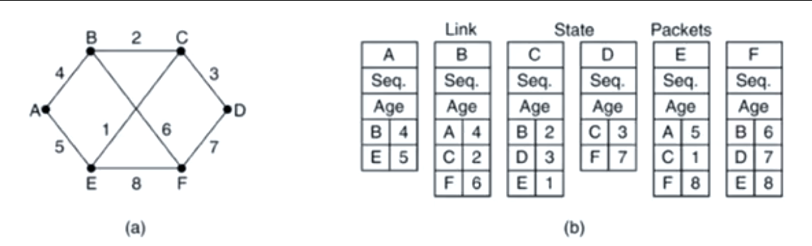

# Computer Systems - Lecuture 12 - Network Layer - Routing

### Routing Overview
- Each router has a forwarding table
	- Maps destination addresses to outgoing interfaces
	- When a packet is received it inspects the address, indexes it in into the table and sends it to the interface it's supposed to go
- Then the next router in the path repeats the process
- Routing in the internet is done differently in different networks
- Usually based around a triple
	- IP Address
	- Subnet Mask
	- Outgoing Line
	- e.g. `203.32.8.0 255.255.255.0 Eth 0`
- Longest mask used when choosing a route

#### Routing Algorithm
- Used to decide which output line to use
- Properties of a good routing algorithm
	- Correctness
	- Simplicity
	- Robustness - a router crash should not require a 'network' reboot
	- Stability - a stable algorithm reaches equilibrium and stays there
	- Fairness
	- Efficiency

#### Fairness vs Efficiency
- **For efficiency:**
	- A, B and C get 3 times more bandwidth if we don't care about X
- **For fairness:**
	- We must let X send at least *some packets*



#### Delay vs. Bandwidth
- What's being optimised?
	- Mean packet delay?
		- More closer route
	- Max network throughput?
		- More efficient route
- Simple approach
	- Minimise the number of hops a packet has to make
	- Tends to reduce per packet bandwidth and improve delay
	- Hopefully also reduces the distance travelled but not guarenteed
	- Hop counts

### Routing Algorithms
- **Non-adaptive (static routing)**
	- Doesn't adapt to the network
	- Calculated "offline" and uploaded at boot
	- Can't respond to failure :sad:
	- Reasonable where there is a clear/implicit choice
		- e.g. home router, if router goes down we don't have a connection anyway
- **Adaptive**
	- Dynamic routing, adapts to changes in topology/congestion
	- Optimise some property (distance, hops, transit time etc.)
	- May get information from adjacent routers/all routers in the network

#### Flooding
- Sends packets in all directions to probe where things are fastest
- Simplest approach
	- Guarentees shortest distance and minimal delay
	- Useful benchmark in terms of speed
	- Extremely robust - *if there is a path it will find it*
	- Highly *inefficient* - generates many duplicate pakcets
	- Have to find a way of discarding packets (TTL)

#### Adaptive Routing
- We need something more efficient than flooding
- Should adapt to network topology and changes
- If we have complete knowledge of the graph how can we determine an optimal route?
	- Djikstra's algorithm lol

##### Optimality Principle
- If router *j* is on the *optimal path from router i to k* then the optimal path from *j* to *k* also falls along the same route

```
i -------------> j --------------> k
```

##### Sink Tree
- We can construct a tree of optimal routes from the above principle
- Directed graph of shortest paths from a root
	- All long paths stripped



#### Shortest Path Algorithm
- Once we have a sink graph, we can use the *shortest path algorithm*
- Most famous is [**djikstra's algorithm**](https://brilliant.org/wiki/dijkstras-short-path-finder/)
- Simply label all paths as distance infinity
	- Go through and label the shortest path for each node
		- Basically for each node:
			- From the node we came from, figure out how much the path costs
			- Pass this onto the nodes around us
			- Only accept the paths which are the shortest
- Now we can get the shortest path
- If we don't know the cost between nodes, simply use the bandwidth provided



#### Link State Routing
- Relatively simple, 5 step process
	1. Discover it's neighbours and learn their network address
	2. Set the distance or cost to each of it's neighbours
	3. Construct a packet containing all it has just learned
	4. Send the packet to, and receive packets from, all other routers
	5. Compute the shortest path to every other router
- Still used today
- *Basically Dijkstra's but constantly happening in the background*
- To discover neighbours it *just sends a HELLO packet on each interface*
- Cost can be set automatically or manually
	- Usually via bandwidth or delay
- Consists of ID, sequence number, age and a list of neighbours and their respective costs



- Deciding when to build the packet is difficult
	- When a change occurs?
	- Intervals?
- To send packets to all other routers "reliable" flooding is used
	- Basically discard duplicate packets once it received at the destination router
		- Done via *duplicate sequence numbers*
		- Can result in errors if router crashes and restarts it sequence number
	- If it didn't get there, just resend packets

### Border Gateway Protocol (BGP)
- Just like the TV series lol
- Internet is a bunch of independently administered networks
	- No automatic routing so we use BGP
	- At borders of networks where they're owned by different entities they'll have BGP
- Different networks will have different protocols for internal/external routing
- BGP also has *politics* as well
	- Companies not willing to have their network used for transit
	- ISPs not wanting other ISPs traffic
	- Not carrying commercial traffic on academic networks
	- Use one provider over another because they are cheaper
	- Don't send through certain countries
- Typically based on peering agreements
	- one ISP buying transit service from another
- Super complex
- Like the glue that holds the internet together

### Address Resolution Protocol
- MAC addresses assigned when manufactured
	- Can be changed now
- Link between internet layer and physical layer
- Allows you to translate an IP address into a MAC address
- Broadcasts ethernet packet asking who owns the target IP address
- Owner of IP address responds with it's MAC address
- Low level sending done via MAC addresses