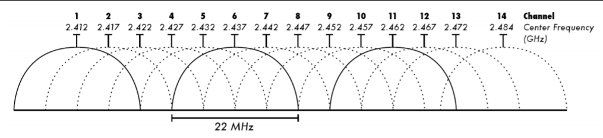
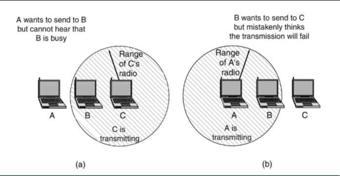

# Computer Systems - Lecuture 14 - Wireless LANs

### Link Layer - Wireless LANs
- Increasingly popular
- Doesn't cost anything to connect things
- Main standard is `802.11 (a, g, n)`
- 2 modes
	- Infrastructure mode (access points)
	- Ad-hoc mode (direct between computers - `PSP ANYONE?????`)
		- Not well supported
- Has a Medium Access Control sublayer like ethernet
	- Determines how to interact with the channel - who can transmit next
- 802.11 has varied over time

#### Wireless Communication
- Wireless uses radio waves to communicate
	- Operate at a specific frequency
	- Different frequencies are reserved for different purposes - some are open and some are restricted
	- Within a frequency band there could be a number of channels operating
	- Adjacent channels and frequencies tend to interfere with each other, careful channel and frequency selection is necessary
- 3 usable channels on a router - otherwise you'll be screwing with everyone else around you lol
- Different countries allocate different bands to different things

#### 802.11 examples:
- 802.11b - 11Mbps running in the 2.4GHz band
	- Most popular
	- only supports 1, 2, 5.5, 11 Mbps
	- If you drop the a little speed then you `d r o p` fast
- 802.11g - 54Mbps running in the 2.4GHz band
	- Same rates as 802.11a
- 802.11a - 54Mbps running in the 5GHz band
	- 8 rates: 6, 9, 12, 18, 24, 36, 48, 54 Mbps
	- Much faster than 802.11b has a 7th the range
	- Good performance if you're close to the router
- a/b/g are the most popular
- 802.11n - 4 antennas up to 600Mbps
	- Made in 2009
	- Aim was 100Mbps after removing wireless overheads
	- 4 antennas for 4 streams
	- Increased channel size from 20MHz to 40MHz
- 802.11ac - 8 antennas up to 1300Mbsps
	- Newest thing
	- Operates only in 5GHz
	- 8 antennas is really rare - not often supported
- 2.4GHz and 5GHz are unlicensed and are free to use within a certain power limit (1 W)
	- Reason why heaps of other devices seem to use 2.4GHz like mice, microwaves, garage door openers

#### 802.11 2.4GHz channels
- 802.11 a, b, g share 100MHz of space
	- Each channel is 20/22MHz in width, with 5 MHz divide between channels
	- channels overlap, with only 3 channels do not
	- Selecting anything other than those 3 overlaps with other channels and fucks everything over
	- Want everyone on the same channel - so we can use collision management

### Collision Management
- Want to save energy since sending WiFi takes up power
	- Instead of constantly sending things, idle until it's free
- Use CSMA/CA as opposed to CSMA/CD
- Detection vs avoidance
- Instead of waiting to collide we check if anyone else is sending something
- If there is, we wait and have this "backoff" period which stops collisions between sends (like at traffic lights when everything's red)
- If we somehow get an error, resend after a while
- In wireless it's really hard to detect collisions
	- Hidden terminal problem - can't hear all devices at the same time and thus can't account for all collisions
	

### 802.11 Frame
- Not going to go through in detail
- Has 3 address fields
	- Your 2nd address may be the router's address
	- Saying how it's gonna get there
	- Start, router and end point instead of just start/end point 
- Duration
	- How long the frame is likely to occupy channel - go to sleep after this so we don't use up power

### 802.11 Security
- Authentication and security tied together
- Open - no authentication or encryption
	- All traffic *is visible*
	- All of your DNS queries which are not secured
- WEP - wired equivalent Privacy
	- Key is 40-100 bits - RC4 encryption
	- Easy to crack by capturing packets
		- 40,000 packets -> 3 minutes to capture -> 3 seconds to crack key
- WPA - WiFi Protected Access
	- Temporal key integrity protocol - each packet has a unique key
	- Attacks focus on recovery of small amounts of data - not access
	- Best access attacks are *directed brute force passwords*
		- People still make shitty passwords lol
- WPA2 - Updated WPA
	- Use AES to counter the weakness in WPA1
	- Was secure until the KRACK attack in 2017
	- Key reinstallation attack - jeys should only be used once otherwise they are susceptible to attack
	- Attack was against the 4-way handshake used in WPA2 to negotiate a key - the third message may be resent in case of loss - each time the client received message 3 it would reinstall the key
	- Devastating to android phones
		- Android would just install random keys
- Could only fix this vulnerable by patching everything
- Many devices are not supported anymore and are still vulnerable to KRACK
- You can only switch wifi off

### Network Discovery and Power Usage
- Many devices using WiFi are power constrained
	- Activating WiFi radio it costs power
- Access Points send out beacon frames announcing they're available
	- By default sent every 100 TU (Time Unit) which is equivalent to 102.4 ms
	- Contains
		- SSID (network name)
		- BSSID: MAC address of the access point
		- Security settings (Open, WPA, WPA2)
		- Channel
		- Beacon interval
		- Traffic indication map and delivery traffic indication map: technique for improved power management on devices - tells you if there's data waiting for you at the AP when you wake up
	- This is sent off everywhere like crazy
	- Zero security to hide it
- Devices continue to listen to beacon frames *even when connected*
	- Allows moving to a different access point if the signal strength is better
	- Generally won't switch between SSID
- Network discovery is either Passive or Active
	- **Passive**: listen to beacon frames - significant power drain - full scan takes several seconds and is done every minute
	- **Active**: Used a lot today and just sends out a *probe request*
		- Probe consists of
			- BSSID: Broadcast MAC address
			- SSID: Zero length of a SSID the device has *previously connected to*
			- MAC: The device MAC address
			- Additional fields similar to the information in beacon (security/channel)
			- If an AP sees a general probe request (or one for itself) *it will respond with a probe response* which is similar to beacon frame

### Network Discovery Security
- Huge problem
- You're literally leaking information when you walk around with your WiFi on
- Tracking, Privacy and Security (Evil portal)
- MAC address is unique
- If you control many APs across an area you can track people's movement
- Attempts at MAC address randomisation have either not been implemented (Android) or failed (iPhone)
- Not only revealing your MAC ddress
- Also sends SSIDs which means you can figure out where people were at
- You can now get a GPS reading from an SSID name
- Chances are is your home wifi access name is listed on your device which means it's trivially easy to figure out where you live whenever you're walking around with wifi on
- `this is scary`

### Evil Portal
- You can construct an *Evil Portal*
- Basically by monitoring a Open wifi place, you can pretend you're a place you're not by making a spoofed SSID
	- e.g. "hey its me ur starbucks wifi"
	- Phone auto connects to this
	- **Make sure you don't save open SSIDs!**
- You can literally buy WiFi pinapples - automatic tools for performing this attack
- wtf

### Summary
- WiFi Tracking is really widespread
	- Only solution is to switch off WiFi and Bluetooth
	- Doesn't stop cell phone tracking
- Even worse if you use "free" WiFi - allows linking of movement with browsing history

