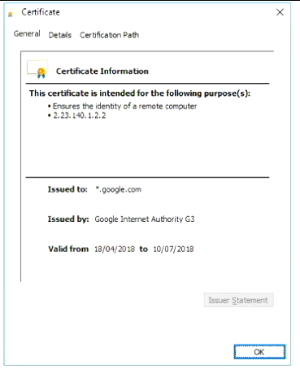
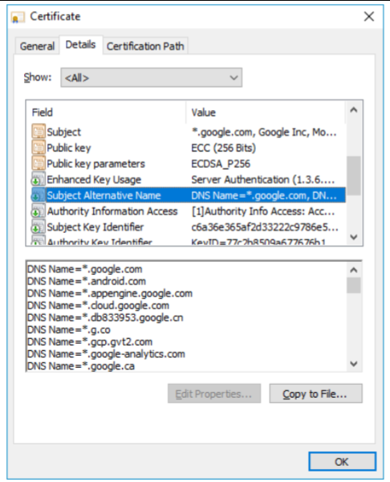
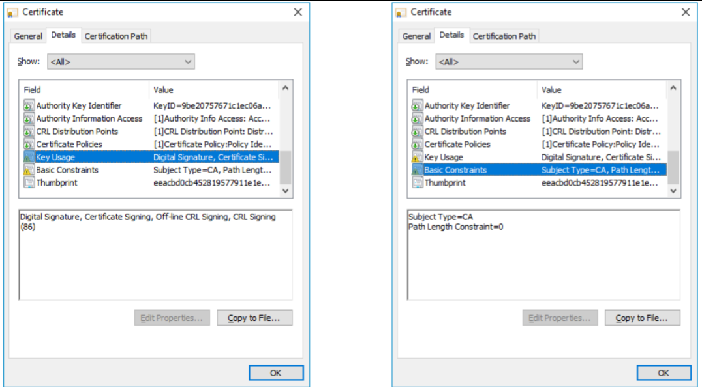
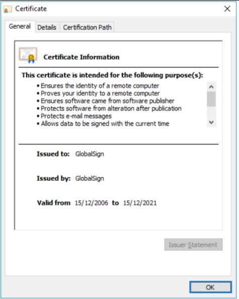

# Computer Systems - Lecuture 16 - Certificates and Public Key Infrastructure

### What's the purpose of a certificate?
- Establish the identity associated with a public key
	- Name, domain, organisation, etc.
- X.509(v3) is the most common standard
	- Has a bunch of stuff:
		- Version Number
		- Serial Number
		- Signature Algorithm ID
		- Issuer Name
		- Validity Period
		- Subject Name
		- Subject Public Key Info
		- Issuer Unique Identifier
		- Subject Unique Identifier
		- Extension
		- Certificate Signing Algorithm
		- Certificate Signature
- The *certificate itself is signed* often by a third party

### Certificate Hierarchies
- The signer *vouches for the identitiy behind the public/private key pair*
- Certificates can be chained: A signs B's certificate, B signs C's certificate and C runs a website or issues digital signatures
- Trust *flows down the hierarchy*, if you trust A, then you trust all certificates A signs and in turn all certificates signed with certificates signed by A (*trusting A means trusting C as well*)
- Limiting purpose is critical (BasicConstraints - id-ce 19)
	- Stops further chains from happening

### Trust anchors and certificate authorities
- Trust anchors are entities that are *explicitly trusted*
	- Most commonly found as *root certificates*
	- Implicitly trusting all the root certificates in your OS
- They are points from which *all other trust is derived*
- **Certificate Authorities (CA)** are the most common trust anchors
	- Sign certificates for others
	- Root certificates are shipped, pre-loaded with your operating system/browser
		- Root certificates are usually not directly used to sign something
		- If one of them gets compromised then we fucked with the internet
		- Certificate Authorities can get their reputation destroyed if a root certificate gets compromised
	- Root certificate is self-signed
	- Sub-CA - intermediate CA that is not a root, but has been signed by a root
	- Cross-signing - sub-CA signed by multiple root CAs
		- Greater compatability across different OS/browser since you're signed by multiple CAs
- Trust anchors can also be *explicit/hardcoded*
	- VPN connections, SSH, Application specific connections
	- No one else connect pls
- PGP Web of Trust
	- Checking if both of you trust another 3rd party which helps with verification - no CAs
	- Nowadays not really used cause it didn't scale well

### Trusting root certificates
- Machine will contain *50+ root certificates*
- Mozilla includes *173 root certificates*
	- Largely geopolitical
	- Government of The Netherlands
	- Government of Turkey
	- China Internet Network Information Center
	- Large issue
		- Do we trust these governments?
		- A lot of the 173 root certificates are kinda shady
		- they can decide to issue a Facebook verification certificate and shit will happen
- Some certificates are only partially trusted
	- *Should we really trust all those organisations?*

### Certificate Issuance
- **Domain Validation (DV)**
	- Most common
	- Ties a certificate to a domain and checks the requester has some control over the Domain
		- Show you can change something on the website
	- Validation via email/DNS/URL - possible weakness
	- Has gone wrong before
		- Where 'admin' email was used to receive emails, make sure users can't register this admin account and receive certificates for the domain
			- This happened with github
		- Consequence of getting this wrong can be severe
- **Organisation Validation (OV)**
	- Ties a certificate to a domain and a legal entity
- **Extended Validation (EV)**
	- Establishes legal entity, jurisdiction, and presence of authorised officer
	- Offline process + expensive
	- This shows the name of the entity too

### Issues with Certificate Issuance
- DV certificates *do not establish* a link between the domain and a real world entity
	- LetsEncrypt has issued *14000 certificates* containing the word "paypal"
		- Not their job to check whether they are actually the organisation they say they are
	- WoSign incorrectly issued certificates for github
	- CNNIC issued an uncontrolled Sub-CA certificate
		- No basic constraints
		- People could just issue certificates for anything with this
		- Sometimes a result of internal testing being leaked
- Even **EV certificates are not immune**
	- Symmantec issued an EV certificate for Google.com
		- Was pretty bad cause why would Google.com have an external certificate issuance
		- Symmantec actually got rekt out of the CA business because of this

### Certificate Revocation
- Recovation occurs when a certificate is:
	- Mistakenly issued
	- Private key is compromised
	- You're responsible if you don't revoke the certificate
- Performed via *Certificate Revocation Lists and OCSP*
	- When you check a certificate check that it's not in this list
	- or with OCSP you request to check if a certificate is verified or not
- When *root certificates are revoked, all certificates below that become untrsted*
	- Hence cross-signing root certificates
		- Maybe you got issued a certificate from a CA with a root certificate that got revoked and now *everything you signed is now revoked even though you didn't do anything wrong*
		- If you have cross-signing this doesn't happen
- Only useful if aware of incorrectly issued certificate
	- TrustWave issued a Sub-CA certificate for use on a private network to intercept traffic
		- Man-in-the-Middle attack - taking your certificate, duplicating it and using their own allowing to see traffic
- No way of figuring out if things are correctly issued

### Certificate Transparency
- Something that's trying to be implemented now
- Intended to provide a way or monitoring certificates that have been issued
- Uses a *cryptographic append-only log to record the issuance of certificates*
	- Merkle trees
	- Sort of like blockchain
	- Can't skip entries, have to read it
- Monitors check for rogue certificates
- Public auditing of Certificate Authorities
- EV: Server should send signed certificate timestamp with TLS
- Useful for protecting *public internet*
- Some weird cases sometimes where laptops are shipped with compromised root certificates
	- Literally anyone can fuck with that laptop

### Certificate Validation
- Trust is *only as good as the certificate validation*
- Not a simple task
	- Involves checking CRL/OCSP, start/end dates, each certificate in the hierarchy until trusted certificate is found, extensions of certificates, purpose of certificate
	- Certificates are typically ASN.1 encoded - difficult to parse correctly
	- Common for developers to just say everything's trusted and accept it all - too easy for app devs to skip validation/partially verify
			- 1 line of parsing Null vs a bunch of classes for checking certificates
			- Who would win?: A Hundred well written classes to check certificates or one nully boi
- Improved significantly recently, but problems still occur
	- Apple Code Injection Bug
		- Due to incorrect parsing of certificate you could inject code
	- Avast Rendering Certificate Common Name
		- You could put malicious html using the avast tool since it'd view pages as trusted
- Our focus is on *TLS certificates*
- Common Name should contain the DNS URL
	- Can be a wildcard - *.google.com*
	- Can only contain 1 URL
		- This created problems - each IP address should only return 1 certificate
		- Solution was Subject Alternative Name extension
- Subject Alternative Name extensions allows *multiple URLs* to be covered by a single certificate
	- Can contain wildcards but *not all CA's will issue such certificates*
		- You can now kinda see all the unrelated websites that use this same certificate
		- Helped spread TLS certificates but hurt the end-to-end nature of Certificates
	- 4096kb limit on size
- Has a few attributes:
	- Valid From
	- Valid To
	- Public Key - including algorithm and key length
	- Basic Constraints
		- Can be used as a CA certificate or is it an end entity
	- Enhanced Key Usage 
		- Server Authentication, Client Authentiction, Code Signing, etc.
		- Shouldn't accept certificates that are used for something it states it shouldn't be used for

Certificate now looks like this:

Heirarchy of a certificate (typically more levels down since everyone isn't google and can't issue their own root certificates):

Example of a SAN:

Key usage and basic constraints (Note the *Path length Constraint=0*):

Certificate for your machine (note how it's a few years):

Certificates nowadays are a lot shorter than they used to be
- Help keep Certificate Revocation Lists short

### Object Identifiers (OID) vs Text
- Globally registered identifiers for entities
- All of those certificates look really nice
	- Underneath this are a lot of decimal values that are called Object Identifiers 
	- Use these to identify what things are
- SSL libraries will provide human readable forms of OID
	- The string you get out of an SSL library will vary
- Often easier to evaluate based on those text values, but not as portable since OID remains the same
- Only the OID values are standardised
	- 1.3.6.1.5.5.7.3.1 - TLS server Authentication - Server Authentication
- Make sure the string match is the correct certificate since the OID may be different?
- [http://oid-info.com/](http://oid-info.com/)

ASN.1 looks trash

ASN.1 is really hard to get right and a lot of people get it wrong which can cause vulnerabilities

Assignment 2 stuff
- Certificate Validation in C using OpenSSL
- Focus is on understanding how certificates are validated and why it is a challenge
- Don't need to check for full chain/signatures just the contents of the individual certificates