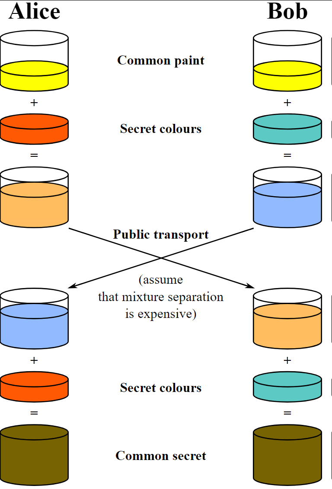
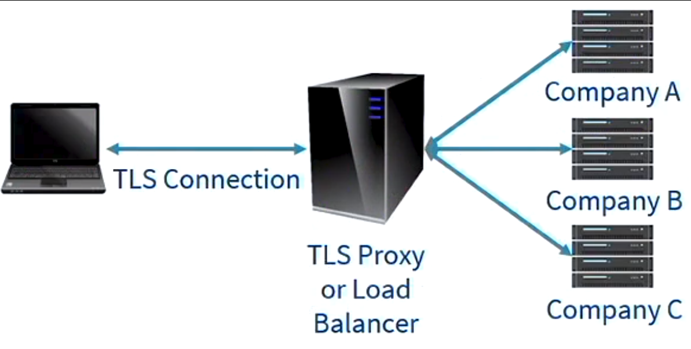

# Computer Systems - Lecuture 17 - TLS - Transport Layer Security

### Secure Communication
- Standards get outdated *really fast*
- Initial attempt was Secure Network Programming (SNP)
	- Basically like an API for sockets to retrofit security
- SSL (Secure Socket Layer)
	- Developed by netscape
	- 1.0 was never released because of security flaws
	-  2.0 was first to be made public
	- 3.0 complete redesign, basis on which TLS was designed

### TLS - Transport Layer Security
- TLS 1.0 1999 - upgrade to SSL 3.0, further improvements to security
- TLS 1.1 2006 - further upgrades
- TLS 1.2 2008 - updated primitives
	- You do a "downgrade" attack by pretending you're a older machine that only works with SSL 2.0
	- Added support for AES and various advanced modes of AES
	- 2011 update attempts to fix the downgrade attacks
- TLS 1.3 2018 draft - significant differences, not backwards compatible, removing weaker crypto primitives, enforcing *forward secrecy*
- Problem for older devices, do we let them still try to connect with a crappier protocol or just deny them service

### TLS Handshake
1. TCP connection is established
2. Client sends `ClientHello` to server asking for secure connection, listing its support cipher suites
	- RSA, Elliptic curve etc.
3. Server responds with `ClientHello` and the cipher suite it supports
	- This also includes the *certificate* and can *request the client send its certificate* - used in VPNs and organisational networks
	- Vulnerability to downgrade hack where *you decide the cipher suite*
4. Client confirms validity of certificate
5. Client generates session key
	- Either by picking a random key and encrypting it with the public key of the server or
	- Running the Diffie-Hellman Key Exchange protocol that provides better security
6. Handshake *concludes* and *both parties share a key* that is then used for *encrypting/decrypting messages*
- More modern systems will use the Diffie-Hellman key exchange method because of *forward secrecy*

### Diffie-Hellman Key Exchange
- Provides **forward secrecy**
	- Means that if the *long term key (private key)* was compromised, and an attacker had recorded all traffic they would *still not be able* to decrypt the messages
	- Its protection is *still limited to conventional compromises* (won't protect against a quantumn computer)
	- In essense the Diffie-Hellman Key exchange works by *sending information* in a way that both parties can calculate a shared key *without ever excplicitly communicating the key*
- Look at [Tutorial 11](tut11.md) for more information

### Diffie-Hellman Key Exchange Calculation
- Uses similar techniques to *Discrete Log Cryptography* Elgamal
- **How it works:**
	- Generate some *public information like with public keys*
	- Large prime number *p*
	- A generator *g*
	- Alice will pick a secret value *a*
		- Computes `A = g^a mod p`
		- Sends *A* to Bob
	- Bob will pick a secret value *b*
		- Computes `B = g^b mod p`
		- Sends *B* to Alice
	- Alice calculates the secret s by:
		- `s = B^a mod p = g^ba mod p`
	- Bob calculates the secret s by:
		- `s = A^b mod p = g^ab mod p`
	- And it works because they equal each other:
		- `g^ba mod p = g^ab mod p`

### TLS
- Should *always be between the exact process and the exact server*
- It seems to be good
	- It's on the basis that the public are *told to check for the padlock to know their communication is secure and protected between their web browser and the server, and is with the genuine server*
- Is our confidence misplaced?
	- Do you *trust TLS?*

### Local TLS Interception
- Create *own local CA and install certificate into root stores*
- Local proxy can *intercept TLS connections*
	- Acts as a man in the middle
	- Dynamically *issues fake certificates* using the local CA
	- *Virtually invisible to the user*
- Common practice for Anti Virus/Web Protection software
	- Avast, Paspersky, ESET
	- Necessary to *monitor and analyse TLS traffic*
	- Most attack traffic goes over TLS cause they want to make it harder to detect
- Not only *trusting tools for privacy, also security*
- When acting as Man In The Middle, the local proxy is performing the certificate validation, *not the browser*
- Too often this has shown to be flawed:
	- Susceptibility to FREAK
	- Not supporting modern features (OCSP stapling)
	- Downgrade attacks
- Worst case was *superfish/eDellRoot*
	- Same root certificate *installed on all machines* - same private key that was locally stored
	- Once compromised anyone could *impersonate websites/code signing*
	- Superfish also had faulty certificate checking
	- Proxy was Komodia
		- People don't give a crud about proxy
	- Dad nearly had this

### Network Level TLS Interception
- Many companies intercept TLS connections using the same approach
- Private network proxy acts as a Man In the Middle and generates *fake certificates*
- Domain controllers install root certificate on machine
- If you *don't control the machine, you don't control the trust*
	- If you had a machine outside of your control then you can believe that someone has intercepted all of your shit
- Same problems with poor validation and old cipher suites
	- Hardware routers hardly ever get updated
	- Browsers update like every day for security
	- Routers never really get updated 

### Server-side problems
- Often we're not *actually connecting directly to the server*
- Web servers increasingly using *TLS proxies or Load Balancers*
	- Protects against *hacking and DDoS*
	- Prevalent on cloud services
- Problem is you *don't know what's beyond the TLS proxy*
	- Could be shit
- Proxy has certificates for *many different sites*
- Backhaul may not be over a secure connection
- Must trust proxy for privacy
- Cannot determine routing of traffic
	- Everything from proxy beyond is *hidden*
- **Fundamentally breaks concept of end-to-end encryption**
- Proxies analyse and inject content into pages

### Cloudbleed
- Cloudflare - large CDN and TLS proxy service
- Error in HTML parser led to memory being leaked into returned pages
- This in turn led to that data being crawled by Google/Bing/etc.
- Potential breaches of authentication of tokensm passwords, private messages
- Many big name sites use Cloudflare: Uber, Yelp, OkCupid, Patreon
- Demonstrates that TLS is being broken

### iVote WA - Incapsula
- An absolute clusterfuck
- Whilst analysing the WA deployment of iVote we discovered they were running the service through Incapsula
- They didn't pay for the corporate version and ended up sharing a service with a bunch of shady sites
- Weird custom encryption
- For some reason both registration and vote collection were going through *the same proxy*
- Their private key turned up everywhere
- Incapsula injects JavaScript into the page
	- Gathers analytics information
	- Obfuscated to make it difficult to see what is being included
	- *Malicious attackers could have injected javascript in string evaluation*
- Incapsula sets persistent cookies
- Encrypted partial vote is *not protected by Public Key Crypto*
	- Is only protected by an AES key which is only protected by VoterNo and PIN - one of which the proxy could know
	- Easy to bruteforce
- They didn't care lol

### Have things changed?
- Nope, we're all screwed cause government services keep screwing up and using TLS proxies
- New Zealand Online Census
	- Data wasn't even encrypted before sending it
	- NZ falsely claimed that it was an end-to-end connection
	- Stats NZ
		- "You can verify that you are communicating with Stats NZ by selecting the key or the lock"
			- They paid for the extended validation lol
			- Still handed over the private key to Incapsula
		- "All census forms submitted to Stats NZ won't be read by anyone other than the authorised staff at Stats NZ"
			- lol nope Incapsula is reading it???

- Even with all this technology, it is *depending on the person to not be an idiot and deploy it correctly*

