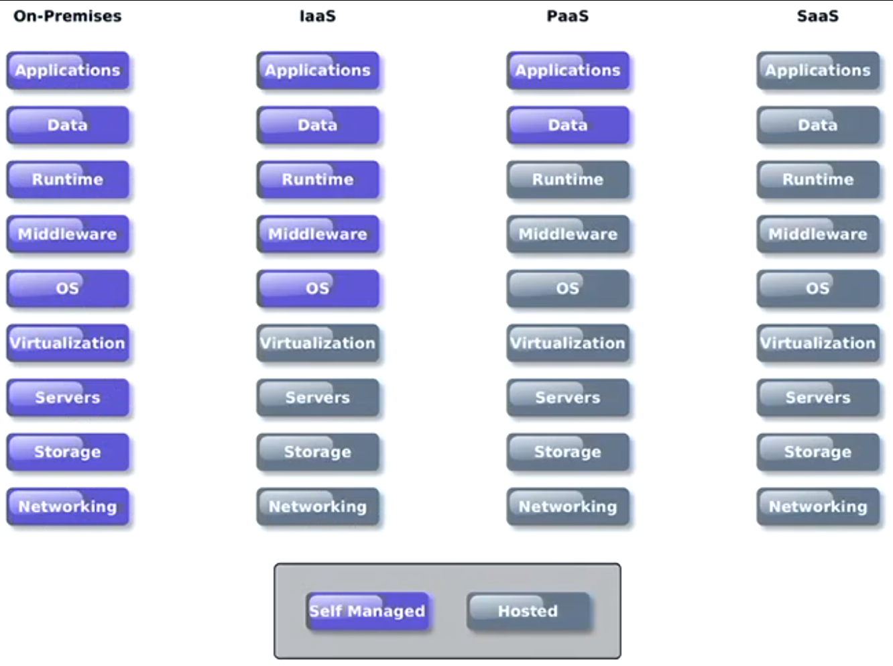

# Computer Systems - Lecuture 19 - Future of Computer Systems

### Computer Systems
- People are beginning to use tablets more than laptops and desktops
- Online services
	- Desktop as a service
	- Citrix XenDesktop
		- Everyone connects to one server
	- Amazon Workspace
		- Top level machine for 22$ a month
- u disrespecting my rig???? 
- This has a big impact on Development
	- Web-first approach
		- People expect shit to work on whichever device and integrate with services
	- Collaborative tools
	- Multiple platforms
		- iOS, Android, Windows, Mac, Linux etc.
		- vs Making 1 purely online service

### Computer Systems Servers
- Multi-user (server)
	- Mainframe 1960s
	- Microcomputer servers
	- Large scale data centers
	- Virtualisation
	- **Software as a Service**
		- Video games
		- Email
		- Spotify
		- Office 365
	- **Inrastructure as a Service**
		- AWS
		- Virtual Machines
		- Servers
		- Storage
	- **Platform as a Service**
		- Google App Engine
		- Heroku
		- Execution runtime
		- Database
		- Web server
		- Dev tools
		- Targeted for app devs

### Software as a Service
- Where *cloud services began*
- Enterprise applications *delivered through the browser*
- Streamlines enterprise IT management
	- Vendor does all of the maintenence shit
- Google Apps, Office 365, GitHub, GitLab
- *Entirely dependent on the vendor not being bad*
- *Depends on internet connectivity*
	- No internet = no job
- *Trust in a single provider*
	- Failure means you lost all your shit
		- Also means provider may not be trustworthy
- *Privacy and Security Challenges*
	- Where is data stored?
	- What protections does it have?

### Infrastructure as a Service
- Usually virtualised access to hardware instances
- AWS EC2 is one of the biggest examples
	- Various hardware specifications available
	- Both shared and dedicated instances
		- Dedicated instances provide a greater degree of security and predictability of performance
- Able to reduce hardware purchase and support costs
	- Allows rapid rescaling of resources - able to handle peak demand more efficiently and at a lower cost cause you can just turn on/off things instead of having to set up your own machines that just idle there when it's not peak hours
- Software is still the *responsibility of the enterprise*
	- Amazon will not touch your software
	- Have to install patches, keep OS to date, manage software/applications
- NeCTAR provides Infrastructure as a Service
- *Requires skilled System Administrators to manage IaaS*
- Can be expensive
	- *Forgot to shut down things during prototyping = still paying for idle things*
	- AWS has no billing warnings, just spends till you run out of money so be careful
- Replication makes scaling easy but can also lead to *replication of vulnerabilities*
	- Old images not being updated
	- Poorly configured server instance replicated 100's of times
	- Incorrect security settings lead to massive data lost
- Amazon Simple Cloud Storage Service (S3)
	- Really easy to use and get terabytes of data
	- Nothing inherently insecure about it, just really easy to setup incorrectly
- In 2013 Rapid7 survey 12000 s3 buckets and found that 1 in 6 were left open to the public
	- `Accessible via a guessable URL: s3.amazonaws.com/[bucket_name]/`
	- This is getting worse lol

### Some idiots getting their data breach'd
- WWE - 3+ million member details
- Verizon - 14 million records of subsciber calls, including name and account PIN
- Republican National Committee - 198 million voter details (*o shit that's like everyone in the US*)
	- Had modelled religion/ethnicity lol
- Dow Jones & Company - 2.2+ million customer records
- Election Systems & Software - 1.8 million voter records
- Power Quality Engineering (PQE) - lost sensitive electrical infrastructure data
	- Found top secret government shit
- [Here's some more](https://www.upguard.com/breaches/data-leak-pqe)
- Holy shit guys *actually stop please*

### AWS EC2
- By default AWS instances will have some degree of insecurity
	- Gobally accessible
	- Password based access (as in your AWS account not the actual instance)
		- Holy shit your credit card stuff
	- Publicly accessible metadata available at /latest/meta-data/
- Threat stack analysed their own customers and found *73%* of companies had critical AWS misconfigurations
	- This is *really hard to fix* since most people offshored all their sys admins and they have 100s of instances

### AWS Credentials
- AWS credential compromise is a growing problem
- *Never hardcode your AWS credentials or store them in a git repository*
- DXC lost their credentials via a developer publishing them to a public repo by mistake
	- Started 244 AWS instances and had a 64k USD
- Uber had a private repo compromised that contained AWS credentials giving the attackers access to customer data held in AWS (50m customers and 7m drivers)
	- Uber *secretly paid 100k usd to the attackers to delete the data*

## Platform as a Service
- People thought this would be better since it's not as low level
- Provides a framework for rapid development/deployment of applications
	- Potentially across multiple platforms
- Select frameworks to add to application, then develop the application
	- No managing the installation or updating or the frameworks
	- Often uses Git to deploy applications
	- Generally provides *auto-scaling*
- Salesforce Heroku, AWS Elastic Beanstalk, Microsoft Azure, RedHat OpenShift, Google App Engine
- Not grown as quickly as expected
- In many ways provided a *middle ground between IaaS and SaaS but somewhat blighted by history*
	- *Vendor tie-in*
		- Moving between different Platforms can be difficult and expensive (like Google App Engine requiring certain things)
	- *Scaling costs grow rapidly*
		- Good for proof of concept but wouldn't want to run a large business on PaaS
		- Infrastructure cost is like the half
	- *Runtime limitations* - limited support and often restricted features
	- *Service providers have shutdown*, abandoned platforms, forcing customers to migrate/update their applications using a different infrastructure

#### IaaS vs PaaS vs SaaS

- Probably still need on-premises for academic/really high powered shit

### Severless - Function as a Service
- Next step from PaaS - developer takes no interest in infrastructure or software stack, *just the functionality of the application*
	- It isn't actually serverless - there are still servers, it is just they are invisible to the developer
	- The scaling works really well
	- Costs are tiny
- Hook.io and AWS Lambda introduced in 2014
	- Google Cloud Function (Firebase as well), Azure Functions
	- Aligns with microservice development technique
		- *Build services to do tiny things*
		- *Call these services for your app*
		- Some people don't like this cause it splits stuff up
- *Development is simplified, no low level handling of requests, functions are small pieces of code expected to run in milliseconds*
- Static content served via a CDN (Content Delivery Network)
	- CDN is good at delivering static stuff
	- Moves all your dynamic stuff to the cloud network

### Severless - Example - Alexa
- Allows easy access to advanced APIs and functionality
- Including Amazon Alexa
- Can handle really simple voice based queries

### Severless - The Future
- *Severless adoption grew by 667%* in the *fourth quarter of 2017*
- Allows companies to focus on what differentiates them, which is their product/application and *not on infrastructure* which is largely commoditised anyway

### What does this mean for SysAdmin?
- The role isn't going to disappear
- Skillset is changing
	- Configuration vs Installation
- Severless may well dominate in the application dev space but it it's suited to long running/high performance tasks
- Could see a shift away from PaaS to Serverless but IaaS will always be around
- Awareness of best practise, network config, security and privacy will be paramount
- Role is gradually moving upwards, away from low-level OS and network management to strategic planning and anomaly management
	- Understanding bottlenecks in the network
	- Understanding security and privacy
		- Avoid losing all your shit on AWS S3
	- We've been convinced cloud is secure due to marketing
	- 198 million records on a webserver is the same as 198 million records on "the cloud"

- A lot of what we have covered has been about understanding the infrastructure in order to protect it and yourselves from attack
- Gotta change how systems are being compromised and where data is being stolen

- We're getting *really shit at this holy crap*
- *Dystopian cyber future where hackers rule the world let's go*

- [The scale is almost becoming unmanageable](https://threatmap.checkpoint.com/ThreatPortal/livemap.html)
	- This is hitting your server *all the freakin' time*
- [Holy crap we're all idiots](http://informationisbeautiful.net/visualizations/worlds-biggest-data-breaches-hacks/)