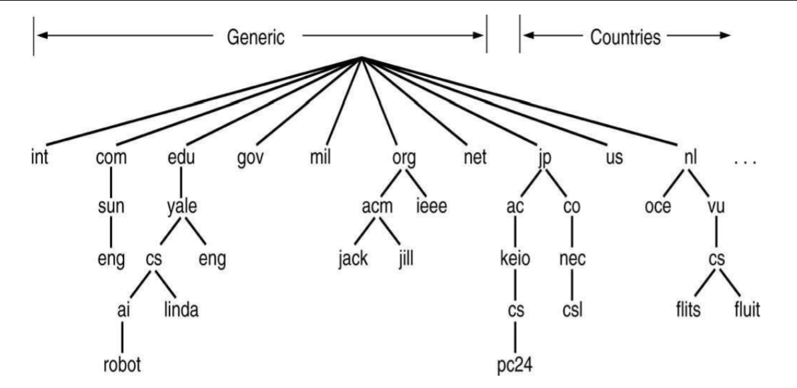
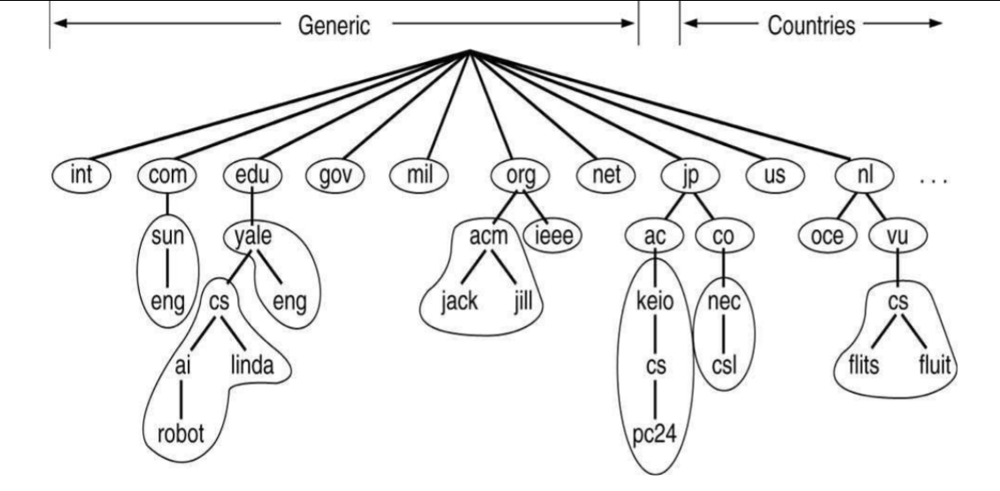
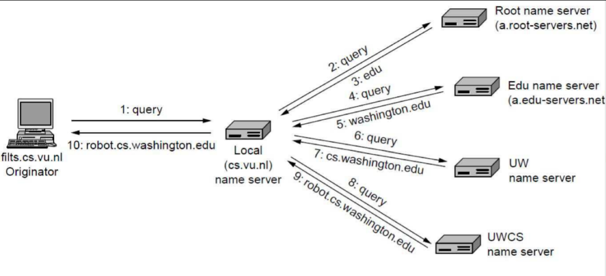
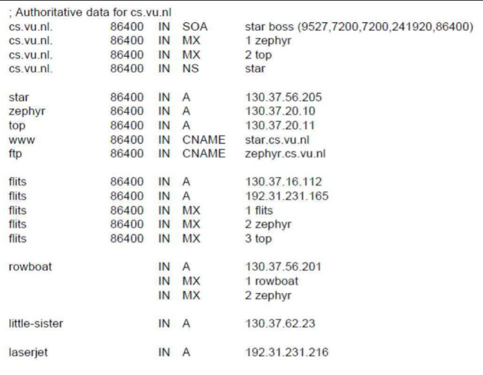
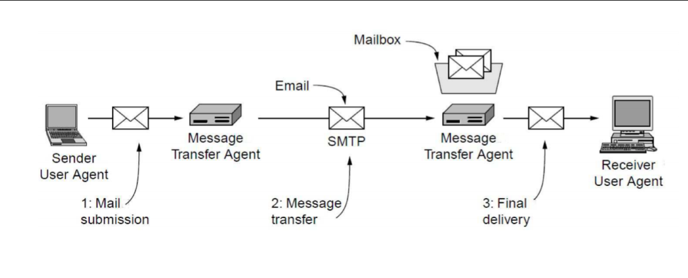
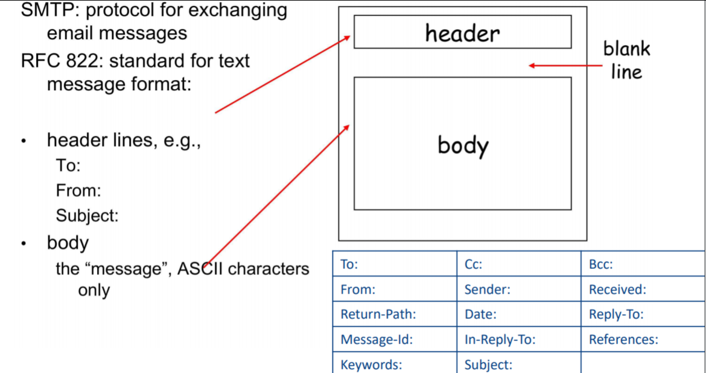

# Computer Systems - Lecture 3 - Mar 05

## Application Layer, DNS, Mail - Streaming

### DNS: Domain Name System
Used to resolve URLs to an absolute location
- e.g. google.com vs ip address

For now, just consider them to be unique numerical identifier
- 8.8.8.8 Google Public DNS
- 203.2.218.208 abc.com.au 
- Conceptually IP addresses should be unique
	- Nowadays it's possible for computers to share an ID 
			address to share processing load
	- This is important due to the number of queries/requests coming through an IP address

DNS is essentially the **technology behind mapping host.domain.com to an IP address**.
Hierarchy goes from "right to left" com -> domain -> host

### Four elements compromise the DNS:
#### Domain name space: 
- DNS uses a **tree-structured name space** to **identify** resources on the internet
#### DNS Database: 
- Each **Node/leaf** in the name space tree **names a set of information** that is contained in a **resource record**. The collection of all RRs is organised into a distributed dbs.
#### Name Servers:
- Server programs that hold information about a portion of the domain name tree and the associated RRs.
- The **roots** of the DNS database
#### Resolver:
- "What happens on your machine"
- The resolver queries the necessary DNSs it requires to get the URL
- These are programs that **extract information** from name servers in response to client requests
- Pretty much all OSs have this built in.

### Domain Names:
- Case sensitive
- Up to 63 characters per constituent
- Can have up to 255 chars per path
- Can be internationalised
	+ Non latin characters allowed
	+ Huge security problem
		+ URL Phishing -> Using characters that look really similar but aren't 
			+ Most browsers usually stop this

Naming conventions usually follow either **organisational** or **physical boundaries**:
- au.ibm.com / uk.ibm.com (for email)
- ibm.com.au / ubm.co.uk (for web)

Absolute domain ends in a '.'

Relative domain names end in a constituent e.g. .com

#### Big division of DNS namespace
 - "Generic" for the US
 - US-Orientated
 - A lot of countries have top-level domains which are used for their governmental related content
 - All *countries that have an ISO code (2 letter code) were given a top-level domain.*
	 - Some were sold/given out.
 - *Controlled by IKAN*.
	 - There was a period where all top-level domains were issued
	 - Nowadays most just use .com/.au/.uk etc.
	 - .ac used for education in non-US context (e.g. .ac.jp for Japan) vs .edu
 - No more domains really left
 - "Cyber squatting" - register domain and then charge very high prices for the domain
	 - Letting a domain lapse can result in this
 - Each of these will have it's own DNS server
 	- Usually most will have a *secondary DNS server*
 	- Good to have at least *more than one external DNS server* in case one site goes down 

Example of name server zones (how these are controlled)
Higher servers control lower servers

### Name server Zones:
#### Zones:
- DNS namespace is dicided into *non-overlapping zones*. The servers are authoritative *for that zone*
- Name servers are arranged in *hierarchical manner* extending from a set of *root servers*

#### Root Name Servers:
- The root servers form an *authoritative cluster for enquiries*. The root servers are *contacted* by a *local name server that cannot resolve the name*.
- If you are lost you end up here.
- They only handle top level stuff -> throw stuff to the next DNS server down since they are handling **millions (and billions and billions)** of requests every second.
- There are **13 root servers globally** (a root server may be a cluster of servers in IP space)
	- e.g. F-ROOT 13 servers; J-ROOT 8 servers 

### Types of Name servers:
- Top level Domain DNS servers:
	- Responsible for com, org, net, edu
	- *All top level country domains*
- Authoritative DNS servers:
	- *Organisations'* DNS servers
	- Authoritative hostname to IP mappings for organisations servers
	- Maintained by organisation or servers provider
	- Contains full resource records
- Local DNS server:
	- *Not strictly part of this hierarchy*
	- If you are running a DNS server in your machine, if it is not an authority for a host, then it isn't part of the hierarchy
	- It's just caching and forwarding queries - a proxy
	- Typically each ISP has a "default name server" which handles DNS queries

#### Example:
#### A resolver client asks the local DNS for the domain to IP Mapping:
- If the answer is known by the local DNS, then it sends the answer.
- IF the answer is *not known*, then the local DNS queries *up the hierarchy* to the *top level (root) DNS for the domain* and then relays the answer to the resolver client.

Essentially it utilizes a *recursive query mode*. Queries are subject to timers to avoid longer than necessary response times.

If you're returning an namespace record, then you must have a record in order to tell what that was.

If you misconfigure your DNS you can result in a infinite loop

*Example of an Iterative Query*

### Resource Records:

Usually you have seperate servers for mail exchange (MX) and others.
This creates problems if they are the same - web domain and mail domain at the same level = problems.

SPF - mitigates spam by automatically marking spam-domains as junk
TXT - Usually nowadays used for authentication

#### Some DNS query tools:
- nslookup - Internal resolver - not using the OS
	- Can see completely different resolver come back as opposed to the OS one (ignores the OS) - useful if your OS is incorrectly set up
- dig - OS resolver
- host (linux)
- Hosts File
	- Hard coded mappings
	- Used to hardcode a domain name to an IP address
	- Able to test with an internet search
	- Google Chrome can mess this up since it uses Google's Public DNS
	- Same as on win and linux
	- Used to be able to do crude adblocking by hardcoding advertiser's domains
	- Used maliciously to redirect windows update to more malware
	- Good for testing TLS certificates/development where you can't be bothered setting up a DNS server
	- Remember to reset this later so you're not only looking at your local server

#### No security in original design:
- DNS spoofing
- DNS flooding

#### Solutions:
- DNSSEC
- Root signing

Doesn't really work until all resolvers have it.

## Email servers and architecture

Has a long history (old boi) - lots of standards

Only need to be aware of:
#### Standards for internet enabled email are based on 2 RFC's
- RFC 821 (transmission)
- RFC 822 (message format)

#### Architecture and services
- User agents
	- Allow user to read and send email
- Message transfer agents
	- Transport messages from source - destination

From vs Sender:
 - Sender is who sent it and From is who it's written by - prevents spoofing.

### SMTP - Simple Message Transfer Protocol
SMTP uses TCP to reliably transfer email message from client to server (port 25)
Direct transfer: sending to recieving
- WhatsApp uses this

By default SMTP is not secure as it has *no authentication*
Most people just use HTTPS now so it doesn't really matter too much

Three stages of transfer - handshake, transfer, closure

Command response interaction: commands in ASCII text and response consists of status and phrase.
Messages must be in 7-bit ASCII

### Message Transfer & Access

- Transfer
	- SMTP: Delivery/storage to the reciever's sender

- Delivery methods
	- Local
	- **POP3**: *Post Office Protocol*; authorization between agent-server and download
		- Removes message from the server once it is downloaded
	- **IMAP**: *Internet Mail Access Protocol*; more features and more complex, provides for the *manipulation of stored messages on server*
		- Allows you to potentially have access from multiple locations (doesn't delete) but it requires a lot more processing
		- Doesn't scale well
	- **HTTP**: Gmail, Hotmail, Yahoo! Mail, 10minutemail, etc.

### MIME - Multipurpose Internet Mail Extensions

Allows you to encode for all types of content including video/audio/images as opposed to pure ASCII.
Adds *5 additional message headers*:
	- MIME-Version: Identifies the MIME version
	- Content-Description: human readable describing contents
	- Content-Id: unique identifier
	- Content-Transfer-Encoding: how body is wrapped for transmission
	- Content-Type: type and format of content

### Streaming

VoIP
- Prioritises low latency, accepts degredation in quality

Video/Audio
- Live: Same as VoIP
- Stored: Balance between quality and latency; initial buffering is acceptable (Vimeo/YT)

Other Examples:
- SIP - Session Initiation Protocol, VoIP
- RTMP – Flash based, largely deprecated
- RTSP/RTP – Real Time Streaming Protocol
- HLS – HTTP Live Streaming
- MPEG-DASH – Future protocol?

### UDP vs TCP for Video Streaming
- UDP - Good for live video streams
	- Packet loss is acceptable
	- Supports IP Multicast (one source -> many destinations)
	- Less resource intense on the server
		- Smaller buffer (don't need to know whether packages were successfully sent)

- TCP - Good for stored video
	- Quality of service is provided, i.e. packet resending
	- Individuals streams
	- Compatible with Content Delivery Networks
	- Can create *jitter/buffering* problems
	- High workload on the server
