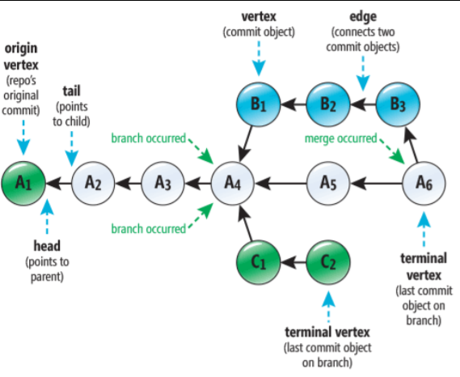

# Computing Systems - Lecture 4 - March 8

# Version Control Systems

Well if you don't know how to use git and you're on github... :thinking:

What happens when you're working in a team, and everyone's using the same files/directories?

You could try shouting across the office (goes bad as soon as there's more than 3 people)

So we have Version Control Systems!
- Track and control changes over files
- Collaborate
- See revision history
- Audit changes
- Backup? (it's not a great idea to put it on github since you can destroy it accidentally)
- Take over the world (probably)

### History
1972 - SCCS (Source Code Control System)/Unix

1982 - Revision Control Systems
- Simple, but limited - only one editor at a time
- Operates at a file level, not project

1986 - Concurrent Version Systems
- Check out at project level, concurrent users
- Only commit if change is against latest version - requires updates regularly
- Supports branches - expected to be short lived/historical (just copied the whole thing)

2000 - Bitkeeper
- Similar to Git
- Distributed model - each dev had a local copy of repository
- Used at one time for the Linux Kernel
- No access to meta data

and finally...
2005/2006 - Git by the legend Linus Torvalds
- **Made in 10 days**
- Takes CVS as an example of what *not* to do
- Supports a distributed workflow
- Includes *very strong safeguards* against corruption either accidental
- Some strange design choices since it was mdae in 2005/2006 in 10 days by linus himself
- Huge number of commands
- Reputation for being difficult
- Andrew Morton said Git is "expressly designed to make you feel less intelligent than you thought you were".

### Git Architecture
- Distributed Version Control
- Directed Acyclic Graph (DAG)

Works by "Staging" changes - choosing the changes you made you want to commit -> then commit to remote (the repository of code).

Git does *not store deltas* (changes). It takes *snapshots of the file system*.
This is a big difference compared to other VCS.
This results in really fast branching processing but large sizes.

`.git` folder is where everything is stored.

### Git as a Database
- In essense just a key-value database
- Putting a value into the the database returns SHA1 hash (40 character identifier) 
	- Value is stored as a *blob* in the objects folders
	- The SHA hash is the key

Git is real confusing. The file structure can be recreated if you lost everything, but for now I'll just talk about commands:

## Git Commands

`git add <files>`    								Stages files for commit

`git commit -m <message>` 							Commits the changes to your dbs

`git push <remote> <branch>` 						Pushes the changes to the repository
													note: can only push when you're up to date. Pull and resolve conflicts with merge first.

`git checkout <branch>` 							Change branches

`git merge <branch to merge current branch with>`	Merges branches with your current one

`git pull`											Pulls latest changes from repository

`git clone`											Copies the entire repository to you

`git remote add <remotename> host:/dir.git`			Adds a remote repository to push to

### Git real world usage
- Tags can be used to add informative names to commits
	- e.g. "release 1.0"
- A release is also often stored on a branch
	- This allows bug fixing to continue without impact on future development
- Git **doesn't solve inherent conflicts** - two people editing the same file can still create a problem. General workflow is commit/push often with small changes.
	- Master -> Dev -> Feature
- Not uncommon for developers to not be able to merge onto Dev, maybe restricted or require code review prior to senior staff merging branches

Binary files can be inefficient in git
- Git automatically packs file changes using delta compression
- The change is across the whole file so makes things like JPEGs getting copied over and over
- Increases the size of the clone operation
- Problem for game development - can do a "shallow clone"

### Forks
- Copy of a repository
- Useful for large changes, keeps development work out of main repository
- Remains even if original repository is removed
- Link remains to parent
- e.g. Bitcoin -> Bitcoin Cash

### Continuous Integration
- Changes merged several times a day
- All changes are built ready for deployment
- Build has a self-running test and is automatic (*unit testing*)
- Deployed to clone of production environment
- Automate deployment
- Significant part of *DevOps*
- Hooks in git allow system processes to be triggered
	- After a commit, push, merge, etc.
	- Rebuild the software and deploy it (see *Heroku deploying from GitHub*)

Build processes that depend on external repositories are fragile
- A user deletes the repository -> build process breaks
- Risk of unknown code changes in builds
- e.g. npm relying on one small script that was deleted -> had to re-release the original script without license permission -> this is bad

It's usually better to *fork the repository*
- Higher support costs, since you need to pull changes
- at least everything won't self destruct

GitHub allows recreating deleted users
- Serious security concern - can inject malicious code

Be careful what you store in public repositories
- never store credentials/aws keys! (I've done this before oops)