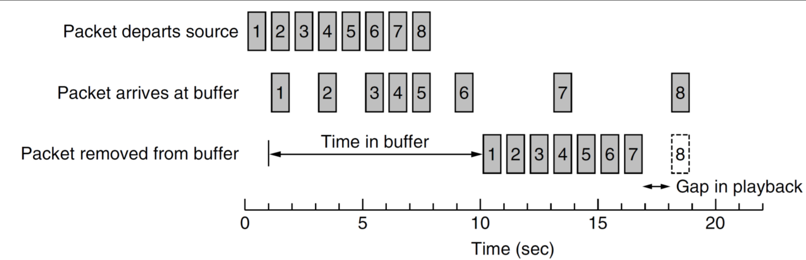

# Computing Systems - Lecture 5 - UDP Transport Layer

# Transport Layer
- Primary function is to provide reliable *cost effective* data transport
- The Transport layer provide interfaces between the *application* layer and the *network/internet* layer.
- Can exist in multiple locations (OS kernel, processes, NIC)
- Provides a logical communication between *application processes* running on *different hosts*

The transport layer is *between* the *Application Layer* and the *Network Layer*.

Transported data are transferred in *segments* using a *transport protocol* (TCP/UDP).

Note: Typically segments are used in reference to TCP (as TCP splits data into segments) while UDP has "data grams"

### Transport Layer Encapsulation
- As you send a message "down one layer" it is *encapsulated* into the next unit
	- This is taken when it arrives and each layer is "peeled off"
- Encapsulation of segments is done in *frames*

**Terminology Used in this Course:**
- Segments = sent at transport layer
- Packets = sent at the internet/network layer
- Frames = sent at the link/data link layer

### Transport Layer Service
**Reliable Connection Orientated Service**
- Provides a notational perfect connection between two nodes
- Hides acknowledgements, congestion control, lost packets
- Service provided to the application layer
- "If you format your message like this I'll send it"
- Layers above have no clue what happens below

**Unreliable Connectionless Orientated Service**
- Provides a way of injecting segments into the network

### Transport Layer Addressing
- Specification of which process is supposed to receive what packet
- This is done using port number (e.g. port 80)
	- This is like an apartment number
	- Building is the computer, the port is the specific apartment number/process

### Port Allocations
- Range from 0-65535 (8 bits)
- Port numbers regulated from IANA
- Classified in 3 segments:
	- Well known ports (0-1023)
		- 80 HTTP
		- 25 SMTP
		- 22 SSH
	- Registered Ports (1024-49151)
		- Application has registered with the IANA
	- Dynamic Ports (49152-65535)
		- Listening for responses

There is a security issue where the well known ports can be attacked if the attacker knows e.g. a SSH server exists they can just flood that port
- Can be countered by just changing the port

### Multiplexing/Demultiplexing
- Shortened to MUXING and DEMUXING (not MUZZING :facepunch: :stuck_out_tongue_winking_eye:)
	- Multiplexing - combining multiple distinct streams into a single shared stream
	- Demultiplexing - splitting distinct streams from a single shared stream
- An example of this is using FFMPEG and changing audio/video streams

Different ports are multiplexed into a single ethernet stream

# UDP - User Datagram Protocol
- Simple protocol for putting data into the IP protocol
- From source to destination with a particular port number
- UDP headers contain source and destination ports, payload is handed to the process which is attached to the particular port at destination

The main advantage of UDP over raw IP is the ability to *specify ports for source and destination pairs*.

**Strengths and Weaknesses of UDP**:
- Provides an IP interface with multiplexing/demultiplexing capabilities and consequently, transmission efficiencies, optional error detection
- *Does not include* support for flow control, error control or retransmission of bad segments
- UDP is a good choice where *applications require a precise level of control over packet flow/error/timing*

- Simple and efficient
- Suitable for some client-server settings
	- Short request and short response
	- If that does not occur, client timeouts and resends
	- Simple to code, fewer messages, one in each dir
	- DNS is a good example
	- Similar to making a function call in programming

### Remote Procedure Calls
- Allows calling procedures on a remote server as if they are local to the client
- Hides the networking aspects from the programmer
- Makes distributed programming easier

- Conceptually simple, but real difficult
	- Cannot pass *pointers easily* - client and server are in different address spaces
	- Weakly typed languages like C can present problems e.g. unknown array sizes
	- Unable to deduce parameter types
	- Global variables are not shared

- Not necessarily secure

- UDP can be a good choice for RPC
	- Requires some additional scaffolding
	- e.g. Resending after timeout
	- Handling large parameter sizes

- TCP can be used for non-idempotent things

### RTP - Streaming and VOIP
- Real-Time Transport Protocol
- Runs in user space - uses UDP from the transport layer -> Application layer
- Generic protocol that provides services to applications -> Transport layer
- Example of TCP/IP not being strongle modelled
- RTP multiplexes several streams into a single stream of UDP segments

- Doesn't really matter which layer you pick in the exam, application or transport is fine

**UDP Example Use with RTP**

**RTP Packet**

Seems really inefficient to transfer payload type but allows for encoding to change during transmission (variable bit rate).

Sequence number - just a counter (allows reciever to know if it's lost a packet)

Timestamp - you can figure out how far from the first packet you need to play this one

**Don't need to know the rest for exam**

### Real-time Transport Control Protocol
- Control Protocol for RTP
	- handles feedback, synchronization and UI
- Feedback to source
	- Delay, jitter, bandwidth, congestion
	- Used by encoder to *adaptively encode* to suit network conditions
	- In multicast settings feedback is limited to a small percentage of media bandwidth
		- need to limit recievers for multicast since everyone's sending control packets and we get overwhelmed
		- Can DDoS yourself
- Synchronization
	- Different streams use different clocks/drift
- UI
	- Naming sources to show who is on call

### RTP Playback
- You can see in the 2nd line the packets arrive a bit weird - this is called *jitter*
- Buffer at receiver to counter it
- Packet 8 is way too late so we can wait or skip it depending on how you have it set up
- Buffer size depends on content/application - e.g. VOIP - small buffer

