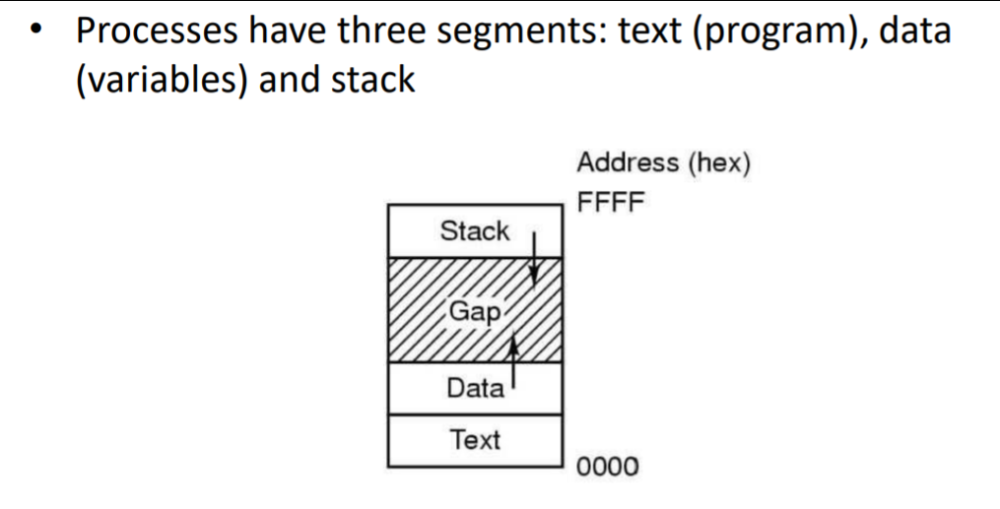
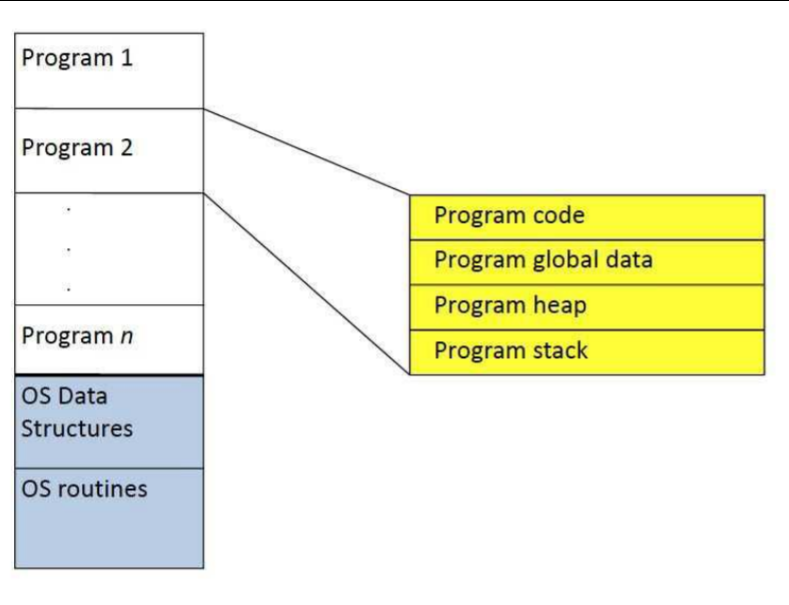
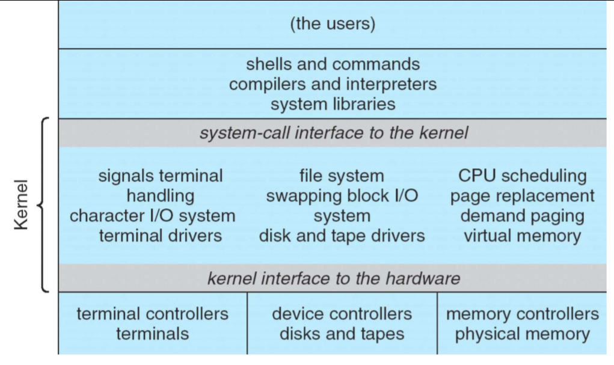
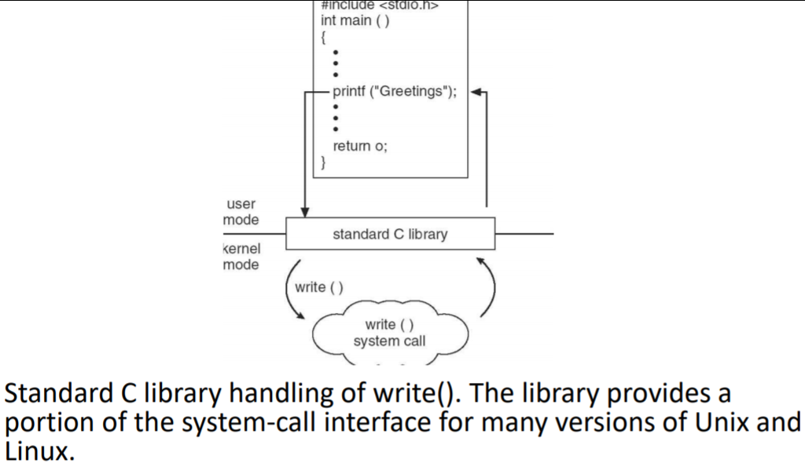
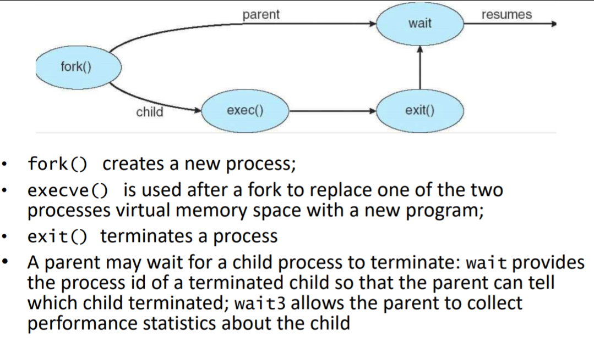
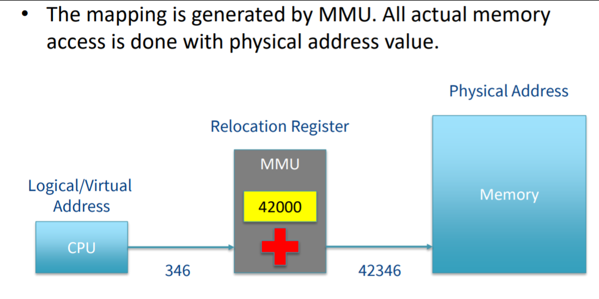
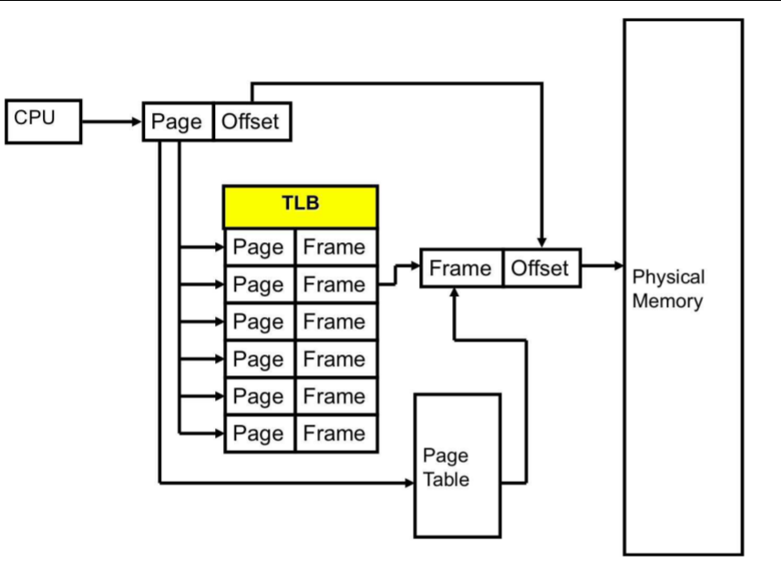

# Lecture 6 - Process Memory Management

# What is a process?:
- A process is a *program in execution*
- A *program is static*, a *process is dynamic*. At any given time the number of processes running in a given program
- The state of a process consists of the code, variables (in memory and registers), address of instruction and some other data.
- As an analogy, consider cooking. A recipe is a static entity; it is analogous to a program. The person cooking is a dynamic entity; e.g. a process

### Multiprogramming:
- Conceptually each process has *it's own CPU*
- In reality multiple processes will share a CPU, each for running a small period of time in turn.
- This is called **multiprogramming**
- Multiprogramming *increases system efficiency*. When one process needs to wait for e.g. data from disk/keyboard input, another process can make use of CPU
- Useful even when the machine has *two or more CPUs* since the number of processes will sometimes exceed the number of CPUs

### The Kernel:
- If several processes are to be active at the same time, something has to ensure they do not get in each other's way. This is the privileged part of the operating system - *called the kernel*
- The kernel provides serves such as *read N bytes from this file*. These services are used by application programs, utilities and non-privileged parts of the OS.
- *The kernel is not itself a process*

### User-Kernel Distinction:
- Most CPUs have *two modes*. The program status word (PSW) register gives the current mode.
	- Code running in user mode cannot issue privileged instructions and can only access the parts of memory allowed by kernel
	- Code running in kernel mode (also system mode) can issue *all instructions* and can access all memory.
- Instructions and memory locations whose use could interfere with other processes are privileged.
- The user mode is the foundation needed by the kernel for the building of its security mechanisms.

Transition from User/Kernel Mode:

### System Calls:
- Allow user programs to ask the kernel to execute privileged instructions on their behalf. The OS checks requests before executing them so this preserves system integrity and security.
- To make system calls more convient a system will typically do several privileged things in carrying out one logical operation
- To the application programmer, a system call *is a call to a privileged function*
- e.g. open, read, write, close, fork, exec, exit, wait

**System Call Example**

Example: Process creation / control

## Interrupts
- When a hardware device needs attention from the CPU, *it generates a signal to interrupt the CPU.*
- When an interrupt occurs, the CPU's hardware takes the values in a program counter and the program status word registers and saves them in privileged memory locations reserved for this purpose.
- It then replaces them with new values.
- The replacement PSW will put the CPU into kernel mode. The replacement PC will cause execution to resume at the start of the interrupt handler, code that is part of the kernel.
- Technically a Blue Screen is an interrupt

### Interrupt handler
- Saves the rest of the status of the current process
- Service the interrupt
- Restore what it saved
- Execute a return from interrupt or similar instruction to restore whatever the hardware saved them the interrupt occured.

### Pseudo-interrupt
- Software calls - executing a trap
- True interrupts come from hardware devices outside the CPU, pseudo-interrupts from the CPU itself
- Users can generate pseudo interrupts inadvertently, e.g. divide by zero (exceptions)
- Users can generate pseudo-interrupts intentionally by executing a special instruction for system calls

### System Security
- User programs execute in user mode, cannot change to kernel mode without going through a system call
- A system call executes in kernel mode, but it's *first task is to check whether the user is authorized to perform the requested operation*.
- Users *cannot bypass the authorization check* because that requires the ability to modify either the interrupt vector or the code it points to, both of which are in privileged memory.

# Memory Management
- Kernel also has a key role in memory management
- Main functions of memory manager are:
	- Keep track of which parts of memory are allocated/free
	- Allocate memory to processes when they require it
	- To protect memory against unauthorized access
	- Simulate the appearance of a bigger main memory by moving data automatically between main memory/disk

### Swapping
- Main method of memory management in the 1960s-1990s
- In a multiprogramming system the total size of processes may exceed the size of the main memory. The memory images of some processes may be kept on disk, called swap space.
- The kernel could *swap out* a process 
- Causes external fragmentation
	- Need to defrag after a while

## Virtual Memory
- Newer process
- Task manager shows this
- runs off two assumptions:
	- all the code/data of a program has to be in main memory when the program is running
	- this code and data has to be stored in contiguous locations
- With virtual memory, only some of the code and data of a program have to be in main memory: the parts needed now and the other parts when the program needs it
- Similarly different parts of the program can be loaded into different parts of memory, again without the program having to be aware of this.
- The first point means that the size of a program can exceed the amount of available main memory
- Very important in 60s/70s when RAM was real smol
- Still useful now

## Two approaches to virtual memory: Paging and Segmentation
- Paging:
	- Paging relies on the separation of the concepts virtual address/physical address
	- Addresses generated by programs are virtual addresses
	- The actual memory cells have physical addresses
	- A piece of hardware called a memory management unit translates virtual addresses to physical addresses at run time.

The physical address space of a machine contains one address for each memory cell.
In almost all modern machines, one cell contains one byte.

## Memory Management Unit (MMU)
A paged system allocates a set number of pages for your system, this will be mapped by the MMU 

During the lifetime of a process, pages in its virtual address space all start out on disk and may move between disk/memory any number of times. When a virtual page is moved to disk and back again, it may be put into a different page from than before

### Operation of paging
- Whenever the CPU accesses memory, the MMU transform the addresses according to the mapping.
- The information required to do the mapping is recorded in a page table. Each process has it's own virtual address space, thus it's own page.
- Page table entry contains:
	- Physical page number
	- Valid bit
	- Referenced Bit
	- Modified Bit
	- Read/Write/execute permission bits

- MMU checks that the selected PTE has the valid bit set to TRUE and the permissions permit memory access.
- IF both conditions are met, it will construct the physical address using the physical page nunber field of the PTE.
It will then set the referenced bit, and if the access was a write it'll also set the modified bit.
- If either condition isn't met, you'll get a page fault exception.

### Page Fault Handling
- The page fault is caused by the permissions being violated, the page fault handler will usually terminate the process.
- Otherwise when the valid bit is zero, the OS must:
	- Suspend the process,
	- Free up a page frame
	- Load the required virtual page from swap space into a free page frame,
	- Cause the MMU to map the virtual page onto the physical page and
	- Restart the process at the same instruction

### Translation Lookaside Buffer (TLB)
- A way to be caching these PTEs.
- Allows you to get real quick responses

If you switch processes, it must clear the entire TLB - otherwise it'll leak information from the previous buffer.

Paging is an important concept for software dev, even when using high level languages.
### Paging in High Level Software Dev
- How you access data i.e. row->col or col->row can impact on memory paging and therefore performance
- Regular context switching can empty caches (TLB) causing a drop in performance.
- You can view page fault statistics in the Windows Resource Monnitor or using the linux command:
- ps -eo min_flt,maj_flt,cmd