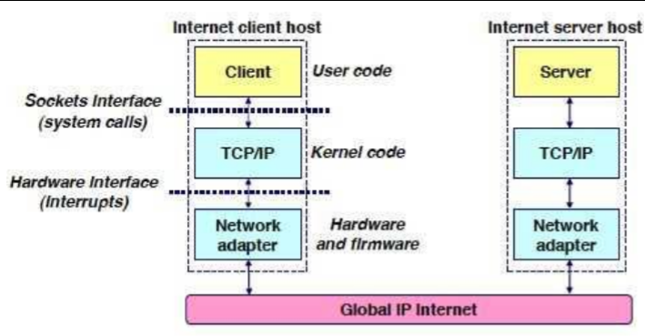
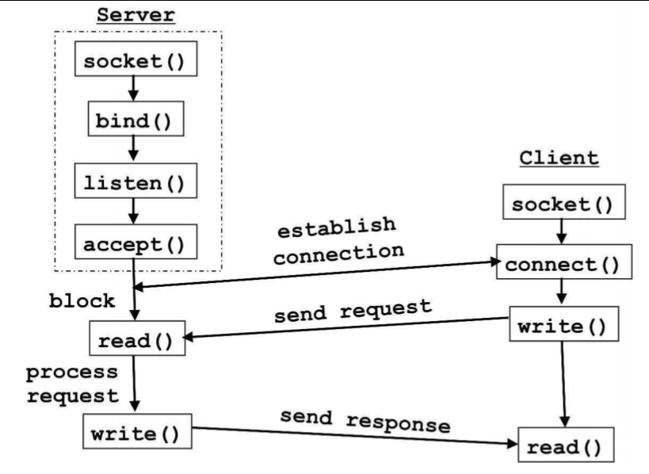
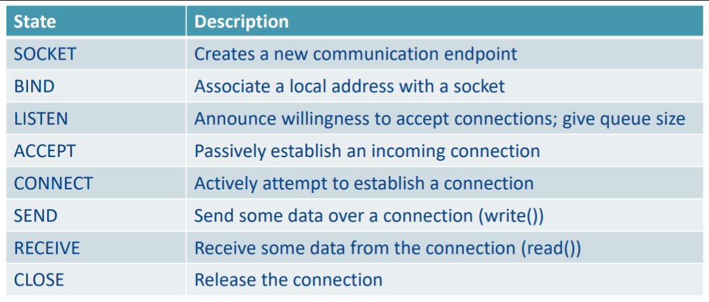
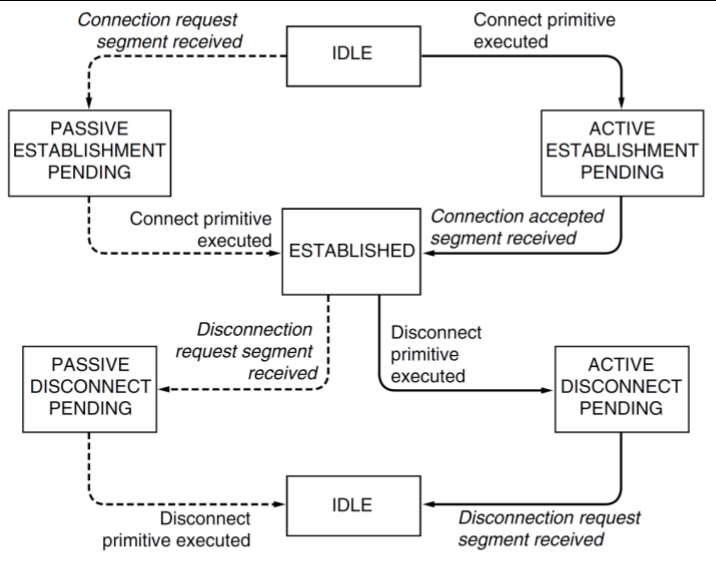
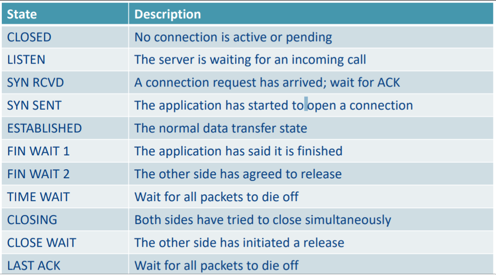
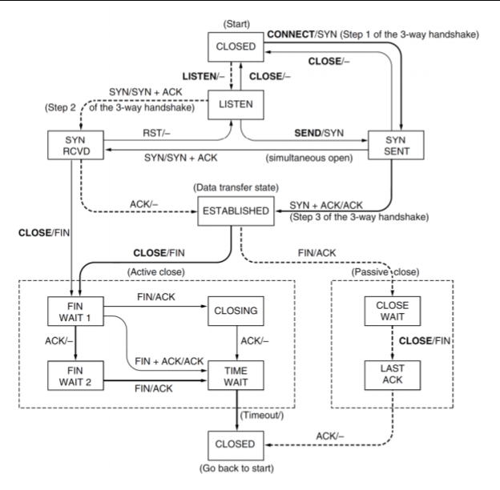
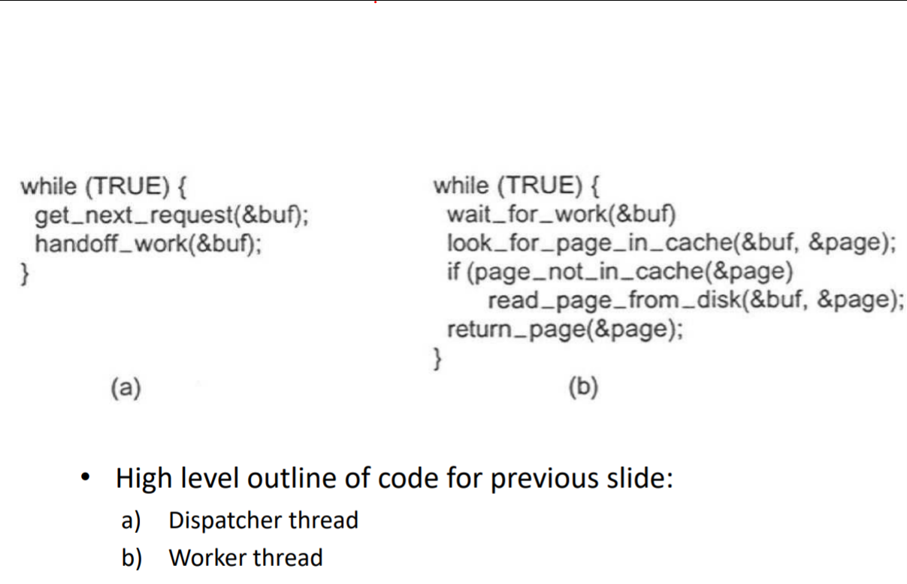
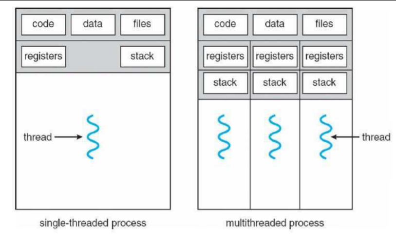

# Computer Systems - Lecture 8 - Socket Programming and Threading

### Socket
- Sockets are like doorways into and out of an application
- Allow traversal from Host Application -> Kernel Code -> HW/FW and back up to client application



**Using Sockets**
- Using the socket API you can create network applications
- Done by using a network application with an *association* -> protocol, source IP, source port, dest IP, dest ports

### Berkeley Socket
**Socket Interface**
- Originally part of Berkeley UNIX
- Adopted by all populat operating systems
- Simplifies porting applications to different OSes

**In UNIX everything is like a file**
- All input is like reading a file
- All output is like writing a file
- File is represented by a integer file descriptor

**API implemented as system calls**
- e.g. connect, read, write, close



1. Instantiate Socket()
2. Bind your ports with Bind() - Specifies if this is for just local stuff or interwebs (note this depends on what you're doing)
3. Listen() puts it into a state which makes it wait and block until someone connects
4. Accept() accepts the connection which triggers the connection (3-way handshake)

Everything outside the box is not part of sockets - part of the protocol used e.g. TCP/IP

### Socket Primitives


Really similar to TCP stuff

**Flow/State Diagram for Sockets**


Dashed line is the *server*, client is the other line

won't really be examined

### Low-Level Socket States


These directly map to the TCP protocol

TIME WAIT 
	- when you close the connection the system doesn't kill off all resources for a few min
	- Used to stop accidental sending of old data when a new socket is instantiated in the same port after immediately after one is killed

**Flow/State Diagram**

Don't need to remember this exactly, but it is a good way to visualise it

### Sockets in C
**Headers**
```C
#include <arpa/inet.h>
#include <sys/socket.h>
#include <netinet/in.h>			// Interfaces to use
```
**Variables**
```C
int listenfd = 0, connfd = 0;
char sendBuff[1025]; 			// send buffer
struct sockaddr_in serv_addr;	// Server address
```
**Create a socket**
```C
// Listen file descriptor
// AF_INET specifies you're communicating over internet
// AF_UNIX would specify communicating same machine
// SOCK_STREAM for TCP since it's a byte stream
// SOCK_DGRAM for UDP (since that would be a datagram) 
listenfd = socket(AF_INET, SOCK_STREAM, 0); //create socket
memset(&serv_addr, '0', sizeof(serv_addr)); //initialise server address
memset(sendBuff, '0', sizeof(sendBuff)); //initialise send buffer

serv_addr.sin_family = AF_INET; //Type of address – internet IP
// INADDR_ANY - listen to all connections on this machine
// htonl changes the byte order - standard thing you'll call
// networks change the byte order so yeah
serv_addr.sin_addr.s_addr = htonl(INADDR_ANY); //Listen on ANY IP Addr
serv_addr.sin_port = htons(5000); //Listen on port 5000
```

The process:
**Bind and listen**
```C
bind(listenfd, (struct sockaddr*)&serv_addr, sizeof(serv_addr));
listen(listenfd, 10) // maximum number of client connections to queue
```
**Accept, Send, Close**
```C
// Use same file descriptor
connfd = accept(listenfd, (struct sockaddr*)NULL, NULL);

// Actually send the data
// This puts it in the buffer
snprintf(sendBuff, sizeof(sendBuff), "Hello World!");
// This writes it to the socket
write(connfd, sendBuff, strlen(sendBuff));
close(connfd);
```
**Connect**
```C
connect(connfd, (struct sockaddr *)&serv_addr, sizeof(serv_addr)
```
**Receive**
```C
while ( (n = read(connfd, recvBuff, sizeof(recvBuff)-1)) > 0)
{
//process received buffer
}
```

### Multi-threaded Web Server
- Clearly we should have a bunch of different concurrent connections from multiple clients
- This can be done through the usage of a *multithreaded web serveer*
- Many worker threads checking the cache



Can change things like having mulltiple sockets - typically you want everything on one port number and spread it acccross server-side

## Threads vs Processes
- Threads are a sequential executation
- Threads vs Single Process


More threads = more danger/reliability issues but also more performance
Threads are just sub-processes

### Kernel vs User Threads
- Kernel threads operate at OS level
	- Have scheduling
- user threads operate using multi-threading
	- It's slow af

diferent ways of representing itself

### Process and Threads
If youre doing threads then you can treat each thread as a representation for processes
- Fork() creates a new process with it's own entirely new process context
- Clone() : creates with it's own identity but is allowed to give data structutres to parent

### Pthreads
- POSIX standard for API for thread and synchonisation. 
- All threads have type -lpthread

**Creating a thread**
``` C
int pthread_create(pthread_t *id,
const pthread_attr_t *attr,
void *(func)(void *),
void *arg);
Id of thread itself:
pthread_t pthread_self();
```
**Terminate a thread:**
``` C
void pthread_exit(void *rval_ptr);
int pthread_cancel(pthread_t tid);
// Get the return value of a thread and then close that and start one
int pthread_join(pthread_t tid, void **rval_ptr);
```
**Causes the current thread to wait until the specified thread has
terminated.**
``` C
int pthread_detach(pthread_t tid);
```
**Causes the thread resources to be reclaimed immediately upon
termination.**


Global variables are *shared across threads*
- This results in any thread being *able to modify shared data* at any time
- Need to synchonize threads (as they should all be aware of this change in data)
- Multithreaded is really hard to do correctly - as it's non-deterministic
- Running a program twice can result in different values
- Normal testing doesn't really work
- Way more theoretical modelling
	- No corrupted states etc.

### Multithreaded Programming Shortcomings
- Really powerful but dire consequences
- Race Conditions
	- Look up [Therac-25](https://en.wikipedia.org/wiki/Therac-25)
- Deadlock
	- Both threads waiting for each other indefinitely
- Requires locks, synchronisation and analysiss

### Threads
- Can communicate with each other *Without a process*
- Shared memory allows threads to communnicate wtih each other
