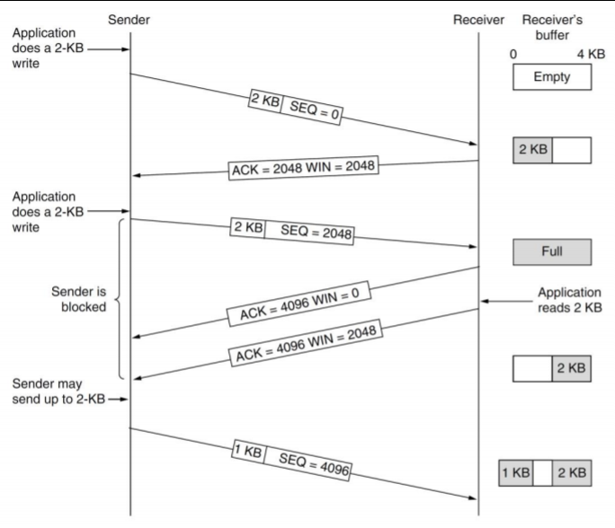
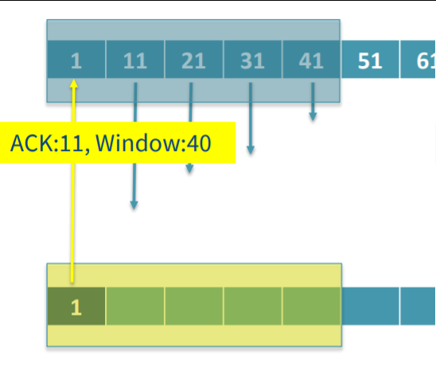
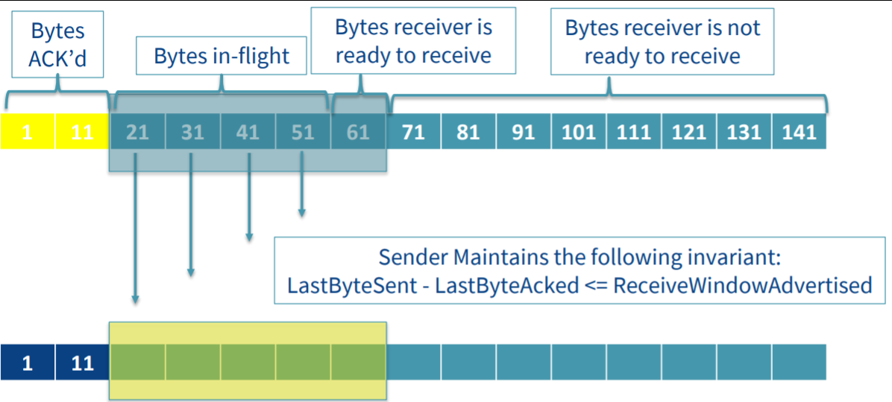
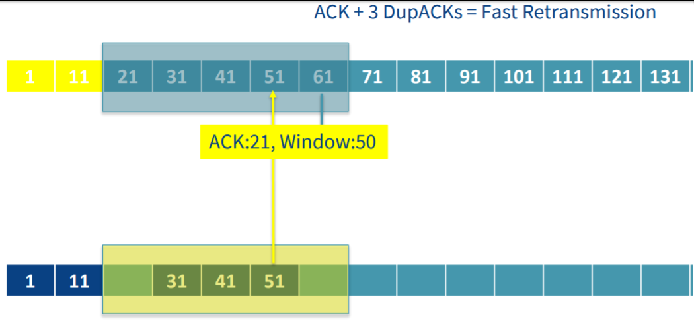
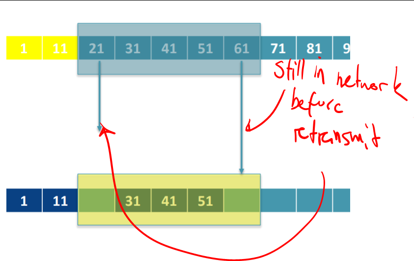
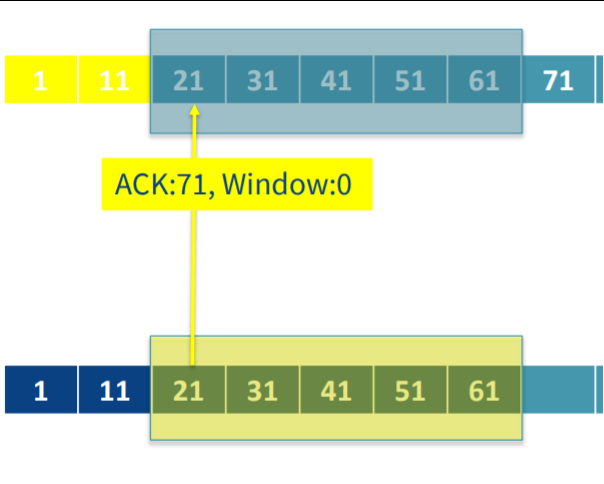
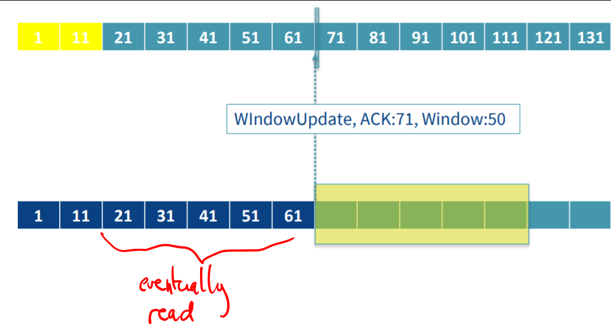
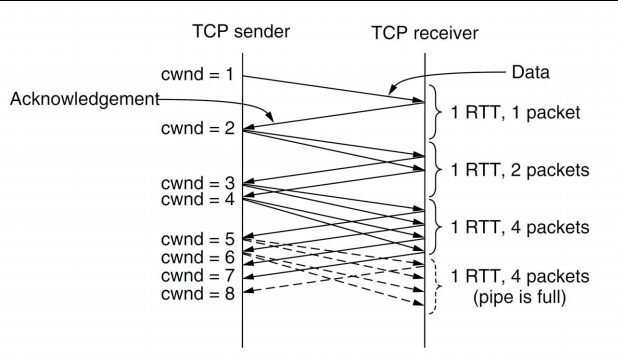
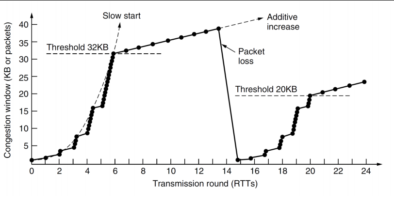

# Computer Systems - Lecuture 9 - TCP Congestion Control

### TCP Sliding Window
- Sliding window of data which is controlled by the receiver
- Determines the amount of data the receiver can accept
	- Sender/Receiver maintain buffers independently of application
	- No guarentee that data is immediately send or read from respective buffers
- These buffers should be *in sync*
- If you send data beyond the receiver buffer then it'll reject it



- You have to make sure when writing to receivers to send the *correct amount of data per thread* otherwise the receiver will simply *block it*
- When the window is 0 the sender *should not send any more data*
	- Can send URGENT data
		- This is only really used for sending "shut it down" signals
	- 1 byte segment
		- You can send this to be like "yo hold up I still got data on the way boi"
		- Prevents deadlock so no one's waiting
- Senders can delay sending data if the receiving window is larger
	- e.g. we have 2kb in the buffer right now but the receive window is 4kb so we can wait for another 2kb

**Send Window**
- What data the sender is able to send
**Receiver Window**
- Amount of data the receiver is willing to receive - window size in ACK

### The Process
**At the Start:** :smile:
- Both windows initialised
- 3-way handshake already done
- Synchronized af boi

**Sending stuff:** :speech_balloon:
- Bytes are loaded into the send window 'buffer' and these are called *in flight*
- Send an ACK for a segment and the window size to the receiver
- These bytes will be read by application
- An ACK is sent back to sender *(may be out of order)*



**Moving to the next segment:** :muscle:
- Remove the first socket
- Slide along the receiver window
- Next byte received - same ACK process done again
- Sender *still has less bytes for window size*
	- This *variable window size* allows for a different number of bytes to be read for each segment
- The sender *may send a window size update*
- The sender window **must always be in sync with the receiver** and *the same size* or *slightly smaller*



**Oh no! We lost a segment!:** :scream:
- Keep sending the later segments cause we don't notice

- Eventually receiver window *keeps sending an ACK for the previous segment* so the sender window stops and does a *fast retransmit*
	- This previous ACK is called a *DupACK (Duplicate Acknowledgement)*
	- *3 DupACKS = fast retransmit*
	- If there's still other segments in the network we let them turn up before our resend
	
- Fast retransmit is just resending some shit
- The latest ACK will have the newest byte value so we can go back up to where we were (sender window size should be 0 so again *don't send anything*)

- Shitty thing is you can't predict when the receiver window will move on, just hope the data is read at some point
	- The process is initiated when a window update is sent back and we'll start sending things again
	

**Persist Timer**:
- The sender will just wait when it receives a 0 size window until the timer is up
- After the timer is up it'll send a probe "pls notice me senpai" to the receiver window
	- This should nudge the receiver window with a *ZeroWindowProbe* and the receiver should reply with a windowUpdate and a *ZeroWindowProbeACK*

### Congestion Control
- When networks are overloaded they are *congested*
- Need to keep things rolling
- Lower layers (data/network layers) attempt to reduce congestion but TCP affects congestion the most by adding methods where you can *reduce the data rate*
- TCP is *defensive*
	- Window size is chosen *by the receiver* based on their buffer size
	- If the *sender is constrained to this size* then the receiver *doesn't have to deal with buffer overflow*
	- Segment lifetimes - stop the receiver from waiting forever

**Congestion Control Window**
- An extra™ window that is dynamically adjusted according to the network performance
- Congestion window size is maintained *by the sender*

**How Does this work? a.k.a. Incremental Congestion Control**
- On connection, we initizalise the congestion window to the *size of the maximum segment on the connection* and transmits one segment
- As we continue to get successful sends we increase the window size by the maximum segment size
	- `the more u send the more thicc u get`
- Although it starts slow, this is *exponential in speed* <sub>[eurobeat intensifies]</sub>


This is called a *"slow start algorithm"* :turtle:

- Eventually you'll be *too fast* and you'll send too many segments
- You have a *threshold* to stop this (called **Slow Start Threshold: ssthresh**)
- If segment loss occurs the ssthresh is set to half the current window size and we start incrementing again
- Once the threshold is reached the growth becomes *linear*
- Can also react to known lost segments via fast retransmission
- known as *TCP Tahoe*

This is what it should look like during a transfer



Not efficient but it's ezpz to implement and do
- You can make this better by making the recovery speed faster
	- Starts from new ssthresh instead of the original starting value
- You can also make other optimizations:

**SACK (Selective Acknowledgements)**
- Not examined
- Shows what data you've received without sending one ACK
- Extension of TCP
- SACK header on top of ACK (inside the Options area of the TCP header)
- Some other shenanigans that I'll revisit one day after the midsem

```
godspeed everyone o7
```