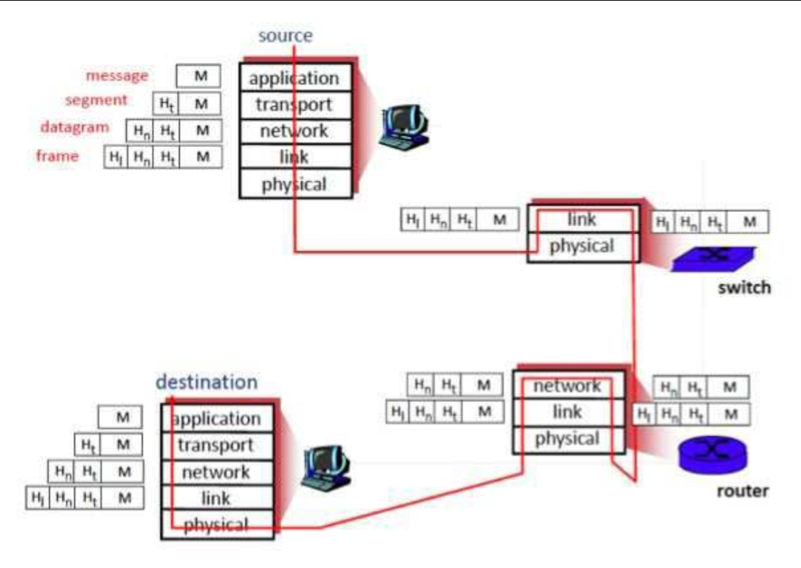
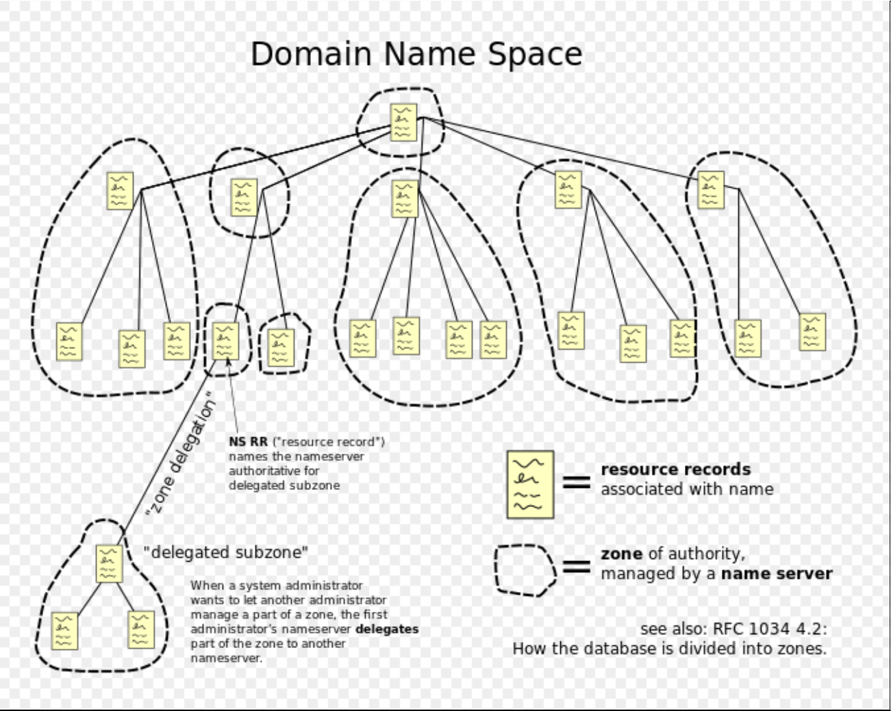
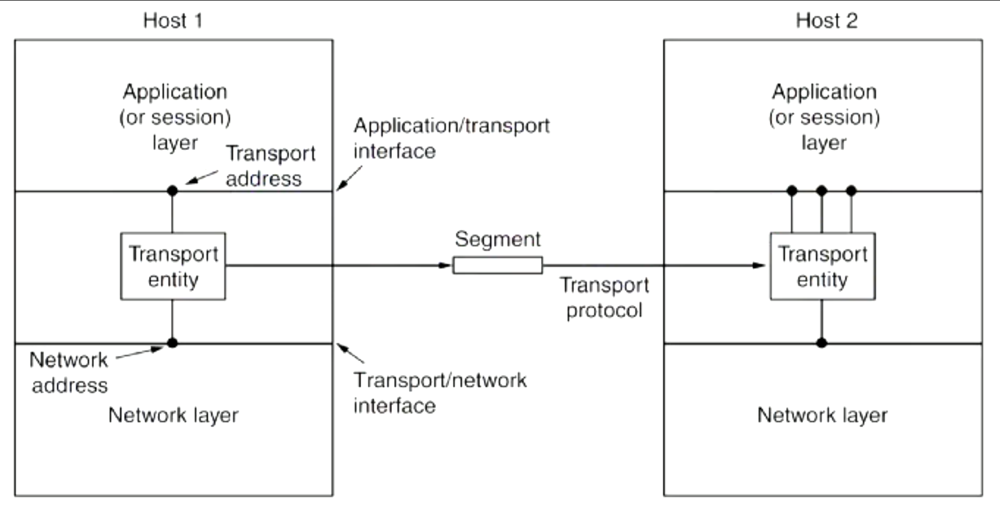

Computer Systems Mid-Sem Summary Notes (Week 1-6)
=================================================

### Overview (According to Recap Lecture)

-   Midsem will be multi choice + short answer
-   Covers *all material from week 1-6*
-   See attached Sample Midsem

Contents (in order specified in the recap) :book:
-------------------------------------------------

-   [Network Models](#network-models)
    -   [Connection Oriented vs
        Connectionless](#connection-oriented-vs-connectionless)
    -   [TCP/IP vs OSI](#tcpip-vs-osi)
-   [Application Layer](#application-layer)
    -   [What's in a URL? (Uniform Resource
        Locator)](#whats-in-a-url-uniform-resource-locator)
    -   [How HTTP works](#how-http-works)
    -   [Web Proxies](#web-proxies)
    -   [Dynamic/Static Web Documents](#dynamicstatic-web-documents)
    -   [DNS: Domain Name System](#dns-domain-name-system)
        -   [Resolver](#resolver)
        -   [Types of Name Servers:](#types-of-name-servers)
        -   [DNS tools](#dns-tools)
    -   [Email and SMTP (Simple Message Transfer
        Protocol)](#email-and-smtp-simple-message-transfer-protocol)
        -   [User Agents](#user-agents)
        -   [Message Transfer Agents](#message-transfer-agents)
        -   [SMTP](#smtp)
        -   [Delivery Methods](#delivery-methods)
        -   [MIME - Multipurpose Internet Mail
            Extensions](#mime---multipurpose-internet-mail-extensions)
        -   [Streaming](#streaming)
-   [Transport Layer UDP/TCP](#transport-layer-udptcp)
    -   [Transport Layer](#transport-layer)
    -   [Ports and Addressing](#ports-and-addressing)
    -   [Multiplexing/demultiplexing](#multiplexingdemultiplexing)
-   [UDP - User Datagram Protocol](#udp---user-datagram-protocol)
    -   [Pros of UDP](#pros-of-udp)
    -   [Cons of UDP](#cons-of-udp)
    -   [RPC and RTP](#rpc-and-rtp)
-   [TCP - Transmission Connection
    Protocol](#tcp---transmission-connection-protocol)
    -   [Service Model](#service-model)
    -   [TCP Features](#tcp-features)
    -   [TCP properties](#tcp-properties)
    -   [The Process](#the-process)
    -   [Congestion Control](#congestion-control)
-   [Socket Programming and
    Threading](#socket-programming-and-threading)
    -   [Socket](#socket)
    -   [Socket Primitives](#socket-primitives)
    -   [Low-Level Socket States](#low-level-socket-states)
    -   [Multi-threaded Web Server](#multi-threaded-web-server)
    -   [Threads vs Processes](#threads-vs-processes)
        -   [Multithreaded Programming
            Shortcomings](#multithreaded-programming-shortcomings)
-   [Memory Management](#memory-management)
    -   [What is a process?](#what-is-a-process)
    -   [Multiprogramming](#multiprogramming)
    -   [The Kernel](#the-kernel)
    -   [User-Kernel Distinction](#user-kernel-distinction)
    -   [System Calls](#system-calls)
    -   [Interrupts](#interrupts)
    -   [Swapping](#swapping)
    -   [Virtual Memory](#virtual-memory)
-   [Version Control Systems](#version-control-systems)
    -   [Git Architecture](#git-architecture)
    -   [Git as a Database](#git-as-a-database)
    -   [Some Git Commands](#some-git-commands)
        -   [Git real world usage](#git-real-world-usage)
        -   [Forks](#forks)
        -   [Continuous Integration](#continuous-integration)

`good luck and godspeed fams` :muscle:

------------------------------------------------------------------------

Network Models
==============

In this course we'll be looking at the network as a *stack of layers*
networks have layers

Each layer gives stuff to the layer above or to other layers on the same
layer.

The services that go to higher layers are called *interfaces or
services* while communication between layers of the same depth are
called *protocols*.

A service can be ***connection oriented*** or ***connectionless***.

##### Connection Oriented vs Connectionless

-   **Connection Oriented (e.g. TCP)**
    -   Connect, Use, Disconnect
    -   e.g. it's like talking to a normal person
        -   start convo -\> topic -\> kbye lol
-   **Connectionless (e.g. UDP)**
    -   Just send it™
    -   Kinda like a postal service except we don't really know if the
        message will ever get there
-   This has an impact on how *reliable* a service can be.

### TCP/IP vs OSI

In the beginning of internets, there were a bunch of models.

Some people wanted to implement heaps and make a really nice and long
spec for a network. They were never adopted cause *they were too slow*.
**This is the OSI model**.

The **TCP/IP model is the other model**. It's *jank af* but it was
adopted first, because it was made earlier.

**OSI is the ideal peak performance** - Use it to make the ideal network
model

TCP/IP is just what we happen to use cause it was there first - Use this
when actually making something

kinda sounds like my marks

#### OSI Model Layers

-   Application
    -   Stuff you interact with
    -   TELNET, FTP, SMTP, DNS
-   Presentation
    -   Encoding stuff (unicode, languages etc.)
-   Session
    -   HTTP Sessions?
-   Transport
    -   TCP/UDP
-   And 3 more layers which are used to connect
    -   Network
        -   IP
    -   Data link + Phyical
        -   LAN, ARPANET, SATNET, Radio

#### TCP/IP Model Layers

-   Application
    -   Stuff you interact with
    -   This basically now *also tries* to do all the stuff in the
        *presentation and session layers*
    -   TELNET, FTP, SMTP, DNS
-   Transport
    -   TCP/UDP
-   And 2 more layers which are used to connect
    -   Network
        -   IP
    -   Host-To-Network
        -   LAN, ARPANET, SATNET, Radio

**This is how the model works** 

------------------------------------------------------------------------

Application Layer
=================

Application layer is where cool stuff happens.

##### What's in a URL? (Uniform Resource Locator)

-   Protocol
    -   WWW
-   DNS Name
    -   google.com
-   File Name
    -   /fish.html

Address for a resource can be *relative (./folder1/fish.html)* or
*absolute (https://www.google.com)*

Defined in HTTP spec

#### How HTTP works

1.  Client initiates TCP connection to server on port 80
2.  Server accepts connection
3.  Exchange messages/data between server/client
4.  Close connection

In HTTP 1.0 we'd only have single connections so we'd have to constantly
disconnect/reconnect in order to load a webpage. Nowadays we have
pipelining and caching and persistent connections and shit (1.1
onwards).

##### Methods used in HTTP

    Method          | Safe              | Idempotent        | Cacheable
    GET             | Y                 | Y                 | Y
    HEAD            | Y                 | Y                 | Y
    POST            | N                 | N                 | Y/N           // Typically used to creates orders
    PUT             | N                 | Y                 | N             // Typically used to update orders - has 1 call
    DELETE          | N                 | Y                 | N
    CONNECT         | N                 | N                 | N
    OPTIONS         | Y                 | Y                 | N
    TRACE           | Y                 | Y                 | N             // recommended to disable TRACE - gives cookies
    PATCH           | N                 | N                 | N

Idempotent - multiple identical requests have same effect

Safe - only for information retrieval - shouldn't change state

##### Example of a ASCII Request/Response

    // Here's a request
    GET /somedir/page.html HTTP/1.1         // Request line (GET, POST, HEAD)
    Host: www.somesite.com.au               // Header Lines
    User-agent: Mozilla/4.0 
    Connection: close 
    Accept-language: fr                     // Carriage return - line feed indicates EoM

    // Here's a response
    HTTP/1.1 200 OK                         // Status line
    Connection close                        // Header Lines
    Date: Thu, 06 Aug 2009 12:00:15 GMT 
    Server: Apache/2.2.11 (Unix)            // generally change this to hide vulnerabilities
    Last-modified: Mon, 22 Jun 2009 
    Content-Length: 6821 
    Content-Type: text/html

    <html>...                               // Data

##### HTTP Response Codes

    1xx     | Information       | 100 - Agrees to handle client's request
    2xx     | Success           | 200 = request succeeeded; 204 = no content
    3xx     | Redirection       | 301 = Page moved
    4xx     | Client error      | 404 gf and internship not found 😭
    5xx     | Server error      |

##### Client Side Processing

-   Doesn't really have much to process beyond webpages
-   Plugins/Extensions
    -   Integrated software modules which executes in the browser
    -   Javascript
-   Helper
    -   Seprate program which can instantiated by the browser
    -   Applications/pdf

##### Server Side Processing

-   Five step process:
    -   Accept connection
    -   Identify the file requested
        -   Perform access control
        -   Check cache
    -   Get the file from local disk storage and other processing
    -   Send file to client
    -   Close connection
        -   Maybe make an entry in the server log if you want
    -   Except do all of the above in multiple threads otherwise things
        would be slow af :turtle:

Cache = basically reduce response time by just retrieving version of
data in memory instead of disk

#### Web Proxies

-   Used for *caching and security*
-   Basically send all requests to a proxy and the proxy does the
    processing and returns results
    -   "Can you ask this person to give me this?"
    -   Organisations all usually have a proxy set up

##### Cookies

-   Small amount of information placed on user's computer and re-used
-   Has 5 fields: domain, path, content, expiry, security
-   Used to track users and the kind of weird kinky shit you look at

e.g.

    Name            Value               Domain              Expires         HTTPOnly    Secure
    Session-id      356-7555.....       .amazon.com.au      2036-01-01.     -           -

#### Dynamic/Static Web Documents

Here are some formats:

##### Static

###### HTML - Hypertext Markup Language

-   Simple af
-   plain text with browser based rendering
-   Restricted to ISO-8859 Latin-1 Character Set
-   structural divisions (divs)
-   probably only drinks black coffee
-   has a stable job
-   under appreciated by everyone
-   likes listening to chiptunes

Note: HTML 5.0 now has things like built in standard for video etc.

###### XML and XSL

-   basic af
-   Usually just used to separate content
-   wanted to be cooler than html but is actually way lamer
-   a e s t h e t i c
-   vapes a lot

###### XHTML

-   Expression of HTML 4.0 as valid XML
-   Different to HTML 4.0 since it has more requirements for
    conformance/stuff
-   literally who
-   can't decide what to order at maccas
-   wants attention
-   failed college

##### Dynamic

Usually scripts which run in the web browser process Allows you to
change parts of a page instead of requesting a new page

###### Javascript

-   broken inside
-   instagram page with 1 mil followers
-   carries the team

###### Java Applets

-   Compiled java code
-   old af
-   tries too hard
-   no idea what blockchain means

###### ActiveX

-   retired
-   really likes windows in their house
-   no-one cares anymore

##### AJAX

-   used a lot
-   stressed
-   never in sync with the group
-   doesnt like attention

###### HTML and CSS

-   present information as "pages"
-   OG
-   hipsters before hipsters existed
-   cool
-   smokes a lot and drives an 80's mustang

DNS: Domain Name System
-----------------------

Used to resolve URLs to an *absolute location* - e.g. google.com vs ip
address

DNS uses a *tree-structured name space* to identify resources. - Each
node in the tree has a set of information in a *resource record* -
`d i s t r i b u t e d database` - A *root* of the database is called a
*name server*

#### Resolver

-   This is how your machine uses the DNS
-   Queries necessary DNSs to get the URL
-   Pretty much all OSs have this
-   Recursive search boi

##### Domain Names:

-   Case sensitive
-   63 characters per part
-   255 chars per path
-   Internationalised
    -   Non-latin characters allowed
        -   e.g. chinese characters
        -   Huge security problem
            -   Can pretend you're a different URL by using similar
                characters

This image makes things a lot easier

At the very top you have a *root name server*. There are 13 in the world
and you only end up here if you're lost. These only handle top level
stuff and push requests down.

-   Literally the internet

#### Types of Name Servers:

-   Top level domain
    -   com, org, net, edu
-   Authoritative
    -   Used within an organisation
-   Local
    -   Not part of the hierarchy
    -   DNS server within your machine

This is a resource record: 

#### DNS tools

-   nslookup
    -   Internal resolver
-   dig
    -   OS resolver
-   host (linux)
-   Hosts File
    -   Hard coded mappings

DNS has no security hence you can spoof things and DDoS DNS servers -
Fix with DNSSEC and Root Signing which don't really work till all
resolvers have it

Email and SMTP (Simple Message Transfer Protocol)
-------------------------------------------------

##### User Agents

    - Allow users to read/send email

##### Message Transfer Agents

    - Transport messages source->destination

##### SMTP

-   Use TCP to reliably transfer email message (port 25)
-   Direct transfer
    -   WhatsApp uses this
-   Default not secure as it has no authentication (mitigated by HTTPS)

##### Delivery Methods

-   Local
-   **POP3**: Post Office Protocol
    -   Removes message from server once it's downloaded
-   **IMAP**: Internet Mail Access Protocol
    -   More features and more complex
    -   Can manipulate stored messages
    -   Doesn't scale well
-   **HTTP**: Gmail, Hotmail, Yahoo! Mail, 10minutemail etc.

#### MIME - Multipurpose Internet Mail Extensions

-   Allows you to attach things to emails
-   5 additional message headers:
    -   MIME-Version: Identifies the MIME version
    -   Content-Description: human readable describing contents
    -   Content-Id: unique identifier
    -   Content-Transfer-Encoding: how body is wrapped for transmission
    -   Content-Type: type and format of content

#### Streaming

VoIP (Voice Over IP)

-   Prioritises low latency and small buffer since it's just voice data

Video/Audio

-   Live: same as VoIP
-   Stored: Balance between quality and latency; initial buffering is
    acceptable (Vimeo/YT)

SIP, RTMP, RTSP/RTP, HLS, MPEG-DASH \<- Some more examples (probably
won't be tested)

Usually you should stream live in UDP (no buffering, less resource
intensive), stream stored video in TCP (good quality, buffering)

------------------------------------------------------------------------

Transport Layer UDP/TCP
=======================

#### Transport Layer

-   Meant to provide reliable *cost effective* data transport
-   Provides interfaces between the *application* and *network* layer
-   Does all the *moving of data between hosts* in *segments* using a
    *transport protocol* (TCP/UDP)

##### Encapsulation

-   When you send a message *down a layer* you *encapsulate it* in the
    next unit.
-   When it arrives each unit is *peeled off*

###### Terminology Used in this Course

-   Segments = sent at transport layer
-   Packets = sent at the internet/network layer
-   Frames = sent at the link/data link layer

#### Ports and Addressing

-   Transport layers also decide *which process receives which packet*
-   This is done using a **port number** (e.g. http for port 80)
    -   This is like an apartment number
    -   Building is the host, port is the specific apt. number

##### Port Allocations

-   Range from 0-65535 (8 bits)
-   Classified in 3 segments:
    -   Well known ports (0-1023)
        -   80 HTTP
        -   25 SMTP
        -   22 SSH
    -   Registered Ports (1024-49151)
    -   Dynamic Ports (49152-65535)
        -   Listening for responses

#### Multiplexing/demultiplexing

-   or MUXING and DEMUXING
-   MUXING:
    -   combining multiple streams into a single stream
-   DEMUXING:
    -   splitting distinct streams from a single shared stream
-   Kinda like when you have a DVD and you change the language or
    subtitles
    -   you're changing which audio stream you're taking from
-   Different ports are multiplexed into a single ethernet stream

UDP - User Datagram Protocol
============================

-   Simple af protocol for putting data into the IP protocol
-   Simple header - data from source to dest with particular port
-   Used over raw IP since *you can specify ports for data to arrive at*

##### Pros of UDP

-   Provides IP interface with multiplexing/demultiplexing
-   Simple and efficient
-   Short request and short response
-   Simple to code - fewer messages
-   DNS is a good application for UDP

##### Cons of UDP

-   Does *not* include support for
    -   flow control
    -   error control
    -   retransmission
-   Unreliable

**RPC (remote procedure calls)** and **RTP (real time transport
protocol)** are two good use cases for UDP

#### RPC and RTP

-   RPC
    -   Allows calling procedures on a remote server as if they are
        local
    -   Makes distributed programming easier
    -   UDP is good for this as it's idempotent
-   RTP
    -   Used by VoIP (voice over IP)
    -   Runs in user space and application layer but uses parts of
        transport layer (pick one for exam)
        -   Example of TCP/IP not being strongly modelled
    -   MUX several streams into single stream of UDP segments
    -   Controlled by Real-timeTransport Control Protocol
        -   Provides feedback to source
        -   Synchronisation (clocks drifting)
        -   UI (e.g. naming sources)
    -   Uses a buffer to counter jitter and other issues

TCP - Transmission Connection Protocol
======================================

-   Provides a protocol by which applications can transmit IP datagrams
    -   Split the thing you're sending into *thicc* segments and send
        individually
    -   Reconstruct this at the recipient
-   TCP is a *connection oriented* protcol running on top of the
    *connectionless* IP protocol
-   Can result in many issues:
    -   Congested networks (delayed ACKs)
    -   Multiple repeated transmissions
    -   Delayed duplicates (things arriving in the wrong order or not at
        all)
    -   much spaghetti
    -   allergies to shellfish

##### Service Model

-   The sender/receiver both create **sockets** with the *IP of the host
    and the port*
    -   TCP service activates when connections are established between
        sockets

#### TCP Features

-   Full duplex (bidirectional)
-   Point to point (From one source to one destination)
-   Byte streams (not message streams)
    -   Length of an operation measured in bytes
-   Buffer Capable (can be buffered prior to sending)
    -   Benefits efficiency (instead of sending lots of tiny messages
        wait for an *extra thicc* message)
    -   Unless they have a **PUSH** flag (don't buffer me
        **reee*EEEE***)

#### TCP properties

-   Data is exchanged in segments
-   Segment has a header of *20-60 bytes + zero or more data bytes*
-   TCP entities decide how large segments should be by:
    -   changing the 65515 byte IP payload
    -   changing the *Maximum Transfer Unit*
-   *Sliding Window Protocol*
    -   Helps with congestion and flow control
    -   Until the segment has been ACK'd from a client it stays to be
        retransmitted

##### Sliding Window Rundown

-   Determines the amount of data the receiver can accept
-   Two buffers (sender/receiver) in sync
    -   Must send the correct amount of data of it'll be out of buffer
        of receiver

### The Process

##### At the Start :smile:

-   Both windows initialised
-   3-way handshake already done
-   Synchronized af boi

##### Sending stuff :speech\_balloon:

-   Bytes are loaded into the send window 'buffer' and these are called
    *in flight*
-   Send an ACK for a segment and the window size to the receiver
-   These bytes will be read by application
-   An ACK is sent back to sender *(may be out of order)*

##### Moving to the next segment :muscle:

-   Remove the first socket
-   Slide along the receiver window
-   Next byte received - same ACK process done again
-   Sender *still has less bytes for window size*
    -   This *variable window size* allows for a different number of
        bytes to be read for each segment
-   The sender *may send a window size update*
-   The sender window **must always be in sync with the receiver** and
    *the same size* or *slightly smaller*

##### Oh no! We lost a segment! :scream:

-   Keep sending the later segments cause we don't notice
    
-   Eventually receiver window *keeps sending an ACK for the previous
    segment* so the sender window stops and does a *fast retransmit*
    -   This previous ACK is called a *DupACK (Duplicate
        Acknowledgement)*
    -   *3 DupACKS = fast retransmit*
    -   If there's still other segments in the network we let them turn
        up before our resend 
-   Fast retransmit is just resending some shit
-   The latest ACK will have the newest byte value so we can go back up
    to where we were (sender window size should be 0 so again *don't
    send anything*)

-   Shitty thing is you can't predict when the receiver window will move
    on, just hope the data is read at some point
    -   The process is initiated when a window update is sent back and
        we'll start sending things again 

##### Persist Timer

-   The sender will just wait when it receives a 0 size window until the
    timer is up
-   After the timer is up it'll send a probe "pls notice me senpai" to
    the receiver window
    -   This should nudge the receiver window with a *ZeroWindowProbe*
        and the receiver should reply with a windowUpdate and a
        *ZeroWindowProbeACK*

### Congestion Control

-   When networks are overloaded they get *congested*
-   Fix this with a *congestion control window*
    -   Resizes automatically according to network performance
    -   Calculated by a number that doubles whenever you have a good
        send and halves when you fail send
    -   When you get too fast only increase linearly eurobeat
        intensifies
        -   This is called ssthresh (slow start threshold)
    -   Called a *slow start algorithm* :turtle:
        -   Not efficient but ezpz to implement
        -   Can make it better by making recovery speed faster

------------------------------------------------------------------------

Socket Programming and Threading
================================

### Socket

-   Sockets are like doorways into and out of an application
-   Allows you to traverse from host application -\> kernel code -\>
    HW/FW

##### Connecting with sockets:

1.  Instantiate Socket()
2.  Bind your ports with Bind() - Specifies if this is for just local
    stuff or interwebs (note this depends on what you're doing)
3.  Listen() puts it into a state which makes it wait and block until
    someone connects
4.  Accept() accepts the connection which triggers the connection (3-way
    handshake)

### Socket Primitives

### Low-Level Socket States

These directly map to the TCP protocol

TIME WAIT - when you close the connection the system doesn't kill off
all resources for a few min - Used to stop accidental sending of old
data when a new socket is instantiated in the same port after
immediately after one is killed

`not going to talk about sockets in C since that's more related to the assignment and not the midsem`

### Multi-threaded Web Server

-   Clearly we should have a bunch of different concurrent connections
    from multiple clients
-   This can be done through the usage of a *multithreaded web serveer*
-   Many worker threads checking the cache

Threads vs Processes
--------------------

-   Threads are a sequential executation
-   Threads vs Single Process 

More threads = more danger/reliability issues but also more performance
Threads are like sub-processes

If youre doing threads then you can treat each thread as a
representation for processes 
- Fork() creates a new process with it's own entirely new process context 
- Clone() : creates with it's own identity but is allowed to give data structutres to parent

`not going to talk about pthreads either since that's just a POSIX standard and more code stuffs - look at lec8 for more`

Global variables are *shared across threads*

-   This results in any thread being *able to modify shared data* at
    any time
-   Need to synchonize threads (as they should all be aware of this
    change in data)
-   Multithreaded is really hard to do correctly - as it's
    non-deterministic
-   Running a program twice can result in different values
-   Normal testing doesn't really work
-   Way more theoretical modelling
    -   No corrupted states etc.

### Multithreaded Programming Shortcomings

-   Really powerful but dire consequences
-   Race Conditions
    -   Look up [Therac-25](https://en.wikipedia.org/wiki/Therac-25)
-   Deadlock
    -   Both threads waiting for each other indefinitely
-   Requires locks, synchronisation and analysis

------------------------------------------------------------------------

Memory Management
=================

### What is a process?

-   A program *in execution*
-   A *program is static* and a *process is dynamic*
-   Program is like the recipe while the process is the dish

### Multiprogramming

-   Each process will share the CPU instead of having a CPU for every
    process
-   This is called **multiprogramming**
    -   Increases system efficiency - when a process is waiting for
        something, a different can sweep in and make use of the CPU

### The Kernel

-   Basically The Overseer :sunglasses: for all processes
-   Stops processes from fighting
-   This is the *privileged* part of the operating system
    -   Provides services like *read from this file*
-   The *kernel itself is not a process*
-   Has a key role in memory management
    -   Keep track of which parts of memory are *free* and *allocated*
    -   Allocated memory when required
    -   Protect memory against unauthorized access

### User-Kernel Distinction

-   Most CPUs have *two modes* given by the PSW
    -   User mode vs Kernel Mode
        -   User mode can only do some stuff while the kernel mode can
            do *literally everything* and *access all memory*
-   Secure way of managing processes

### System Calls

-   User programs can ask the kernel to execute privileged instructions
-   The kernel will decide if they're allowed to do it
-   e.g. open, read, write, close, fork, exec, exit, wait

### Interrupts

-   When a hardware device needs attention from the CPU it *generates a
    signal to interrupt the CPU*
-   The CPU takes the current state of the program counters / PSWs and
    saves them in privileged memory locations
-   PSW will then put the CPU into kernel mode and fix the interrupt
-   Return from interrupt
-   Technically a blue screen is an interrupt
-   Only caused by hardware

#### Pseudo Interrupt

-   Software calls
-   Division by zeros / exceptions / acting weirdly

### Swapping

-   Main old way of memory management
-   *Swap out process* onto disk image called "swap space"
-   Causes External fragmentation
    -   Need to defrag after a while
-   *s l o w a f*

### Virtual Memory

-   Used today
-   Task manager lol
-   Only have some of the code and data of a program in main memory and
    load stuff in ahead of time
-   Now you can have a program larger than the amount of available RAM
-   Done with *Paging* or *Segmentation*

#### Paging

-   Addresses generated by programs are *virtual*
-   The *virtual addresses* are then *mapped to physical addresses*
-   This is managed by the *MMU* or Memory Management Unit
    -   Mapped in a *page table*
        -   Contains page number, valid but, referenced bit, modified
            bit, read/write/exec permission bits
    -   When permissions are *violated* there is a *page fault* which
        will terminate the process
    -   If not valid bit
        -   Suspend process, free page frame, load required page, map it
            and restart the process
        -   basically turn it off and on again

------------------------------------------------------------------------

Version Control Systems
=======================

Well if you don't know how to use git and you're on github...
:thinking:

What happens when you're working in a team, and everyone's using the
same files/directories?

You could try shouting across the office (goes bad as soon as there's
more than 3 people)

So we have Version Control Systems!

-   Track and control changes over files
-   Collaborate
-   See revision history
-   Audit changes
-   Backup? (it's not a great idea to put it on github since you can
    destroy it accidentally)
-   Take over the world (probably)

2005/2006 - Git by the legend Linus Torvalds

-   **Made in 10 days**
-   Takes CVS as an example of what *not* to do
-   Supports a distributed workflow
-   Includes *very strong safeguards* against corruption either
    accidental
-   Some strange design choices since it was mdae in 2005/2006 in 10
    days by linus himself
-   Huge number of commands
-   Reputation for being difficult
-   Andrew Morton said Git is "expressly designed to make you feel less
    intelligent than you thought you were".

### Git Architecture

-   Distributed Version Control
-   Directed Acyclic Graph (DAG)

Works by "Staging" changes - choosing the changes you made you want to
commit -\> then commit to remote (the repository of code).

Git does *not store deltas* (changes). It takes *snapshots of the file
system*. This is a big difference compared to other VCS. This results in
really fast branching processing but large sizes.

`.git` folder is where everything is stored.

### Git as a Database

-   In essense just a key-value database
-   Putting a value into the the database returns SHA1 hash (40
    character identifier)
    -   Value is stored as a *blob* in the objects folders
    -   The SHA hash is the key

Git is real confusing. The file structure can be recreated if you lost
everything, but for now I'll just talk about commands:

Some Git Commands
-----------------

`git add <files>` Stages files for commit

`git commit -m <message>` Commits the changes to your dbs

`git push <remote> <branch>` Pushes the changes to the repository note:
can only push when you're up to date. Pull and resolve conflicts with
merge first.

`git checkout <branch>` Change branches

`git merge <branch to merge current branch with>` Merges branches with
your current one

`git pull` Pulls latest changes from repository

`git clone` Copies the entire repository to you

`git remote add <remotename> host:/dir.git` Adds a remote repository to
push to

### Git real world usage

-   Tags can be used to add informative names to commits
    -   e.g. "release 1.0"
-   A release is also often stored on a branch
    -   This allows bug fixing to continue without impact on future
        development
-   Git **doesn't solve inherent conflicts** - two people editing the
    same file can still create a problem. General workflow is
    commit/push often with small changes.
    -   Master -\> Dev -\> Feature
-   Not uncommon for developers to not be able to merge onto Dev, maybe
    restricted or require code review prior to senior staff merging
    branches

Binary files can be inefficient in git

-   Git automatically packs file changes using delta compression
-   The change is across the whole file so makes things like JPEGs
    getting copied over and over
-   Increases the size of the clone operation
-   Problem for game development - can do a "shallow clone"

### Forks

-   Copy of a repository
-   Useful for large changes, keeps development work out of main
    repository
-   Remains even if original repository is removed
-   Link remains to parent
-   e.g. Bitcoin -\> Bitcoin Cash

### Continuous Integration

-   Changes merged several times a day
-   All changes are built ready for deployment
-   Build has a self-running test and is automatic (*unit testing*)
-   Deployed to clone of production environment
-   Automate deployment
-   Significant part of *DevOps*
-   Hooks in git allow system processes to be triggered
    -   After a commit, push, merge, etc.
    -   Rebuild the software and deploy it (see *Heroku deploying from
        GitHub*)

Build processes that depend on external repositories are fragile

-   A user deletes the repository -\> build process breaks
-   Risk of unknown code changes in builds
-   e.g. npm relying on one small script that was deleted -\> had to
    re-release the original script without license permission -\> this
    is bad

It's usually better to *fork the repository* - Higher support costs,
since you need to pull changes - at least everything won't self destruct

GitHub allows recreating deleted users

-   Serious security concern - can inject malicious code

Be careful what you store in public repositories

-   never store credentials/aws keys! (I've done this before oops)

------------------------------------------------------------------------
