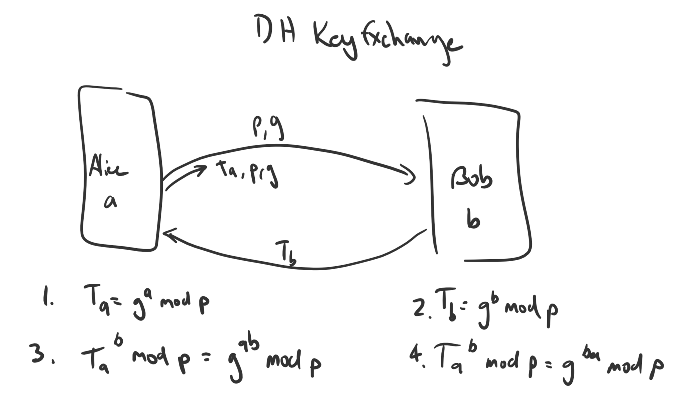

# COMP30023: Computer Systems Tutorial Week 11
### Certificates and PKI, TLS

### 1. What is a digital certificate?
- Verifies you have ownership over a domain
- Verify an entity
- Binds a public key to an entity
- Usually a CA does this
- Certificate looks like this:
	- I certify that the public key FF1987... belongs to domain
	- You can trust this because it's signed by someone you trust
	- This is done by hashing a signature (SHA-1?) which is then signed by the person
- Decrypt the signature *with the public key provided by the CA* and then check it against the certificate
- There are already CAs you trust pre-loaded on your device

### 2. Suppose certifier.com creates a certificate for foo.com. Typically, the entire certificate would be encrypted with certifier.com’s public key. True or False?
- False
- Encrypted with the private key
- The "entire" certificate is *not encrypted*, only the *signature*
- Certificates do *not* have to be paired with signatures
- Signatures can be put on everything incl. word docs, PDFs etc.

### 3. The Diffie-Hellman key exchange is being used to establish a secret key between Alice and Bob. Alice sends Bob (227, 5, 82). Bob responds with (125). Alice’s secret number, x, is 12, and Bob’s secret number, y, is 3. Show how Alice and Bob compute the secret key.
- DH key exchange

- Don't know what (227, 5, 82) are
```
p = 227 or p = 5	// since p is a prime
// Testing 227
Ta = g^12 mod 227
82 = 5^12 mod 227
5 = 82^12 mod 227
227 = 82^12 mod 5
82 = 227^12 mod 5

// We can eliminate all the mod 5 guesses, since mod 5 will always result in <5, no 7s
Just test the remaining with a calculator
82 = 5^12 mod 227 	// This is our answer
so,
Ta = 82
a = 12 				// Secret number probided
g = 5
p = 227

// Bob responds with 125, so we plug that in on a's side
Tb = g^b mod p
Tb = 125
b = 3 				// Bob's secret number
g = ????
p = 227

125^12 mod 227 = 212

// Plugging it in on b's side
82^3 mod 227 = 212

// So in the end we transferred a secret key 212 without exchanging the key
A vs B
125^12 mod 227 = 82^3 mod 227
Ta and Tb and g are all interchangeable
```

### 4. Alice wants to communicate with Bob, using public-key cryptography. She establishes a connection to someone she hopes is Bob. She asks him for his public key and he sends it to her in plaintext along with an X.509 certificate signed by the root CA. Alice already has the public key of the root CA. What steps does Alice carry out to verify that she is talking to Bob? Assume that Bob does not care who he is talking to (e.g., Bob is some kind of public service).
- Encrypt it using the CA's public key
- Get a hash
- Check it against the certificate hash
- Also check whether it's revoked (in the CRL) or expired
- She can hash the signature with a nonce and then send it to Bob, who then returns it unencrypted with his private key
- Just because you're sent a signature from a person *does not mean they own it*

### 5. Suppose that a system uses PKI based on a tree-structured hierarchy of CAs. Alice wants to communicate with Bob, and receives a certificate from Bob signed by a CA X after establishing a communication channel with Bob. Suppose Alice has never heard of X. What steps does Alice take to verify that she is talking to Bob?
- Keep going up in the hierarchy until you meet someone you trust
	- Once you reach someone you trust, you trust *everything below it*
- Do the same proces as above

### 6. What are the different validation levels at which certificates are issued? What criteria must a purchaser of a certificate at each validation level meet?
- **Domain Validation**
	- Really easy to get, LetsEncrypt
	- Have to prove that you have some control over the website
- **Organisational Validation**
	- Legal entity
- **Extended Validation**
	- Legal entity
	- Prove that it's an actual thing
	- Offline Process
		- Need an actual office and people do it in person
		- Expensive
	- Banks use this
	- Name shows up in the browser bar

### 7. Describe the TLS Handshake process.
1. Initiate TCP connection
	- SYN, SYN+ACK, ACK
2. Client sends `ClientHello`
	- Send a *list of cipher suites it can use*
3. Server sends ServerHello
	- The *cipher suite it chooses*
	- Sends also a certificate
4. Once the client gets the certificate it *validates it*
5. Client *generates a key for this session* using asymmetric cryptography or DH
6. Server and Client now have keys and are using TLS