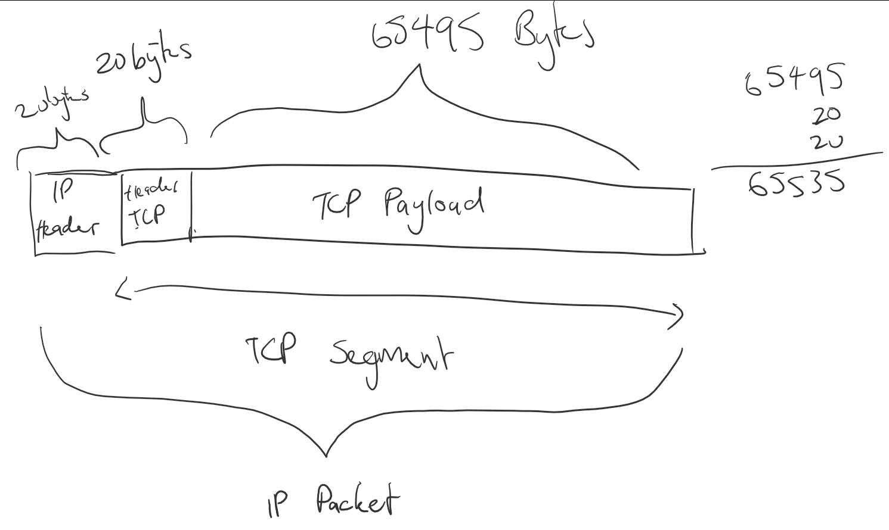

# COMP30023: Computer Systems Tutorial Week 5
# TCP, Socket Programming, Threading
## 1. What is a race condition? What is a deadlock?
### Race Condition: 
- when 2 threads try to read the same data at the same time, resultls in weird behaviour depending on what thread goes first

e.g.
inputting 10k but also taking out 2k at the same time
```
1. 1000+10000 	-> 11000 
2. 1000-2000 	-> -1000
```
If 1 and 2 occur at the same time but 2 is saved last, then the guy just lost 10k

```What should happen: 1000+10000 -> 11000-2000 = 9000```

### Deadlock: 
- When both threads make changes on a value, but each thread does not wait until the other finishes - each thread waits for another thread to complete their task and end up in an infinite loop

## 2. What is the biggest advantage of implementing threads in user space?
- User space threads vs kernel space threads
- User threads:
	- Faster to create
	- More efficient to create

- Kernel threads:
	- Harder to create
	- Require more states
	- Harder to manage

Threads belong in processes
If a user thread requires something from low-level in the kernel (e.g. keyboard interrupt) then that user thread will have to go to the kernel thread.
If there is one kernel thread and it blocks a user thread, all threads in the process will be blocked.
```
		Kernel Thread
			  ^
			  |      <- this only allows one process thread to call at a time
-----------------------------
|                           |
|		Process threads     |
|							|
-----------------------------
```
This is how you decide which thread you want - if it requires a lot of low level requests and has much blocking then use a kernel thread.
e.g. reading from a file

What is the biggest disadvantage?


## 3. In the lectures, a multi-threaded Web server was shown. If the only way to read from a file is the normal blocking read system call, do you think user-level threads or kernel-level threads are being used for the Web server?
- If we have a web server process (with user threads) and it needs to read from a file, it'll call `read()` and this will be a blocking call (i.e. requires a kernel thread).
- If you have a kernel thread to manage this specifically, then it will not cause delays (as each user thread will not have to wait for the kernel)

Why?

## 4. When an interrupt or system call transfers control to the OS, execution stops using the stack of the interrupted process and switches to a separate kernel stack. Why?
- Main reason here is a security thing
	- This allows some level of security in the OS
	- So we have the kernel "guarding" the OS
	- Kernel has it's own stack so it separates out privilaged/sensitive OS information from the process' information itself
	- If it were to run in a process stack then there may be some kernel data leftover
	- Safer
- Another reason could be that we don't want the process stack to overflow
	- This can cause an error which still leaves behind sensitive data
(Stack = Block of Memory)
`Consider reading the Tanenbaum chapter on this for more info`

## 5. The maximum payload of a TCP segment is 65,495 bytes. Why was such a strange number chosen?

This image is what is *accurately* defined as a packet.
Max length of IP packet = 65535
This constraint is because the length fireld is 16 bits
`2^16 = 65535+1`

The reason why the IP packet is 1 less than the full possible size is that *you cannot have an empty packet*, therefore you have 1 extra byte in the case that 'nothing' is sent. 

## 6. Theoretically, an optical fiber can run at 75 Tbps. What maximum packet lifetime is required to make sure that future 75-Tbps networks do not have wraparound problems even with 64-bit sequence numbers? Assume that each byte has its own sequence number, as TCP does.
TCP numbers each packet with a *sequence number*.
These *sequence nunmbers* are how each segment is differentiated.

Let's say you only have sequence numbers up to 4. 0,1,2,3

But what if you're sending stuff so fast and the network is slow?
You could wait for confirmation that all the packets have been sent, or.

Reuse the same sequence numbers.
The problem is now you potentially have different packets with the same sequence numbers.

We have to make sure that we have enough sequence numbers that we never "wrap around" like this

If you have 64-bit sequence numberes then you have `2^64 sequence numbers`. Each of these bytes will have a sequence number. Therefore you can send 2^64 bytes before you wrap around.

`75 Tbps -> 75/8 TBps -> 75*10^12/8 T = 2^64`
`solve for T = 22 days`
Meaning you can send 75Tbps in 22 days without wrap around.

It will only *wrap around after 22 days*

you won't be asked to find those calculations in the exam

## 7. This question relates to SYN cookies as discussed in the lecture.
```
3-way handshake of
----------->      "hello" (i.e. SYN) 
<-----------	  "got your message" (i.e. SYN+ACK)
----------->      "I recieved your hello" (i.e. ACK)
```
This is how you establish a connection

There's a type of attack called a *SYN flood attack* 
You just keep sending SYN characters as the server keeps waiting for an ACK to be sent back.

Eventually the server will keep allocating resources for these SYNs and eventually the queue will be exhausted.

This is a type of DDoS attack

A SYN cookie is a special kind of initial sequence number

ISN = hash(source host and source port and destination host and destination port and a secret number only the server knows)

It sends this ISN back along with the SYN+ACK but *does not* allocate resources until the server gets the ISN back with the same hash

This will only normally happen if you're close to exhausting your SYN queue - i.e. potentially under attack

You can also prevent the ISNs being reused by also hashing the time of date along with all the other things 

### (a) SYN cookies were developed to resist a particular kind of denial-ofservice attack. Name and describe this attack.