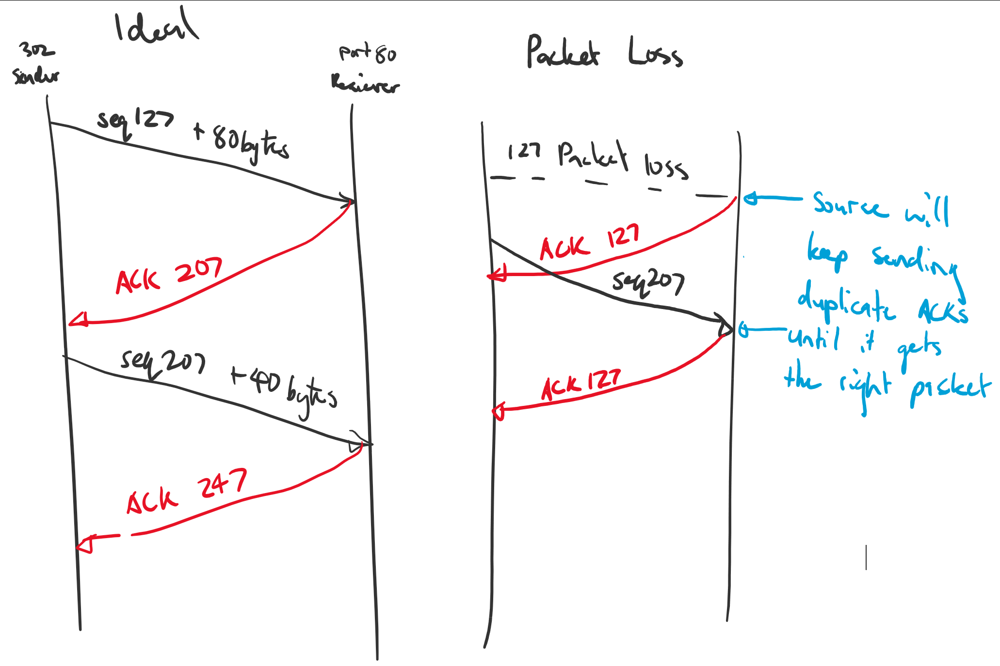

# COMP30023: Computer Systems Tutorial Week 6
### TCP, Congestion Control, Flow Control

### 1. Suppose Host A sends two TCP segments back to back to Host B over a TCP connection, and that Host B has received all previous bytes sent by
#### A. The first segment has sequence number 90; the second has sequence number 110.
#### (a) How much data is in the first segment?
- The sequence number increments based on the number of bytes you have in a segment
- Is it 19 or 20?
	- If we were to send the segment then:
		- `1 Byte Seq 90`
		- `2 Byte Seq 91`
		- ...
		- `20 Byte Seq 109`
	- Then it would move to the next segment, so therefore you get 20 bytes

#### (b) Suppose that the first segment is lost but the second segment arrives at B. In the acknowledgment that Host B sends to Host A, what will be the acknowledgment number?
- The last byte of the sequence will be followed by a acknowledgement for the next segment's first byte
	- Seq 109
	- ACK for 110 (i.e. next segment)
	- Seq 110
- The ACK sent back will say "I am ready to receive a *new* segment" so it will say acknowledgement number 110
	- i.e. it will say it has already received up to 110 even though no segment has been sent
- In a *cumulative acknowledgement* then the receiver will say although it has received the second segment it will not advance any further until it has segment with sequence 90
- If it receives the same ACK 3 times in a row this is evidence of a lost packet

### 2. Host A and B are communicating over a TCP connection, and Host B has already received from A all bytes up through byte 126. Suppose Host A then sends two segments to Host B back-to-back. The first and second segments contain 80 and 40 bytes of data, respectively. In the first segment, the sequence number is 127, the source port number is 302, and the destination port number is 80. Host B sends an acknowledgment whenever it receives a segment from Host A.
#### (a) In the second segment sent from Host A to B, what are the sequence number, source port number, and destination port number?
- First sequence number for the second segment is 127 + 80 = 207
- Source port number is still 302 and destination port is still 80 (http request)
- 207, 302, 80

#### (b) If the first segment arrives before the second segment, in the acknowledgment of the first arriving segment, what is the acknowledgment number, the source port number, and the destination port number?
- This is in order so nothing changes in the acknowledgement number
- Acknowledgement number will be 207 (as it's ready to receive the next segment)
- Source is now 80 and destination is 302 (since we're sending from the receiver to the sender)
- 207, 80, 302

#### (c) If the second segment arrives before the first segment, in the acknowledgment of the first arriving segment, what is the acknowledgment number?
- Acknowledgement number will be 127 since it hasn't received the first segment
	- Still has to acknowledge the previous ones
- Source is now 80 and destination is 302 (since we're sending from the receiver to the sender)
- 127, 80, 302

### 3. What is the difference between congestion control and flow control? What methods (as discussed in the lectures) are used in TCP to provide each functionality? 
- Congestion control is about networking - it's global
	- Ensuring not too many packets are sent that they are lost
		- Uses the *slow-start algorithm*
- Flow Control
	- To make sure the receiver does not get overwhelmed
	- To make sure there's no overflow at the receiver buffer
		- Uses the *sliding-window algorithm*

### 4. How can a deadlock occur in the TCP Sliding Window protocol? What is the countermeasure used in TCP to prevent this scenario happening?
- Sender asks the receiver if there's room
	- there is no room
- Receiver can't just randomly generate a window update and send it when it thinks so 
	- can only send packets in response to the sender so it can't ask for more data
- Sender deoesn't know when there is room so it just waits
- **Countermeasure**: Sender eventually sends a dummy packet probe forcing for a window update (sent after the persist timer runs out)
	- *If this window update is lost* in response to the probe then *you have a deadlock*

Side note: Buffer Size is dependent on a lot of factors, usually hardware - network cards etc.

### 5. How does the TCP Slow Start algorithm detect potential congestion in the network? What other methods (possibly with the explicit assistance of the network layer) could be used to infer congestion in the network?
- Keep sending data until you reach the threshold
- Once you lose a packet, halve the threshold from your current congestion window size (i.e. slow your packet rate down)
	- If you lose a packet it's a signal that you're congested
- Reset packet rate 

You can use other things like ECN (Explicit Congestion Notification)

	- Send a ECN flag to ask to slow the rate when things like buffer sizes are getting really full
	- Slows

### 6. True or False?
#### (a) The size of the TCP receive window never changes throughout the duration of the connection.

False

- Size decreases as you send more data??? (maybe at the end?)

#### (b) Suppose Host A is sending Host B a large file over a TCP connection. The number of unacknowledged bytes that A sends cannot exceed the size of the receive window.

True

- You should not send more than the receive window -> the receiver maintains an invariant?

#### (c) Suppose Host A is sending a large file to Host B over a TCP connection. If the sequence number for a segment of this connection is m, then the sequence number for the subsequent segment will necessarily be m + 1.

False (Unless the segment is 1 byte)

#### (d) The TCP segment has a field in its header for the receive window size.

True

- Comes after the TCP Flags

##### Side Question: What counts as Urgent data?
- Window probe