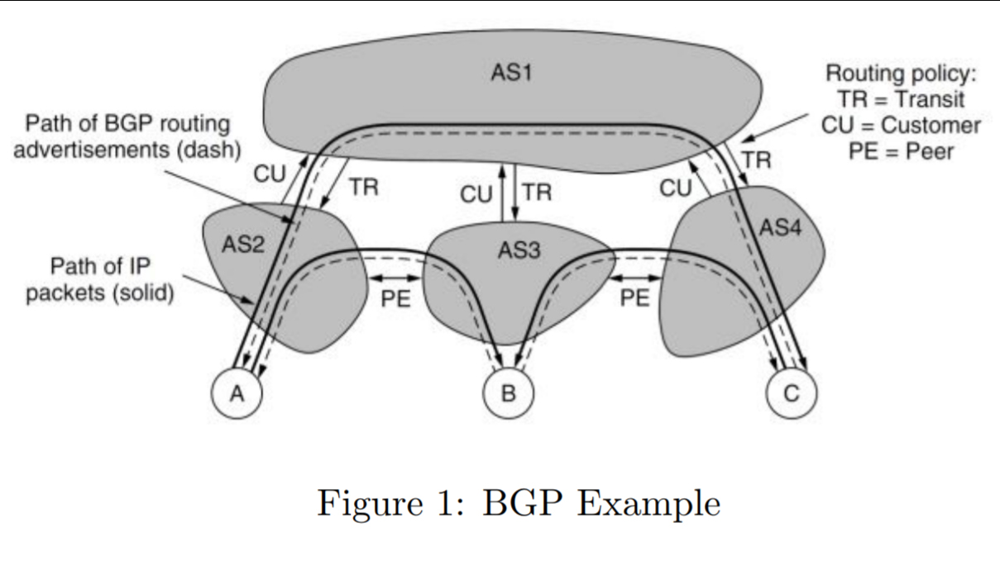

# COMP30023: Computer Systems Tutorial Week 7
### Network Layer - Subnets, NAT, Fragmentation, Routing

### 1. Suppose an ISP owns the block of addresses of the form 101.101.128.0/17. Suppose it wants to create four subnets from this block, each block having the same number of IP addresses. What are the prefixes (of form a.b.c.d/x) for the four subnets?
- The ISP owns the block 101.101.1|0000000.0
- Can't change that first host label
- If you want to create even more networks using this range, you use the next two bits from the host part to create your subnetworks
- Becomes 
		101.101.100|00000.0		// 128
		101.101.101|00000.0		// 160
		101.101.110|00000.0		// 192
		101.101.111|00000.0		// 224

		// In Prefixes

		101.101.128.0
		101.101.160.0
		101.101.192.0
		101.101.224.0
- Note if they had asked for 3 subnets, we'd waste a bunch of addresses
	- This is just a shortcoming of IPv4 and why we're running out of addresses all the time

### 2. Consider sending a 1500-byte datagram into a link that has an Maximum Transmission Unit of 500 bytes. Suppose the original datagram is stamped with the identification number 1. Assume that IPv4 is used. Hint: The IPv4 header is 20 bytes long.
##### (a) Where does fragmentation happen? Where are the fragments reassembled?
- Fragmentation: When a message is split up because it was too bad for the link to carry (network layer)
- Happens when a router A cannot send a file so they split it up
- It's either reassembled at router B or at the destination host
	- This is dependent on Fragmentation Type (whether the host sees the fragmentation)
		- Transparent
			- Router does it
		- Non-Transparent
			- Host sees it so they do it
	- lolwut shouldn't it be the other way around

##### (b) How many fragments are generated?
- 4 (have to consider the IPv4 header)
- 20 byte header
- 1500/480 -> 3.something -> 4

##### (c) In addition to the identification number, what are the fields in the generated IP datagram(s) that are related to fragmentation?
1. Frag or don't Frag?
2. More Fragments?
3. Fragment Offset

#### (d) What are the values of the fragmentation-related fields in the generated IP datagram(s)?
Fragment|Don't Frag|More Fragments|Fragment Offset
-|----------|--------------|---------------
F1|0|1|0
F2|0|1|60 // which 8-byte boundary you're at (480/8=60)
F3|0|1|120
F4|0|0|180 

### 3. John’s home network consists of his laptop, smart phone and smart speaker.
#### (a) Is it likely that each of these devices will each have unique global IP address? Explain why or why not.
- No
- We'd have run out of IP addresses a long time ago
- If we did have IPv6, then all of them would have addresses

#### (b) The network address of the home network is 192.168.1.0/24. Assign addresses to all interfaces in the home network.
- 2^24 -> 24 bits -> 8 bits for HOST
- 192.168.1.00000000
- Computer: 192.168.1.2
- Phone: 192.168.1.3
- Speaker: 192.168.1.4
- Convention to give 192.168.1.1 to the router
```
			(global address) -> (local address)
Internet -> WAN -> ROUTER -> Computer/Phone/Speaker

```

#### (c) Describe a widely used solution (as described in the lectures) which allows several devices to share the same global IP address.
- Use a port number to differentiate the three
- This is called using a NAT
- The NAT inside the router translates the port number of the user and then uses a converted version to communicate with the web server
- When the web server responds with the converted port, the NAT in the router translates it back to the original
```
Internet (80) <-> (5678) NAT in ROUTER <-> (1234) source
```

#### (d) John is a keen computer science student who is writing his own web server. Describe the key difficulty he will face when testing his server which is related to the solution you described above, and describe a workaround for the problem.
- You don't know the port of the client since it's dynamically assigned by the router
- The NAT will not know what to do since it'll keep translating the client's port
- The solution is **port forwarding** which will statically set a port for the clients to connect to
	- Usually this is done automatically by UPnP

### 4. Consider the example of BGP shown in the lectures (also given below) Figure 1: BGP Example
#### (a) What is an Autonomous Sytem? What do A, B and C represent?
- BGP -> Border Gateway Protocol 
	- Handles routing between autonomous system
	- Autonomous System = A subnetwork with the same administered organisation



#### (b) As shown in the figure, a physical path exists between AS2 and AS3, as well as between AS3 and AS4. Can a packet sent from C with destination A be sent from AS4 to AS3 to AS2? Why or why not?
- Autonomous systems are mostly belonging to one ISP
- A, B, C are hosts/customers of the system
- AS3 if it wants to send a packet to AS4 it'll send it to AS1 first
- Usually if we don't have agreements we send it to the transport autonomous system (i.e. AS1)
- Agreements between different autonomous systems if a lot of data passes through them
	- Called a peering agreement - determined by network operators
- You can't send packets from C to A with the AS4 to AS3 to AS2.
	- Anything within AS3 for example will be advertised to only go to it's customers within AS3