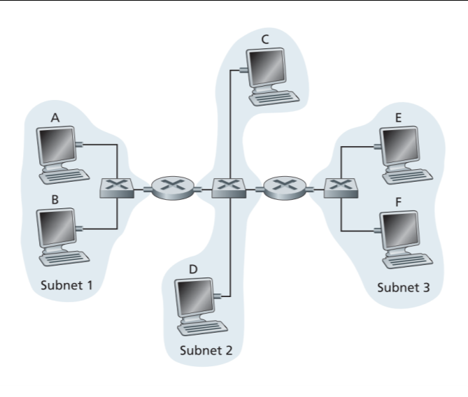
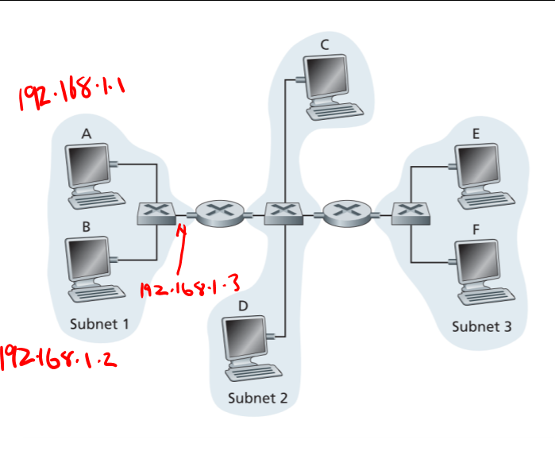

# COMP30023: Computer Systems Tutorial Week 9
### Network Layer - Data Link Layer

### 1. Why is an ARP query sent within a broadcast frame? Why is an ARP response sent within a frame with a specific destination MAC address?
- ARP = Address Resolution Protocol
	- Converts IP address to MAC address
	- If I want to send to `192.168.1.4/24` and I'm on `192.168.1.5/24` then we're on the same subnet and it won't resolve
		- ARP query - broadcast who has `192.168.1.4` and they'll respond
		- No longer have to broadcast it to everyone, `192.168.1.4` will have the MAC address of the sender so it can reply
		- Why don't we broadcast it back?
			- Network congestion
			- If you broadcast, all hosts on the network will have to process it too
- Sent in a broadcast frame so everyone can hear it
	- Don't know the MAC address of the host to send to it

### 2. Consider three LANs interconnected by two routers, as shown in the figure below.
### Figure 1: Three subnets, interconnected by routers

#### (a) Assign IP addresses to all of the interfaces. For Subnet 1 use addresses of the form 192.168.1.xxx; for Subnet 2 use addresses of the form 192.168.2.xxx; and for Subnet 3 use addresses of the form 192.168.3.xxx.
- Simply increment in the network
- Note how the interface to the router is also included in the subnet

#### (b) Assign MAC addresses to all of the adapters.
- 16 bit hexadecimal
- Just pretend these MAC addresses were made in the factory lol
- You can actually change your MAC address
- Won't check if your MAC address is valid

#### (c) Consider sending an IP datagram from Host E to Host B. Suppose all of the ARP tables are up to date. Explain the process of sending the datagram, including details of source and destination IP and MAC addresses of the datagrams sent.
- The prefix of the IP is different
- If the prefix is not the same then it'll go through a different router
- E sends it's source IP and source MAC address
- Send a packet to destination 192.168.1.3 router 2
- Ask router to do the rest
- Router 2 then extracts the data gram and determines it has to send it to Router 1
	- Source MAC of the router 2's sending interface is used and desintation MAC of router's 1 interface used
	- *IPs of E and B are still used and sent to router 1*
	- Router 1 sends it to B

#### (d) Repeat (c), now assuming that the ARP table in the sending host is empty (and the other tables are up to date).
- E knows R2 IP
- Broadcast ARP from E, then the R2 receives this and transmits back it's MAC address
- E now knows the IP and MAC address of R2
- Repeated across the whole network

### 3. Suppose you walk into a room, connect to Ethernet, and want to download a Web page. What are all the protocol steps that take place, starting from powering on your PC to getting the Web page? Assume there is nothing in our DNS or browser caches when you power on your PC. (Hint: the steps include the use of Ethernet, DHCP, ARP, DNS, TCP, and HTTP protocols.) Explicitly indicate in your steps how you obtain the IP and MAC addresses of a gateway router.
1. MAC address already configured at factory
2. IP needs to be configured -> don't know IP so we need to use DHCP to configure it
	- Broadcast DHCP discover message
	- DHCP server will respond with the DHCP offer
	- This will give the PC an IP address e.g. `192.168.3./`
	- The IP address is leased for a certain amount of time
	- DHCP also gives some other things
		- Subnet mask
		- DNS server IP
		- Gateway IP for the Router
3. Use ARP request to get MAC addresses of the DNS server and the Router
4. Type in your web page, resolver finds the web address; first check cache and then try asking the DNS server
5. Open a TCP connection to the web page server
6. Send a GET HTTP request in a TCP segment
7. Request in TCP segment in IP packet in a data frame
8. Send this to the Gateway router
9. This is eventually forwarded through the internet to the web server
10. Web server reads the response, repeats the process and sends it back using it's gateway router

### 4. You have just explained the ARP protocol to a friend. When you are all done, he says: “I’ve got it. ARP provides a service to the network layer, so it is part of the data link layer.” What do you say to him?
- Controversial statement
- Different people consider ARP to be part of different layers
- Network layer about the 2 end hosts
- Data link layer always about the physical medium
- Part of network cause it's providing translating things for you
- Part of data link since it sends requests 
- No real answer

### 5. When the IPv6 protocol is introduced, does the ARP protocol have to be changed? If so, are the changes conceptual or technical?
- Concepts would stay the same but the technical stuff isn't