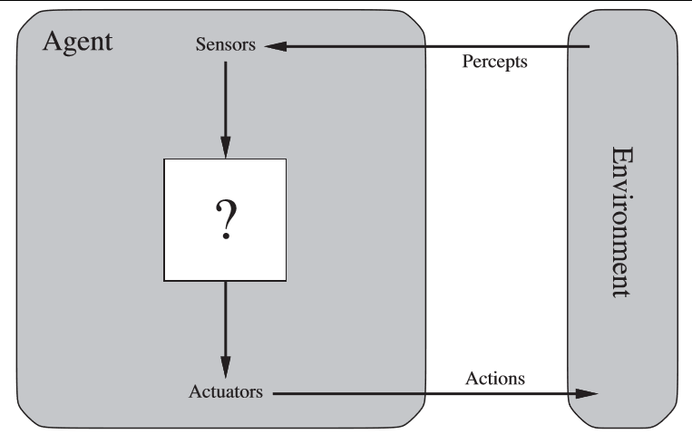
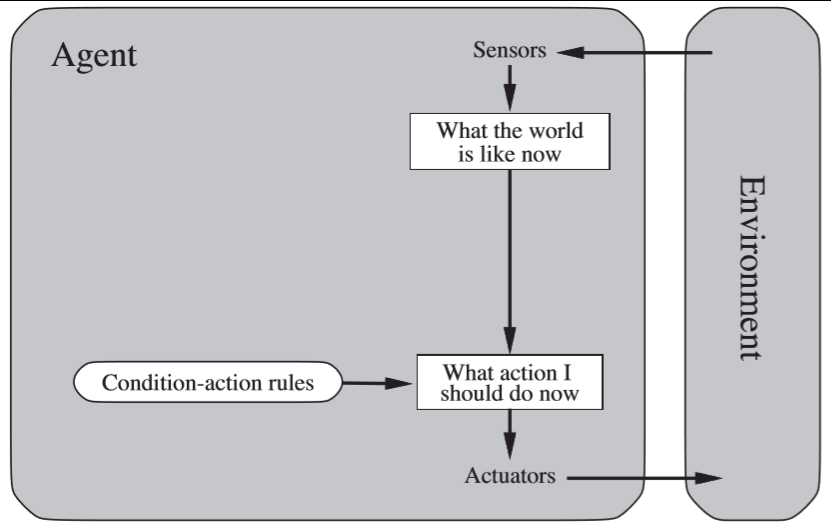
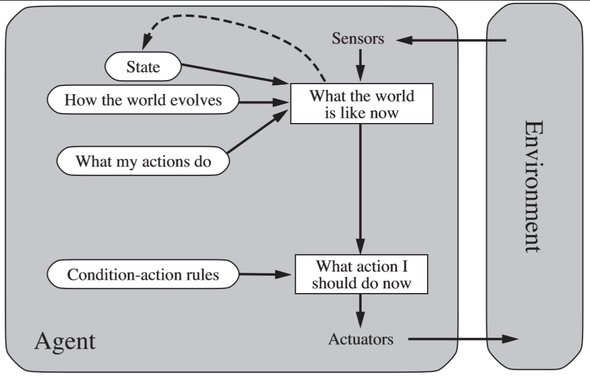
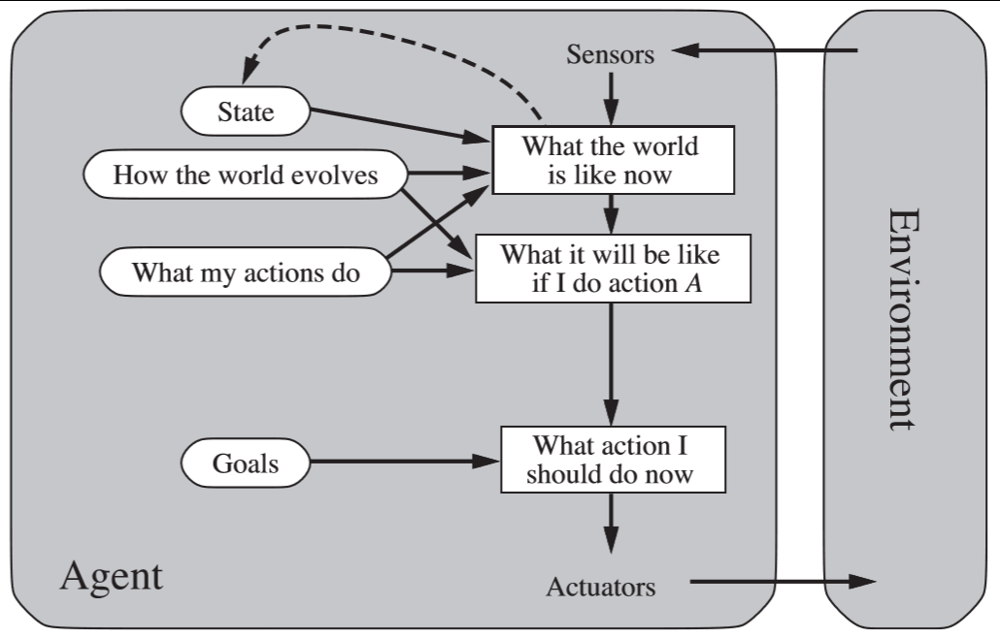
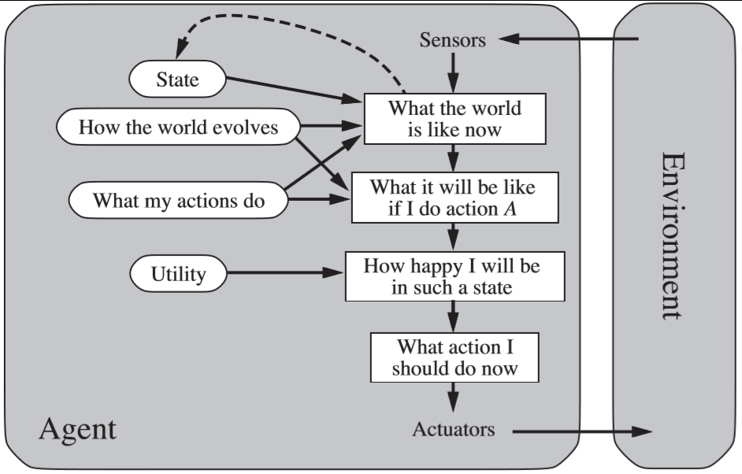

# COMP30024 Artificial Intelligence Summary Notes

### Overview
- These notes were made in *2018 Semester 1*
- Textbook:
```
Artificial Intelligence: A Modern Approach, 
by S. Russell and P. Norvig, Pearson, ISBN 9781292024202. 
Available in the ERC Library on reserve, 006.3 RUSS, or in the Co-op Bookshop.
```
Textbook website: http://aima.cs.berkeley.edu/

## The Turing Test
- A human converses with a computer via a teletype
- Aim is for the computer to *imitate a human well enough to fool someone*

## What is AI?
### The agent model:
- The *agent model charcterises requirements for an agent* in terms of what it *perceives*, how it *acts*, its *environment* and its *performance measure (how well it does something)*.
	- Takes **inputs - perceptions of the environment**
		- Sensors, keyboards, GPS
	- Does **actions** which **change the environment** done by **actuators**
		- Movement, display, speak
	- Exists in a **environment**
		- City streets, problem space, chess game
	- Results in a **performance measure - desirability of the current situation**
		- Safety of a vehicle
		- Maximizing profits
- An agent should be *rational* which means it is ***not***
	- Omniscient (*perceives everything*)
	- Clairvoyant (*can't tell the future*)
	- Successful (*doesn't win all the time* :cry:)
- All agents improve their performance through *learning*


### Types of Agents
#### Simple Reflex Agents
- Lives in the moment :smiley:
- Does actions according to *what is happening right now*
- if x do y
- Doesn't remember the past
- probably doesn't like reading books
- bad at giving directions
	- "I should turn left here"
- likes the colour red
- simple boi


#### Model Based Reflex Agents
- Takes into account how the environment works :open_mouth:
	- World is observable
	- Don't have complete information
		- Like *unimelb love letters*
			- Can't see everything
			- But we can derive things based on the letters
	- Uses *a lot of memory*
- Plans ahead a little
	- "What path should I take from here to there?"
- thinks they are an intellectual


#### Goal Based Agents
- Takes into account *what will happen if it does a certain thing* 🤔🤔🤔
	- Has a model of the *current* and *future* states of the world
	- Sees how *each possible action affects distance from goal*
- Has a *goal to achieve* instead of condition-action rules
	- "If a I take a left here what will be my remaining path?"
	- Plans ahead a lot
- loyal boi


#### Utility Based Agents
- Does the same as a goal based agent but *maximizes a happiness value* :astonished:
	- How should we prioritise our goal?
	- "If I take a left here how much time will be remaining on my path and is there a faster way?"
- insecure:tm:
- wants the best for you


### Environment Types
#### Fully Observable vs Partially Observable
- Can you **see all relevant information about an environment** :eyes:?
	- *Chess is Fully Observable* since you can *derive all the possible moves at a state*
	- *Internet Shopping is Partially Observable* since at a single state *we don't know if more people are going to add stuff in the next state* or if something will be bought

#### Deterministic vs Stochastic
- Does the **current state** of the environment **uniquely define the next state with absolute certainty with no randomness** :arrow_forward:?
	- Chess is *deterministic* since the next state has to have come from another valid state 
	- Poker is *stochastic since the next hand has some randomness*

#### Episodic vs Sequential
- Is only the **current perception of the state** relevant :clipboard::x:?
	- Chess is *sequential since you need to think of the next move*
	- Image analysis is Episodic since *the image does not change state* and it's all that is there

#### Static vs Dynamic
- Does the **environment change while we are making a decision** :clock4:?
	- Chess is *static* since the *board does not change while you're deciding your move*
	- Driving a car is *dynamic* since *time keeps moving when you're thinking*

#### Discrete vs Continuous
- Can we do **only a limited number of moves**:one::interrobang:?
	- Chess is *discrete* since you can only *do a certain number of moves*
	- Driving is *continuous* since you can do an *infinite number of "moves" in the next state*


## Problem Solving
### Restricted/Generic form of an Agent

```python
function SimpleProblemSolvingAgent(percept) returns an action
	static:	seq, an action sequence, initialised to empty
			state, current world state
			goal, initialised to null
			problem, a problem formulation
	state ← UpdateState(state, percept)
	if seq is empty then
		goal ← FormulateGoal(state)
		problem ← FormulateProblem(state, goal)
		seq ← Search(problem)
	action ← Recommendation(seq, state)
	seq ← Remainder(seq, state)
	return action
```

- Has a *main function* which *returns an output*
	- Takes an *perception*
		- Forms a *state* from this perception
		- Does an *action to this state*
		- Forms a *goal*
		- Creates a *problem to solve*
- Every other moment we *update the state*
	- If *current state is empty*:
		- **Goal** -> find goal from current state
		- **Problem** -> find problem from current goal and state
		- **Search** -> find solution to problem
	- **Action** -> solution from state and search
	- *Return this action*