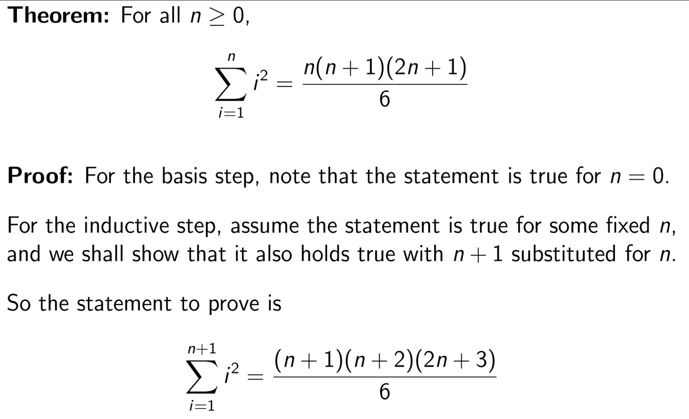
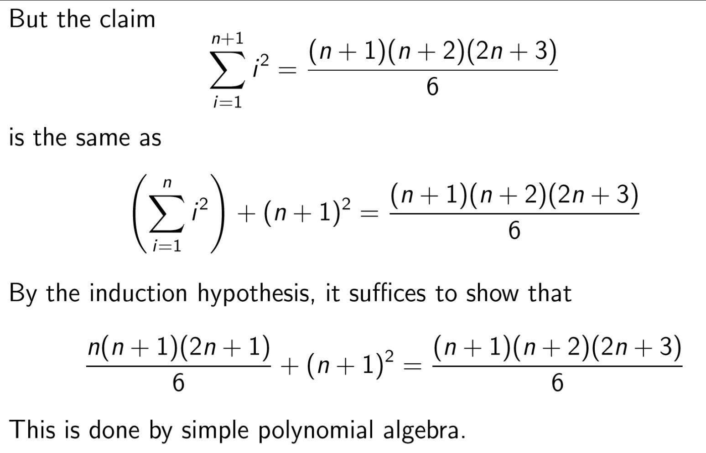
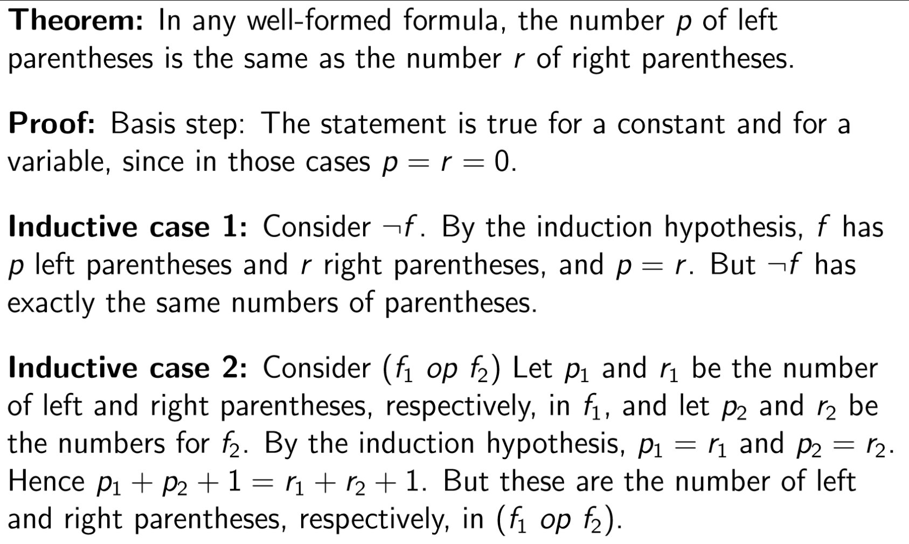

Models of Computation COMP30026 Lecture 10
==========================================

# Mathematical Proofs

## Types of Statements
- A **conjecture** is an *unproven claim*
- A **theorem** is a *claim that has been proved **true***
- A **lemma** is a statement that is of interest only because it *assists in the proof of a more significant statement*
- A **corollary** is a *simple consequence of a theorem*
- A **proposition** is a *more technical theorem, perhaps of less significance*

## Types of Proof

### Proof by Construction
- Produces a *witness*
	- Prove a claim of the form "There Exists..."
	- Refute a claim of the form "For all..."

### Proof by Contradiction
- Assume a claim to be false, and then prove that it's absurd if it's false

#### Proof by Contradiction Example
- **Theorem**: `√2 is irrational`
- **Proof**: 
	- Suppose √2 is rational 
	- Then `√2 = m/n` for some integers `m` and `n`, `n ̸= 0`
	- We can assume without loss of generality that at least one of `m` and `n` is odd
	- Multiplying both sides by `n` and then squaring we get:
		- `2n² = m²`
	- Hence `m²` and therefore `m` is even, so we can write `m = 2k` for some integer `k`:
		- `2n² = 4k²`
	- But then
		- `n² = 2k²`
	- so `n` is *also even*: i.e. A **contradiction**, so `√2 is irational`

### Proof by Induction
- Show that some set of objects all have some property 

#### Mathematical Induction
- Mathematical Induction is *always a proof about the natural numbers,* N.
- We're usually given a statement "for all n, S(n)"
- Usually a mathematical induction is done *in two steps*:
	1. In the **basis step**, we show `S(0)`
	2. In the **inductive step**, we take `S(n)` as the **induction hypothesis** and use it to establish `S(n+1)`
- This is basically that thing you learnt in calc 2

##### Proof by Induction Example 1

#### More General Induction
- Sometimes more base cases are needed (so we can establish several statements for `S(n+1)`)

##### Proof by Induction Example 2
- **Theorem** for all n>=8 can be written as a sum of 3s and 5s
- **Proof**: for the basis step, observe that `S(8)`, `S(9)` and `S(10)` are all `true`
	- Inductive Step:
		- Assume that `n >= 10` and `S(8),...S(n)` are `true`. 
		- Since `S(n-2)` is `true`, `n + 1` can be written as a sum of 3s and 5s - just add 3 to the sum we had for `n - 1`.
		- Hence we have established `S(n + 1)`
		- We conclude that `S(n)` holds for all `n >= 8`

#### Recursive Structure and Induction
- Some objects are recursively defined, like lists and trees
- We can assert things about these objects with **structural induction**

##### Structural Induction Example

### Refutation Example
- **Conjecture**: `For all prime numbers p > 5, 2ᵖ-1 is not prime`
- **Refutation**: Take `p = 31` and verify that `2³¹-1 = 2147483647` is a prime

### Non-Constructive Proofs
- This one's a bit strange; it's proofs of things that aren't exactly quantifiable, but you can assert it's true
- **Theorem**: There are `irrational numbers m and n such that mⁿ is rational`
- **Proof**: We know that √2 is irrational. What about √2^√2?
- *Case 1:* √2^√2 is rational, and we have proved the assertion correct, taking p = q = √2
- *Case 2:* √2^√2 is irreational, so we call it `m` and let `n` be √2. Then mⁿ = 2, which is rational, and again the assertion is correct.
- In either case, the assertion is correct

## Converse and Contrapositive
- Consider the statement "B follows from A"
- The statement "A follows from B" is its *converse*
- Sometimes we can prove "B follows from A" by proving "not-A follows from not-B" (it's *contrapositive*)
- "B follows from A" and "not-A follows from not-B" are logically equivalent

## Writing Proofs
- Write in clear english
- Be neat
- Be consistent
- Use *signposting* - words like "therefore", "it follows", "suppose"

### Proof Strategy
- This is *not examinable*
- For each connective, there are rules for how to introduce it and how to eliminate it
- Start by rephrasing the problem:
	- **Given**:...
	- **To be proved**:...
	- **Proof**:...
- Concentrate primarily on the proof goal, not the given
- You should approach different proofs (implication, biimplication, predicate logic) in different ways, but that's not examinable so I won't write about it

## Intuitionistic Logic
- The *non-constructive proof* we just mentioned didn't actually produce two irrational numbers `m` and `n`
- The school of *intuitionism* insists that such a proof is inadmissible
- Proof of "A or B" must indicate *which* of A and B was proved
- Intuitionists do not accept proof by contradiction in general