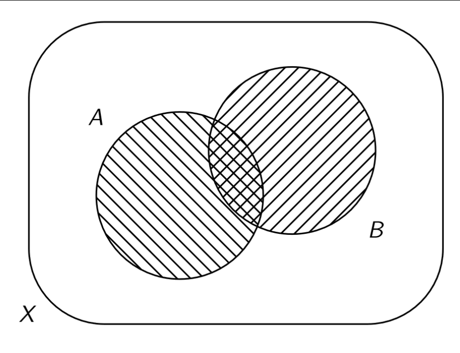
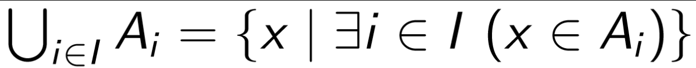
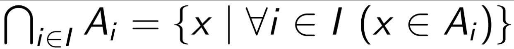
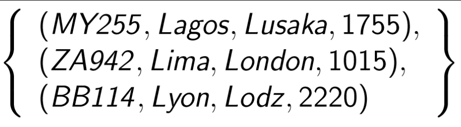

Models of Computation COMP30026 Lecture 11
==========================================

# Sets
## Set Theory
- A set is a *collection into a whole of definite, distinct objects of our intuition or of our thought*. The objects are called the elements (members) of the set.
- **Notation**: We write `a ∈ A` to express that `a` is a *member* of set `A`
	- e.g. 1 ∈ {1, 2, 3}
- **Principle of Extensionality**:
	- For all sets `A` and `B` we have:

> `A = B ⟹ ∀x (x ∈ A ⇔ x ∈ B)` (i.e. two sets are equal when two sets have the same members)

## Set Notation
- Small sets can be specified with curly braces: `{1, 2, 3}`
- We often write an empty set as ̸O
- Order and repetition are irrelevant in sets

### Set Abstraction
- You can use an *abstraction* to describe a large set when you don't want to write it all out
- If P is a property of all the objects in the set, then you can describe the set with an abstraction:

> `{x | P(x)}`

### Set Notation in Haskell
- Haskell's list notation is really similar to set notation

Haskell|Set Notation
---|---
`[]`|{}
`[1, 2, 3]`|{1, 2, 3}
`[n \| n <- nats, even n]`|{n ∈ N \| even(n)}
`[f n \| n <- nats]`|{f(n) \| n ∈ N}
`[1, 3..]`|{1, 3, ...}

## Well-Foundedness
- Set abstraction can get really weird
- e.g. There are sets for which `E = {x | E(x)}` does *not hold*
- Call a set `S` **well founded** if there is no infinite sequence S = S₀ ∈ S₁... etc.

## The Subset Relation
- `A` is a *subset* of `B` `iff ∀x(x ∈ A ⟹ x ∈ B)`
- We write this as `A ⊆ B`
- If `A ⊆ B` and `A ̸= B` we say that `A` is a *proper subset* of `B` and we write this `A ⊂ B`
- Do not confuse `⊆` with `∈`
	- We have `{1} ⊆ {1, 2}`, but `{1} ∉ {1, 2}`

### Subset Relation Partial Ordering
- For all sets `A`, `B` and `C`, we have
	- `A ⊆ A` (reflexivity)
	- `A ⊆ B ∧ B ⊆ A ⟹ A = B` (antisymmetry)
	- `A ⊆ B ∧ B ⊆ C ⟹ A ⊆ C` (transivity)
- These laws together state that ⊆ is a *partial ordering*

## Special Sets
- The empty set satisfies `̸0 ⊆ A` for every set `A`
	- You can always take out an empty set from any set
- A set with just a single element is a *singleton*
	- For example, `{{1, 2}}` is a singleton
- The set `{a}` should not be confused with `a`
- A set with two elements is a *pair*
- Ordinarily, and in programming languages, we refer to (1, 2) as a pair, but in set theory we would call that an *ordered pair*

## Set Algebra
- Let A and B be sets
	- `A ∩ B = {x | x ∈ A ∧ x ∈ B}` is the **intersection** of A and B
	- `A ∪ B = {x | x ∈ A ∨ x ∈ B}` is their **union**
	- `A \ B = {x | x ∈ A ∧ x ∈ B}` is their **difference**
	- `A ⊕ B = (A \ B) ∪ (B \ A)` is their **symmetric difference**
- In the presence of a set X of which all sets are considered subsets, we also define:
	- `Aᶜ = X \ A` is the **complement** of A

### Venn Diagrams

## Set Laws
- **Absorption**: 
	- A ∩ A = A 
	- A ∪ A = A
- **Commutativity**: 
	- A ∩ B = B ∩ A 
	- A ∪ B = B ∪ A
- **Associativity**: 
	- A ∩ (B ∩ C) = (A ∩ B) ∩ C 
	- A ∪ (B ∪ C) = (A ∪ B) ∪ C
- **Distributivity**: 
	- A ∩ (B ∪ C) = (A ∩ B) ∪ (A ∩ C) 
	- A ∪ (B ∩ C) = (A ∪ B) ∩ (A ∪ C)
- **Double complement**: 
	- A = (Aᶜ)ᶜ
- **De Morgan**: 
	- (A ∩ B)ᶜ = Aᶜ ∪ Bᶜ 
	- (A ∪ B)ᶜ = Aᶜ ∩ Bᶜ
- **Duality**: 
	- Xᶜ = ∅ and ∅ᶜ = X
- **Identity**: 
	- A ∪ ∅ = A and A ∩ X = A
- **Dominance**: 
	- A ∩ ∅ = ∅ and A ∪ X = X
- **Complementation**: 
	- A ∩ Aᶜ = ∅ and A ∪ Aᶜ = X
- **Subset characterisation**: 
	- A ⊆ B ≡ A = A ∩ B ≡ B = A ∪ B
- **Contraposition**: 
	- Ac ⊆ Bc ≡ B ⊆ A 
	- A ⊆ Bc ≡ B ⊆ Ac 
	- Ac ⊆ B ≡ Bc ⊆ A

## Powersets
- The powerset `P(X)` of the set `X` is the set `{A | A ⊆ X}` of all subsets of `X`
- In particular `̸0` and `X` are elements of `P(X)`
- If `x` is finite (with cardinality `n`) then `P(X)` is of cardinality `2ⁿ`

## Generalised Union and Intersection
- Suppose we have a collection of sets `Aᵢ`, one for each `i` in some index set `I`.
	- e.g. `I` may be `{1..99}`, or `I` may be infinite
- The union of the collection is 
- The intersection of the sets is  

## Ordered Pairs Set Example
- You can define ordered pairs by using certain set notation
- If we want ordered pairs `(a, b)`, then:
	- `(a, b) = (c, d) ⇔ a = c ∧ b = d`
- We can achieve this by defining
	- `(a, b) = {{a}, {a, b}}`
- And hey, look at that, we just made ordered pairs in set notation

## Cartesian Products and Tuples
- The **Cartesian product** of A and B is defined as:
	- `A x B = {(a, b) | a ∈ A ∧ b ∈ B}`
- We define the set `Aⁿ` of **n-tuples** over A as follows:
	- `A⁰ = {̸0}`
	- `Aⁿ⁺¹ = A x Aⁿ`
- To simplify things, we write things without the inner brackets:
	- `(a, b, c)` instead of `(a, (b, (c, ̸0)))`
- This is also commonly referred to as cross product

### Some Cartesian Product Laws
- `(A × B) ∩ (C × D) = (A × D) ∩ (C × B)`
- `(A ∩ B) × C = (A × C) ∩ (B × C)` 
- `(A ∪ B) × C = (A × C) ∪ (B × C)` 
- `(A ∩ B) × (C ∩ D) = (A × C) ∩ (B × D)` 
- `(A ∪ B) × (C ∪ D) = (A × C) ∪ (A × D) ∪ (B × C) ∪ (B × D)`

## Relations
- An *n*-ary relation is a **set of *n*-tuples**
- 
- That is, the relation is a *subset of some cartesian product*
	- `A₁ x A₂ x ... x Aₙ`