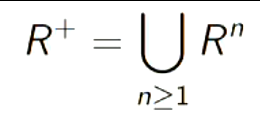
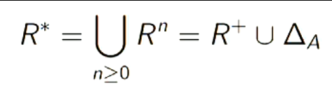

Models of Computation COMP30026 Lecture 12
==========================================

# Binary Relations
- A binary relation is a set of pairs, or 2-tuples
- "Being unifiable", "<", "⊆", "divides" are all binary relations
- For small relations we can tabulate:

Beats|Paper|Scissors|Rock
---|---|---|---
Paper|0|0|1
Scissors|1|0|0
Rock|0|1|0

- You can *express membership* of a relation in many ways:
	- (x, y) ∈ Beats
	- Beats(x, y)
	- x Beats y

## Domain and Range of a Relation
- The domain of `R` is `dom(R) = {x | ∃y R(x, y)}`
	- Basically the space in which R exists
- The range of `R` is `ran(R) = {y | ∃x R(x, y)}`
- We say that `R` is a relation *from A to B* if `dom(R) ⊆ A` and `ran(R) ⊆ B`
	- as in, if R's domain is a subset of A and R's range is the subset of B, then R is a relation between A and B
- "Being unifiable" is a relation on *Term*
- "<" is a relation on integers
- "⊆" is a relation on `P(A)`
- e.g. "*Acted in*" is a *relation between* *actors* and *films*

## Identity and Inverse
- `A x B` is a relation - the `full relation from A to B`
- ̸0 is a relation
- `∆A = {(x,x) | x ∈ A}` is a relation on A
	- called the **identity relation**
- If `R` is a relation from `A to B` then `R⁻¹ = {(b, a) | (a, b) ∈ R}` is a relation from `B to A`, called the *inverse* of `R`
	- This also means `(R⁻¹)⁻¹ = R`

## Properties of Relations
- Let A be a non-empty set and let R be a relation on A
	- `R` is **reflexive** iff `R(x,x)` for all `x` in `A`
	- `R` is **irreflexive** iff `R(x,x)` holds for no `x` in `A`
	- `R` is **symmetric** iff `R(x,y) ⇒ R(y,x)` for all `x,y` in `A`
	- `R` is **asymmetric** iff `R(x,y) ⇒ ¬R(y,x)` for all `x,y` in `A`
	- `R` is **antisymmetric** iff `R(x,y) ∧ R(y,x) ⇒ x = y` for all `x,y` in `A`
		- i.e. only symmetrical when they're the same
	- `R` is **transitive** iff `R(x,y)∧ R(y,z) ⇒ R(x,z)` for all `x,y,z` in `A`

## Reflexive, Symmetric, Transitive Closures
- The full relation is transitive
- Transitive relations are *closed under instersection*, that is, *if R₁ and R₂ are transative* then *so is `R₁ ∩ R₂`*
- From this we derive a property:
	- *For any binary relation `R`, there is a **unique smallest transitive relation `R⁺`** which includes `R`*
	- We call this `R⁺` the **transitive closure** of `R`
- Similarly we have the *unique reflexive closure* and the *symmetric closure of R*

## Composing Relations
- The *composition* is defined by:
	- `(x, z) ∈ (R₁ O R₂) iff ∃y(R₁(x, y) ∧ R₂(y, z))`
- The n-fold composition Rⁿ is defined by:
	- R¹ = R
	- Rⁿ⁺¹ = Rⁿ O R

### Composition Example
- if `R` is `{(0,2), (0,3), (1,0), (1,3), (2,0), (2,3)}`, what is `R²`?

x|0|1|2|3
-|-|-|-|-
0| | |.|.
1|.| | |.
2|.| | |.
3| | | | 

Composition with itself:

x|0|1|2|3
-|-|-|-|-
0|.| | |.
1| | |.|.
2| | |.|.
3| | | | 

Composition with R²

x|0|1|2|3
-|-|-|-|-
0| | |.|.
1|.| | |.
2|.| | |.
3| | | | 

## Transitive Closure
- The transitive closure of R can be defined in terms of union and composition:
	- 
- The reflexitive, transitive closure is:
	- 

## Equivalence Relations
- A binary relation which is *reflexitive, symmetric and transitive* is an **equivalence relation**
- The identity relation ∆A is the smallest equivalence relation on a set A
	- The full relation A² is the largest equivalence relation on A

### Equivalence Relations Examples
- Which of these binary relations are *equivalence relations*?
	- `≤ on Z`?
		- Not symmetric, therefore not equivalence relation
	- `≡ₘ on Z`, where `a ≡ₘ b` iff `a mod m = b mod m`?
		- This is transitive, symmetrical and reflexitive, therefore it is
	- "are unifiable" on the set of terms (over some alphabet)?
		- Reflexive
			- Term is unifiable with itself
		- Transitive
			- `f(a)` unifiable with `f(b)`? No.
		- Therefore not transitive therefore it is not an equivalence relation
	- `{(a, b) ||a-b| ≤ 3}`?
		- Not transitive, therefore it is not an equivalence relation (where a = 5, b = 9)
	- "are compatriots" on the set of all people?
		- Yes this is an equivelence relation
	- "are logically equivalent" on the set of propositional formulas?
		- Yes

## Partial Orders
- R is a *preorder* iff R is *transitive* and *reflexive*
- R is a *strict partial order* iff R is *transitive* and *irreflexive*
- R is a **partial order** iff R is an **antisymmetric preorder**
- R is *linear* iff `R(x, y) ∨ R(y, x) ∨ x = y for all x, y in A`
- A *linear partial order* is also called a *total order*
- In a *total order, every two elements from A are comparable*

### Partial Orders Example
- Which of these are binary relations are partial orders?
	- The relation ≤ on N?
		- This is a **total order** and therefore also a *partial order*
	- The relation ⊆ on P(N)?
		- Yes
	- The relation "divides" on N?
		- Yes

## Functions
- **Mathematically**: A function f is a binary relation with a special property: `(x, y) ∈ f ∧ (x, z) ∈ f ⟹ y = z`
	- We write f(x) = y
	- Takes an input and returns an output
- **Computationally**: An algorithm for how to calculate output values from input values
- Note that *function as a relation* (mathematical) may be *infinite*, but we assume that an *"algorithm"* is *finite*

### Mathematical Functions vs Computational Functions
- In Haskell, we can say:
```Haskell
f0 n = n^2 + n
f1 n = n * (n+1)
f2 n = if n == 0 then 0 else 2*n + f2 (n-1)
```
- All of these give calculations for the mathematical function:
	- `{(0,0),(1,2),(2,6),(3,12),...} = {(n, n² + n) | n ∈ N}`
- Note there is no Haskell type corresponding to N, and therefore the functions are not the same when applied to negative integers

#### Recurrences vs Closed Forms
- The definition of `f2` in the example before is a *recurrence* formula (since we're defining f2 in itself)
- The definition of `f1` does not depend on `f1` itself. This is called a *closed form* definition.
- Closed form is preferred since it's easier to read.

## Domains and Co-domains
- We say that the function f is *from X to Y*, or
	- `f : X → Y`
- if `dom(f) = X` and `ran(f) ⊆ Y` then Y is the *co-domain* of f


