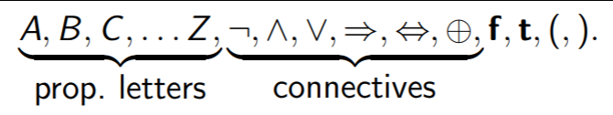
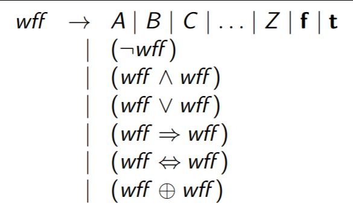
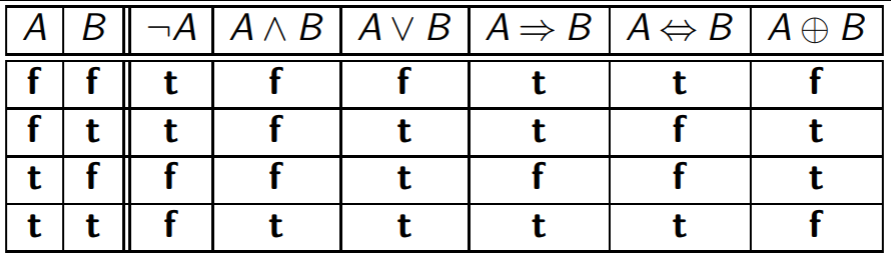
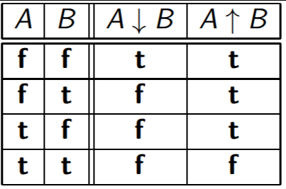
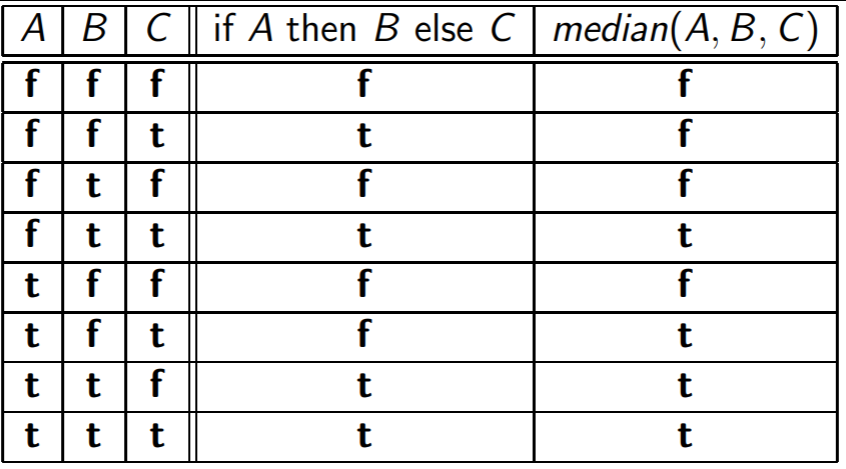

Models of Computation COMP30026 Lecture 3
=========================================

# Prepositional Logic
*Intro Puzzle*
```
Huey, Dewey and Louie are being questioned by their uncle. Here is
what they say:
Huey: “Dewey and Louie had equal share in it; if one is
guilty, so is the other.”
Dewey: “If Huey is guilty, then so am I.”
Louie: “Dewey and I are not both guilty.”

Their uncle, knowing that they are cub scouts, realises that they
cannot tell a lie.
Has he got sufficient information to decide who (if any) are guilty?
```

**To solve this, we break it up:**
- Huey's Statement:
	- "H" : D ⇔ L `(Dewey is true if and only if Louie is true)`
- Dewey's Statement:
	- "D" : H ⇒ D
- Louie's Statement:
	- "L" : ¬(D ∧ L)

**Then we can create a truth table:**

H|D|L|"H"|"D"|"L"|∧
---|---|---|---|---|---|---
0|0|0|1|1|1|1
0|0|1|0|1|1|0
0|1|0|0|1|1|0
0|1|1|1|1|0|0
1|0|0|1|0|1|0
1|0|1|0|0|1|0
1|1|0|0|1|1|0
1|1|1|1|1|0|0

### Propositional Logic: Syntax
- So usually creating a truth table for everything can get a bit weird
- We can instead build propositional *formulas* from this *set of symbols*
	- 
	- **Definitions for these weird bois:**
		- `⇒` - If true then the other thing is true (implication, only works one way)
		- `⇔` - If and only if (means the connective goes both ways - if something is fulfilled by B then it's fulfilled by A and vice versa)
		- `⊕` - Exclusive OR (XOR)
- Well-formed formulas (wffs) are generated by the grammar
	- 
	- This is kind of like the data structures in Haskell how it can be `This | That` - either "this" or "that"

#### Propositional Logic: Notational Conveniences
- We can drop outermost parentheses
- We can assume that ¬ binds tighter than ∧ and ∨
	- This is similar to operator precedence (BODMAS)
	- Imply has lower precedence
- These bind tighter than ⊕, which binds tighter than ⇒ and ⇔
- negate > disjunct = conjunct > xor > imply > biimply
- With these conveniences we can write:
	- `((P ∧ (¬Q)) ⇒ (P ∨ (P ⇔ Q)))`
	- as
	- `P ∧ ¬Q ⇒ P ∨ (P ⇔ Q)`
- Other notes:
	- We can write "t" as 1 and "f" as 0
	- Also the arrows don't have to be double-lined

### Propositional Logic: Semantics
- A proposition is *false (**f**) or true (**t**)*
- A *truth assignment* maps each propositional letter to **t** or **f**
- We can give the semantics of the connectives via *truth tables*
	- 
- This gives meaning to all prepositional formulas, as we let A and B stand for the values of arbitrary positions

#### Propositional Logic in Haskell
- Haskell has a type Bool
- A boolean is defined in Haskell as the following:
```Haskell
data Bool = False | True

not :: Bool -> Bool
not True = False
not False = True

(&&) :: Bool -> Bool -> Bool
False && _ = False
True && x = x

(||) : Bool -> Bool -> Bool
False || x = x
True || _ = True

-- Here are some more connectives in Haskell
infix 1 ==>
infix 1 <=>
infix 2 <+>

-- Implication
(==>) :: Bool -> Bool -> Bool
False ==> _ = True
True ==> x = x

-- IFF
(<=>) :: Bool -> Bool -> Bool
x <=> y = x == y

-- XOR
(<+>) :: Bool -> Bool -> Bool
x <+> y = x /= y
```

##### Conjunction and Disjunction
- P∧Q is the *conjunction* of P and Q
- P∨Q is their *disjunction*

An "or" in English sometimes translates to *disjunction*:
- `"I'll eat if there is peanut butter or jam in the fridge."`

Other times it translates to *exclusive or*:
- `"Would you like the fish or the chicken?"`

##### Implication
- The proposition `P ⇒ Q` is best read `"if P then Q"` (or sometimes `"P only if Q"` or `"Q whenever P"`). e.g.:
	- *wtf is this example they gave use this one instead*:
		- If it's raining, then the floor is wet
		- If the floor is wet it *doesn't mean it's raining*, since the floor can become wet from something else
		- Note how the implication works in *one direction only*
- Note that `A -> B` has the *same truth table as* `¬A∨B`

##### Quiz
```
Which of these claims hold?
1 P ⇒ Q has the same truth table as ¬Q ⇒ ¬P
2 (P ⇒ Q) ∧ (P ⇒ R) has the same truth table as P ⇒ (Q ∧ R)
3 (P ⇒ R) ∧ (Q ⇒ R) has the same truth table as (P ∧ Q) ⇒ R
```

**Answer to 1:**

P|Q|P ⇒ Q|¬Q ⇒ ¬P
---|---|---|---
0|0|1|1
0|1|1|1
1|0|0|0
1|1|1|1

**Answer to 2:**
Logically equivalent

**Answer to 3:**
Doesn't work in specific cases

### Other Binary Connectives
- We also have `"NAND"` and `"NOR"`
- Defined by ↓, as `"NOR"` and ↑ as `"NAND"`.


### Ternary Connectives
- You can also connect things with more than 2 values
- 

### Boolean in Programming Languages
- Operators in languages are usually not commutative
- `0 == 1 && 1/0 == 42` has a behaviour that's different from `1/0 == 42 && 0 == 1`
	- Haskell is really lazy; it only evaluates until the latest possible moment
