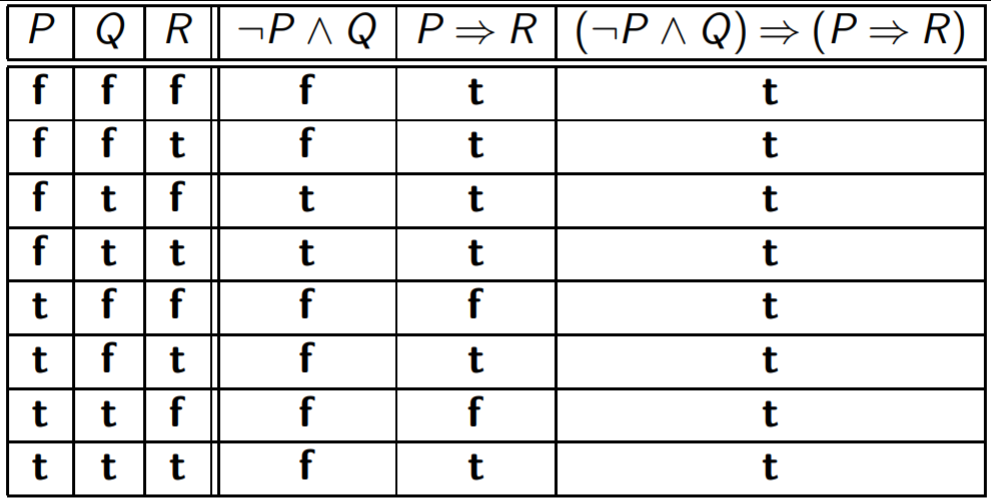
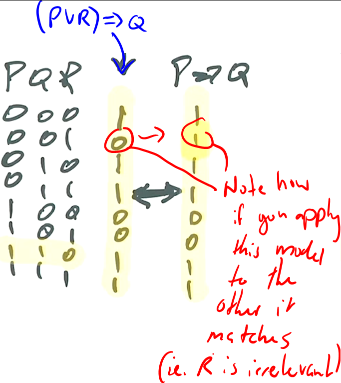
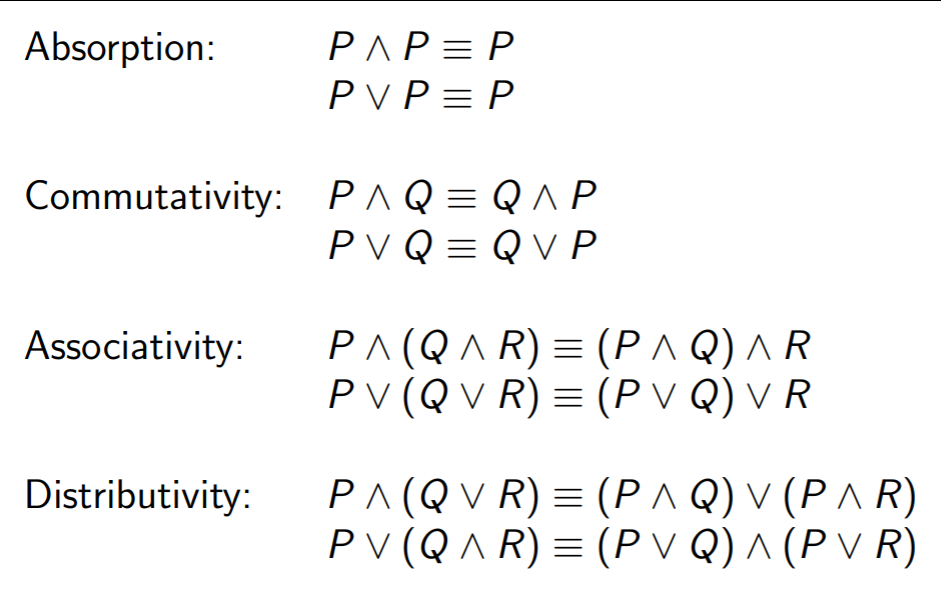
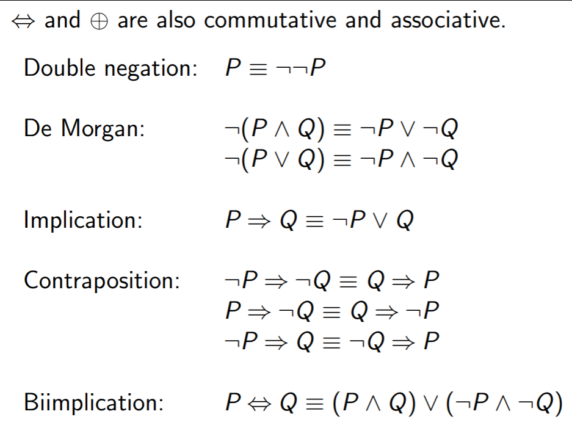
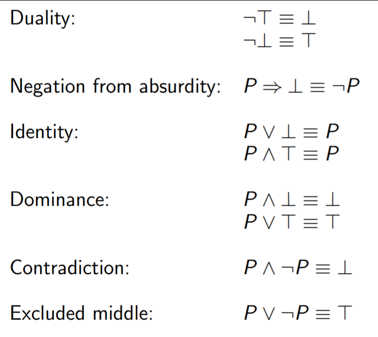

Models of Computation COMP30026 Lecture 4
=========================================

*Quiz*
```
On the island of Knights and Knaves, everyone is a knight or knave.
Knights always tell the truth. Knaves always lie.
On the 1st of August there is a census on the island!
You are a census taker, going from house to house. Fill in what you
know about each of these three houses.
In house 1: Husband: We are both knaves.
In house 2: Wife: At least one of us is a knave.
In house 3: Husband: If I am a knight then so is my wife
```
**Solution:**
```
H : Husband is a knight

Don't know if Husband is a Knave or a Knight

If he's a knave: 	¬H ∧ ¬(H -> W)
If he's a knight:	H ∧ (H -> W)

You can take the disjunction of these two statements:

(¬H ∧ ¬(H -> W)) ∨ H ∧ (H -> W)

This results in:

H ∧ (¬H ∨ W)

This is the same as saying (by negating above's first term to ¬H ∧ H ∧ ¬W = 0):

0 ∧ (H ∨ W)
```
<hr></hr>

> "Logic is the calculus of computation."
>
> -- <cite>Zohar Manna</cite>

<hr></hr>

### Validity and Satisfiability
- A propositional forumla is ***valid*** if *no truth assignment makes it false*. Otherwise it is *non-valid*. 
- It is ***unsatisfiable*** if no truth assignment makes it true. Otherwise it is *satisfiable*.
- A valid propositional formula is a *tautology*
- An unsatisfiable propositional formula is a *contradiction*

#### Tautology Example
- Assuming (¬P∧Q) -> (P -> R) is valid:
- Notice how it's *always true no matter the assignment*


#### More on Validity
- A valid statement in logic is *void of information*
- For example, `A -> A` is a empty statement, but still valid
- "If Trump is sane then Trump is sane" tells us nothing about *whether Trump is sane* - the statement is true in either case (i.e. if he's insane)
- You don't even have to know who Trump is, or what it means to be sane in order to agree with the statement: the statement is *inherently true*.

#### Validity Checking in Haskell
- Given a truth table for a proposition P, it is easy to check if P is valid: The conjunction of all the entries in P's column must be true.
- To check the validity of 3-place Haskell predicate:
```Haskell
valid3 :: (Bool -> Bool -> Bool -> Bool) -> Bool
valid3 f = and [f p q r | p <- b, q <- b, r <- b]
	where b = [False, True]

-- To check for satisfiability, then replace 'and' with 'or'
```

### Contradiction Example
- `P ∧ Q ∧ (¬Q ⇔ (¬P ∨ Q))` is *unsatisfiable*.
- In this was, P and Q must both be true in order to solve `P ∧ Q`, so assign both P and Q as **t**.
- This results in `¬t ⇔ (¬t ∨ t))`, which evaluates to **f**.
- No matter *what you assign*, it's *always false* :cry:.

### Substitution Preserves Validity + Unsatisfiability
- Validity is preserved by *substitution* of propositional letters by formulas
- We saw that `(¬P ∧ Q) ⇒ (P ⇒ R)` is valid, and hence the following is valid if we replace `P` with `(A ∨ B)` and `Q` with `(B ⇔ C)`:

> `¬(A ∨ B) ∧ (B ⇔ C)) ⇒ ((A ∨ B) ⇒ (B ⇔ C))`

- Substitution *does not* preserve *satisfiability*
- `P` is clearly satisfiable. But if we substitute `P` with `Q ∧ ¬Q`, then we can never make this true.
- The fact that `P` can be true does *not mean we cannot make it false*

### Models, Logical Consequence and Equivalence
- Let θ be a *truth assignment* and ϕ be a propositional formula.
	- If θ makes ϕ true then θ is a *model* of ϕ
- ψ is a *logical consequence* of ϕ iff every model of ϕ is a model of ψ as well.
	- In this case we write `ϕ |= ψ` (similar to implication)
- If `ϕ |= ψ` and `ψ |= ϕ` both hold, that is, ϕ and ψ have *exactly the same model*, then ϕ and ψ are *logically equivalent*
- In this case, we write `ϕ ≡ ψ` 
	- Equivalence preserves in **in both directions**

**Quiz**
- Of the following statements, which allow us to conclude `P ⇒ Q`?
1. `P`
	- P |= P -> Q? No.
2. `¬P`
	- Yes. Look at the truth table: Q will always be True
3. `Q`
	- Yes. 	
4. `P ⇒ (Q ∧ R)`
	-  Yes. This promises even more than the original statement.
5. `(P ∨ R) ⇒ Q`
	- Yes. You can prove this by *applying any model of this formula* to `P ⇒ Q`.
	- 
6. `¬P ∨ Q`
	- Yes
	- [Note that `A -> B` has the *same truth table as* `¬A ∨ B`](lec3.md#implication)
7. `¬Q ⇒ ¬P`
	- Yes
	- This rule is called [contraposition](https://en.wikipedia.org/wiki/Contraposition)
8. `P ⇒ (Q ∨ R)`
	- No
	- Can't tell for certain that Q is True
9. `(P ⇒ Q) ∨ R`
	- No
- Note that 6-9 work *in the other direction*.

### More on Equivalence
- Substituting a value in two models preserves logical equivalence
	- e.g. If `Φ ≡ Ψ` and `Φ′ and Ψ′` are the results of replacing each occurrence of letter `P` (in both) with formula `Υ`, then `Φ′ ≡ Ψ′`
- **Interchange of Equivalents**
	- This is different to substitution
	- If you have `ϕ as a sub-formula of Y`
	- and two models equivalent `ϕ ≡ ψ`
	- You can get Y' by substituting ϕ in Y for ψ 
	- And this also means Y ≡ Y'
	- This preserves *literally everything* between ϕ and ψ
- Here are *more examples of equivalence*:
	- 
	- 

### Last Equivalences
- Let `⊥` be any unsatisfiable formula let `⊤` be any valid formula
- Can think of `⊥` as a "always false" formula
- Can think of `⊤` as a "always true" formula
- 

