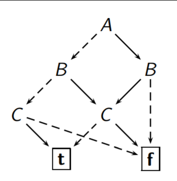
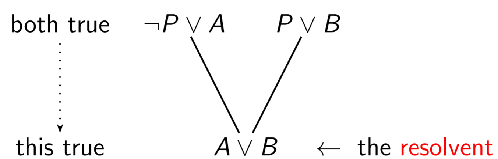
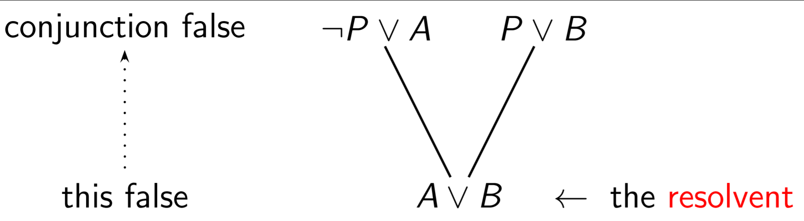
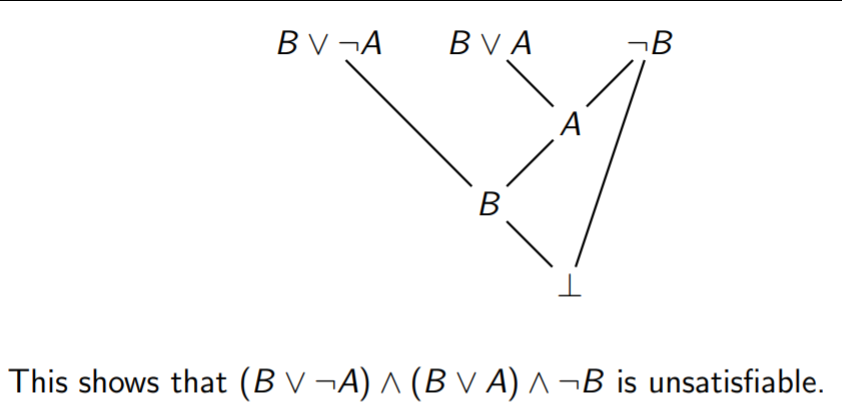
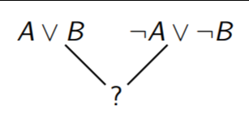

Models of Computation COMP30026 Lecture 5
=========================================

> We must not think that computation ... has place only in numbers.
>
> -- <cite> T. Hobbes (1655) </cite>

# Mechanising Deduction
- Math is a lot like mechanically just applying formulas

### Propositional Logic is Decidable
- Generating a *truth table* is using brute force
- Unfortunately, truth tables may grow exponentially in size
- Formulas are a way of defining this in a *finite way*

##### Faster Satisfiability/Validity Checking?
- Are there faster decision procedures for propositional logic?
	- It depends on how we choose to write the formulas.
		- Two different forms
- What if we don't want to commit to any particular form?
	- Then satisfiability is *NP-complete* and validity is *Co-NP-complete*
- These are terms from *complexity theory*
- The satisfiability problem; *SAT* has been the *"mother of all NP-complete problems"*

##### SAT and Complexity Theory
- A lot of important problems in logistics have been shown to be *tractable if and only if the SAT problem is*
- Solving this will solve a shitton of things
- Since it's taken so long, most computer scientists conclude that it's unlikely that there are decision procedures for SAT that perform much better than brute force

### Normal Forms for Propositional Logic
- A *literal* is `P` or `¬P` where `P` is a propositional letter
- A formula is in **conjunctive normal form (CNF)** if it is a *conjunction of disjunctions of literals* (a conjunction of "*clauses*")

> `(A ∨ ¬B) ∧ (B ∨ C ∨ D) ∧ A`

- It is in **disjunctive normal form (DNF)** if it is a *disjunction of conjunctions of literals*.

> `(¬A ∧ ¬B) ∨ (¬B ∧ C) ∨ (A ∧ ¬D)`

- Every propositional formula can be expressed in CNF and DNF

### Converting a Formula to CNF or to DNF
1. Eliminate all occurrences of `XOR ⊕`, using `A ⊕ B ≡ (A ∨ B) ∧ (¬A ∨ ¬B)`
2. Eliminate all occurences of `IFF ⟺`, using `A ⇔ B ≡ (A ⇒ B) ∧ (B ⇒ A)`
3. Eliminate all occurrences of `implication ⇒`, using `A ⇒ B ≡ ¬A ∨ B`
4. Use [*De Morgan's Laws*](https://en.wikipedia.org/wiki/De_Morgan's_laws) to push `¬` inward over `∧` and `∨`
5. Eliminate double negations using `¬¬A ≡ A`
6. Use the distributive laws to get the required form

#### Example of Conversion to CNF
- We'll try this with `(¬P ∧ (¬Q ⇒ R)) ⇔ S`
2. `(¬P ∧ (¬Q ⇒ R)) ⇔ S` ≡ `((¬P ∧ (¬Q ⇒ R)) ⇒ S) ∧ (S ⇒ (¬P ∧ (¬Q ⇒ R)))`
3. ≡ `(¬(¬P ∧ (¬¬Q ∨ R)) ∨ S) ∧ (¬S ∨ (¬P ∧ (¬¬Q ∨ R)))`
4. ≡ `((¬¬P ∧ ¬(¬¬Q ∨ R)) ∨ S) ∧ (¬S ∨ (¬P ∧ (¬¬Q ∨ R)))` <- Use demorgan's law to push in
4. ≡ `((¬¬P ∧ (¬¬¬Q ∧ ¬R)) ∨ S) ∧ (¬S ∨ (¬P ∧ (¬¬Q ∨ R)))` <- repeat on `¬(¬¬Q ∨ R)`
5. ≡ `((P ∧ (¬Q ∧ ¬R)) ∨ S) ∧ (¬S ∨ (¬P ∧ (Q ∨ R)))`
6. ≡ `(((P ∨ ¬Q) ∧ (P ∨ ¬R)) ∨ S) ∧ ((¬S ∨ ¬P) ∧ (¬S ∨ (Q ∨ R)))`
	- 'multiply' out brackets - Treat "AND" (disjunction) as multiplication and "OR" (conjunction) as addition

### Reduced CNF
- This is one more transformation that is easy/natural to do: *simplifying clauses*
- A CNF formula is in *reduced CNF (RCNF)* if, for each of its clauses, *no propositional letter occurs twice*.
- The transformation is the obvious one, for example:

> `(A ∨ ¬B ∨ ¬A) ∧ (¬C ∨ ¬B) ∧ (C ∨ ¬A ∨ C ∨ B)`
>
> Becomes
>
> `(¬C ∨ ¬B) ∧ (C ∨ ¬A ∨ B)`

- The first clause is '1 or B or 0' so it becomes true
- The last clause you can remove the second C since its redundant to say "C or C"
- The order of elements don't matter, so we can remove whatever

### Normal Form ≡/≡ Unique Form
- The formula `(P ∧ Q ∧ R) ∨ (¬P ∧ ¬Q ∧ ¬R) ∨ (¬P ∧ R) ∨ (Q ∧ ¬R)` is in *reduced DNF*, and so is the equivalent `¬P ∨ Q`
- Two DNF formulas may have different sizes and variables, and yet be equivalent

### Canonical Forms
- If a normal form leads to a unique representation for every Boolean function, we call it *canonical*
- One canonical form ("xor normal form") presents the function in a *sum-of-products* form, using exclusive or and conjunction
- e.g. `(A ⇒ B) ∧ (B ⊕ C)` is written as `ABC ⊕ AC ⊕ B ⊕ C` in canonical form
- This form is *unique*, including reordering
- We can describe this as sets:
	- `{{A, B, C}, {A, C}, {B}, {C}}`
- Also, we can represent this *as a graph called a **Binary Decision Diagram (BDD)***
- Kinda looks like a bayesian network lol
- 
	- If `A` then [follow solid arc] else [follow dashed arc]
- This graph representation becomes *canonical* when we enforce *maximal sharing of subgraphs*
	- This results in a ROBDD - A *reduced graph*
	- Useful for hardware verification

### CNF and Clausal Form
- Knowledge bases are often presented in CNF, as a set of (conjunction of clauses)
- A *clause* is a *set (disjunction) of literals*
- Can represent CNF as given in *clausal form* (i.e. *without order*)
> `(P ∨ ¬Q ∨ S) ∧ (P ∨ ¬R ∨ S) ∧ (¬S ∨ ¬P) ∧ (¬S ∨ Q ∨ R)`
>
> as
>
> `{{P, S, ¬Q}, {P, S, ¬R}, {¬P, ¬S}, {Q, R, ¬S}}`
- Note: I think the first worksheet uses this form

## Empty Clauses and Formulas

### Empty Clauses
- Clause `{A, B}` represents `A ∨ B` and clause `{A}` represents `A`
- We can read empty clauses as ***false*** (can be represented as ⊥)
- This is because in conjunction, false has no affect on the clause
	- e.g. false ∨ A is still A

### Empty CNF Formulas
- A formula is a collection of clauses
- A formula `{C1, C2}`, with clauses `C1` and `C2`, represents `C1 ∧ C2`
- The formula `{C}` represents `C`
- Read the *empty formula* ∅ ***as true*** (represented as ⊤)
- This is because in disjunction, true has no affect on the clause
	- e.g. true ∧ {A} is still A

**Continued**
- For clausal form representation (CNF) this means;
	- Empty set of *clauses* ∅ is *valid*
		- Because it is trivial to satisfy all of the set's clauses
	- Any set of *clauses* with *an empty clause*  {∅, . . .} is *unsatisfiable*
		- This can't be satisfied, because nothing satisfies that empty clause
- Note: {∅} /= ∅

## Resolution-Based Inference
- Consider two clauses `¬P ∨ A` and `P ∨ B`
	- If `P` is true, they reduce to `A` and t
	- If `P` is false, they reduce to t and `B`
- There are no other possible values for P
	- This means if `(¬P ∨ A)` and `(P ∨ B)` are both true, then either `A` is true or `B` is true (or both)
	- This can be simplified to `A ∨ B`
	- We call this the ***resolvent***

### Propositional Resolution Generally
- Let `C1` and `C2` be clauses such that `P` is in `C1` and `¬P` in `C2`
- A resolvant of `C1` and `C2` is `C1 ∨ C2` *without `P` in either clause*
- ***Theorem**. If R is a resolvent of C1 and C2 then C1 ∧ C2 |= R.*
- This generalises the well-known inference rule of modus ponens:
	- From A and A ⇒ B deduce B.

### Refuting a Set of Clauses
- Resolution suggests a way of verifying that a CNF formula is *unsatisfiable*
- 
- If we can derive the empty clause ⊥ from this, then *the original set of clauses were unsatisfiable*

### Deductions and Refutations
- A resolution deduction of clause C from a set S of clauses is a finite sequence C1, C2, . . . , Cn of clauses such that Cn = C and for each i, 1 ≤ i ≤ n, Ci is either
	- A member of S or
	- A resolvent of Cj and Ck, for some j, k < i
- A resolution refutation of s set S of clauses is a resolution deduction of ⊥ from S
- Basically keep resolving each one into each other until you reach ⊥
- 
- We *cannot* resolve *mutliple literals on each other*
	- kinda like FOIL multiplication
- 
- **The Process**
	- To show that Φ is valid, first put ¬Φ in RCNF, yielding a set S of clauses.
	- Then refute S, that is, deduce ⊥ from S.
	- e.g. Consider: (P ⇒ R) ∨ (R ⇒ (P ∧ Q))
		- Negating yields: ¬((¬P ∨ R) ∨ (¬R ∨ (P ∧ Q)))
		- Pushing negation then yields: P ∧ ¬R ∧ R ∧ (¬P ∨ ¬Q)
- **Φ |= Ψ iff Φ ∧ ¬Ψ is unsatisfiable**
- Hence a strategy is:
1 Negate Ψ and bring it into RCNF;
2 add those clauses to the set Φ; and
3 find a refutation of the resulting set of clauses.