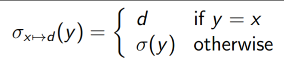

Models of Computation COMP30026 Lecture 7
=========================================

# Predicate Logic: Semantics

## The Meaning of a Predicate Logic Formula
- Is this true or false?
	- `∀x, z (x < z ⇒ ∃y (x < y ∧ y < z))`
	- More accurately, what do we assign x and z to to make this true?
	- If the domain is all integers...
	- it is *false* if `D = Z` and < is the usual "smaller than"
	- it is *true* if `D = Z` and < is "smaller than or equal"
	- it is *true* if `D = R` and < is the usual "smaller than"
	- it is *true* if `D = {0}`
- The meaning of a formula can be *independent* of what its names denote
	- e.g. `∀x P(x) ∨ ∃y (¬P(y))` is inherently true, no matter what (valid)
	- e.g. `∀x P(x) ∧ (¬P(a))` is false no matter what a and P stand for (unsatisfiable)

## Interpretations (or Structures)
- An *interpretation* consists of
	1. A non-empty set D (*domain*)
	2. An assignment, to each n-ary predicate symbol P of an n-place function `p : Dⁿ → {f, t}`
	3. An assignment to each n-ary function symbol g, of an n-place function `g : Dⁿ → D`
	4. An assignment to each constant a of some fixed element of D

## Free Variables and Valuations
- To give meaning to formulas that may have *free variables*, such as `∃x P(f (y ), x)`
- We need two things:
	- A *valuation* `σ : var → D` for free variables
	- An interpretation as just discussed
- Connectives are always given their usual meaning 

## Terms and Valuations
- Given an interpretation I, we get a valuation function from *terms* automatically, by *natural extension*:
	- `σ(a) = d`
	- `σ(g(t1, . . . ,tn)) = g(σ(t1), . . . , σ(tn))`
	- Where d is the element of D that I assigns to a, and g : Dⁿ → D is the function that I assigns to g.

## Closed Formulas
- The truth of a *closed* formula should *only depend on the given interpretation*
- 
- Read as "The map σ, updated to map x to d"

## Making a Formula True
- Given an interpretation I with domain D and a valuation,
	- σ makes P(t1, . . . ,tn) true iff p(σ(t1), . . . , σ(tn)) = t, where p is the meaning that I gives P
	- σ makes ¬F true iff σ does not make F true.
	- σ makes F1 ∧ F2 true iff σ makes both of F1 and F2 true
	- σ makes ∀x F true iff Oₓ→d makes F true for every d ∈ D
- Eventually we get to this: **`∃xF ≡ ¬∀x¬F`**

## Models and Validity of Formulas
- F is *true in interpretation I* iff every evaluation makes F true, otherwise it is *false in interpretation I*
- `I |= F` means interpretation I is a *model* of F, which means it makes F true
- `|= F` means every interpretation is a model for F
- `F₁ |= F₂` means F₂ is a *logical consequence* of F₁ iff `I |= F₁` and `I |= F₂`
- `F₁ ≡ F₂` are *logically equivalent* iff `F₁ |= F₂` and `F₂ |= F₁`

## Satisfiability and Validity
- **satisfiable** iff `I |= F` for some interpretation I
- **valid** iff `I |= F` for every interpretation I
- **unsatisfiable** iff `I V= F` for every interpretation I
- **non-valid** iff `I V= F` for some interpretation I

### Non-Validity Example
- Consider `(∀y∃x P(x, y )) ⇒ (∃x∀y P(x, y ))`
- It is *not valid*
- The formula is satisfiable where D = {0,1} and P means "less than or equal"
	- Just need one counter example for proof

### Validity Example
- `F = (∃y∀x P(x, y )) ⇒ (∀x∃y P(x, y ))` is valid
- If we negate F and rewrite it, we get
	- `(∃y∀x P(x, y )) ∧ (∃x∀y ¬P(x, y ))`
	- The right is only true when P(x, y), but the left says the opposite therefore it is unsatisfiable
	- Since F's negation is *unsatisfiable*, F is invalid

## Order of Quantifiers
- The *order in which quantifiers are stated are important*
- If you say `∀x∃y P(x, y)` then you can pick any y under x since x covers everything - essentially y has no effect on x
- If you say `∃x∀y P(x, y)` it's different from the above; it's all y values where x exists - you can't have any y's where x doesn't exist
- If you say `∃x∃y P(x, y)` then both x and y are constrained
- If you say `∀x∀y P(x, y)` then you can pick whatever you want in the domain

### Rules of Passage for the Quantifiers
- We cannot in general "push quantifiers in"
- For example there is no simplification of the form:
	- `\∃x (P(x)∧Q(x))`
- However we do get the following:
	- `∃x(¬F₁) ≡ ¬∀xF₁`
	- `∀x(¬F₁) ≡ ¬∃F₁`
	- `∃x(F₁∨F₂) ≡ (∃xF₁) ∨ (∃xF₂)`
	- `∀x(F₁∧F₂) ≡ (∀xF₁) ∧ (∀F₂)`
- It also shows that
	- `∃x(F₁ ⇒ F₂) ≡ (∀xF₁) ⇒ (∃xF₂)`
- If G is a formula with *no free occurences of X* then we also get:
	- `∃xG ≡ G`
	- `∀xG ≡ G`
	- `∃x(F∧G) ≡ (∃xF)∧G`
	- `∀x(F∨G) ≡ (∀xF)∨G`
	- `∀x(F⇒G) ≡ (∃xF) ⇒ G`
	- `∀x(G⇒F) ≡ G ⇒ (∃xF)`
	- Where F may have free occurences of x