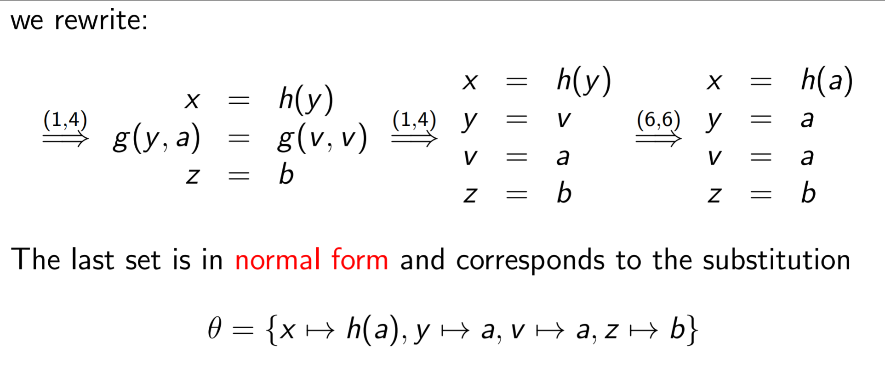
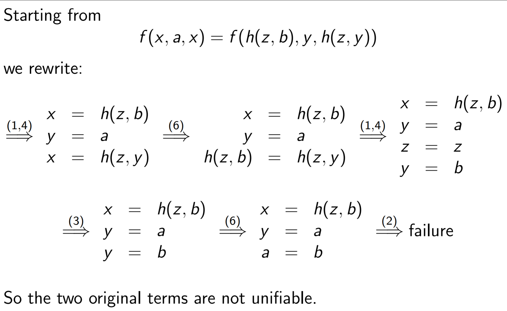
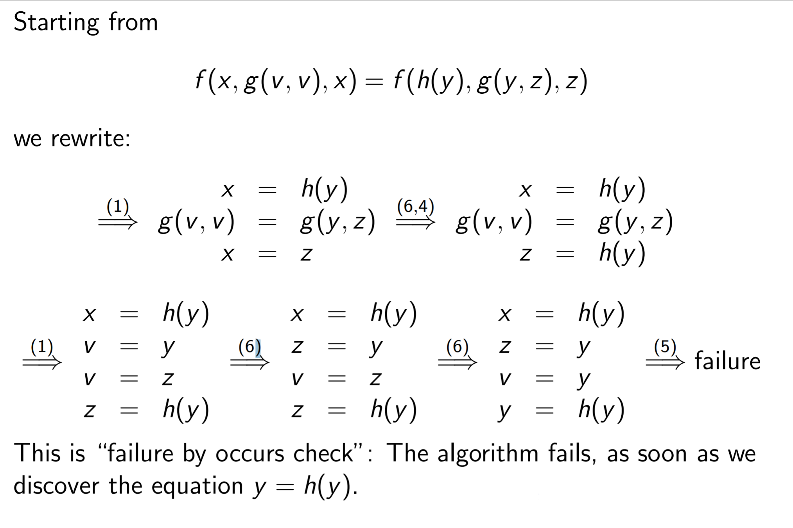
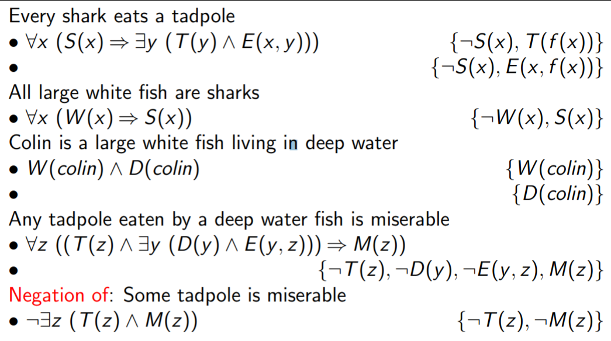
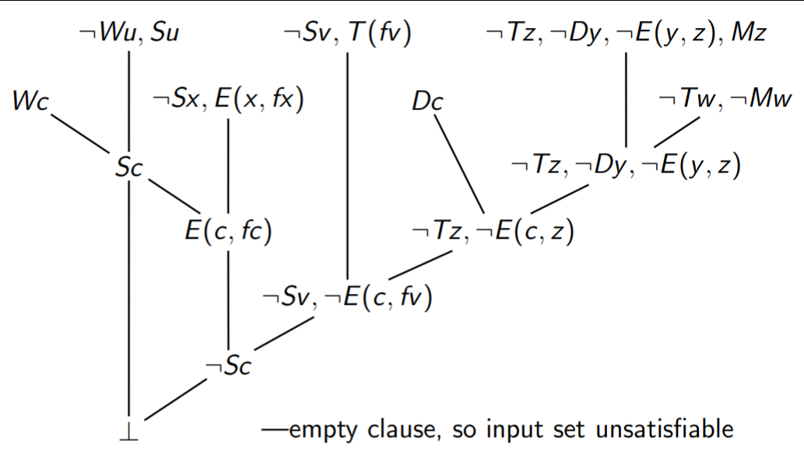
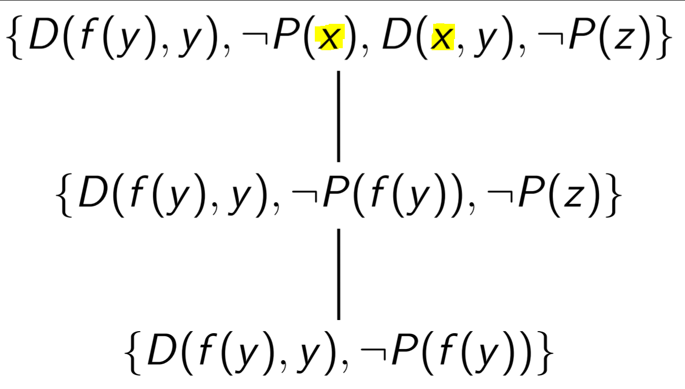
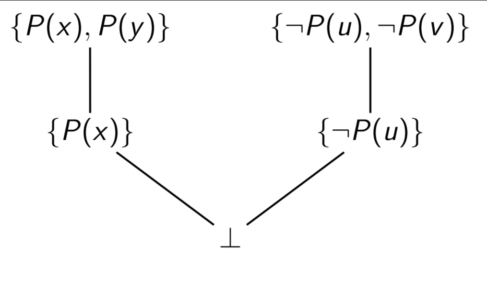

Models of Computation COMP30026 Lecture 9
=========================================

# Predicate Logic: Resolution and Unification
- This section covers basically the process of 'resolving' a predicate as you've done in tutorials

## Notation for Variables and Constants in Predicate Logic
- Letters from the *start of the alphabet* `(a, b, c, ...)` for *constants*
- Letters from the *end of the alphabet* `(u, v, x, y, ...)` for *variables*
- *Lower case letters from `f`* as *function symbols*
- *Upper case letters* as *predicate symbols*

### Functions vs Predicates
- In some contexts it may be important to distinguish between these (formulas, etc.)
- In *unification*, predicate symbols and function symbols are considered the same

## Substitution
- When you come across a variable in resolution, you can *substitute it* with a term (function or predicate) 
- Eventually you end up with a **substitution**: a finite set of replacements of variables by terms
	- It looks like this: `{x₁ ↦ t₁, x₂ ↦ t₂,...}`
	- Where `xi` are variables and `tᵢ` are terms
- **Example:**
	- if `F` is `P(f(x), y)` and set `θ = {x ↦ h(u), y ↦ a}` then `θF` is `P(f(h(u)), a)`
- This is similar to *valuation (mapping term to variable)* but this *maps a **variable to a term*** and therefore a ***term to a term***
- However, **you cannot map a term that contains the variable to the variable itself**
	- e.g. you can't map `{x ↦ f(x)}` as you end up with an infinite loop of `f(f(f(...)))`

## General Unifiers
- A unifier of two terms `s` and `t` is a substitution `θ` such that `θ(s) = θ(t)`
- Basically if you can *resolve two terms to the same thing* then they are **unifiable**
- A *most general unifier (mgu)* for `s` and `t` is a substitution `θ` where:
	- `θ` is a unifier for `s` and `t`
	- every other unifier of `s` and `t` can be *expressed as a result produced by unifying `s` and `t`*

### Unifier Examples
1. `P(x, a)` and `P(b, c)` are not unifiable (can't map constants to constants)
2. `P(f(x), y)` and `P(a, w)` are not unifiable (can't map term to a constant)
3. `P(x)` and `P(f(x))` are not unifiable (infinite loop)
4. `P(x, c)` and `P(a, y)` are unifiable using `{x ↦ a, y ↦ c}`
5. `P(f(x), c)` and `P(f(a), y)` also unifiable using `{x ↦ a, y ↦ c}`

### Most General Unifier Example
- Consider `P(f(x), g(y, a))` and `P(f(a), g(z, a))`
- You can have any of the following unifiers, but `{x ↦ a, y ↦ z}` is considered the best (i.e. the most general unifier)
	- `{x ↦ a, y ↦ z}`
	- `{x ↦ a, y ↦ a, z ↦ a}`
	- `{x ↦ a, y ↦ g(b, f(u)), z ↦ g(b, f(u))}`
	- `{x ↦ a, z ↦ y}` <-- this is also equivalent to the first one and is also a MGU
- This is because they avoid making unnecessary substitutions

## Unification Algorithm
- This is an *algorithm to unify `s` and `t`* and will produce a mgu
- Start with *two terms `s` and `t`*
- If the result is 'failure', no unifier exists
- Do the following:
	1. When `F(s₁...sₙ) = F(t₁...tₙ)` *(two predicates with the **same arity**)*
		- Replace the equations for each argument e.g. `s₁=t₁` etc.
	2. When `F(s₁...sₙ) = G(t₁...tₘ)` *(two predicates with **different arity**)*
		- **Failure**
	3. `x = x`
		- *Delete the equation*
	4. `t = x` (where *t* is *not a variable*)
		- Replace the equation by `x = t`
	5. `x = t` where `t` contains `x`
		- **Failure**
	6. `x = t` where `t` contains no `x` but `x` occurs in other equations:
		- Replace `x` by `t` in those other equations

### Solving Term Equations Example 1
`f(h(y), g(y, a), z) = f(x, g(v, v), b)`

### Solving Term Equations Example 2
`f(x, a, x) = f(h(z, b), y, h(z, y))`

### Solving Term Equations Example 3
`f(x, g(v, v), x) = f(h(y), g(y, z), z)`

## Resolvents
- Resolvents for propositional logic went like this:
	- Two literals are complementary if one is `L` and the other is `¬L`
	- The *resolvent of two clauses* containing complementary literals `L`, `¬L` is their union omitting `L` and `¬L`
- Rsolvents for predicate logic go like this:
	- Two literals `L` and `¬L` are *complementary* if `{L,L'}` is *unifiable*

## Automated Inference with Predicate Logic Example
- Ok so this bit is a bit long
- This walks through the whole example of *automated inferencing*
- We'll be using the following example:
	- 
- Once you have all your predicates, *convert them to clausal form*
	- This is done by simply doing the transformations we learnt earlier, e.g. `F(x) ⟹ G(y)` becomes `¬F(x) ∨ G(y)`
- Once you have a form with *only `∧'s` and `∨'s`*, convert it to a clausal form using the {} brackets 
- For the statement you're trying to prove (the "therefore" statement), *negate* the clausal form that you end up with
- 
- Then resolve it using the methods described before with mapping terms and variables etc.
- You can use clauses multiple times, but may only use the negate clause once (the negated statement you're trying to prove)
- 
- And you're done!

## Factoring
- You can rewrite clauses via *factoring*
- If some clauses can be unified then we can simplify it and present it as less clauses:

- This is sometimes required to create a resolution

## The Resolution Method
- There's a problem with the above stuff: How do we figure out when to terminate?
- Sometimes we can get into an infinite loop when we're resolving
- If we can finish it in a finite number of steps it is *sound* and *complete*
- There's a bunch of different approaches to resolution (i.e. using different search strategies) but they're *outside of the scope of this course*
	- Just resolve it and hope you figure it out lol

## Horn Clauses
- A *Horn* clause is a clause with at most one positive literal
- All seven clauses used in that tadpole example were horn clauses
- This clause: `s {¬T(z), ¬D(y ), ¬E(y , z), M(z)}` is a horn clause