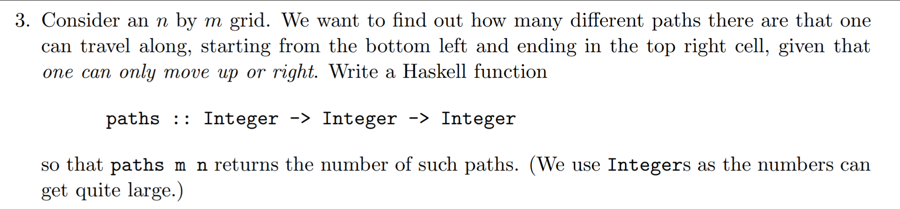
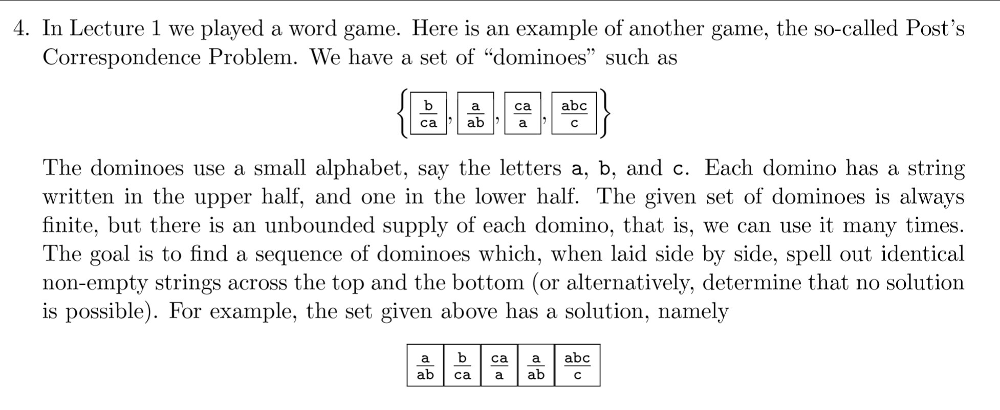

Models of Computation COMP30026 Tutorial 2 
==========================================

## [Question 3](q3.hs)

## Question 4

### 4.a) 
- 2 1 2

### 4. b)
- No solution (you can't use the second tile since denominator is never fulfilled)

### 4. c)
- You can't use the 2nd tile since there are never 2 b's next to each other in denominator
- Cut down solutions until there isn't any left

