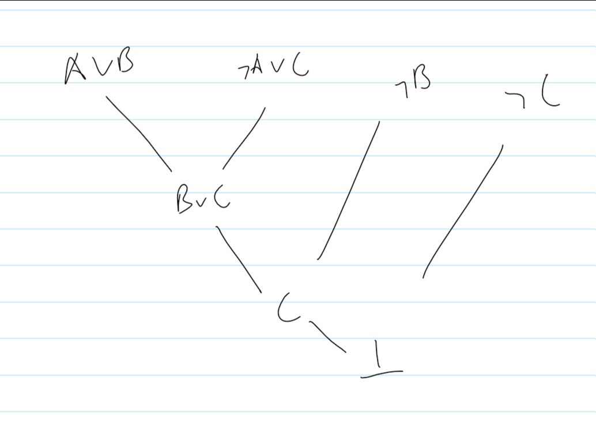
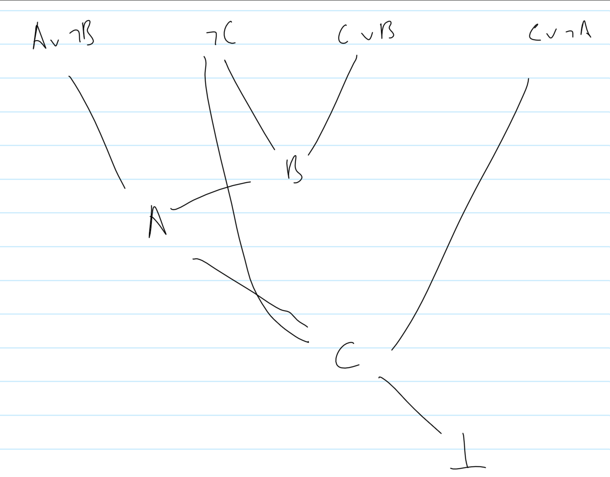
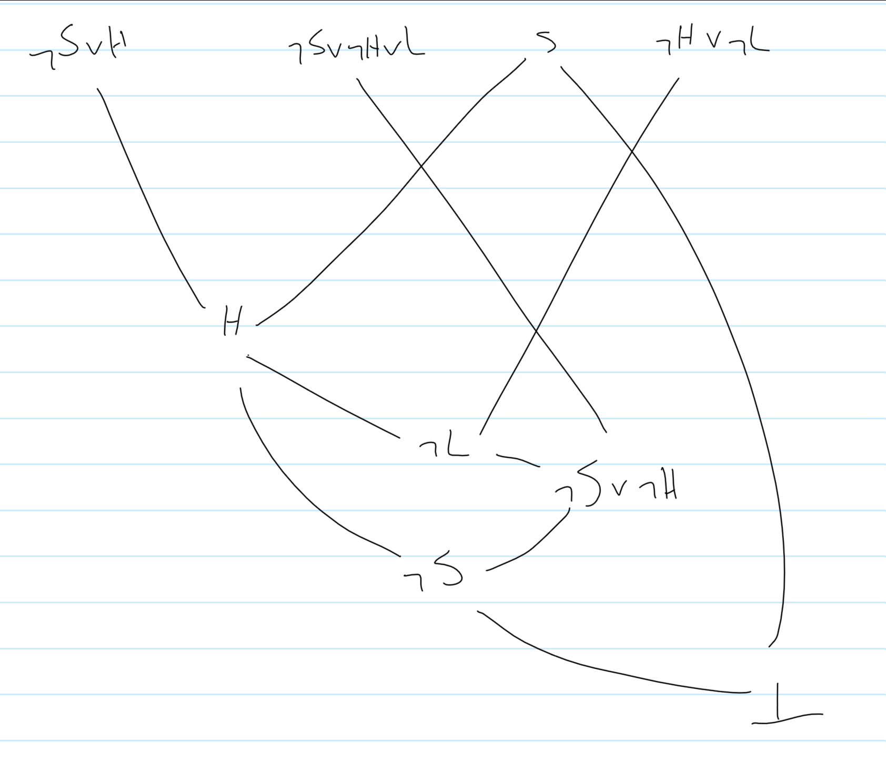

Models of Computation COMP30026 Tutorial 4
==========================================

A CNF is where everything is conjunctive with each other
(A ∨ B) ∧ (¬A ∨ C ∨ A) reduces to (A ∨ B) ∧ `true` which results in (A ∨ B)

### Converting a Formula to CNF or to DNF
1. Eliminate all occurrences of `XOR ⊕`, using `A ⊕ B ≡ (A ∨ B) ∧ (¬A ∨ ¬B)`
2. Eliminate all occurences of `IFF ⟺`, using `A ⇔ B ≡ (A ⇒ B) ∧ (B ⇒ A)`
3. Eliminate all occurrences of `implication ⇒`, using `A ⇒ B ≡ ¬A ∨ B`
4. Use [*De Morgan's Laws*](https://en.wikipedia.org/wiki/De_Morgan's_laws) to push `¬` inward over `∧` and `∨`
5. Eliminate double negations using `¬¬A ≡ A`
6. Use the distributive laws to get the required form

Trying this with `¬((A ∨ ¬B) -> C) ∧ (C ∨ (B ∧ ¬A))`:
1. `¬(¬(A ∨ ¬B) ∨ C) ∧ (C ∨ (B ∧ ¬A))`
2. `((A ∨ ¬B) ∨ ¬C) ∧ ((C ∨ B) ∧ (C ∨ ¬A))`
3. `(A ∨ ¬B) ∨ ¬C ∧ (C ∨ B) ∧ (C ∨ ¬A)` <- this is CNF

Refutation Proof:
- You *must reach an unsatisfiable* in order to proof a refutation proof
- 
- Refutation Proof for `(A ∨ ¬B) ∨ ¬C ∧ (C ∨ B) ∧ (C ∨ ¬A)`
- 

Resolution:
- Resolving `A ∨ B` with `¬A` will give `B`
	- A can never be resolved, no matter if it's true or false
	- 
- This can be written as `(A ∨ B) ∧ (¬A)`
- If we have `(A ∨ B) ∧ (¬A ∨ C)` then we will get `(B ∨ C)`

Tautologies:
- If *formula* `¬A` is unsatisfiable, then we can *negate our formula and it'll be valid*
- If `(A ∧ ¬B)` is unsatisfiable
	- `B` is therefore a logical consequence of `A`  

Question:
Assumptions
- S: I go swimming
- ¬S: I don't go swimming
- H: I feel healthy
- L: I love everyone
1. If I go swimming, then I feel healthy.
	- `(S -> H)`
2. If I go swimming and I feel healthy, then I love everyone
	- `(S ∧ H) -> L`

Prove: 3. If I go swimming, then I feel healthy and I love everyone
`S -> (H ∧ L)`

First both formula and consequence to CNF
1. `(S -> H) ∧ ((S ∧ H) -> L)`
2. `(¬S ∨ H) ∧ (¬S ∨ ¬H ∨ L)`

1. `S -> (H ∧ L)`
2. `¬(S -> (H ∧ L))`
3. `¬(¬S ∨ (H ∧ L))`
4. `S ∧ (¬H ∨ ¬L)`

Refutation proof:

- Means 1 ∧ 2 ∧ ¬3
- Means 1 ∧ 2 |= 3