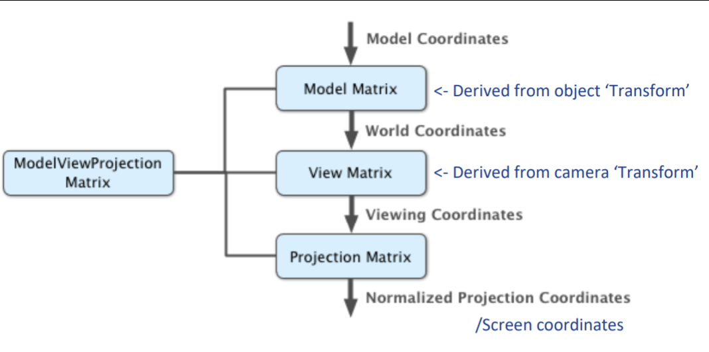

Models of Computation COMP30026 Tutorial 5
==========================================

Recall that all mesh data structures are uploaded to the GPU via the PCI bus

# The Rendering Pipeline (Simplified)
### Vertex Shader
- Can imagine it as a function
- Vertex in -> Vertex out
- You can pass through colors, UV coordinates and transformations

#### Model Matrix
- Takes our model's matrix coordinates
- Derived from object 'transform'
- Transforms from model space into world space
- Derived from the object's transform component in Unity
> Vw = Mvm
- Where vm is a column vector representing a vertex position in model space, M is the model matrix, and vw is the resultant vector in world space

#### View Matrix
- Transforms from world space into view space
- Derived from the camera's transform component in Unity
> vv = Vvw
- Where Vw is a column vector representing a vertex position in world space, V is the view matrix and Vv is the resultant vector in view space

#### Projection matrix
- Transforms from view space into screen space
- Constructed internally by Unity based on projection mode
- Vs = PVv
- Where vv is a column vector representing a vertex position in view space, P is the projection matrix and Vs is the resultant vector in screen space
- At this point, the vertex is on a '2D plane' which eventually is your screen

#### MVP
- Composition of all three
- `𝑣𝑠 = 𝑃(𝑉(𝑀𝑣𝑚)) = 𝑃𝑉𝑀𝑣𝑚`
- PVM is precalculated for efficiency purposes and passed to shaders as UNITY_MATRIX_MVP
- Sometimes we need to work in different spaces in vertex shaders
- Unity provides us with partial products of the MVP matrix, for example:
- `UNITY_MATRIX_MV`
- `UNITY_MATRIX_P`
- `unity_ObjectToWorld`